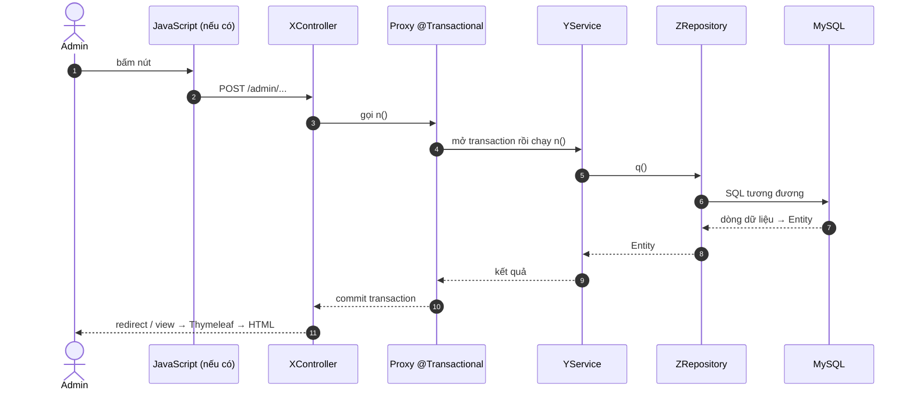

# PROMPT HỌC DỰ ÁN ĐỂ BẢO VỆ — BUSMANAGEMENT

> **File này là công cụ, không phải tài liệu mô tả hệ thống.** Nó chứa các prompt để chủ dự án
> copy gửi cho AI, mỗi lần sinh ra **một file học** trong `docs/study/`.
>
> - **PHẦN A1 — Bài 00a:** Java hiện đại + Spring core + Spring MVC + Thymeleaf/JavaScript. Chạy **một lần**.
> - **PHẦN A2 — Bài 00b:** JPA/Hibernate + Transaction + xử lý lỗi + kiểm thử + "những gì dự án
>   không dùng". Chạy **một lần**, sau 00a.
> - **PHẦN B — Bài theo chức năng:** prompt mẫu, chạy lại cho **từng chức năng** trong danh sách.
>
> Khác với `02_feature_doc_prompt.md` (hiểu sâu để **sửa bug**), file này nhắm tới **học và bảo
> vệ**: trace đường đi của request qua từng tầng (kể cả JavaScript phía trình duyệt), giải thích
> phần Spring làm ngầm, có câu hỏi hội đồng và bài tự kiểm tra. File 02 vẫn giữ nguyên giá trị,
> không bị thay thế. Luật chung trong `01_system_rules.md` vẫn áp dụng đầy đủ.

---

## Cách dùng

1. Chạy **PHẦN A1** → `docs/study/00a-java-spring-mvc.html` (nguồn `.md` cùng tên).
2. Chạy **PHẦN A2** → `docs/study/00b-jpa-transaction-testing.html` (nguồn `.md` cùng tên).
3. Học lần lượt theo **thứ tự trong danh sách chức năng** bên dưới. Mỗi lần: copy **LUẬT CHUNG +
   PHẦN B**, thay `{TÊN_CHỨC_NĂNG}` và `{SỐ_THỨ_TỰ}` bằng đúng một dòng trong danh sách, gửi cho AI.
4. Mỗi bài xong thì tự làm phần "Bài tập tự kiểm tra" **trước khi** mở đáp án.

Luôn gửi kèm phần **LUẬT CHUNG** — mọi prompt đều dựa vào nó.

### Định dạng output (chủ dự án chốt 2026-09-27)

Mỗi bài học gồm **hai file cùng tên** trong `docs/study/`:

- `NN-ten.md` — **nguồn**, viết bằng Markdown. Mọi sơ đồ viết bằng **Mermaid** (khối
  ` ```mermaid `): `flowchart` cho kiến trúc/bản đồ, `sequenceDiagram` cho luồng request,
  `stateDiagram-v2` cho vòng đời trạng thái, `erDiagram` cho quan hệ bảng. **Không dùng sơ đồ
  ASCII.** Tránh ký tự `<` `>` trong nhãn Mermaid (viết "danh sách Bus" thay vì `List<Bus>`).
- `NN-ten.html` — **trang để học**, dựng từ file nguồn bằng
  `node docs/study/_build/build.mjs <nguồn.md> <đích.html> "<tiêu đề trang>" "<chip>"`
  (lần đầu chạy `npm install` trong `docs/study/_build/`). Script lo giao diện thống nhất: mục lục,
  nhãn màu `[CODE]`/`[SPRING]`/`[SUY LUẬN]`, tô màu code, sơ đồ Mermaid, giao diện sáng/tối.
  Không sửa tay file `.html` — sửa `.md` rồi build lại.
- Sau khi build, **publish file `.html` thành claude.ai artifact** để đọc trên web; file `.html`
  trong repo mở thẳng bằng trình duyệt cũng được (cần internet để tải font, tô màu code và vẽ
  Mermaid).
- H1 của file nguồn là tiêu đề bài; **không** viết mục "Mục lục" tay (trang tự sinh từ các H2).

### Danh sách chức năng (thứ tự học từ dễ đến khó)

⭐ = gần như chắc chắn hội đồng hỏi — ưu tiên học kỹ nếu thiếu thời gian.
🧮 = có thuật toán/công thức — bắt buộc có mục "Ví dụ tính tay" (PHẦN B mục 8).

| # | Tên chức năng (dùng đúng tên này) | Điểm bắt đầu chính | File output |
|---|---|---|---|
| 01 | Bus Management | `AdminBusController` — `/admin/buses` | `01-bus-management.md` |
| 02 | Station Management | `AdminStationController` — `/admin/stations` | `02-station-management.md` |
| 03 | Route Management | `AdminRouteController` — `/admin/routes` | `03-route-management.md` |
| 04 | Driver & User Management | `AdminDriverController`, `AdminController` (`/admin/users/*`) | `04-driver-user-management.md` |
| 05 ⭐ | Trip FSM & Bus Status Synchronization | `TripService.updateTripStatus()` | `05-trip-fsm.md` |
| 06 ⭐🧮 | Business Rule Validation (`validateBusForTrip` / `validateStaffForTrip` + dry-run) | `TripService` | `06-business-rule-validation.md` |
| 07 ⭐ | Manual Trip CRUD (danh sách, lọc, tạo, sửa, hủy, xóa + REST `available-resources` gọi từ JavaScript) | `AdminTripManagementController`, `TripRestController`, JS trong `trip-create-form.html` | `07a-...md`, `07b-...md` (xem mục "Tách file") |
| 08 ⭐🧮 | Extra Trip Recommendation System (job chạy nền) | `TripService.scanAndSuggestExtraTrips()` — `@Scheduled`, không có HTTP request | `08-extra-trip-scheduler.md` |
| 09 ⭐ | Admin Approval Flow | `AdminTripController` — `/admin/trips` | `09-admin-approval.md` |
| 10 | Dispatch Center | `DispatchController` — `/admin/dispatch` | `10-dispatch-center.md` |
| 11 | Incident Management | `AdminIncidentController` — `/admin/incidents` | `11-incident-management.md` |
| 12 | Dashboard & Analytics | `AdminController` `/admin/dashboard`, `DashboardController` `/admin/analytics` (+ Chart.js) | `12-dashboard-analytics.md` |
| 13 | Demo Seed & Historical Data Backfill | `DataInitializer` (profile `demo`), `HistoricalDataBackfill` (profile `backfill`) — `CommandLineRunner`, không có HTTP request | `13-seed-and-backfill.md` |
| 14 ⭐🧮 | Demand Forecast | `ForecastController` — `/admin/analytics/forecast` | `14-demand-forecast.md` |
| 15 | Driver Recommendation | `DriverRecommendationController` | `15-driver-recommendation.md` |
| 16 🧮 | Vehicle Replacement Recommendation | `VehicleReplacementController` | `16-vehicle-replacement.md` |
| 17 ⭐🧮 | Recommendation Engine + Cost/Revenue Estimation | `RecommendationController`, `CostParameterController` | `17-recommendation-engine.md` |
| 18 ⭐🧮 | What-if Simulation | `WhatIfController` — `/admin/analytics/what-if` | `18-what-if-simulation.md` |

Customer Portal (Phase 9) **chưa triển khai** — không có gì để học; không được đưa vào.

**Tách file:** chức năng nào có quá nhiều endpoint hoặc JavaScript dài (chắc chắn là **07**; có thể
là 09) được tách thành hai file `a`/`b` theo nhóm luồng có nghĩa — ví dụ 07a = danh sách + tạo
(kèm REST + JS wizard), 07b = sửa + hủy + xóa. Bảng endpoint ở mục 2 của **cả hai** file vẫn liệt
kê đủ mọi endpoint của chức năng, và ghi rõ endpoint nào được trace ở file nào.

---

## LUẬT CHUNG (gửi kèm mọi prompt)

Bạn là một senior Spring Boot engineer kiêm người hướng dẫn bảo vệ đồ án. Nhiệm vụ: giúp mình
hiểu dự án BusManagement đủ sâu để **tự giải thích trước hội đồng** và **tự đọc code**.

**Mình là ai:** sinh viên, **mới với Spring Boot**, chỉ có **Java cơ bản** (class, object,
interface, kế thừa, List/Map, vòng lặp, exception). Không giả định mình biết: lambda, Stream API,
`Optional`, `record`, switch expression; bất kỳ khái niệm nào của Spring, JPA, Hibernate,
Thymeleaf, Lombok; JavaScript ngoài mức cú pháp cơ bản; HTTP ngoài mức "trình duyệt gửi request,
server trả trang web".

**Ranh giới task:**
- Đây là task **CHỈ VIẾT TÀI LIỆU HỌC**. Không sửa code, không sửa file tài liệu đang có, không
  chạy app, không tạo test. Sản phẩm là **một bài học mới** trong `docs/study/` (nguồn `.md` +
  trang `.html` dựng từ nó — xem "Định dạng output").
- Thấy bug hoặc điểm lạ: **ghi vào file học** ở mục "Cạm bẫy", không tự sửa.

**Nguồn sự thật, đọc theo thứ tự:**
1. `docs/development/THESIS_ROADMAP.md` — §3 Architectural Principles, §4 Non-Goals, §5 "As
   delivered" của phase liên quan, §6 Hidden Costs Register, §9 Developer Notes (lý do thiết kế
   **đã được chủ dự án duyệt**). Nếu §9 đã giải thích "vì sao" thì **trích lại**, không tự nghĩ lý
   do khác.
2. **Code thật** trong `src/main` (Java, template `.html` kể cả khối `<script>`,
   `application*.properties`), `src/test`, và `pom.xml`. Đây là nguồn quyết định.
3. `docs/development/Proj_functions_summary.md`, `docs/architecture/*.md`,
   `docs/todo/current_bugs_found.md` (lịch sử lỗi thật; **tôn trọng các mục "ĐÃ LOẠI — đừng nêu
   lại"**), `docs/reports/project_report.md`.
4. `docs/archive/` là bản cũ — chỉ làm bối cảnh lịch sử, không trích như hiện trạng.

**Thứ bậc khi có mâu thuẫn: logic code > javadoc/comment trong code > tài liệu `docs/`.**
- Javadoc và comment trong code **cũng có thể đã cũ**. Ví dụ đã biết: comment trong
  `validateBusForTrip()` còn nói `findBestAvailableBus()` dùng xe sát ngưỡng bảo trì "làm fallback
  cuối cùng", trong khi code của `findBestAvailableBus()` đã bỏ fallback đó.
- **Số dòng ghi trong comment** (kiểu `TripService:621-627`, `canTransition:541`) thường đã lệch —
  không tin, luôn grep lại.
- Tài liệu đã biết là lệch code: `Proj_functions_summary.md` mục 7.6 (fallback bảo trì của AI) và
  mục 18.7 ("chỉ doanh thu, chưa có chi phí" — Phase 7 bước 3 đã thêm chi phí).
- Gặp mâu thuẫn mới thì **nói rõ cho mình biết** (trích cả hai phía, kèm `file:dòng`).

**Chống bịa — bắt buộc:**
- Mọi tên file / class / method / annotation / endpoint / cột DB / hàm JavaScript phải có thật và
  kèm `file:dòng`. Không tìm thấy thì ghi "không tìm thấy trong code", không đoán.
- Gắn nhãn rõ ba loại khẳng định:
  - **[CODE]** — đọc trực tiếp từ code (có `file:dòng`);
  - **[SPRING]** — hành vi chuẩn của framework/thư viện mà code không viết ra (DispatcherServlet,
    proxy, Hibernate sinh SQL, Jackson, Thymeleaf...), nói theo tài liệu chính thức;
  - **[SUY LUẬN]** — suy luận của bạn; nếu là hành vi lúc chạy mà không kiểm chứng được thì ghi
    thêm "chưa kiểm chứng".
- Câu SQL: dự án để `spring.jpa.show-sql: false`, nên SQL bạn viết ra là **SQL tương đương do bạn
  dựng từ JPQL / tên method**, phải gắn nhãn **[SUY LUẬN — SQL tương đương]**, không trình bày như
  log thật. Dự án **không có native query** — mọi truy vấn là derived query hoặc JPQL `@Query`.
- Số liệu trong file prompt này (số dòng, số test, số lỗi) là ảnh chụp ngày 2026-09-26, chỉ để
  định hướng — luôn đọc lại file gốc.

**Văn phong:**
- Viết **tiếng Việt**; giữ nguyên tên file/class/method/annotation/enum bằng tiếng Anh đúng như
  code — không dịch, không đổi hoa thường.
- **Mọi thuật ngữ, lần đầu xuất hiện trong file, phải giải nghĩa ngay bằng một câu đời thường**,
  rồi mới dùng. Ví dụ: "`@Transactional` — nôm na là 'làm trọn gói: xong hết hoặc hoàn tác sạch,
  không bao giờ dừng nửa chừng'". Từ bài chức năng trở đi, thuật ngữ nền đã học chỉ nhắc ngắn và
  dẫn "(xem Bài 00a §x)" hoặc "(xem Bài 00b §x)".
- Đi từ dễ đến khó; ưu tiên rõ ràng hơn dài; không lặp lại cùng một ý ở hai phần.

---

## PHẦN A1 — PROMPT BÀI 00a: JAVA HIỆN ĐẠI + SPRING CORE + SPRING MVC + THYMELEAF/JS

*(Gửi kèm LUẬT CHUNG.)*

Viết file `docs/study/00a-java-spring-mvc.md`. Mục tiêu: sau bài này mình đọc được code controller
/ service của dự án và hiểu một request web đi từ trình duyệt tới controller rồi quay ra màn hình
thế nào. **Mọi khái niệm phải minh hoạ bằng một đoạn code có thật của dự án** (kèm `file:dòng`),
không dùng ví dụ "Hello World" chung chung. Chỉ giảng những gì **dự án thật sự dùng** — grep để xác
nhận trước khi đưa vào.

### Cấu trúc bắt buộc

**§1. Bức tranh toàn cảnh**
- Spring Boot là gì, giải quyết vấn đề gì so với Java thuần — một đoạn đời thường.
- `pom.xml`: Maven là gì; "starter" là gì; phiên bản Spring Boot và Java của dự án; liệt kê các
  starter có trong `pom.xml` và đánh dấu cái nào **thật sự được dùng** (grep code để kiểm).
- Ứng dụng khởi động thế nào: `BusManagementApplication.java`, `@SpringBootApplication` (kèm vế
  `exclude` và lý do trong javadoc), `@EnableScheduling`, `main()`.
- Kiến trúc phân lớp: trình duyệt (HTML + JS) → Controller → Service → Repository → Domain(Entity)
  → MySQL, và vai trò của `dto/`, `config/`, `templates/`. Dùng ẩn dụ (lễ tân / nhân viên xử lý /
  thủ kho / cái kho) **và** một sơ đồ Mermaid `flowchart` có tên package thật.
- Bảng: mỗi package → vai trò → 1–2 file tiêu biểu. Nhắc cả `helloController` (`/`) cho đủ.

**§2. Java hiện đại mà code dự án dùng** — phần này bắt buộc vì mình chỉ có Java cơ bản.
Với mỗi mục: giải nghĩa đời thường → viết lại một đoạn code thật của dự án bằng Java "kiểu cũ"
(vòng for, if) để mình so sánh → chỉ ra chỗ tương tự trong dự án. Tối thiểu:
- lambda và method reference (`Bus::getKmSinceLastMaintenance`);
- Stream API: `filter`, `map`, `sorted`, `min`, `collect(Collectors.toList / toMap / groupingBy /
  counting)`, `mapToDouble(...).sum()/average()`, `anyMatch/noneMatch` — minh hoạ bằng
  `TripService.findBestAvailableDriver()` và một đoạn của `DashboardService`;
- `Comparator.comparing(...).thenComparing(...).reversed()` — minh hoạ bằng
  `preferredTypeThenLeastWorn()`;
- `Optional` và `orElseThrow(...)` — mẫu `repository.findById(id).orElseThrow(...)` ở mọi service;
- `record` (`ForecastService`, `WhatIfSimulationService`);
- switch expression `case A, B -> ...` và vì sao dự án **cố ý không có `default`**
  (`deleteRefusalReason`, `editRefusalReason`);
- text block `"""` (JPQL trong `TripRepository`);
- `BigDecimal` (vì sao tiền không dùng `double`), `LocalDate/LocalDateTime/Duration`, `EnumSet`,
  `String.format`.

**§3. IoC Container, Bean và Dependency Injection**
- Bean là gì; `@Component`, `@Service`, `@Repository`, `@Controller`, `@RestController`,
  `@Configuration`/`@Bean` — cái nào dự án dùng, ở đâu (`SecurityConfig` là ví dụ `@Bean`).
- Constructor injection qua Lombok `@RequiredArgsConstructor` + field `private final` (dự án dùng
  nhất quán kiểu này — kiểm code). Vì sao không `new TripService()` bằng tay.
- Repository chỉ là **interface**, không có class nào implement: ai viết phần cài đặt? (Spring Data
  sinh proxy lúc chạy — chi tiết ở Bài 00b.)

**§4. Vòng đời một HTTP request trong Spring MVC**
- DispatcherServlet → HandlerMapping tìm method theo `@RequestMapping`/`@GetMapping`/`@PostMapping`
  → binding tham số → method controller chạy → trả **tên view** hoặc `"redirect:..."` →
  ViewResolver → Thymeleaf render HTML.
- Các cách nhận dữ liệu mà dự án dùng: `@PathVariable`, `@RequestParam` (kể cả `required = false`
  và `List<Long>`), `@ModelAttribute` bind form thẳng vào **entity**, `@DateTimeFormat`.
- **`DomainClassConverter`**: form gửi lên `id` của xe/chuyến/tài xế, Spring Data tự đổi thành
  entity (javadoc `AdminIncidentController.createIncident`; `bus-form.html` bind `busType`).
- `Model`, `RedirectAttributes` + flash attribute (`success` / `error` / `warning`), mẫu PRG (vì sao
  redirect sau POST).
- Minh hoạ trọn vẹn bằng **một** luồng ngắn có thật: `GET /admin/buses` → `listBuses()` →
  `busService.findAllWithBusType()` → `bus-list.html`.
- Cảnh báo: xóa xe/tài xế/bến/tuyến/sự cố đang dùng **GET** (`<a href>` + `confirm()` của JS),
  còn xóa/hủy chuyến dùng **POST** — giải thích khác biệt và vì sao đây là câu hội đồng có thể hỏi.

**§5. REST và JSON**
- `@RestController` khác `@Controller` thế nào; `ResponseEntity.ok(...)` /
  `ResponseEntity.badRequest()`; Jackson biến `Map` thành JSON — minh hoạ bằng
  `TripRestController.getAvailableResources()`.
- Vì sao controller này tự dựng `Map` phẳng (`toBusDto`, `toDriverDto`) thay vì trả thẳng entity.

**§6. Thymeleaf — phía giao diện**
- Dự án **không dùng fragment/layout** (`th:fragment`, `th:replace`): mỗi template là một trang
  HTML đầy đủ, Bootstrap/Bootstrap Icons/Chart.js nạp qua CDN. Kiểm lại bằng grep.
- Các cú pháp dự án thật sự dùng: `th:text`, `th:if/th:unless`, `th:each`, `th:href`/`@{...}`
  (kể cả `@{/x/{id}(id=${...})}`), `th:action`, `th:object`/`th:field`, `th:value`, `th:selected`,
  `th:classappend`, `th:switch/th:case`; utility `#lists`, `#numbers.formatDecimal`,
  `#temporals.format`. Template gọi thẳng method của entity (`bus.needsMaintenance()`).
- Form HTML gửi dữ liệu lên controller thế nào (thuộc tính `name` ↔ field của object).
- Cách hiện flash message (`th:if="${success}"`...).

**§7. JavaScript phía trình duyệt** — dự án có nhiều logic ở đây, phải giảng:
- `th:inline="javascript"` + cú pháp `/*[[${...}]]*/` để đẩy dữ liệu server vào JS
  (`trip-edit-form.html`, `approve-form.html`, `dashboard-analytics.html`), và vì sao **không được
  inline thẳng entity** (vòng lặp `Driver.user` → `User.driver` → StackOverflowError — lỗi #9; xem
  javadoc `AdminTripController.toDriverOptionsForJs`).
- `fetch()` + `async/await` gọi REST: `trip-create-form.html` (hàm `fetchAvailableResources`) →
  `TripRestController` → JSON → JS dựng lại dropdown.
- `addEventListener` (change, submit, DOMContentLoaded), `confirm()`, kiểm tra phía trình duyệt
  (`validateNoDriverConflict`) — và nguyên tắc: **kiểm tra ở JS chỉ là lớp "không-mời", lớp chặn
  thật luôn ở server** (dẫn sang Bài 00b §5).
- Chart.js nhận mảng `labels/values` từ DTO (`ChartSeriesDto`) và vì sao cần `chart.resize()` khi
  đổi tab.

**§8. Chạy nền, cấu hình, bảo mật**
- `@Scheduled(fixedRate = ...)` — ở đâu trong dự án.
- `application.properties`, `application-demo.properties`, `@Profile("demo")`,
  `@Profile("backfill")`, `CommandLineRunner`; `ddl-auto=update` vs `create-drop`; DB test riêng
  (`src/test/resources/application.properties`). Cảnh báo: profile `demo` **xoá sạch** dữ liệu.
- `SecurityConfig`: Spring Security có trên classpath và đang **bật**, nhưng `permitAll()` + tắt
  CSRF/form-login/http-basic — không có đăng nhập, đây là Non-Goal có chủ đích (roadmap §4).
  Không được nói "Spring Security bị tắt".

**§9. Lombok**
- Các annotation Lombok dự án dùng (`@Data`, `@Getter`, `@RequiredArgsConstructor`,
  `@NoArgsConstructor`, `@AllArgsConstructor`, `@EqualsAndHashCode(onlyExplicitlyIncluded = true)`,
  `@ToString.Exclude`, `@Slf4j`) — code Lombok sinh ra trông như thế nào (viết tay một ví dụ).
- Vì sao `@Data` trên entity có quan hệ hai chiều từng gây đệ quy vô hạn và quy ước hiện tại xử
  lý thế nào (javadoc `User.driver`, roadmap Hidden Cost #9, `EntityEqualsHashCodeCycleTest`).

**§10. Bảng tra cứu thuật ngữ (phần 00a)**
Bảng: Thuật ngữ / Annotation / cú pháp → Nghĩa đời thường (1 câu) → Ví dụ trong dự án
(`file:dòng`). Phải đủ mọi thứ đã nhắc trong bài.

**§11. Câu hỏi hội đồng + gợi ý trả lời** (8–10 câu, ví dụ: "Vì sao em chia
Controller/Service/Repository?", "Dependency Injection là gì, em dùng ở đâu?", "Sao xóa xe lại
dùng GET?", "Dữ liệu từ server vào JavaScript bằng cách nào?"). Mỗi gợi ý 3–6 câu, bám ví dụ thật.

**§12. Bài tập tự kiểm tra** — quy cách như PHẦN B mục 11. Có ít nhất một bài "viết lại đoạn
Stream này bằng vòng for".

Sau khi tạo file: tóm tắt 3–5 dòng những điều quan trọng nhất.

---

## PHẦN A2 — PROMPT BÀI 00b: JPA/HIBERNATE + TRANSACTION + LỖI + KIỂM THỬ

*(Gửi kèm LUẬT CHUNG. Mình đã học Bài 00a.)*

Viết file `docs/study/00b-jpa-transaction-testing.md`. Mục tiêu: hiểu dữ liệu đi xuống / lên DB
thế nào, và các cơ chế ngầm quyết định hành vi thật của dự án. Cùng yêu cầu minh hoạ bằng code
thật như Bài 00a.

### Cấu trúc bắt buộc

**§1. ORM và Entity**
- ORM là gì; `@Entity`, `@Table`, `@Id`, `@GeneratedValue`, `@Column`, `@Enumerated(STRING)`.
- Quan hệ: `@ManyToOne`, `@OneToMany(mappedBy)`, `@ManyToMany` + `@JoinTable`
  (`Trip.coDrivers`), `@OneToOne` + `@MapsId` (`Driver` ↔ `User`), khoá phức hợp
  `@EmbeddedId`/`@Embeddable` + `@MapsId("...")` (`RouteStation`), tự tham chiếu
  (`Trip.originalTrip`). Vẽ sơ đồ quan hệ các bảng.
- Entity có method nghiệp vụ (`Trip.getOccupancyRate()/needsReinforcement()`,
  `Bus.needsMaintenance()/isNearMaintenance()`, `Driver.isLicenseValid(LocalDate)`,
  `Route.getDepartureStation()`) — vì sao đặt ở entity.
- Soft delete: `@SQLDelete` + `@SQLRestriction` trên `Trip`.
- `@CreationTimestamp`, `@UpdateTimestamp`.
- Quy ước `equals/hashCode` chỉ theo id (javadoc `User.driver`).

**§2. Repository — Spring Data JPA**
- `JpaRepository` cho sẵn gì (`findById`, `findAll`, `save`, `delete`, `count`...); interface
  không có class cài đặt — Spring Data sinh proxy lúc chạy.
- Ba kiểu truy vấn dự án dùng, mỗi kiểu một ví dụ thật: **derived query** (tên method thành truy
  vấn: `existsByBusIdAndStatusIn`, `findByDepartureTimeBetweenAndStatus`), **JPQL `@Query`** kèm
  `@Param` (`existsOverlappingTripForDriver`), **projection trả `Object[]`/scalar**
  (`findDemandHistoryByStatus`, `sumTicketsSoldAndRevenueByStatuses` — và cái bẫy
  `ClassCastException` đã ghi ở `Proj_functions_summary.md` mục 10).
- JPQL khác SQL thế nào (viết trên entity/field, không phải bảng/cột).
- LAZY vs EAGER, vấn đề N+1; cách dự án tránh: `JOIN FETCH` (`findAllWithDetails`),
  `@BatchSize` trên `Route.routeStations` và vì sao không JOIN FETCH được hai `List` cùng lúc
  (`MultipleBagFetchException` — comment trong `Route.java`).
- Vì sao Decision Support đọc bằng projection thay vì nạp entity (roadmap Hidden Cost #4).

**§3. `save()` là persist hay merge — gốc của một nhóm lỗi**
- `save()` với entity chưa có id = INSERT; đã có id = MERGE (ghi đè mọi cột bằng dữ liệu của
  object, kể cả cột form không gửi).
- Hệ quả thiết kế lặp lại ở **mọi** service: tách `createX()` (chặn nếu id khác null — "tripwire")
  khỏi `updateX(id, form)` (nạp bản ghi cũ theo id từ URL rồi chép từng field). Minh hoạ bằng
  `BusService.saveBus()/updateBus()` và lỗi #16, #21.
- Vì sao form bind thẳng vào entity bằng `@ModelAttribute` mà không có `@InitBinder` lại là rủi ro
  (POST tự chế mang `id`).

**§4. Transaction, proxy, persistence context — phần hội đồng hay hỏi nhất**
- Transaction là gì; commit/rollback; `@Transactional(readOnly = true)`; exception nào gây rollback
  mặc định (unchecked vs checked) — dự án ném toàn `RuntimeException` và các lớp con.
- Spring bọc bean bằng **proxy** thế nào; vì sao **self-invocation** không đi qua proxy — giảng dựa
  trên javadoc phía trên `scanAndSuggestExtraTrips()` trong `TripService`.
- **Persistence context, entity "đang được quản lý", dirty checking**: sửa field của entity đang
  được quản lý trong transaction thì Hibernate tự UPDATE lúc commit, kể cả không gọi `save()`; và
  khi ném exception thì mọi thay đổi bị rollback. Áp vào `TripService.approveTrip()` (gọi
  `setBus()` rồi mới validate — vì sao vẫn an toàn, và vì sao `requirePendingApproval()` phải đứng
  TRƯỚC `setBus()`).
- **Controller không có `@Transactional`** ⇒ controller gọi hai method service là **hai
  transaction riêng**: `AdminTripManagementController.updateTrip()` (bước 1 `updateManualTrip`,
  bước 2 `updateTripStatus`) và lỗi #24.
- **Open Session In View** (`spring.jpa.open-in-view`, mặc định bật): vì sao template đọc được
  quan hệ LAZY trong request web, nhưng `CommandLineRunner` / `@Scheduled` thì không (roadmap
  Session Log Phase 5 — lỗi `LazyInitializationException` của `HistoricalDataBackfill`; javadoc
  `scanAndSuggestExtraTrips()`). Đối chiếu mục đã loại "OSIV rollback safety" trong
  `current_bugs_found.md` (grep "OSIV") thay vì tự kết luận.

**§5. Xử lý lỗi và "hai lớp bảo vệ"**
- Quy ước exception của dự án: `IllegalArgumentException` = vi phạm luật nghiệp vụ / đầu vào,
  `IllegalStateException` = vi phạm chính sách theo trạng thái (FSM, xóa, duyệt),
  `EntityNotFoundException`/`RuntimeException` = không tìm thấy. Controller bắt riêng từng loại
  (xem `AdminTripController.processManualApproval`) rồi đẩy flash message.
- Không có `@ControllerAdvice`: mỗi controller tự `try/catch`.
- **Lớp "không-mời" và lớp "chặn thật"** — pattern xuyên suốt dự án: UI ẩn nút / dropdown chỉ
  liệt kê lựa chọn hợp lệ / JS kiểm trước (không-mời), còn service/controller từ chối request sai
  (chặn thật). Ví dụ: `populateTripList()` + `deleteRefusalReason()`,
  `allowedTransitionsFrom()` + `canTransition()`, `BOARD_ACTIONS`, `requirePendingApproval()`.
  Quy tắc một chiều của dự án: *không được mời thứ mà validator sẽ từ chối*.
- Toàn vẹn dữ liệu ở tầng service, không ở DB: URL datasource đặt
  `sessionVariables=foreign_key_checks=0`, nên các guard "không xóa được vì còn tham chiếu" nằm
  trong service (`BusService.deleteBus()`, `DriverService.deleteDriver()`).

**§6. Những gì dự án KHÔNG dùng — và nên trả lời thế nào khi bị hỏi**
Bảng: Kỹ thuật → dự án có dùng không (grep chứng minh) → thay vào đó dự án làm gì → hệ quả / lý
do (trích roadmap §4/§6 nếu có, không có thì ghi [SUY LUẬN]). Tối thiểu:
- Bean Validation (`@Valid`, `@NotNull`...) — starter `spring-boot-starter-validation` có trong
  `pom.xml` nhưng validate hoàn toàn thủ công ở service;
- `@ControllerAdvice` / `@ExceptionHandler`;
- DTO riêng cho form (form bind thẳng entity) và `@InitBinder`;
- phân trang; Flyway/Liquibase (schema tiến hóa bằng `ddl-auto=update`);
- đăng nhập thật, phân quyền theo `Role`, mã hóa mật khẩu (BCrypt) — mật khẩu đang lưu thô;
- gửi mail (`spring-boot-starter-mail` có nhưng không dùng);
- test controller bằng MockMvc, test đơn vị bằng Mockito;
- khoá ngoại được DB kiểm tra (`foreign_key_checks=0`).

**§7. Kiểm thử**
- Cách dự án test: chủ yếu `@SpringBootTest` + `@Transactional` (mỗi test rollback), chạy trên MySQL
  thật ở DB riêng `busmanagement_test` (`create-drop`); vài class là JUnit thuần cho hàm tính toán.
  Đếm số class / số `@Test` hiện có (đếm annotation đứng đầu dòng — javadoc cũng có chữ
  `@SpringBootTest`).
- Đọc giải thích một test tiêu biểu (gợi ý `TripServiceStatusTransitionTest`) từng dòng.
- Quy ước của dự án: mỗi thay đổi còn được kiểm chứng bằng cách chạy app thật trên MySQL (skill
  `verify` trong `.claude/`), không chỉ bằng test — giải thích vì sao cả hai cần thiết.
- Câu trả lời mẫu cho "em kiểm thử hệ thống thế nào?".

**§8. Bảng tra cứu thuật ngữ (phần 00b)** — cùng quy cách Bài 00a §10.

**§9. Câu hỏi hội đồng + gợi ý trả lời** (8–10 câu: "`@Transactional` hoạt động thế nào?", "N+1
là gì, em xử lý ra sao?", "Soft delete làm thế nào?", "Sao em không dùng `@Valid`?", "Nếu hai
admin cùng sửa một chuyến thì sao?"...). Mỗi gợi ý 3–6 câu, bám ví dụ thật.

**§10. Bài tập tự kiểm tra** — quy cách như PHẦN B mục 11.

Sau khi tạo file: tóm tắt 3–5 dòng những điều quan trọng nhất.

---

## PHẦN B — PROMPT BÀI THEO CHỨC NĂNG

*(Gửi kèm LUẬT CHUNG.)*

**Chức năng cần học:** {TÊN_CHỨC_NĂNG}
**File output:** `docs/study/{SỐ_THỨ_TỰ}-{ten-khong-dau}.md` + `.html` dựng từ nó (đúng cột "File output" của danh
sách; chức năng lớn được tách `a`/`b` — xem mục "Tách file").

Mình đã học Bài 00a và 00b. Nhiệm vụ của bạn: cho mình thấy **dữ liệu và lời gọi chạy qua từng
tầng như thế nào, cả chiều đi lẫn chiều về**, để mình tự kể lại được trước hội đồng.

**Trước khi viết:**
- Liệt kê cho chính bạn **mọi điểm bắt đầu** của chức năng — không chỉ `@GetMapping`/`@PostMapping`,
  mà cả `@Scheduled` (job chạy nền), `fetch()` trong JavaScript gọi REST, `CommandLineRunner` +
  `@Profile` chạy lúc khởi động.
- Grep các template để biết nút / link / form / hàm JS nào dẫn tới từng endpoint.
- Nếu chức năng nằm trong một class lớn dùng chung (điển hình `TripService`, ~1.900 dòng), chỉ đích
  danh **method và khoảng dòng**, không coi cả class là "chức năng".
- Tra roadmap §5 để biết chức năng thuộc Phase nào và "As delivered" nói gì.

### Cấu trúc file bắt buộc (11 mục)

**1. Chức năng này là gì — ngôn ngữ đời thường**
- Giải quyết vấn đề thật nào của nhà xe? Không có nó thì ai khổ?
- Một kịch bản cụ thể kể theo trình tự ("Anh admin mở trang…, bấm…, hệ thống…"), chưa nhắc code.

**2. Bản đồ tổng quan**
- **Bảng các mảnh ghép:** mỗi file tham gia (template / JS / Controller / Service / Repository /
  Entity / DTO / test) — 1 dòng trách nhiệm.
- **Bảng endpoint — đủ MỌI điểm bắt đầu:** HTTP method | URL (hoặc trigger) | Controller method
  (`file:dòng`) | Được gọi từ đâu (nút / form / hàm JS nào, trong template nào) | Service method
  chính | Kết quả (view nào / redirect đi đâu / JSON gì).
- **Sơ đồ Mermaid `flowchart` toàn cảnh** của chức năng (thêm `stateDiagram-v2` nếu chức năng có
  vòng đời trạng thái).
- **3–5 "điều cốt lõi cần nhớ".**

**3. Trace chi tiết các luồng chính** — chọn **1–2 luồng quan trọng nhất** (nói rõ vì sao chọn).
Với **mỗi** luồng, trình bày đủ 3 thành phần:

(a) **Sơ đồ Mermaid `sequenceDiagram`** đi và về, có tên method thật, bật `autonumber` để số bước
khớp với bảng (b), ví dụ dạng:
````

````
Dùng `alt` / `else` cho nhánh rẽ quan trọng và `Note over` cho bước Spring làm ngầm.

(b) **Bảng từng bước**, đánh số liên tục từ lúc người dùng thao tác tới lúc màn hình mới hiện ra:

| # | Tầng | Vị trí (`file:dòng`) | Method / hàm / thành phần | Nhận vào | Làm gì (kể cả kiểm tra, rẽ nhánh) | Trả về / gọi tiếp | Nhãn |
|---|---|---|---|---|---|---|---|

Bảng phải có:
- **tầng JavaScript** nếu template có `<script>` tham gia luồng: sự kiện nào kích hoạt, hàm nào
  chạy, gửi request gì, nhận JSON gì, sửa DOM ra sao;
- các bước **Spring làm ngầm** ([SPRING]): tìm handler, bind form thành object (kể cả
  `DomainClassConverter` đổi id → entity), proxy mở/commit/rollback transaction, Hibernate chuyển
  JPQL/derived query thành SQL, map kết quả thành entity, LAZY load phát sinh truy vấn phụ (nếu có),
  ViewResolver + Thymeleaf render, Jackson serialize JSON;
- **ranh giới transaction**: mỗi transaction mở ở đâu, đóng ở đâu; nếu controller gọi từ hai
  method `@Transactional` trở lên thì nói rõ đó là nhiều transaction và hệ quả;
- nếu controller **inject thẳng repository** (bỏ qua service), đánh dấu và giải thích (roadmap §3
  gọi đây là anti-pattern đã biết);
- **chiều về đầy đủ**: dữ liệu DB trả lên → method nào xử lý tiếp → biến đổi thành gì (entity, DTO,
  List, String cảnh báo...) → bỏ vào `Model` / flash với key gì → template đọc key đó ở dòng nào;
- mỗi nhánh `if`/`switch`/exception quan trọng: điều kiện rẽ và hậu quả;
- câu SQL tương đương cho mỗi lần chạm DB (nhãn [SUY LUẬN — SQL tương đương]).

(c) **Trích code then chốt** (chỉ đoạn quyết định, không chép cả file), chú thích từng dòng bằng
comment tiếng Việt, ghi `file:dòng-dòng` phía trên mỗi đoạn. Đoạn nào dùng Stream/lambda phức tạp
thì kèm bản "viết lại bằng vòng for" ngay bên dưới.

**4. Luồng lỗi** — ít nhất **1** luồng thất bại có thật (validate sai, vi phạm luật nghiệp vụ, sai
trạng thái, không tìm thấy bản ghi...): exception loại gì được ném ở `file:dòng` → ai bắt, bắt
bằng nhánh `catch` nào → transaction có rollback không, vì sao → flash message gì → redirect về
đâu → người dùng thấy gì trên màn hình nào.

**5. Các luồng còn lại — trace rút gọn** — với mọi endpoint/trigger chưa trace ở mục 3: một dòng
chuỗi gọi (`[JS]` → `Controller.m()` → `Service.n()` → `Repository.q()` → view/redirect) + 1–2
câu về điểm đáng chú ý. Không bỏ sót endpoint nào của bảng mục 2.

**6. Hai lớp bảo vệ và tác động lên dữ liệu**
- **Bảng "không-mời / chặn thật"**: mỗi luật của chức năng → lớp không-mời (nút ẩn, dropdown lọc,
  kiểm tra JS — `file:dòng`) → lớp chặn thật (service/controller — `file:dòng`) → một POST tự chế
  vượt lớp đầu sẽ bị lớp sau chặn thế nào. Nếu một luật chỉ có một lớp, ghi rõ.
- **Bảng "thay đổi gì trong DB"**: mỗi thao tác ghi → bảng/cột nào đổi, từ giá trị gì sang gì
  (ví dụ: chuyển `COMPLETED` cộng `route.distanceKm` vào `buses.odometer` và đặt `status = READY`;
  xóa chuyến là `UPDATE trips SET is_deleted = true`). Thao tác chỉ đọc thì ghi "không ghi DB".

**7. Annotation và cơ chế dùng trong chức năng này** — bảng: annotation/cơ chế → nghĩa đời thường
→ tác dụng **ở đây** (`file:dòng`) → nếu bỏ đi thì chuyện gì xảy ra. Thuật ngữ đã có ở Bài 00a/00b
chỉ nhắc ngắn và dẫn mục.

**8. Ví dụ tính tay** — **bắt buộc** với chức năng có 🧮 trong danh sách, tùy chọn với chức năng
khác. Lấy một bộ số cụ thể đi qua đúng công thức trong code, từng bước (ví dụ: 4 cổng "hot trip"
với occupancy, giờ còn lại, giờ mở bán; chia giờ lái cho tài xế phụ; hồi quy + hệ số thứ; điểm
70/30; độ phủ theo ngày của What-if). Ghi rõ số liệu là **minh hoạ** hay lấy từ dữ liệu thật; nếu
minh hoạ, tự chọn số tròn cho dễ theo dõi và chỉ đúng dòng code của mỗi phép tính.

**9. Vì sao thiết kế như vậy + cạm bẫy + kiểm thử**
- Mỗi quyết định quan trọng: tránh được lỗi gì, vì sao không chọn cách đơn giản hơn. Ưu tiên trích
  roadmap §9; không có thì ghi [SUY LUẬN].
- Bug thật đã từng xảy ra ở chức năng này (`current_bugs_found.md`, `project_report.md`): bug xuất
  phát từ **hiểu sai điều gì**, sửa ra sao. Đây là nguyên liệu cho câu "em gặp khó khăn gì" — viết
  kỹ, không qua loa.
- **Test đang giữ chức năng này**: tên class/method test trong `src/test` và mỗi test chốt luật gì.
  Không có test thì ghi rõ "chưa có test tự động", không bịa.
- Comment/javadoc trong code mâu thuẫn với logic (nếu gặp) — ghi ra theo thứ bậc của LUẬT CHUNG.
- Liên kết: chức năng này ảnh hưởng tới ai, bị ai ảnh hưởng.

**10. Chuẩn bị bảo vệ**
- **Tóm tắt 1 phút:** một đoạn ~120–150 chữ để mình nói trước hội đồng khi được hỏi "trình bày
  chức năng X".
- **Câu hỏi hội đồng + gợi ý trả lời: 8–12 câu**, trộn đủ 4 loại: *cái gì* (chức năng làm gì),
  *thế nào* (luồng chạy, method nào), *vì sao* (lý do thiết kế), *nếu… thì sao / hạn chế là gì*.
  Mỗi gợi ý 3–6 câu, bám code (`file:dòng`) — không trả lời chung chung kiểu sách giáo khoa.
- **Điểm phải nói thật:** nêu rõ cách nói trung thực cho mọi điều sau mà chức năng này dính tới:
  - hệ thống là **tự động hoá theo luật (rule-based), không phải AI/ML thật** — chữ "AI" trong log
    và tên hàm chỉ là tên gọi;
  - dữ liệu lịch sử là **mô phỏng** (profile `backfill`);
  - **không có đăng nhập/phân quyền**, mật khẩu lưu thô (Non-Goal);
  - ghi nhận sự cố là **Admin ghi thay tài xế** (diễn giải lại có chủ đích);
  - `totalDrivingHours24h` là **giờ nền mock**, chỉ cộng khi xét ngày hôm nay;
  - **thông điệp nhắc tới tính năng không tồn tại** — ví dụ câu từ chối trong
    `TripService.deleteRefusalReason()` nói "hoàn vé và thông báo cho hành khách", "dữ liệu GPS",
    trong khi hệ thống không có vé, không có thông báo, không có GPS;
  - cùng mọi giới hạn có chủ đích mà roadmap/summary ghi cho chức năng này.

**11. Bài tập tự kiểm tra**
- **5–8 câu hỏi ngắn** (trắc nghiệm hoặc trả lời 1 câu) kiểm tra hiểu luồng và luật.
- **1 bài "tự trace":** một tình huống cụ thể khác với luồng đã trace ở mục 3 (một thao tác khác,
  hoặc cùng thao tác với dữ liệu khiến rẽ nhánh khác) — mình tự viết chuỗi
  `[JS] → Controller → Service → Repository → view` và kết quả trên màn hình.
- **1 câu "đọc code":** trích một đoạn ngắn, hỏi "đoạn này làm gì, bỏ dòng X thì sao?".
- Với chức năng 🧮: **1 bài tính tay** với bộ số khác mục 8.
- **Đáp án đặt ở cuối file**, gói trong `<details><summary>Đáp án</summary> … </details>` để mình
  không nhìn thấy trước.

### Sau khi tạo file
Tóm tắt 3–5 dòng: điều quan trọng nhất cần nhớ về chức năng, và (nếu có) những chỗ bạn thấy đáng
ngờ nhưng chưa đủ căn cứ kết luận, hoặc chỗ tài liệu/comment mâu thuẫn với code.

---

## Ghi chú bảo trì cho file này

- Danh sách chức năng phản ánh trạng thái **Phase 0 → 8** (2026-09-26). Khi Phase 9 (Customer
  Portal) hoàn thành, phải bổ sung chức năng mới vào bảng — nếu không, người dùng prompt sẽ tự bịa
  tên.
- Cách gộp so với danh sách của `02_feature_doc_prompt.md`: "Available Resources REST API" gộp vào
  07 vì nó chỉ phục vụ form tạo chuyến; "Cost/Revenue Estimation" (`CostParameters`) gộp vào 17 vì
  màn cấu hình và thẻ đề xuất là nơi nó sinh ra — bài 18 vẫn phải nhắc lại vì
  `WhatIfSimulationService` cũng đọc tham số chi phí (kèm ghi đè tạm trong phiên); "Dashboard" và
  phần tạo User của `AdminController` gộp theo màn hình mà chúng phục vụ; `DataInitializer` được
  thêm vào 13 vì kịch bản demo dựa vào dữ liệu seed của nó.
- Các ví dụ "đã biết lệch" trong LUẬT CHUNG (comment fallback bảo trì, `Proj_functions_summary.md`
  mục 7.6 / 18.7, thông điệp "hoàn vé / GPS") ghi ngày 2026-09-26. Khi các chỗ đó được sửa, xoá
  chúng khỏi file này để prompt không dạy một điều đã hết đúng.
