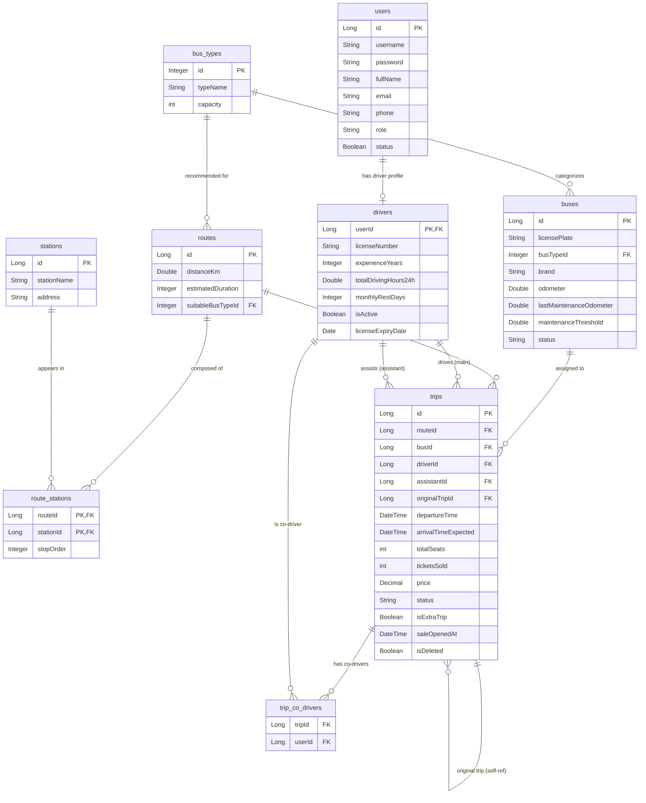

# Database Schema Reference

This document is derived from the JPA entity definitions in `src/main/java/giang/com/BusManagement/domain/`. All table names, column names, constraints, and relationships are extracted from the active source code.

> The schema is generated by Hibernate. The **default** profile uses `ddl-auto=update` (schema and data are preserved across restarts); the **`demo`** profile uses `ddl-auto=create-drop` (drops and recreates everything, then reseeds via `DataInitializer`). No migration scripts (e.g., Flyway, Liquibase) exist in the current codebase.

---

## Entity Overview

| Entity Class      | Table Name        | Purpose                                              |
|-------------------|-------------------|------------------------------------------------------|
| `User`            | `users`           | System accounts for administrators and drivers       |
| `Driver`          | `drivers`         | Driver profile, linked 1-to-1 with a `User`          |
| `BusType`         | `bus_types`       | Vehicle category definition (capacity, type name)    |
| `Bus`             | `buses`           | Physical vehicle records and maintenance tracking     |
| `Station`         | `stations`        | Named geographical terminals and stops               |
| `Route`           | `routes`          | Route configuration with distance and duration       |
| `RouteStation`    | `route_stations`  | Ordered stop sequence linking a route to stations    |
| `Trip`            | `trips`           | Scheduled dispatch: route + bus + crew + status      |
| *(join table)*    | `trip_co_drivers` | Many-to-many link between trips and co-drivers       |

---

## Table Definitions

### `users`

Stores base account information for all users of the system.

| Column       | Java Type    | Constraints                      | Notes                        |
|--------------|--------------|----------------------------------|------------------------------|
| `id`         | `Long`       | PK, auto-increment               |                              |
| `username`   | `String`     | NOT NULL, UNIQUE                 |                              |
| `password`   | `String`     | nullable                         | Intended for BCrypt encoding |
| `full_name`  | `String`     | nullable                         |                              |
| `email`      | `String`     | UNIQUE, nullable                 |                              |
| `phone`      | `String`     | nullable                         |                              |
| `role`       | `String`     | Enum stored as VARCHAR           | `ROLE_ADMIN`, `ROLE_DRIVER`, `ROLE_USER` |
| `status`     | `Boolean`    | nullable, default `true`         | Account active flag          |

**Relationships:**
- `OneToOne` → `drivers` (via `cascade = CascadeType.ALL`, `mappedBy = "user"`)

---

### `drivers`

Stores driver-specific profile data. Shares its primary key with `users` (shared-PK / `@MapsId` pattern).

| Column                    | Java Type       | Constraints         | Notes                                       |
|---------------------------|-----------------|---------------------|---------------------------------------------|
| `user_id`                 | `Long`          | PK, FK → `users.id` | Shared PK — no separate auto-increment      |
| `license_number`          | `String`        | nullable            |                                             |
| `experience_years`        | `Integer`       | nullable            |                                             |
| `total_driving_hours24h`  | `Double`        | nullable            | Seeded baseline value, not real-time synced |
| `monthly_rest_days`       | `Integer`       | nullable            |                                             |
| `is_active`               | `Boolean`       | nullable, default `true` |                                        |
| `license_expiry_date`     | `LocalDate`     | nullable            |                                             |

**Relationships:**
- `OneToOne` → `users.id` via `@MapsId` + `@JoinColumn(name = "user_id")`

**Business helper:**
- `isLicenseValid()`: returns `true` if `licenseExpiryDate != null && licenseExpiryDate.isAfter(LocalDate.now())`

---

### `bus_types`

Defines vehicle categories and their seat capacity.

| Column      | Java Type   | Constraints         | Notes                          |
|-------------|-------------|---------------------|--------------------------------|
| `id`        | `Integer`   | PK, auto-increment  |                                |
| `type_name` | `String`    | NOT NULL, UNIQUE    | E.g., "Giường nằm", "Ghế ngồi" |
| `capacity`  | `int`       | NOT NULL            | Total seat count               |

---

### `buses`

Physical bus records including odometer tracking and maintenance data.

| Column                      | Java Type    | Constraints            | Notes                                      |
|-----------------------------|--------------|------------------------|--------------------------------------------|
| `id`                        | `Long`       | PK, auto-increment     |                                            |
| `license_plate`             | `String`     | nullable               | No unique constraint declared in entity    |
| `bus_type_id`               | `Integer`    | FK → `bus_types.id`    | Nullable FK                                |
| `brand`                     | `String`     | nullable               |                                            |
| `odometer`                  | `Double`     | nullable               | Total km driven since manufacture          |
| `last_maintenance_odometer` | `Double`     | nullable               | Odometer reading at last maintenance       |
| `maintenance_threshold`     | `Double`     | nullable, default 5000 | Default set in `BusService.saveBus()`      |
| `status`                    | `String`     | Enum as VARCHAR        | `READY`, `TRAVELING`, `REPAIRING`          |

**Relationships:**
- `ManyToOne` → `bus_types` via `bus_type_id`

**Business helpers (computed, not persisted):**
- `getKmSinceLastMaintenance()` = `odometer - lastMaintenanceOdometer`
- `needsMaintenance()` = `kmSinceLastMaintenance >= maintenanceThreshold`
- `isNearMaintenance(additionalKm)` = `(kmSinceLastMaintenance + additionalKm) >= maintenanceThreshold * 0.9`

**Deletion rule:** Cannot be deleted if the bus has any associated trip record (checked via `TripRepository.existsByBusId`). Cannot be set to `REPAIRING` if it has active or pending trips.

---

### `stations`

Geographical bus terminals and intermediate stops.

| Column         | Java Type   | Constraints              | Notes               |
|----------------|-------------|--------------------------|---------------------|
| `id`           | `Long`      | PK, auto-increment       |                     |
| `station_name` | `String`    | NOT NULL, max length 100 |                     |
| `address`      | `String`    | nullable, TEXT           |                     |

**Relationships:**
- `OneToMany` → `route_stations` (`mappedBy = "station"`, `cascade = CascadeType.ALL`)

---

### `routes`

Route definitions. Departure and destination are derived from the ordered `route_stations` collection.

| Column                | Java Type   | Constraints         | Notes                                          |
|-----------------------|-------------|---------------------|------------------------------------------------|
| `id`                  | `Long`      | PK, auto-increment  |                                                |
| `distance_km`         | `Double`    | nullable            | Total route distance in kilometers             |
| `estimated_duration`  | `Integer`   | nullable            | Estimated duration in minutes                  |
| `suitable_bus_type_id`| `Integer`   | FK → `bus_types.id` | Optional recommended bus type                  |

**Relationships:**
- `OneToMany` → `route_stations` (`cascade = CascadeType.ALL`, `@BatchSize(20)`)
- `ManyToOne` → `bus_types` via `suitable_bus_type_id`

**Notes:**
- No `departure_point` or `destination_point` String columns exist. These were removed. The departure station is the `RouteStation` with the lowest `stopOrder`; the destination is the one with the highest `stopOrder`.
- Helper methods `getDeparturePointDisplay()` / `getDestinationPointDisplay()` compute names from the ordered `RouteStation` list.

---

### `route_stations`

Join table with extra data (stop order) linking routes to stations. Uses a composite primary key.

| Column       | Java Type   | Constraints                          | Notes                     |
|--------------|-------------|--------------------------------------|---------------------------|
| `route_id`   | `Long`      | PK (composite), FK → `routes.id`     | Part of `RouteStationId`  |
| `station_id` | `Long`      | PK (composite), FK → `stations.id`   | Part of `RouteStationId`  |
| `stop_order` | `Integer`   | nullable                             | Ascending integer sequence|

**Primary Key:** Composite `@EmbeddedId RouteStationId { routeId, stationId }`

---

### `trips`

Core transactional entity representing a scheduled bus dispatch.

| Column                | Java Type       | Constraints                              | Notes                                           |
|-----------------------|-----------------|------------------------------------------|-------------------------------------------------|
| `id`                  | `Long`          | PK, auto-increment                       |                                                 |
| `route_id`            | `Long`          | FK → `routes.id`, nullable               |                                                 |
| `bus_id`              | `Long`          | FK → `buses.id`, nullable                |                                                 |
| `driver_id`           | `Long`          | FK → `drivers.user_id`, nullable         | Main driver                                     |
| `assistant_id`        | `Long`          | FK → `drivers.user_id`, nullable         | Bus assistant/conductor                         |
| `original_trip_id`    | `Long`          | FK → `trips.id` (self-ref), nullable     | Set for AI-recommended extra trips              |
| `departure_time`      | `LocalDateTime` | nullable                                 |                                                 |
| `arrival_time_expected`| `LocalDateTime`| nullable                                 |                                                 |
| `total_seats`         | `int`           | not null by primitive                    |                                                 |
| `tickets_sold`        | `int`           | `DEFAULT 0`                              |                                                 |
| `price`               | `BigDecimal`    | nullable, precision=10, scale=2          |                                                 |
| `status`              | `String`        | Enum as VARCHAR, default `PENDING_APPROVAL` |                                              |
| `is_extra_trip`       | `boolean`       | `DEFAULT FALSE`                          | Set `true` for AI-suggested extra trips         |
| `sale_opened_at`      | `LocalDateTime` | nullable                                 | Stamped when status first becomes `ACTIVE`      |
| `created_at`          | `LocalDateTime` | nullable, `updatable = false`            | `@CreationTimestamp` — stamped by Hibernate on INSERT. Technical audit timestamp, distinct from the business-level `sale_opened_at`. Rows inserted before this column existed hold `NULL`. |
| `is_deleted`          | `boolean`       | NOT NULL, `DEFAULT FALSE`                | Soft-delete flag                                |

**Relationships:**
- `ManyToOne` → `routes`, `buses`, `drivers` (main driver), `drivers` (assistant), `trips` (self-reference)
- `ManyToMany` → `drivers` via join table `trip_co_drivers`

**Soft Delete:**
- `@SQLDelete(sql = "UPDATE trips SET is_deleted = true WHERE id = ?")` — physical deletion is intercepted.
- `@SQLRestriction("is_deleted = false")` — all queries automatically exclude soft-deleted rows.

**Business helpers (computed, not persisted):**
- `getOccupancyRate()` = `ticketsSold / totalSeats`
- `needsReinforcement()` = `occupancyRate > 0.90`
- `getTripDurationHours()` = `Duration.between(departureTime, arrivalTimeExpected).toMinutes() / 60.0`
- `getHoursOnSale()` = hours elapsed since `saleOpenedAt`
- `getHoursUntilDeparture()` = hours remaining until `departureTime`

---

### `trip_co_drivers`

Auto-generated many-to-many join table for co-drivers on a trip.

| Column    | Java Type | Constraints                      |
|-----------|-----------|----------------------------------|
| `trip_id` | `Long`    | FK → `trips.id`                  |
| `user_id` | `Long`    | FK → `drivers.user_id`           |

Defined via `@JoinTable` on `Trip.coDrivers`.

---

## Enumerations

### `TripStatus`
Stored as `VARCHAR` in `trips.status`.

| Value              | Description                                  |
|--------------------|----------------------------------------------|
| `PENDING_APPROVAL` | Created by AI scheduler, awaiting admin review |
| `ACTIVE`           | Approved/created; ticket sales open          |
| `DEPARTED`         | Bus has left; trip is underway               |
| `COMPLETED`        | Trip finished; bus returned to READY         |
| `CANCELLED`        | Trip was rejected or cancelled               |

### `BusStatus`
Stored as `VARCHAR` in `buses.status`.

| Value       | Description                                |
|-------------|--------------------------------------------|
| `READY`     | Available for new trip assignment          |
| `TRAVELING` | Currently operating on an active trip      |
| `REPAIRING` | Under maintenance; cannot be dispatched    |

### `Role`
Stored as `VARCHAR` in `users.role`.

| Value         | Description           |
|---------------|-----------------------|
| `ROLE_ADMIN`  | System administrator  |
| `ROLE_DRIVER` | Driver/staff account  |
| `ROLE_USER`   | General user account  |

---

## Entity Relationship Summary

```
users (1) ─────────── (1) drivers
  │                          │
  │                (many roles on trips)
  │                          │
bus_types (1) ──── (many) buses ──── (many) trips ──── (1) routes
                                        │                    │
                               trip_co_drivers          route_stations
                               (many-to-many)         (ordered stop list)
                                                            │
                                                       (many) stations
```

---

## Mermaid ER Diagram



---

## Normalization Notes

- `Route` no longer stores `departurePoint` / `destinationPoint` as redundant string columns. Origin and destination are derived from `RouteStation` records ordered by `stopOrder`.
- `Driver` uses a shared primary key (`@MapsId`) from `User`, eliminating a separate surrogate key and enforcing the one-to-one relationship at the database level.
- `RouteStation` uses a composite embedded PK (`RouteStationId`) instead of a surrogate key, correctly modeling the unique combination of route + station.
