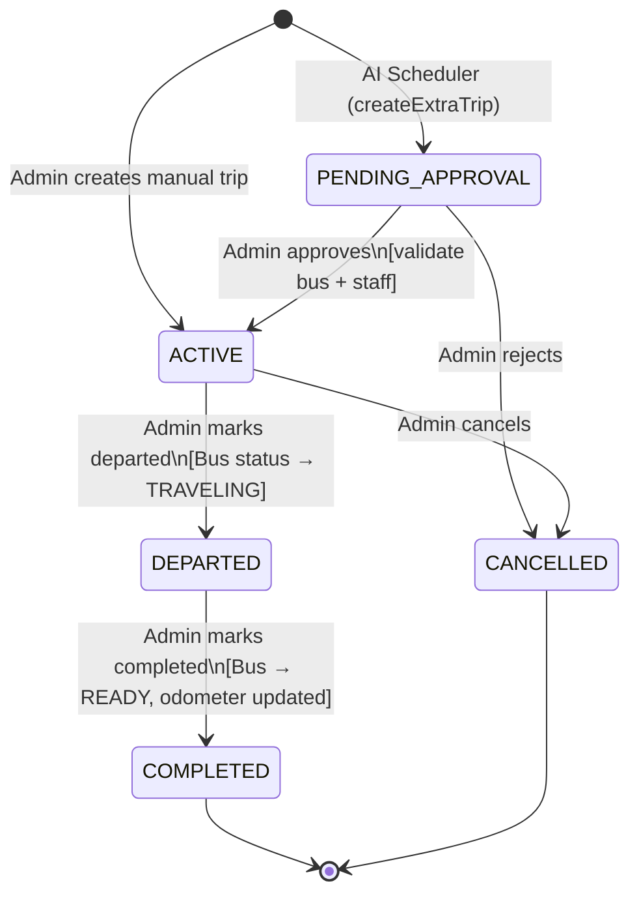

# Trip Lifecycle — Finite State Machine

`TripService` is the **sole authoritative implementation** of all FSM logic. No status change should bypass it.

---

## 1. Overview

Every `Trip` holds a `TripStatus` field that progresses through a defined set of states. Transitions are governed by a whitelist-based FSM in `TripService.canTransition(from, to)`. Invalid transitions throw `IllegalStateException`. The FSM also keeps the assigned `Bus.status` synchronized as a side effect.

---

## 2. States

### `PENDING_APPROVAL`
- **Meaning:** Created by the AI scheduler, awaiting administrator review.
- **When entered:** `createExtraTrip()` in the scheduled job.
- **Side effects on entry:** None. Resources may be unassigned if AI could not allocate them.

### `ACTIVE`
- **Meaning:** Trip is live and open for ticket sales. `saleOpenedAt` is stamped once.
- **When entered:** Manual trip creation (`createManualTrip`), manual approval (`approveTrip`), or AI-confirm (`confirmAutoAssignedTrip`), and via `updateTripStatus`.
- **Validation rules (on approval entry):** Full bus + staff validation runs before activating. See Section 8.
- **Side effects on entry:** `saleOpenedAt = now()` if not already set.

### `DEPARTED`
- **Meaning:** Bus has left. Trip is underway.
- **When entered:** Administrator action via `updateTripStatus(id, DEPARTED)`.
- **Side effects on entry:** `bus.status = TRAVELING`, saved to DB.

### `COMPLETED`
- **Meaning:** Trip finished. **Terminal state.**
- **When entered:** Administrator action via `updateTripStatus(id, COMPLETED)`.
- **Side effects on entry:** `bus.status = READY`; `bus.odometer += route.distanceKm`; bus saved.

### `CANCELLED`
- **Meaning:** Trip rejected or cancelled. **Terminal state.**
- **When entered:** `rejectTrip()`, `cancelTrip()`, or admin setting status to CANCELLED on the edit form.
- **Side effects on entry:** None.

---

## 3. Allowed Transitions

| From               | Event                            | To          | Extra Conditions                       |
|--------------------|----------------------------------|-------------|----------------------------------------|
| `PENDING_APPROVAL` | Admin approves                   | `ACTIVE`    | Bus + staff validation must pass       |
| `PENDING_APPROVAL` | Admin rejects                    | `CANCELLED` | Whitelist only                         |
| `ACTIVE`           | Admin marks departed             | `DEPARTED`  | Whitelist only                         |
| `ACTIVE`           | Admin cancels                    | `CANCELLED` | Whitelist only                         |
| `DEPARTED`         | Admin marks completed            | `COMPLETED` | Whitelist only                         |
| *(any)*            | Same state set again             | *(same)*    | Always allowed (`from == to` guard)    |

---

## 4. Mermaid State Diagram

---

## 5. Invalid Transitions (Enforced)

Any attempt throws `IllegalStateException`.

| Attempted              | Reason                        |
|------------------------|-------------------------------|
| `COMPLETED → *`        | Terminal state                |
| `CANCELLED → *`        | Terminal state                |
| `DEPARTED → ACTIVE`    | Cannot reverse                |
| `DEPARTED → CANCELLED` | Not in whitelist              |

---

## 6. Automatic Transitions (Scheduler)

`@Scheduled(fixedRate = 10_000)` — runs every 10 seconds.

The scheduler does **not** change existing trip statuses. It creates new `Trip` records in `PENDING_APPROVAL`. Flow:

1. Fetch all `ACTIVE` trips with route eager-loaded.
2. `isHotTrip(trip)` — check occupancy > 90%, departure in future, ≥72 h lead time, ≥48 h on sale (waived at ≥95%).
3. `hasAlreadySuggested(trip)` — skip if an extra trip already exists for this `originalTrip` in a blocking status.
4. `createExtraTrip(trip)` — build new `Trip` (status=`PENDING_APPROVAL`, `isExtraTrip=true`, departure+30 min).
5. `autoAssignResources(extraTrip)` — try to assign bus + crew. Save regardless of success.

### 6.1. Duplicate-Suggestion Prevention (`hasAlreadySuggested`)

Because step 1 re-scans every `ACTIVE` trip on every 10-second tick, a trip that stays hot across several ticks would otherwise get a new cloned extra trip on each one. `hasAlreadySuggested(originalTrip)` guards against this by querying `existsByOriginalTripAndStatusIn(originalTrip, blockingStatuses)` — i.e. does any `Trip` already reference this one via `original_trip_id` while sitting in a blocking status.

| Status of existing extra trip | Blocks new suggestion? |
|--------------------------------|-------------------------|
| `PENDING_APPROVAL`             | ✅ Yes                  |
| `ACTIVE`                       | ✅ Yes                  |
| `DEPARTED`                     | ✅ Yes                  |
| `COMPLETED`                    | ✅ Yes                  |
| `CANCELLED`                    | ❌ No — AI may re-suggest |

`CANCELLED` is deliberately left out of the blocking set. A cancelled extra trip means the earlier suggestion was rejected by the Admin or fell through (e.g. bus broke down, driver became unavailable) — the original capacity problem can still exist, so previously cancelled AI-suggested trips do not prevent future recommendations. The next scan is free to propose a fresh extra trip for the same original trip.

---

## 7. Business Validation Rules

### Bus Validation (`validateBusForTrip`)

| Rule                              | Condition                                                    | Effect |
|-----------------------------------|--------------------------------------------------------------|--------|
| Bus under repair                  | `bus.status == REPAIRING`                                   | Reject |
| Bus traveling (different trip)    | `bus.status == TRAVELING` and not editing its own trip      | Reject |
| Bus scheduling conflict           | Trip in `[departure−1h, arrival+1h]` exists for bus         | Reject |
| Bus past maintenance threshold    | `kmSinceLastMaintenance >= maintenanceThreshold`            | Reject |
| Bus near maintenance threshold    | `kmSinceLastMaintenance + routeKm >= threshold × 0.9`      | Reject |

### Staff Validation (`validateStaffForTrip`)

| Rule                              | Condition                                                    | Effect |
|-----------------------------------|--------------------------------------------------------------|--------|
| No main driver                    | `trip.driver == null`                                       | Reject |
| Insufficient drivers              | `count < ceil(durationHours / 8.0)`                         | Reject |
| No assistant on long-haul         | `durationHours > 8.0 && assistant == null`                  | Reject |
| Expired license                   | `licenseExpiryDate <= today`                                | Reject |
| Driver scheduling conflict        | Busy in `[departure−30min, arrival+30min]` in any role      | Reject |
| Daily driving limit exceeded      | `hoursToday + effectiveShareHours > 8.0`                    | Reject |
| Personnel duplication             | Same person in two roles on the same trip                   | Reject |

*Assistants skip the daily driving-hour limit but are still checked for scheduling conflicts.*

### Update-only Validation (`updateManualTrip`)

| Rule                           | Condition                                    | Effect |
|--------------------------------|----------------------------------------------|--------|
| Arrival before departure       | `arrivalTimeExpected.isBefore(departureTime)`| Reject |
| Seat count below tickets sold  | `totalSeats < ticketsSold`                   | Reject |

---

## 8. Bus Status Synchronization (Side Effects)

| Trip Transition        | Bus Status Change     |
|------------------------|-----------------------|
| `ACTIVE → DEPARTED`    | `READY → TRAVELING`   |
| `DEPARTED → COMPLETED` | `TRAVELING → READY`   |
| All others             | No change             |

`PENDING_APPROVAL → ACTIVE` does **not** change bus status. The bus stays `READY` until departure.
