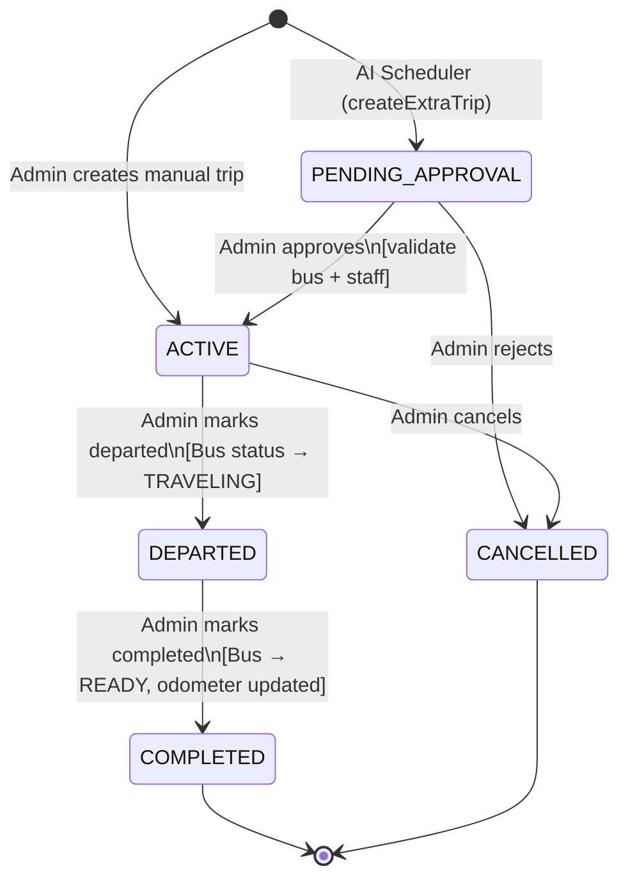

# Trip Lifecycle — Finite State Machine

`TripService` is the **sole authoritative implementation** of all FSM logic. No status change should bypass it.

---

## 1. Overview

Every `Trip` holds a `TripStatus` field that progresses through a defined set of states. Transitions are governed by a whitelist-based FSM in `TripService.canTransition(from, to)`. Invalid transitions throw `IllegalStateException`. The FSM also keeps the assigned `Bus.status` synchronized as a side effect.

---

## 2. States

### `PENDING_APPROVAL`
- **Meaning:** Created by the AI scheduler, awaiting administrator review.
- **When entered:** `createExtraTrip()` in the scheduled job.
- **Side effects on entry:** None. Resources may be unassigned if AI could not allocate them.

### `ACTIVE`
- **Meaning:** Trip is live and open for ticket sales. `saleOpenedAt` is stamped once.
- **When entered:** Manual trip creation (`createManualTrip`), manual approval (`approveTrip`), or AI-confirm (`confirmAutoAssignedTrip`), and via `updateTripStatus`.
- **Validation rules (on approval entry):** Full bus + staff validation runs before activating. See Section 8.
- **Side effects on entry:** `saleOpenedAt = now()` if not already set.

### `DEPARTED`
- **Meaning:** Bus has left. Trip is underway.
- **When entered:** Administrator action via `updateTripStatus(id, DEPARTED)`.
- **Side effects on entry:** `bus.status = TRAVELING`, saved to DB.

### `COMPLETED`
- **Meaning:** Trip finished. **Terminal state.**
- **When entered:** Administrator action via `updateTripStatus(id, COMPLETED)`.
- **Side effects on entry:** `bus.status = READY`; `bus.odometer += route.distanceKm`; bus saved.

### `CANCELLED`
- **Meaning:** Trip rejected or cancelled. **Terminal state.**
- **When entered:** `rejectTrip()`, `cancelTrip()`, or admin setting status to CANCELLED on the edit form.
- **Side effects on entry:** None.

---

## 3. Allowed Transitions

| From               | Event                            | To          | Extra Conditions                       |
|--------------------|----------------------------------|-------------|----------------------------------------|
| `PENDING_APPROVAL` | Admin approves                   | `ACTIVE`    | Bus + staff validation must pass       |
| `PENDING_APPROVAL` | Admin rejects                    | `CANCELLED` | Whitelist only                         |
| `ACTIVE`           | Admin marks departed             | `DEPARTED`  | Whitelist only                         |
| `ACTIVE`           | Admin cancels                    | `CANCELLED` | Whitelist only                         |
| `DEPARTED`         | Admin marks completed            | `COMPLETED` | Whitelist only                         |
| *(any)*            | Same state set again             | *(same)*    | Always allowed (`from == to` guard) — **no-op, no side effects** |

> **Setting the same state again is a no-op, not a re-entry.** It is accepted (no
> exception), but `updateTripStatus()` returns immediately without running any of
> the "Side effects on entry" listed in Section 2 — the side effects belong to
> *entering* a state, and the state diagram has no self-loops.
>
> This is load-bearing, not a detail: without that guard, re-sending `COMPLETED`
> for an already-completed trip would append `route.distanceKm` to
> `bus.odometer` **again** (the bus-sync block keys off the *new* status alone),
> silently corrupting `kmSinceLastMaintenance` and therefore the maintenance
> filters in `findBestAvailableBus()`, the maintenance alerts, and the
> odometer-weighted Vehicle Replacement ranking. Reproduced by double-clicking
> "Hoàn thành" on the dispatch board; fixed 2026-07-30 and pinned by
> `TripServiceStatusTransitionTest`. See `docs/todo/current_bugs_found.md` #6.

---

## 4. Mermaid State Diagram

```mermaid
stateDiagram-v2
    [*] --> PENDING_APPROVAL : AI Scheduler (createExtraTrip)
    [*] --> ACTIVE : Admin creates manual trip

    PENDING_APPROVAL --> ACTIVE : Admin approves\n[validate bus + staff]
    PENDING_APPROVAL --> CANCELLED : Admin rejects

    ACTIVE --> DEPARTED : Admin marks departed\n[Bus status → TRAVELING]
    ACTIVE --> CANCELLED : Admin cancels

    DEPARTED --> COMPLETED : Admin marks completed\n[Bus → READY, odometer updated]

    COMPLETED --> [*]
    CANCELLED --> [*]
```

---

## 5. Invalid Transitions (Enforced)

Any attempt throws `IllegalStateException`.

| Attempted              | Reason                        |
|------------------------|-------------------------------|
| `COMPLETED → *`        | Terminal state                |
| `CANCELLED → *`        | Terminal state                |
| `DEPARTED → ACTIVE`    | Cannot reverse                |
| `DEPARTED → CANCELLED` | Not in whitelist              |

### 5.1. "Enforced" was a promise with a hole in it until 2026-08-12 (defect #20)

`canTransition()` is called from exactly **one** place — `updateTripStatus():579`. But there
are **four** ways into `ACTIVE`, because `changeStatusToActive()` sets the status directly and
never consults the whitelist. Two of those four operate on an **already persisted** trip:

| Entry into `ACTIVE` | What guarantees it is legal |
|---|---|
| `updateTripStatus():605` | `canTransition()`; `ACTIVE → ACTIVE` already returned early at the same-status guard, so only `PENDING_APPROVAL` reaches it |
| `confirmAutoAssignedTrip():869` | **`requirePendingApproval()`** — added by this fix |
| `approveTrip():931` | **`requirePendingApproval()`** — added by this fix |
| `createManualTrip():953` | **Not a transition at all** — the `Trip` is still transient (`id == null`, no row exists), so there is no source state. Note its status here is **`ACTIVE`, not the entity default**: `AdminTripManagementController.createTrip():117` sets it before calling the service |

> **Do not "tidy" this by moving the guard into `changeStatusToActive()` itself.** One choke point for
> all four doors reads better than two call sites, and it is wrong: the creation path arrives with the
> status already `ACTIVE`, so the guard would throw on **every manually created trip**. The guard
> belongs to the two *approval* methods, which are the ones holding a persisted row.

Before the fix, a crafted `POST /admin/trips/approve` or `/admin/trips/confirm` performed
`CANCELLED → ACTIVE`, `COMPLETED → ACTIVE` or `DEPARTED → ACTIVE` and reported success —
the first three rows of the table above. Reproduced on the real app (trip 2749, both doors).
Two consequences beyond the resurrection itself: a re-completed trip adds `route.distanceKm`
to the odometer a **second** time (the defect #6 damage through another door), and
`approveTrip()` moves `trip.bus` before any status check, which is the defect #14 damage.

**Adding a fifth entry into `ACTIVE` means guaranteeing that invariant again** — the whitelist
alone will not catch it, which is precisely how this survived three full-project reviews.

---

## 6. Automatic Transitions (Scheduler)

`@Scheduled(fixedRate = 10_000)` — runs every 10 seconds.

The scheduler does **not** change existing trip statuses. It creates new `Trip` records in `PENDING_APPROVAL`. Flow:

1. Fetch all `ACTIVE` trips with route eager-loaded.
2. `isHotTrip(trip)` — check occupancy > 90%, departure in future, ≥72 h lead time, ≥48 h on sale (waived at ≥95%).
3. `hasAlreadySuggested(trip)` — skip if an extra trip already exists for this `originalTrip` in a blocking status.
4. `createExtraTrip(trip)` — build new `Trip` (status=`PENDING_APPROVAL`, `isExtraTrip=true`, departure+30 min).
5. `autoAssignResources(extraTrip)` — try to assign bus + crew. Save regardless of success.

### 6.1. Duplicate-Suggestion Prevention (`hasAlreadySuggested`)

Because step 1 re-scans every `ACTIVE` trip on every 10-second tick, a trip that stays hot across several ticks would otherwise get a new cloned extra trip on each one. `hasAlreadySuggested(originalTrip)` guards against this by querying `existsByOriginalTripAndStatusIn(originalTrip, blockingStatuses)` — i.e. does any `Trip` already reference this one via `original_trip_id` while sitting in a blocking status.

| Status of existing extra trip | Blocks new suggestion? |
|--------------------------------|-------------------------|
| `PENDING_APPROVAL`             | ✅ Yes                  |
| `ACTIVE`                       | ✅ Yes                  |
| `DEPARTED`                     | ✅ Yes                  |
| `COMPLETED`                    | ✅ Yes                  |
| `CANCELLED`                    | ❌ No — AI may re-suggest |

`CANCELLED` is deliberately left out of the blocking set. A cancelled extra trip means the earlier suggestion was rejected by the Admin or fell through (e.g. bus broke down, driver became unavailable) — the original capacity problem can still exist, so previously cancelled AI-suggested trips do not prevent future recommendations. The next scan is free to propose a fresh extra trip for the same original trip.

---

## 7. Business Validation Rules

### Bus Validation (`validateBusForTrip`)

| Rule                              | Condition                                                    | Effect |
|-----------------------------------|--------------------------------------------------------------|--------|
| Bus under repair                  | `bus.status == REPAIRING`                                   | Reject |
| Bus flagged traveling, unexplained | `bus.status == TRAVELING` **and no `DEPARTED` trip exists for that bus** | Reject |
| Bus scheduling conflict           | Trip in `[departure−1h, arrival+1h]` exists for bus         | Reject |
| Bus past maintenance threshold    | `kmSinceLastMaintenance >= maintenanceThreshold`            | Reject |
| Bus near maintenance threshold    | `kmSinceLastMaintenance + routeKm >= threshold × 0.9`      | Reject |

### Staff Validation (`validateStaffForTrip`)

| Rule                              | Condition                                                    | Effect |
|-----------------------------------|--------------------------------------------------------------|--------|
| No main driver                    | `trip.driver == null`                                       | Reject |
| Insufficient drivers              | `count < ceil(durationHours / 8.0)`                         | Reject |
| No assistant on long-haul         | `durationHours > 8.0 && assistant == null`                  | Reject |
| Expired license                   | `licenseExpiryDate <= today`                                | Reject |
| Driver scheduling conflict        | Busy in `[departure−30min, arrival+30min]` in any role      | Reject |
| Daily driving limit exceeded      | `hoursToday + effectiveShareHours > 8.0`                    | Reject |
| Personnel duplication             | Same person in two roles on the same trip                   | Reject |

*Assistants skip the daily driving-hour limit but are still checked for scheduling conflicts.*

> **Why the `TRAVELING` row asks about a trip and not just the flag (defect #19, 2026-08-12).**
> It used to read "`bus.status == TRAVELING` and not editing its own trip", implemented as
> `excludeTripId.equals(trip.getId())` — a comparison of two *trip* ids under a variable named
> `travelingForThisTrip`, which is a claim about the *bus*. That expression is `true` on three of the
> four call sites, so the same bus was refused at `/trips/create` and accepted at `/trips/approve`.
>
> Blocking **every** traveling bus was tried and rejected: `isBusBusy` already refuses an overlapping
> window, so the flag only adds the *non-overlapping* case — scheduling a bus for next week while it
> is out today, which is ordinary operations. Two real trips have that shape (8 and 14); trip 8 is the
> one that proves it — it saves normally under the rule adopted — while trip 14 is already unsaveable
> for an unrelated staffing rule, so tightening would only have added a second reason. The deciding
> argument does not rest on the count anyway: `showEditTripForm()` force-adds the current bus to the
> dropdown, so the form would have offered exactly the bus it then refuses.
>
> Dropping the row entirely was also rejected: `Bus.status` is written by two owners and can disagree
> with the trip table (see the roadmap's Developer Note on `Bus.status`). A bus flagged `TRAVELING`
> with **no** `DEPARTED` trip behind it is either that desync or an admin's manual mark — neither is
> something to schedule on. So the flag is honoured only when nothing explains it; when a running trip
> does explain it, the window rule decides. The check needs no "other than this trip" clause, because
> the trip being validated can never itself be `DEPARTED` (defect #18 blocks editing one, #20 restricts
> approval to `PENDING_APPROVAL`, and creation has no row yet).

### Update-only Validation (`updateManualTrip`)

| Rule                           | Condition                                    | Effect |
|--------------------------------|----------------------------------------------|--------|
| Arrival before departure       | `arrivalTimeExpected.isBefore(departureTime)`| Reject |
| Seat count below tickets sold  | `totalSeats < ticketsSold`                   | Reject |

---

## 8. Bus Status Synchronization (Side Effects)

| Trip Transition        | Bus Status Change     |
|------------------------|-----------------------|
| `ACTIVE → DEPARTED`    | `READY → TRAVELING`   |
| `DEPARTED → COMPLETED` | `TRAVELING → READY`   |
| All others             | No change             |

`PENDING_APPROVAL → ACTIVE` does **not** change bus status. The bus stays `READY` until departure.

### 8.1. The pairing invariant, and what protects it

The two rows above are a **pair**: the bus set `TRAVELING` on entering `DEPARTED` must be the same
bus set `READY` on entering `COMPLETED`. `updateTripStatus()` does **not** remember which bus it
marked — it re-reads `trip.getBus()` at both ends — so the pair holds **only while `trip.bus` does
not change in between**.

Two guards keep that true, and both live **outside** this FSM:

| Guard | Where | Protects against |
|---|---|---|
| A `DEPARTED` trip cannot be edited **at all** | `AdminTripManagementController.editRefusalReason()`, applied by both `showEditTripForm()` and `updateTrip()` | Defects **#14** and **#18** — while the trip is departed nothing about it can move, so `trip.bus` cannot change and the FSM cannot lose the bus it marked. It also pins `route`, whose `distanceKm` is read at *completion* time to advance the odometer |
| A bus with an unfinished trip cannot be set `REPAIRING` | `BusService.updateBus()` | Defect **#15** — an admin's repair mark placed mid-trip was erased without warning by the `COMPLETED → READY` row above |

Neither changes `TripService`: the FSM stays the sole authority on transitions, while the two screens
stop *feeding* it a state it cannot represent.

**The first guard started narrower and was widened on 2026-08-11.** The 2026-08-06 fix for #14 locked
only the **bus field** of a departed trip. When the owner ruled on #18 — apply `deleteTrip()`'s written
per-status policy to editing as well — the narrower guard became strictly redundant and was folded in,
because a rule that can never fire is the same dead code this project rejected when it declined #15's
option (B). The FSM-invariant reasoning did not disappear with it; it is recorded in that method's
javadoc and here.

**Status changes now leave exactly one door.** With the edit form closed for `DEPARTED` and
`COMPLETED` trips, a departed trip advances only through the dispatch board
(`POST /admin/dispatch/status`), whose target set is the `BOARD_ACTIONS` allow-list hardened by defect
#10. One door for transitions, one door for trip details, and the second is open only before the bus
rolls. Verified 2026-08-11 that this strands nothing: `findDispatchBoardTrips` has an upper time bound
but **no lower one**, so every `DEPARTED` trip reaches the board however old it is — 5 of 5 on the day.

> **The sentence above was written on 2026-08-11 and was not true until 2026-08-12 (defect #20).**
> A second door existed the whole time: `POST /admin/trips/approve` and `/admin/trips/confirm`
> reached `changeStatusToActive()` without consulting the FSM, so a `DEPARTED` trip could be sent
> back to `ACTIVE` — and `approveTrip()` reassigns `trip.bus` on the way, which is exactly the
> pairing invariant this section exists to protect. It is true now that both approval doors require
> `PENDING_APPROVAL` (§5.1). Recorded rather than quietly edited, because the lesson is the shape of
> the error: the claim was made about the *screen* the fix had just closed, and generalised into a
> claim about **every** path. When closing a door, enumerate the others by grepping for the write,
> not by reasoning about the screen in front of you.

If a future change lets `trip.bus` move again while `DEPARTED` — by narrowing this policy, or by adding
a new write path — the pairing breaks **silently**. There is no runtime check that would notice.
