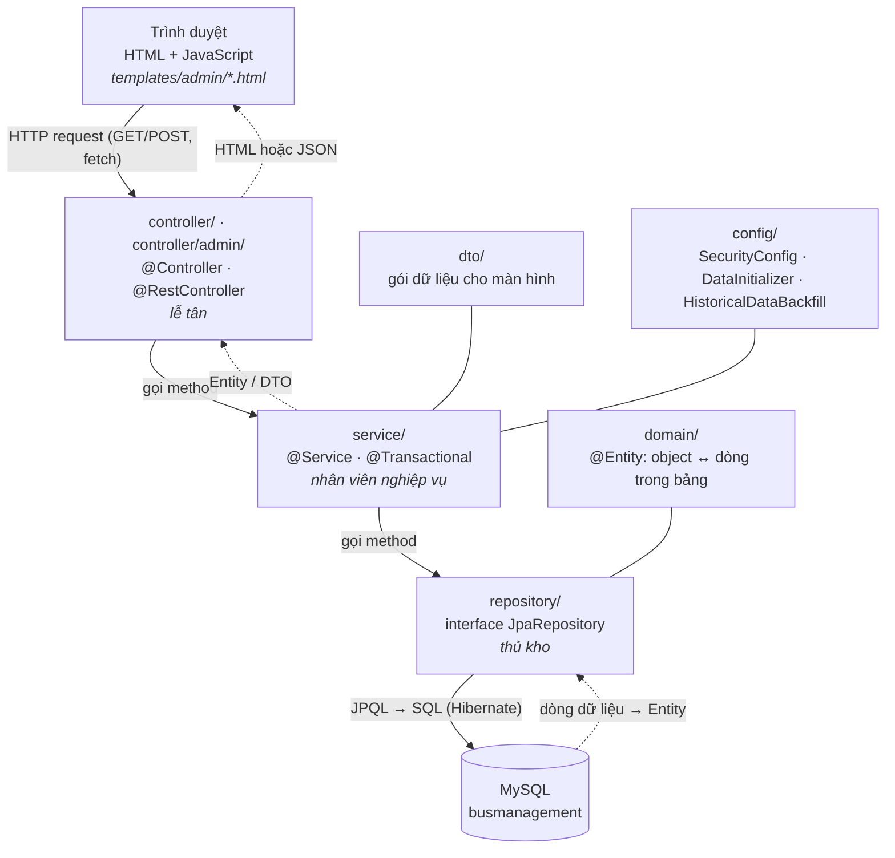
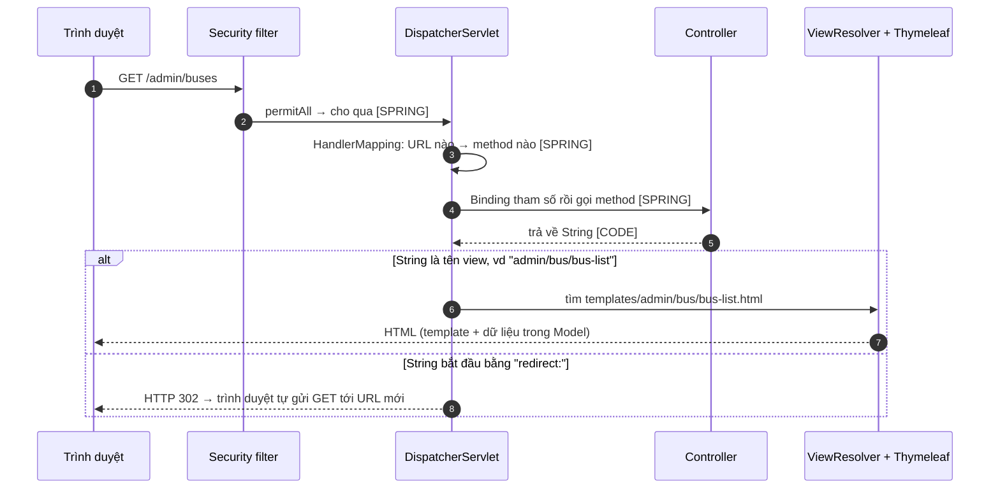
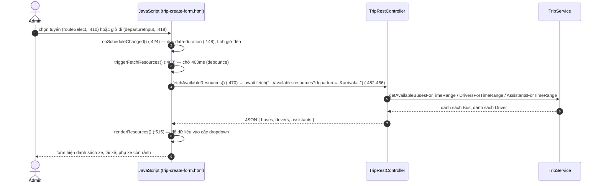

# BÀI 00a — JAVA HIỆN ĐẠI + SPRING CORE + SPRING MVC + THYMELEAF/JAVASCRIPT

> Bài nền thứ nhất, sinh từ `docs/ai/03_defense_study_prompt.md` (PHẦN A1), ngày 2026-09-26.
> Mọi ví dụ lấy từ code thật của BusManagement. Số dòng là ảnh chụp ngày viết — nếu lệch, grep lại.
>
> **Nhãn dùng trong bài:**
> - **[CODE]** — đọc trực tiếp từ code, có `file:dòng`.
> - **[SPRING]** — hành vi chuẩn của framework/thư viện mà code không viết ra.
> - **[SUY LUẬN]** — suy luận của người viết; "chưa kiểm chứng" nếu chưa chạy thử.
>
> Đường dẫn Java viết tắt: `…/` = `src/main/java/giang/com/BusManagement/`.
> Template viết tắt: `tpl/` = `src/main/resources/templates/`.

---

## §1. Bức tranh toàn cảnh

### 1.1. Spring Boot là gì — nói kiểu đời thường

Viết một web app bằng Java thuần, bạn phải tự làm rất nhiều việc "tạp vụ": mở cổng mạng nhận
request, đọc chuỗi HTTP, tự tạo từng object và nối chúng với nhau, tự mở kết nối database, tự đóng
kết nối, tự biến dữ liệu thành HTML...

**Spring** là một bộ khung (framework) làm hộ phần tạp vụ đó. Bạn chỉ viết phần **nghiệp vụ** (xe
nào được gán, tài xế lái bao nhiêu giờ), còn Spring lo "đường ống". **Spring Boot** là Spring kèm
cấu hình mặc định hợp lý: chỉ cần khai báo "tôi cần web, cần database, cần giao diện Thymeleaf" là
nó tự dựng sẵn — không phải viết hàng trăm dòng cấu hình.

Ví von: Java thuần là tự xây nhà từ gạch; Spring Boot là mua nhà khung có sẵn điện nước, bạn chỉ lo
nội thất.

### 1.2. `pom.xml` — danh sách "nguyên liệu"

**Maven** là công cụ tự tải thư viện và build dự án. File `pom.xml` là danh sách thư viện cần dùng.
**Starter** là một "gói combo" của Spring Boot: khai báo một starter là kéo về cả nhóm thư viện đi
kèm cấu hình sẵn.

[CODE] Dự án dùng **Spring Boot 4.0.8** (`pom.xml:8`) và **Java 17** (`pom.xml:30`).

| Starter / thư viện (`pom.xml`) | Dùng để làm gì | Dự án có thật sự dùng? |
|---|---|---|
| `spring-boot-starter-webmvc` (:55) | Web: nhận request, controller | ✅ mọi controller |
| `spring-boot-starter-thymeleaf` (:47) | Sinh HTML từ template | ✅ 27 template |
| `spring-boot-starter-data-jpa` (:35) | Làm việc với database qua object | ✅ mọi repository |
| `mysql-connector-j` (:70) | Driver nói chuyện với MySQL | ✅ |
| `lombok` (:75) | Tự sinh getter/setter/constructor | ✅ khắp nơi (§9) |
| `spring-boot-starter-security` (:43) | Bảo mật, đăng nhập | ⚠️ có bật nhưng cho qua mọi request (§8.3) |
| `spring-boot-devtools` (:64, `runtime`, `optional`) | Tự khởi động lại khi sửa code lúc dev | ✅ chỉ lúc phát triển [SPRING] |
| `spring-boot-starter-validation` (:51) | Kiểm tra dữ liệu bằng `@Valid`, `@NotNull` | ❌ không có `@Valid`/`@NotNull` nào trong `src/main` — kiểm tra viết tay ở service (Bài 00b) |
| `spring-boot-starter-mail` (:39) | Gửi email | ❌ không có `JavaMailSender` nào; roadmap §4 ghi là cố ý chưa dùng |
| `thymeleaf-extras-springsecurity6` (:59) | Cú pháp `sec:` trong template | ❌ không template nào dùng `sec:` |

> Câu hội đồng có thể hỏi: *"Sao pom có validation/mail mà không thấy dùng?"* — trả lời thật:
> starter được khai báo sẵn từ đầu; mail là Non-Goal có chủ đích (roadmap §4), còn kiểm tra dữ
> liệu được viết tay ở tầng service để trả về câu báo lỗi nghiệp vụ tiếng Việt.

### 1.3. Ứng dụng khởi động thế nào

[CODE] `…/BusManagementApplication.java:24-30`:

```java
@SpringBootApplication(exclude = UserDetailsServiceAutoConfiguration.class) // (1)
@EnableScheduling                                                          // (2)
public class BusManagementApplication {
    public static void main(String[] args) {
        SpringApplication.run(BusManagementApplication.class, args);       // (3)
    }
}
```

1. `@SpringBootApplication` — "đây là điểm gốc của ứng dụng". Nó bảo Spring: *quét mọi class trong
   package `giang.com.BusManagement` và các package con, class nào có đánh dấu (`@Controller`,
   `@Service`...) thì tự tạo object cho nó; đồng thời bật cấu hình tự động* [SPRING].
   Vế `exclude = UserDetailsServiceAutoConfiguration.class` tắt đúng một phần cấu hình tự động:
   user mặc định mà Spring Security tự sinh (dòng "Using generated security password" lúc khởi
   động). Hệ thống không có đăng nhập nên không cần user đó. Javadoc cùng file (dòng 8-22) giải
   thích vì sao loại bằng annotation chứ không bằng property: property ghi sai tên class thì Boot
   **im lặng bỏ qua**, còn annotation ghi sai thì **không biên dịch được** [CODE].
2. `@EnableScheduling` — bật khả năng chạy việc định kỳ; chính nhờ nó mà job quét chuyến đông
   `@Scheduled` ở `TripService` chạy được (§8.1).
3. `SpringApplication.run(...)` — khởi động toàn bộ: dựng các object, kết nối MySQL, mở web server
   (mặc định cổng 8080 [SPRING]).

### 1.4. Kiến trúc phân lớp

Ví von một văn phòng nhà xe:

- **Template HTML + JavaScript** = quầy giao dịch, nơi khách (Admin) nhìn và bấm.
- **Controller** = **lễ tân**: nhận yêu cầu, chuyển cho người xử lý, rồi chọn trang để trả về.
  Không tự quyết nghiệp vụ.
- **Service** = **nhân viên nghiệp vụ**: kiểm tra luật (xe có bận không, tài xế có quá 8h không),
  quyết định, ra lệnh ghi.
- **Repository** = **thủ kho**: chỉ biết lấy/cất dữ liệu, không biết luật.
- **Domain (Entity)** = **hồ sơ** trong kho: mỗi class là một loại hồ sơ (Xe, Chuyến, Tài xế...).
- **MySQL** = **cái kho**.



| Package | Vai trò | File tiêu biểu |
|---|---|---|
| `controller` | Trang chủ `/` | `helloController.java` (trả `hello.html`) |
| `controller.admin` | Mọi màn Admin + 1 REST API | `AdminBusController.java`, `TripRestController.java` |
| `service` | Luật nghiệp vụ | `TripService.java` (~1.900 dòng, lõi hệ thống), `BusService.java` |
| `repository` | Truy vấn DB | `TripRepository.java`, `BusRepository.java` |
| `domain` | Entity + enum | `Trip.java`, `Bus.java`, `TripStatus.java` |
| `dto` | Gói dữ liệu cho màn hình | `DashboardOverviewDto.java`, `ForecastPointDto.java` |
| `config` | Cấu hình + nạp dữ liệu | `SecurityConfig.java`, `DataInitializer.java` |
| `resources/templates` | Giao diện Thymeleaf | `admin/bus/bus-list.html`, `admin/trip-create-form.html` |

Ghi chú nhỏ: tên class `helloController` viết thường chữ đầu (`…/controller/helloController.java:7`),
lệch quy ước đặt tên Java (class viết hoa chữ đầu). Không ảnh hưởng chạy, nhưng đừng bắt chước.

---

## §2. Java hiện đại mà code dự án dùng

Đây là phần **bắt buộc phải vững trước** — nếu không, bạn sẽ không đọc được `TripService` hay các
service Decision Support. Mỗi mục: nghĩa đời thường → code thật → viết lại kiểu Java cũ.

### 2.1. Lambda và method reference

**Lambda** = "một hàm nhỏ viết tại chỗ, không cần đặt tên". Cú pháp `tham_số -> kết_quả`.

```java
d -> Boolean.TRUE.equals(d.getIsActive())
// đọc là: "với mỗi d, trả về true nếu d đang hoạt động"
```

**Method reference** = cách viết gọn của lambda khi lambda chỉ gọi đúng một method:
`Bus::getKmSinceLastMaintenance` tương đương `bus -> bus.getKmSinceLastMaintenance()`.

[CODE] `…/service/TripService.java:345` — `.thenComparingDouble(Bus::getKmSinceLastMaintenance)`.

### 2.2. Stream API — "dây chuyền xử lý danh sách"

**Stream** = biến một danh sách thành một **dây chuyền**: phần tử đi qua từng trạm (lọc, biến đổi,
sắp xếp) rồi được gom lại ở cuối. Các trạm hay gặp:

| Trạm | Nghĩa |
|---|---|
| `filter(điều kiện)` | Giữ lại phần tử thỏa điều kiện |
| `map(biến đổi)` | Biến mỗi phần tử thành thứ khác |
| `sorted(comparator)` | Sắp xếp |
| `min(comparator)` / `max(...)` | Lấy phần tử nhỏ/lớn nhất (trả `Optional`) |
| `count()` | Đếm |
| `anyMatch` / `noneMatch` | Có phần tử nào thỏa / không phần tử nào thỏa |
| `mapToDouble(...).sum()` / `.average()` | Biến thành số rồi cộng / lấy trung bình |
| `collect(Collectors.toList())` / `.toList()` | Gom thành List |
| `collect(Collectors.toMap(k, v))` | Gom thành Map |
| `collect(Collectors.groupingBy(k, Collectors.counting()))` | Chia nhóm theo khóa, đếm mỗi nhóm |

**Ví dụ 1 — lọc tài xế hợp lệ** [CODE] `…/service/TripService.java:482-499`
(trong `findBestAvailableDriver()`; đã rút bớt comment):

```java
List<Driver> availableDrivers = driverRepository.findAll().stream()   // lấy mọi tài xế, đưa lên dây chuyền
        .filter(d -> Boolean.TRUE.equals(d.getIsActive()))            // trạm 1: đang hoạt động
        .filter(d -> excludeDrivers == null
                || excludeDrivers.stream().noneMatch(ex -> ex.getUserId().equals(d.getUserId())))
                                                                      // trạm 2: chưa bị chọn ở vai trò khác
        .filter(d -> d.isLicenseValid(departure.toLocalDate()))       // trạm 3: bằng còn hạn vào ngày chạy
        .filter(d -> isAssistantRole
                || getDrivingHoursForDate(d, departure, null, ctx) + effectiveHours <= 8.0)
                                                                      // trạm 4: không vượt 8h (phụ xe được miễn)
        .filter(d -> !isDriverBusyInWindow(d, windowStart, windowEnd, null, ctx))
                                                                      // trạm 5: không trùng lịch
        .collect(Collectors.toList());                                // gom lại thành List
```

Viết lại bằng Java kiểu cũ (cùng ý nghĩa):

```java
List<Driver> availableDrivers = new ArrayList<>();
for (Driver d : driverRepository.findAll()) {
    if (!Boolean.TRUE.equals(d.getIsActive())) continue;

    boolean daBiChon = false;
    if (excludeDrivers != null) {
        for (Driver ex : excludeDrivers) {
            if (ex.getUserId().equals(d.getUserId())) { daBiChon = true; break; }
        }
    }
    if (daBiChon) continue;

    if (!d.isLicenseValid(departure.toLocalDate())) continue;
    if (!isAssistantRole
            && getDrivingHoursForDate(d, departure, null, ctx) + effectiveHours > 8.0) continue;
    if (isDriverBusyInWindow(d, windowStart, windowEnd, null, ctx)) continue;

    availableDrivers.add(d);
}
```

Mẹo đọc: **mỗi `.filter(...)` là một câu `if (...) continue;` đảo ngược.**

**Ví dụ 2 — chọn người ít giờ lái nhất** [CODE] `…/service/TripService.java:503-507`:

```java
Driver best = availableDrivers.stream()
        .filter(d -> d.getLicenseExpiryDate() != null
                && d.getLicenseExpiryDate().isAfter(departure.toLocalDate().plusDays(7))) // bằng còn > 7 ngày
        .min(Comparator.comparingDouble(d -> getDrivingHoursForDate(d, departure, null, ctx))) // ít giờ nhất
        .orElse(null);                                                                        // không ai → null
```

**Ví dụ 3 — đếm và chia nhóm** [CODE] `…/service/DashboardService.java:156` và `:166-169`:

```java
long readyCount = allBuses.stream().filter(b -> b.getStatus() == BusStatus.READY).count();

Map<String, Long> busTypeCounts = allBuses.stream()
        .collect(Collectors.groupingBy(
                b -> b.getBusType() != null ? b.getBusType().getTypeName() : "Chưa phân loại", // khóa nhóm
                Collectors.counting()));                                                     // đếm mỗi nhóm
// Kết quả dạng: {"Limousine"=5, "Giường nằm"=8, "Ghế ngồi"=7}
```

Kiểu cũ của `groupingBy`: tạo `HashMap`, duyệt từng xe, lấy tên loại, `map.put(ten, map.getOrDefault(ten, 0L) + 1)`.

### 2.3. `Comparator` nối chuỗi — "sắp theo tiêu chí 1, hòa thì xét tiêu chí 2"

[CODE] `…/service/TripService.java:343-346`:

```java
private static Comparator<Bus> preferredTypeThenLeastWorn(BusType preferredType) {
    return Comparator.comparing((Bus bus) -> !isOfType(bus, preferredType)) // tiêu chí 1: đúng loại gợi ý lên trước
            .thenComparingDouble(Bus::getKmSinceLastMaintenance);          // tiêu chí 2: ít km kể từ bảo trì lên trước
}
```

Mẹo: `!isOfType(...)` cho `false` với xe đúng loại, mà `false` xếp trước `true`, nên xe đúng loại
đứng đầu. `.reversed()` (gặp ở `RecommendationService`, `VehicleReplacementService`) đảo thứ tự,
dùng để xếp "lớn nhất lên đầu".

### 2.4. `Optional` và `orElseThrow` — "hộp có thể rỗng"

`Optional<T>` = một cái hộp có thể chứa một object, hoặc rỗng. Nó thay cho việc trả `null`, buộc
người gọi phải xử lý trường hợp "không tìm thấy".

[CODE] `…/controller/admin/AdminBusController.java:47-48`:

```java
Bus bus = busService.findById(id)                  // trả Optional<Bus>
        .orElseThrow(() -> new RuntimeException("Không tìm thấy xe với ID: " + id));
        // có xe → lấy ra; hộp rỗng → ném exception
```

Kiểu cũ:

```java
Bus bus = busRepository.findById(id) ... // giả sử trả null nếu không có
if (bus == null) throw new RuntimeException("Không tìm thấy xe với ID: " + id);
```

Mẫu `findById(...).orElseThrow(...)` xuất hiện ở gần như **mọi** service và controller. Biến thể:
`.orElse(null)` (rỗng thì trả null), `.orElseGet(() -> ...)` (rỗng thì tạo mới — xem
`CostParameterService.getOrDefault()`).

### 2.5. `record` — "class chỉ để chở dữ liệu, viết một dòng"

[CODE] `…/service/ForecastService.java:140`:

```java
private record Observation(long routeId, int hour, LocalDate date, double occupancy) { }
```

Một dòng này tương đương một class có 4 field `final`, constructor 4 tham số, 4 method đọc
(`routeId()`, `hour()`, `date()`, `occupancy()` — **không có chữ `get`**), cùng `equals`,
`hashCode`, `toString`. Dự án dùng `record` cho dữ liệu trung gian trong tính toán:
`ForecastService.SeriesKey` (:144), `WhatIfSimulationService.HotSlot` (:134), `Derivation` (:138).

Vì `record` có sẵn `equals/hashCode` theo các field, nó dùng được làm **khóa của Map** — đúng như
`ForecastService.java:164` nhóm quan sát theo `new SeriesKey(o.routeId(), o.hour())`.

### 2.6. Switch expression — và vì sao cố ý **không có `default`**

[CODE] `…/service/TripService.java:1855-1876` (rút gọn):

```java
public String deleteRefusalReason(Trip trip) {
    return switch (trip.getStatus()) {                 // switch TRẢ VỀ một giá trị
        case DEPARTED  -> "Chuyến ... đang trên đường ...";
        case COMPLETED -> "Chuyến ... đã hoàn thành ...";
        case ACTIVE    -> trip.getTicketsSold() > 0 ? "... đã có vé ..." : null;
        case PENDING_APPROVAL, CANCELLED -> null;      // một case gom nhiều giá trị
    };                                                 // KHÔNG có default
}
```

Khác switch cũ: dùng `->`, không cần `break`, và cả khối **trả về một giá trị**.

Vì sao không có `default`: khi switch trên enum phủ **đủ mọi giá trị**, trình biên dịch chấp nhận
không cần `default`. Nếu sau này ai thêm một `TripStatus` mới, switch không còn phủ đủ nữa → **lỗi
biên dịch** → người thêm bắt buộc phải quyết định chính sách cho trạng thái mới. Javadoc nói rõ ý
đồ này [CODE] (`TripService.java` javadoc của `deleteRefusalReason`; cùng kiểu ở
`AdminTripManagementController.editRefusalReason()` `:232-245`).

### 2.7. Text block `"""` — chuỗi nhiều dòng

[CODE] `…/repository/TripRepository.java:46-56`: câu truy vấn dài được viết giữa hai dấu `"""`
thay vì nối nhiều chuỗi bằng `+`. Chỉ là cách viết chuỗi cho dễ đọc, không có ý nghĩa gì khác.

### 2.8. Các kiểu dữ liệu hay gặp

- **`BigDecimal`** — số thập phân chính xác, dùng cho **tiền** (`Trip.price`,
  `CostParameters.fuelCostPerKm`). Không dùng `double` cho tiền vì `double` làm tròn sai kiểu
  `0.1 + 0.2 = 0.30000000000000004`. Phép tính viết bằng method: `a.multiply(b)`, `a.add(b)`,
  `a.subtract(b)`, `setScale(0, RoundingMode.HALF_UP)` (làm tròn về đồng) — xem
  `RecommendationService.estimateCost()`.
- **`LocalDate`** (ngày), **`LocalDateTime`** (ngày + giờ), **`Duration`** (khoảng thời gian):
  `Duration.between(departure, arrival).toMinutes() / 60.0` = số giờ của chuyến
  (`Trip.getTripDurationHours()`). `departure.minusMinutes(30)`, `.plusHours(1)`,
  `.isBefore(...)`, `.isAfter(...)` dùng khắp nơi để tính "cửa sổ bận".
- **`EnumSet.of(...)`** — một tập các giá trị enum; ví dụ `DispatchController.BOARD_ACTIONS`.
- **`String.format("%.1f", x)`** — định dạng số trong câu thông báo (1 chữ số thập phân).
- **Toán tử ba ngôi** `điều_kiện ? a : b` — gặp liên tục, ví dụ
  `bus.getBusType() != null ? bus.getBusType().getCapacity() : null`.

---

## §3. IoC Container, Bean và Dependency Injection

### 3.1. Bean và IoC — "Spring là người tuyển dụng và phân công"

- **Bean** = một object do Spring tạo ra và quản lý (thường chỉ **một** object cho cả ứng dụng).
- **IoC Container** (Inversion of Control — "đảo quyền điều khiển") = cái kho nơi Spring giữ các
  bean. Bình thường code của bạn tự `new` object; ở đây **Spring** tạo, bạn chỉ khai báo "tôi cần".
- **Dependency Injection (DI)** — "tiêm phụ thuộc": khi class A cần class B, Spring tự đưa B vào A.

Đánh dấu một class để Spring tạo bean cho nó:

| Annotation | Nghĩa | Ví dụ trong dự án |
|---|---|---|
| `@Controller` | Bean xử lý web, trả trang HTML | `AdminBusController.java:12` |
| `@RestController` | Bean xử lý web, trả JSON | `TripRestController.java:27` |
| `@Service` | Bean nghiệp vụ | `BusService.java:18` |
| `@Repository` | Bean truy cập dữ liệu | `BusRepository.java:12` |
| `@Component` | Bean chung chung | `DataInitializer.java:26` |
| `@Configuration` + `@Bean` | Class cấu hình; method `@Bean` trả về một bean | `SecurityConfig.java:8`, `:11` |

Cả bốn `@Controller`, `@Service`, `@Repository`, `@RestController` thực chất đều là dạng đặc biệt
của `@Component` [SPRING] — khác nhau ở ý nghĩa và vài hành vi phụ.

### 3.2. Constructor injection qua Lombok — cách dự án làm nhất quán

[CODE] `…/controller/admin/AdminBusController.java:12-17`:

```java
@Controller
@RequestMapping("/admin/buses")
@RequiredArgsConstructor           // Lombok: tự sinh constructor nhận mọi field final
public class AdminBusController {
    private final BusService busService;   // "tôi cần một BusService"
    ...
}
```

Lombok sinh ra (bạn không thấy trong file, nhưng nó có ở bytecode):

```java
public AdminBusController(BusService busService) {
    this.busService = busService;
}
```

Khi khởi động, Spring thấy constructor cần một `BusService` → lấy bean `BusService` trong kho →
truyền vào [SPRING]. Mẫu này (`@RequiredArgsConstructor` + field `private final`) được dùng ở
**mọi** controller, service và config của dự án — grep ra 33 chỗ.

Vì sao không `new BusService()` bằng tay: `BusService` lại cần `BusRepository`,
`TripRepository`... (`BusService.java:22-25`); tự `new` thì phải tự dựng cả cây phụ thuộc, và mỗi
nơi `new` một bản riêng. Để Spring làm thì cả ứng dụng dùng chung một bản, và Spring còn "bọc" thêm
tính năng (ví dụ transaction — Bài 00b) vào đúng bean đó.

### 3.3. Repository là interface — ai viết phần thân?

[CODE] `…/repository/BusRepository.java:12-17`:

```java
@Repository
public interface BusRepository extends JpaRepository<Bus, Long> {
    List<Bus> findByStatus(BusStatus status);
    @Query("SELECT DISTINCT b FROM Bus b LEFT JOIN FETCH b.busType")
    List<Bus> findAllWithBusType();
    ...
}
```

Đây là **interface** — không có class nào trong dự án `implements BusRepository`. Vậy mà
`BusService` vẫn gọi `busRepository.findAllWithBusType()` được. Lý do: lúc khởi động, **Spring Data
JPA tự sinh ra một class cài đặt** interface này (một "proxy") dựa trên tên method và `@Query`, rồi
đăng ký nó thành bean [SPRING]. Chi tiết các kiểu truy vấn ở **Bài 00b §2**.

---

## §4. Vòng đời một HTTP request trong Spring MVC

### 4.1. Đường đi tổng quát



### 4.2. Minh hoạ trọn vẹn: `GET /admin/buses` (xem danh sách xe)

| # | Tầng | Vị trí | Việc xảy ra | Nhãn |
|---|---|---|---|---|
| 1 | Trình duyệt | — | Admin mở `http://localhost:8080/admin/buses` | — |
| 2 | Spring | — | DispatcherServlet ghép `/admin/buses` (từ `@RequestMapping("/admin/buses")` ở class + `@GetMapping` không tham số ở method) → `listBuses()` | [SPRING] |
| 3 | Controller | `AdminBusController.java:19-23` | `listBuses(Model model)`: Spring tự tạo sẵn một `Model` rỗng và truyền vào | [CODE]+[SPRING] |
| 4 | Controller → Service | `:21` | gọi `busService.findAllWithBusType()` | [CODE] |
| 5 | Service → Repository | `BusService.java:42-44` | chuyển tiếp `busRepository.findAllWithBusType()` | [CODE] |
| 6 | Repository → DB | `BusRepository.java:16-17` | JPQL `SELECT DISTINCT b FROM Bus b LEFT JOIN FETCH b.busType` → Hibernate dịch sang SQL | [CODE]+[SPRING] |
| 7 | DB | — | [SUY LUẬN — SQL tương đương] `SELECT DISTINCT b.*, bt.* FROM buses b LEFT JOIN bus_types bt ON b.bus_type_id = bt.id` | — |
| 8 | Chiều về | — | Hibernate biến mỗi dòng thành object `Bus` (kèm `BusType` đã nạp sẵn) → `List<Bus>` đi ngược lên service → controller | [SPRING] |
| 9 | Controller | `:21` | `model.addAttribute("buses", ...)` — bỏ danh sách vào Model với tên `"buses"` | [CODE] |
| 10 | Controller | `:22` | `return "admin/bus/bus-list"` | [CODE] |
| 11 | View | `tpl/admin/bus/bus-list.html:52` | `<tr th:each="bus : ${buses}">` — lặp qua đúng key `"buses"`, mỗi xe một dòng bảng | [CODE] |
| 12 | Trình duyệt | — | Nhận HTML, hiện bảng | — |

Vì sao câu truy vấn có `JOIN FETCH b.busType`: template in `bus.busType.typeName` (dòng 57). Nếu
không nạp sẵn loại xe, mỗi dòng bảng sẽ phát sinh thêm một truy vấn riêng — vấn đề "N+1", giảng ở
**Bài 00b §2**.

### 4.3. Các cách controller nhận dữ liệu

| Cách | Nghĩa | Ví dụ thật |
|---|---|---|
| `@PathVariable Long id` | Lấy giá trị nằm **trong đường dẫn** `/edit/{id}` | `AdminBusController.java:45` |
| `@RequestParam Long routeId` | Lấy tham số `?routeId=...` hoặc ô form tên `routeId` | `AdminTripManagementController.java:122` |
| `@RequestParam(required = false) List<Long> coDriverIds` | Tùy chọn; nhiều ô cùng tên gom thành List | `AdminTripManagementController.java:126` |
| `@ModelAttribute Bus bus` | Gom **mọi ô form** thành một object, khớp theo tên | `AdminBusController.java:34` |
| `@DateTimeFormat(iso = ...)` | Chỉ rõ định dạng ngày giờ khi đổi chuỗi thành `LocalDateTime` | `TripRestController.java:49-50` |
| `Model model` | "Cái khay" để đặt dữ liệu cho template | `AdminBusController.java:20` |
| `RedirectAttributes` | Gửi thông báo sang trang sau khi redirect | `AdminBusController.java:34` |

**`@ModelAttribute` bind thẳng vào entity.** Form tạo xe có các ô `name="licensePlate"`,
`name="brand"`... Spring tạo một `new Bus()` rồi gọi `setLicensePlate(...)`, `setBrand(...)` theo
tên ô [SPRING]. Dự án bind thẳng vào **entity** chứ không qua một class DTO riêng cho form — hệ quả
bảo mật (POST tự chế gửi kèm `id`) là gốc của lỗi #21, giảng ở **Bài 00b §3**.

**`DomainClassConverter` — id tự biến thành entity.** Ô chọn loại xe gửi lên **id** của loại xe
(`bus-form.html:40-43`: `<select th:field="*{busType}">` với `th:value="${type.id}"`), nhưng field
`Bus.busType` là object `BusType`. Spring Data có bộ chuyển đổi tự tra DB đổi id → entity
[SPRING]. Javadoc `AdminIncidentController.java:58-63` ghi rõ cơ chế này cho sự cố (`bus`, `trip`,
`driver` gửi lên là id; chuỗi rỗng → `null` cho trường tùy chọn) [CODE].

**Ngày giờ trong form.** Ô `<input type="datetime-local" name="departureTime">`
(`trip-create-form.html:162`) gửi chuỗi dạng `2026-10-01T07:30`, được bind vào
`Trip.departureTime` (kiểu `LocalDateTime`) mà không có `@DateTimeFormat` trên entity.
[SUY LUẬN — chưa kiểm chứng cơ chế cụ thể] bộ chuyển đổi mặc định của Spring nhận định dạng ISO
này; việc form tạo chuyến chạy được là bằng chứng gián tiếp.

### 4.4. `Model`, flash message và mẫu PRG

Luồng **thêm xe** — [CODE] `AdminBusController.java:33-42`:

```java
@PostMapping("/create")
public String createBus(@ModelAttribute Bus bus, RedirectAttributes redirectAttributes) {
    try {
        busService.saveBus(bus);                                                      // (1) ghi
        redirectAttributes.addFlashAttribute("success", "Thêm mới xe thành công!");  // (2a)
    } catch (Exception e) {
        redirectAttributes.addFlashAttribute("error", "Lỗi: " + e.getMessage());     // (2b)
    }
    return "redirect:/admin/buses";                                                   // (3)
}
```

- **Flash attribute** = một thông báo "sống qua đúng một lần chuyển trang": đặt ở request POST,
  đọc được ở request GET kế tiếp, rồi tự mất [SPRING].
- **PRG — Post/Redirect/Get**: sau khi POST ghi dữ liệu, **không** trả HTML ngay mà bảo trình duyệt
  chuyển sang một GET. Lợi ích: bấm F5 ở trang kết quả chỉ tải lại danh sách, không gửi lại form
  (không tạo trùng xe).
- Dự án dùng **ba** key flash thống nhất: `success`, `error`, `warning`. Template hiện chúng bằng
  `th:if` — [CODE] `tpl/admin/bus/bus-list.html:24-31`:

```html
<div th:if="${success}" class="alert alert-success ..."> <span th:text="${success}"></span> ... </div>
<div th:if="${error}"   class="alert alert-danger ...">  <span th:text="${error}"></span>   ... </div>
```

- Controller bọc `try/catch` rồi biến exception thành flash `error` — đây là cách **mọi** controller
  của dự án báo lỗi (không có `@ControllerAdvice` tập trung — Bài 00b §5).

### 4.5. Cảnh báo: xóa bằng GET và xóa bằng POST

| Màn | Cách xóa | Vị trí |
|---|---|---|
| Xe, tài xế, bến, tuyến, sự cố | **GET** `/.../delete/{id}` qua thẻ `<a href>` + `confirm()` của JS | `AdminBusController.java:72` (`@GetMapping`), `bus-list.html:81-83` |
| Chuyến (xóa, hủy), duyệt/từ chối | **POST** qua `<form method="post">` | `AdminTripManagementController` `@PostMapping("/trips/delete/{id}")`, `/trips/cancel/{id}` |

Theo quy ước HTTP, **GET chỉ nên đọc**, thay đổi dữ liệu nên dùng POST (hoặc DELETE). Rủi ro của
xóa bằng GET [SUY LUẬN]: một đường link bị trình duyệt tải trước, bị bot/công cụ quét truy cập, hay
bị nhúng vào trang khác đều có thể kích hoạt xóa; `confirm()` chỉ chặn được người bấm tay. Các
guard ở service (xe đã có chuyến thì không xóa được — `BusService.deleteBus()`) giảm thiệt hại,
nhưng không thay được quy ước. Trả lời hội đồng trung thực: *các màn CRUD danh mục dùng GET cho
nhanh, màn chuyến — nơi thao tác có hậu quả nghiệp vụ — dùng POST; đây là điểm nên chuẩn hóa.*

---

## §5. REST và JSON

### 5.1. `@Controller` khác `@RestController` thế nào

- `@Controller`: method trả về **tên view** → Thymeleaf render HTML.
- `@RestController`: method trả về **dữ liệu**, Spring biến thành **JSON** gửi thẳng về [SPRING].
  Dùng khi người gọi là **JavaScript** chứ không phải người dùng mở trang.

Dự án có đúng **một** REST controller: `TripRestController` (`/api/admin/trips`), phục vụ form tạo
chuyến.

### 5.2. Ví dụ: `GET /api/admin/trips/available-resources`

[CODE] `…/controller/admin/TripRestController.java:47-86` (rút gọn):

```java
@GetMapping("/available-resources")
public ResponseEntity<Map<String, Object>> getAvailableResources(
        @RequestParam @DateTimeFormat(iso = DateTimeFormat.ISO.DATE_TIME) LocalDateTime departure,
        @RequestParam @DateTimeFormat(iso = DateTimeFormat.ISO.DATE_TIME) LocalDateTime arrival) {

    if (arrival.isBefore(departure) || arrival.isEqual(departure)) {
        return ResponseEntity.badRequest().body(                       // HTTP 400 + JSON báo lỗi
                Map.of("error", "Thời gian đến phải sau thời gian khởi hành"));
    }
    List<Map<String, Object>> buses = tripService
            .getAvailableBusesForTimeRange(departure, arrival)
            .stream().map(this::toBusDto).toList();                    // mỗi Bus → một Map phẳng
    ... // drivers, assistants tương tự
    Map<String, Object> response = new HashMap<>();
    response.put("buses", buses);
    response.put("drivers", drivers);
    response.put("assistants", assistants);
    return ResponseEntity.ok(response);                                // HTTP 200 + JSON
}
```

- **`ResponseEntity`** = "phong bì" gồm mã trạng thái HTTP + nội dung. `ok(...)` = 200,
  `badRequest()` = 400.
- **Jackson** là thư viện Spring dùng để biến object Java thành JSON [SPRING]. Một `Map` trở thành
  object JSON, một `List` trở thành mảng:

```json
{ "buses": [ { "id": 3, "licensePlate": "...", "typeId": 1, "typeName": "Limousine", "capacity": 22, "brand": "..." } ],
  "drivers": [ { "userId": 5, "fullName": "...", "licenseNumber": "...", "experienceYears": 5 } ],
  "assistants": [ ... ] }
```

### 5.3. Vì sao tự dựng `Map` phẳng thay vì trả thẳng entity

`toBusDto` (`TripRestController.java:94`) và `toDriverDto` (`:109`) chép **vài** field ra một `Map`.
Lý do [SUY LUẬN, khớp với javadoc `AdminTripController.java:105` cho trường hợp tương tự bên
Thymeleaf]:

1. Entity có quan hệ hai chiều (`Driver.user` ↔ `User.driver`). Serialize thẳng có thể đi vòng
   vô tận → lỗi tràn bộ nhớ ngăn xếp (StackOverflowError).
2. Entity `User` chứa `password` — trả thẳng sẽ lộ ra JSON.
3. JavaScript chỉ cần đúng vài field; gửi ít thì nhanh và rõ.

---

## §6. Thymeleaf — phía giao diện

**Thymeleaf** = bộ máy trộn "khuôn HTML" với dữ liệu trong Model để ra HTML hoàn chỉnh, **chạy ở
server** trước khi gửi về trình duyệt. Các thuộc tính `th:...` sẽ biến mất trong HTML cuối.

### 6.1. Không có fragment/layout

[CODE] grep toàn bộ `tpl/`: **không có** `th:fragment`, `th:replace`, `th:insert`. Mỗi template là
một trang HTML đầy đủ (tự có `<head>`, tự nạp CSS/JS). Thư viện giao diện nạp qua **CDN** (tải từ
internet, không lưu trong dự án — thư mục `src/main/resources/static` không tồn tại):
Bootstrap 5.3.0, Bootstrap Icons, Chart.js 4.4.1 (`dashboard-analytics.html:463-464`).

Hệ quả [SUY LUẬN]: thanh điều hướng, khối flash message... được **chép lại** ở từng trang; sửa một
chỗ phải sửa nhiều file. Máy demo phải có internet thì giao diện mới hiện đúng CSS.

### 6.2. Cú pháp dự án thật sự dùng

Số lần xuất hiện đếm bằng grep trên toàn bộ `tpl/` (2026-09-26):

| Cú pháp | Số lần | Nghĩa | Ví dụ thật |
|---|---|---|---|
| `th:text="${x}"` | 357 | In giá trị ra (tự chống chèn mã HTML) | `bus-list.html:53` in `bus.id` |
| `th:if` / `th:unless` | 126 / 25 | Hiện khối nếu đúng / nếu sai | `bus-list.html:73-75` nhãn bảo trì |
| `th:each="bus : ${buses}"` | 47 | Lặp | `bus-list.html:52` |
| `th:href="@{...}"` | 64 | Tạo link | `bus-list.html:79` |
| `@{/admin/buses/edit/{id}(id=${bus.id})}` | — | Link có biến đường dẫn | `bus-list.html:79` |
| `th:action` | 23 | URL gửi form | `bus-form.html:22` |
| `th:object` + `th:field="*{...}"` | 4 / 16 | Gắn form với một object; mỗi ô gắn một field | `bus-form.html:23`, `:28` |
| `th:value`, `th:selected` | 50 / 13 | Giá trị ô / option được chọn | `bus-form.html:42` |
| `th:classappend` | 22 | Thêm class CSS theo điều kiện | nhiều trang danh sách |
| `th:switch` / `th:case` | 1 / 5 | Rẽ nhánh hiển thị | — |
| `th:attr="data-x=${...}"` | 1 | Gắn thuộc tính tùy ý | `trip-create-form.html:148` gắn `data-duration`, `data-type` cho JS đọc |
| `th:inline="javascript"` | 3 | Đẩy dữ liệu vào `<script>` | §7.1 |
| `#lists.isEmpty(...)` / `#lists.size` | 33 / 13 | Tiện ích danh sách | `bus-list.html:87` |
| `#numbers.formatDecimal(x, 1, 0)` | 58 | Định dạng số | `bus-list.html:61` |
| `#temporals.format(t, 'dd/MM/yyyy HH:mm')` | 33 | Định dạng ngày giờ Java 8 | nhiều trang chuyến |

**Một form hoàn chỉnh** — [CODE] `tpl/admin/bus/bus-form.html:21-23`:

```html
<form th:action="${bus.id == null} ? @{/admin/buses/create} : @{/admin/buses/edit/{id}(id=${bus.id})}"
      th:object="${bus}" method="post">
```

Cùng một template phục vụ cả **thêm** lẫn **sửa**: xe chưa có `id` → gửi tới `/create`; có `id` →
gửi tới `/edit/{id}`. `th:field="*{licensePlate}"` sinh ra `name="licensePlate"` +
`value="..."` [SPRING] — tên ô khớp tên field của `Bus`, nên phía controller `@ModelAttribute Bus`
nhận đúng (§4.3).

### 6.3. Template gọi thẳng method của entity

[CODE] `bus-list.html:63` gọi `bus.getKmSinceLastMaintenance()`, `:73` gọi `bus.needsMaintenance()`
— đây là method nghiệp vụ viết trong entity `Bus.java`. Template chỉ **hỏi**, không tự tính lại
ngưỡng bảo trì; luật nằm ở một chỗ duy nhất (entity).

---

## §7. JavaScript phía trình duyệt

Nhiều logic của dự án chạy **trên trình duyệt**, sau khi HTML đã về. Khi trace một chức năng, phải
tính cả tầng này.

### 7.1. Đẩy dữ liệu server vào JavaScript: `th:inline="javascript"`

[CODE] `tpl/admin/trip-edit-form.html:252-257`:

```html
<script th:inline="javascript">
    /*<![CDATA[*/
    const driversForJs = /*[[${driversForJs}]]*/[];
    const savedCoDriverIds = /*[[${savedCoDriverIds}]]*/[];
    /*]]>*/
```

- `/*[[${driversForJs}]]*/[]` — Thymeleaf thay cả cụm bằng dữ liệu thật dạng JSON khi render ở
  server [SPRING]. Mở file tĩnh (không qua server) thì chỉ thấy `[]` — nên file vẫn là JS hợp lệ.
- Ba template dùng kỹ thuật này: `trip-edit-form.html:252`, `approve-form.html:355`,
  `dashboard-analytics.html:465`.

**Không được đẩy thẳng entity vào JS.** Controller luôn rút gọn thành `Map` phẳng trước:
`AdminTripController.toDriverOptionsForJs()` (`:117`) chỉ giữ `userId`, `fullName`,
`totalDrivingHours24h`. Javadoc ngay phía trên (`:105-116`) ghi lý do [CODE]: Thymeleaf serialize
cả đồ thị object, đi vòng `Driver.user → User.driver → …` → `StackOverflowError`, response bị cắt
giữa chừng, toàn bộ JS của trang chết. Đó là **lỗi #9** trong `docs/todo/current_bugs_found.md`.

### 7.2. `fetch()` gọi REST — form tạo chuyến dạng "wizard"

Chuỗi sự kiện ở `tpl/admin/trip-create-form.html` [CODE]:



- **`async` / `await`**: `fetch` gửi request và **không đứng chờ** — trang vẫn dùng được. `await`
  nghĩa là "đợi kết quả về rồi mới chạy dòng tiếp theo trong hàm này".
- **`AbortController`** (`:472-476`): nếu Admin đổi giờ khi request cũ chưa về, request cũ bị hủy
  để kết quả cũ không đè lên kết quả mới.
- Nếu server trả 400 (`badRequest` ở §5.2), JS đọc `errData.error` và hiện cảnh báo (`:489-491`).

### 7.3. Sự kiện và kiểm tra phía trình duyệt

- `addEventListener('change' | 'submit' | 'DOMContentLoaded', hàm)` — "khi chuyện X xảy ra thì chạy
  hàm này". `DOMContentLoaded` = trang vừa dựng xong.
- `confirm('Bạn có chắc...')` — hộp hỏi Có/Không; `onclick="return confirm(...)"` ở
  `bus-list.html:83`: bấm "Không" thì link không được mở.
- **Kiểm tra trùng nhân sự trước khi gửi form** — [CODE] `trip-create-form.html:704-716`: lúc
  submit, gọi `validateNoDriverConflict()` (`:721`); nếu một người vừa là tài xế chính vừa là phụ
  xe thì `e.preventDefault()` chặn gửi form và tô đỏ ô sai.

> **Nguyên tắc quan trọng — sẽ gặp lại ở mọi bài:** kiểm tra bằng JavaScript chỉ là lớp
> **"không-mời"** (giúp người dùng không lỡ tay). Nó **không** bảo vệ được gì trước một request tự
> chế (tắt JS, dùng công cụ gửi POST thẳng). **Lớp chặn thật** luôn nằm ở server:
> `TripService.validateStaffForTrip()` kiểm lại trùng nhân sự. Xem Bài 00b §5.

### 7.4. Chart.js ở trang Analytics

- Service tính số liệu → gói thành `ChartSeriesDto` (hai danh sách `labels` và `values`) → Model →
  `dashboard-analytics.html:505-518` đẩy vào biến JS bằng `/*[[...]]*/` → hàm `makeDoughnut` /
  `makeBar` (`:472`, `:485`) gọi `new Chart(...)` vẽ biểu đồ [CODE].
- Vì sao cần `chart.resize()` khi đổi tab — [CODE] comment `:529-531`: canvas nằm trong tab đang ẩn
  (`display:none`) bị Chart.js đo kích thước 0×0 lúc khởi tạo; phải vẽ lại khi tab được hiện
  (sự kiện `shown.bs.tab`, `:533-539`).

---

## §8. Chạy nền, cấu hình, bảo mật

### 8.1. `@Scheduled` — việc tự chạy định kỳ

[CODE] `…/service/TripService.java:76-78`:

```java
@Scheduled(fixedRate = 10_000)     // cứ 10.000 ms = 10 giây chạy một lần
@Transactional
public void scanAndSuggestExtraTrips() { ... }
```

Không ai bấm nút nào — Spring tự gọi method này mỗi 10 giây (cần `@EnableScheduling` ở §1.3)
[SPRING]. Đây là "trái tim" của chức năng chuyến tăng cường (bài chức năng 08). `10_000` là cách
viết số có dấu gạch dưới cho dễ đọc (Java 7+), bằng `10000`. Vì sao method này **bắt buộc** có
`@Transactional`: xem Bài 00b §4.

### 8.2. File cấu hình và profile

- **`application.properties`** = file cấu hình chính. Các dòng quan trọng [CODE]
  (`src/main/resources/application.properties`):
  - `:18` `spring.jpa.hibernate.ddl-auto=update` — Hibernate chỉ **bổ sung** bảng/cột còn thiếu,
    không xóa dữ liệu;
  - `:19` URL MySQL tới database `busmanagement` (kèm `foreign_key_checks=0` — Bài 00b §5);
  - `:23` `spring.jpa.show-sql: false` — không in câu SQL ra log.
- **Profile** = "chế độ chạy". `application-demo.properties` chỉ được đọc khi bật profile `demo`, và
  ghi đè `ddl-auto=create-drop` (`:19`) — **xóa và tạo lại toàn bộ bảng** mỗi lần khởi động.
- **`@Profile("demo")`** trên một bean = bean đó chỉ tồn tại khi profile `demo` được bật.
  [CODE] `…/config/DataInitializer.java:26-29`: `@Component @Profile("demo") ... implements
  CommandLineRunner`. **`CommandLineRunner`** = "chạy method `run()` một lần ngay sau khi ứng dụng
  khởi động xong" [SPRING]. `DataInitializer.run()` gọi `deleteAll()` mọi bảng rồi nạp dữ liệu mẫu.
  Tương tự `HistoricalDataBackfill` (`:110-114`) với `@Profile("backfill")` sinh 12 tuần dữ liệu
  lịch sử mô phỏng.

| Cách chạy | Profile | Hệ quả |
|---|---|---|
| `./mvnw spring-boot:run` | (mặc định) | Giữ dữ liệu, không nạp gì |
| `./mvnw spring-boot:run -Dspring-boot.run.profiles=demo` | `demo` | ⚠️ **XÓA SẠCH** DB `busmanagement` rồi nạp dữ liệu mẫu |
| `./mvnw spring-boot:run -Dspring-boot.run.profiles=backfill` | `backfill` | Bổ sung dữ liệu lịch sử còn thiếu, không xóa gì |
| `./mvnw test` | (test) | Dùng DB riêng `busmanagement_test` (`src/test/resources/application.properties:23`, `create-drop`) |

Vì sao mặc định là "giữ dữ liệu": roadmap Phase 0 — dữ liệu lịch sử là nền của Dự báo; nếu xóa là
mặc định thì một lần khởi động quên cờ là mất sạch mà không báo lỗi (comment
`application.properties:1-17`) [CODE].

### 8.3. Bảo mật: **bật** nhưng cho qua mọi request

[CODE] `…/config/SecurityConfig.java:8-21`:

```java
@Configuration
public class SecurityConfig {
    @Bean
    public SecurityFilterChain filterChain(HttpSecurity http) throws Exception {
        http.authorizeHttpRequests(auth -> auth.anyRequest().permitAll()) // mọi request đều được phép
            .csrf(csrf -> csrf.disable())                                  // tắt chống giả mạo form (CSRF)
            .formLogin(form -> form.disable())                             // tắt trang đăng nhập
            .httpBasic(basic -> basic.disable());                          // tắt hộp user/pass của trình duyệt
        return http.build();
    }
}
```

- Nói **đúng**: *Spring Security đang BẬT; cấu hình của nó cho phép mọi request và tắt CSRF, form
  đăng nhập, HTTP Basic.* **Đừng** nói "Spring Security bị tắt" — câu đó đã bị đính chính nhiều lần
  trong tài liệu dự án (`Proj_functions_summary.md` §12 mục 9).
- **CSRF** = kiểu tấn công lừa trình duyệt của người đã đăng nhập gửi form tới trang của bạn. Tắt
  nó nghĩa là form POST không cần kèm mã bảo vệ.
- Vì sao như vậy: bật đăng nhập thật là **Non-Goal có chủ đích** của roadmap (§4) — cần chủ dự án
  duyệt thành một task riêng. Hệ quả: không có phân quyền theo `Role`, mật khẩu lưu thô.

---

## §9. Lombok

**Lombok** = thư viện tự sinh code lặp đi lặp lại (getter, setter, constructor...) lúc biên dịch.
Bạn không thấy code đó trong file `.java`, nhưng nó có thật trong file `.class`.

| Annotation | Sinh ra gì | Ví dụ |
|---|---|---|
| `@Data` | getter + setter mọi field, `equals`, `hashCode`, `toString`, constructor cho field `final` | mọi entity, ví dụ `User.java:17` |
| `@Getter` | chỉ getter | `AutoAssignResult`, `ValidationResult` |
| `@RequiredArgsConstructor` | constructor nhận mọi field `final` (dùng cho DI — §3.2) | mọi controller/service |
| `@NoArgsConstructor` / `@AllArgsConstructor` | constructor rỗng / đủ tham số | `Station.java`, `RouteStationId.java` |
| `@EqualsAndHashCode(onlyExplicitlyIncluded = true)` + `@EqualsAndHashCode.Include` | `equals/hashCode` chỉ dựa trên field được đánh dấu | `User.java:18`, `:22` |
| `@ToString.Exclude` | bỏ field khỏi `toString()` | `User.java:71`, `Driver.java:24` |
| `@Slf4j` | tạo biến `log` để ghi log (`log.info(...)`, `log.warn(...)`) | `TripService.java:21` |

Ví dụ những gì `@Data` sinh ra cho một field (viết tay để hình dung):

```java
private String licensePlate;
public String getLicensePlate() { return licensePlate; }
public void setLicensePlate(String licensePlate) { this.licensePlate = licensePlate; }
// + equals(), hashCode(), toString() dựa trên các field
```

**Vì sao `@Data` trên entity từng gây lỗi, và quy ước hiện tại.** `@Data` sinh `equals/hashCode/
toString` dựa trên **mọi** field. `User` có field `driver`, `Driver` có field `user` → gọi
`user.hashCode()` sẽ gọi `driver.hashCode()`, lại gọi `user.hashCode()`... vô tận →
`StackOverflowError`. Ngoài ra nó còn chạm vào các quan hệ lười nạp (LAZY — Bài 00b), bắn truy vấn
ngầm. Quy ước đã chốt, ghi trong javadoc `User.java:44-70` và roadmap Hidden Cost #9 [CODE]:

1. `equals/hashCode` **chỉ theo `id`** — `@EqualsAndHashCode(onlyExplicitlyIncluded = true)` ở
   class + `@EqualsAndHashCode.Include` trên field id;
2. mọi quan hệ tới entity khác gắn `@ToString.Exclude`.

Test canh quy ước này: `src/test/.../domain/EntityEqualsHashCodeCycleTest.java` (7 test).

---

## §10. Bảng tra cứu thuật ngữ

| Thuật ngữ | Nghĩa đời thường | Ví dụ trong dự án |
|---|---|---|
| Framework | Bộ khung làm sẵn phần "đường ống" | Spring Boot 4.0.8 (`pom.xml:8`) |
| Maven / `pom.xml` | Công cụ tải thư viện + build; danh sách thư viện | `pom.xml` |
| Starter | Gói combo thư viện + cấu hình sẵn | `spring-boot-starter-webmvc` (`pom.xml:55`) |
| Lambda | Hàm nhỏ viết tại chỗ `x -> ...` | `TripService.java:484` |
| Method reference | Lambda viết gọn `Class::method` | `TripService.java:345` |
| Stream | Dây chuyền xử lý danh sách | `TripService.java:482-499` |
| `filter` / `map` / `collect` | Lọc / biến đổi / gom kết quả | như trên |
| `groupingBy` | Chia nhóm theo khóa | `DashboardService.java:166-169` |
| `Comparator` | Luật so sánh để sắp xếp | `TripService.java:343-346` |
| `Optional` | Hộp có thể rỗng | `AdminBusController.java:47-48` |
| `orElseThrow` | Hộp rỗng thì ném lỗi | như trên |
| `record` | Class chở dữ liệu viết một dòng | `ForecastService.java:140` |
| Switch expression | switch trả về giá trị, dùng `->` | `TripService.java:1855-1876` |
| Text block `"""` | Chuỗi nhiều dòng | `TripRepository.java:46-56` |
| `BigDecimal` | Số thập phân chính xác, dùng cho tiền | `Trip.price` |
| `LocalDateTime` / `Duration` | Ngày giờ / khoảng thời gian | `Trip.getTripDurationHours()` |
| `EnumSet` | Tập giá trị enum | `DispatchController.BOARD_ACTIONS` |
| Bean | Object do Spring tạo và quản lý | mọi `@Service` |
| IoC Container | Kho giữ các bean | [SPRING] |
| Dependency Injection | Spring tự đưa phụ thuộc vào | `AdminBusController.java:14-17` |
| `@SpringBootApplication` | Điểm gốc: quét bean + cấu hình tự động | `BusManagementApplication.java:24` |
| `@EnableScheduling` | Bật chạy việc định kỳ | `BusManagementApplication.java:25` |
| `@Controller` | Bean web trả HTML | `AdminBusController.java:12` |
| `@RestController` | Bean web trả JSON | `TripRestController.java:27` |
| `@Service` / `@Repository` / `@Component` | Bean nghiệp vụ / truy cập dữ liệu / chung | `BusService.java:18`, `BusRepository.java:12`, `DataInitializer.java:26` |
| `@Configuration` / `@Bean` | Class cấu hình / method tạo bean | `SecurityConfig.java:8`, `:11` |
| Spring Data proxy | Class cài đặt repository do Spring tự sinh | `BusRepository` (interface) |
| DispatcherServlet | Tổng đài nhận mọi request | [SPRING] |
| `@RequestMapping` / `@GetMapping` / `@PostMapping` | Gắn URL (+ phương thức HTTP) với method | `AdminBusController.java:13`, `:19`, `:33` |
| `@PathVariable` | Lấy giá trị trong đường dẫn | `AdminBusController.java:45` |
| `@RequestParam` | Lấy tham số URL / ô form | `AdminTripManagementController.java:122` |
| `@ModelAttribute` | Gom ô form thành object | `AdminBusController.java:34` |
| `DomainClassConverter` | Tự đổi id gửi lên thành entity | javadoc `AdminIncidentController.java:58-63` |
| `@DateTimeFormat` | Định dạng khi đổi chuỗi → ngày giờ | `TripRestController.java:49` |
| `Model` | Khay dữ liệu cho template | `AdminBusController.java:21` |
| View name / `redirect:` | Tên template / bảo trình duyệt chuyển URL | `AdminBusController.java:22`, `:41` |
| Flash attribute | Thông báo sống qua một lần chuyển trang | `AdminBusController.java:37` |
| PRG | POST xong thì redirect sang GET | `AdminBusController.java:33-42` |
| `ResponseEntity` | Phong bì: mã HTTP + nội dung | `TripRestController.java:53`, `:85` |
| Jackson / JSON | Thư viện đổi object ↔ JSON / định dạng dữ liệu cho JS | [SPRING] |
| Thymeleaf | Bộ trộn khuôn HTML với dữ liệu, chạy ở server | 27 template |
| `th:text` / `th:if` / `th:each` | In / điều kiện / lặp | `bus-list.html:52-75` |
| `th:object` / `th:field` | Gắn form với object / ô với field | `bus-form.html:23`, `:28` |
| `@{...}` | Cú pháp tạo URL | `bus-list.html:79` |
| `#numbers` / `#temporals` / `#lists` | Tiện ích định dạng số / ngày / danh sách | `bus-list.html:61`, `:87` |
| CDN | Nơi tải thư viện CSS/JS qua internet | `dashboard-analytics.html:463-464` |
| `th:inline="javascript"` + `/*[[...]]*/` | Đẩy dữ liệu server vào JS | `trip-edit-form.html:252-256` |
| `fetch` / `async` / `await` | JS gọi server không chặn trang / đợi kết quả | `trip-create-form.html:470-495` |
| Debounce | Chờ người dùng ngừng thao tác rồi mới gọi | `trip-create-form.html:463` |
| `addEventListener` | "Khi X xảy ra thì chạy hàm" | `trip-create-form.html:410` |
| `preventDefault()` | Chặn hành vi mặc định (vd gửi form) | `trip-create-form.html:706` |
| Lớp "không-mời" / "chặn thật" | UI không mời thao tác sai / server từ chối thao tác sai | §7.3, Bài 00b §5 |
| `@Scheduled` | Chạy method định kỳ | `TripService.java:76` |
| `application.properties` | File cấu hình | `src/main/resources/` |
| Profile / `@Profile` | Chế độ chạy / bean chỉ có ở chế độ đó | `DataInitializer.java:27` |
| `CommandLineRunner` | Chạy `run()` một lần sau khi khởi động | `DataInitializer.java:29` |
| `ddl-auto` | Chính sách Hibernate với cấu trúc bảng | `application.properties:18` |
| Spring Security / `permitAll` | Lớp bảo mật / cho mọi request qua | `SecurityConfig.java:15` |
| CSRF | Tấn công giả mạo form | `SecurityConfig.java:17` |
| Lombok | Tự sinh code lặp lại | `pom.xml:75` |
| `@Data` / `@RequiredArgsConstructor` / `@Slf4j` | getter-setter-equals... / constructor DI / biến `log` | `User.java:17`, `AdminBusController.java:14`, `TripService.java:21` |
| `@EqualsAndHashCode.Include` / `@ToString.Exclude` | So sánh chỉ theo id / bỏ khỏi toString | `User.java:22`, `:71` |

---

## §11. Câu hỏi hội đồng + gợi ý trả lời

**Q1. Vì sao em chia Controller / Service / Repository?**
Mỗi lớp một trách nhiệm: controller nhận request và chọn trang trả về, service giữ luật nghiệp vụ,
repository chỉ truy cập dữ liệu. Nhờ vậy một luật chỉ nằm một chỗ và dùng lại được ở nhiều màn —
ví dụ `TripService.validateBusForTrip()` được dùng cho tạo, sửa, duyệt và cả màn Đề xuất. Roadmap
§3 yêu cầu controller mới chỉ inject service, theo khuôn `AdminBusController`. Em cũng thừa nhận
còn hai controller cũ inject thẳng repository (`AdminTripManagementController`, `AdminController`)
— đã ghi nhận là anti-pattern, không nhân bản sang code mới.

**Q2. Dependency Injection là gì, em dùng ở đâu?**
Là để Spring tự tạo object và đưa vào nơi cần, thay vì tự `new`. Dự án dùng constructor injection
nhất quán: field `private final` + Lombok `@RequiredArgsConstructor`, ví dụ `AdminBusController`
nhận `BusService` (`AdminBusController.java:14-17`). Lợi ích: cả ứng dụng dùng chung một bean,
Spring bọc thêm được transaction, và khi test có thể thay phụ thuộc.

**Q3. Một request đi qua hệ thống thế nào?** (dùng ví dụ `GET /admin/buses`)
DispatcherServlet nhận request, tra `@GetMapping` ra `AdminBusController.listBuses()`; method gọi
`BusService.findAllWithBusType()`, service gọi `BusRepository.findAllWithBusType()` — một JPQL có
`JOIN FETCH` loại xe; Hibernate dịch sang SQL, trả `List<Bus>`; controller đặt vào Model với tên
`buses` và trả tên view `admin/bus/bus-list`; Thymeleaf lặp `th:each` sinh bảng HTML.

**Q4. Sao sau khi lưu em lại redirect mà không trả trang luôn?**
Đó là mẫu Post/Redirect/Get. Nếu trả HTML ngay sau POST, người dùng bấm F5 sẽ gửi lại form và tạo
trùng dữ liệu. Thông báo kết quả được chuyển sang trang sau bằng flash attribute (`success`,
`error`, `warning`), ví dụ `AdminBusController.java:33-42`.

**Q5. Sao xóa xe lại dùng GET?**
Trả lời thật: các màn danh mục (xe, tài xế, bến, tuyến, sự cố) dùng link GET kèm `confirm()` cho
đơn giản; đây là điểm chưa chuẩn vì GET theo quy ước chỉ nên đọc. Màn chuyến — nơi thao tác có hậu
quả nghiệp vụ — đã dùng POST. Rủi ro được giảm nhờ guard ở service (xe đã có chuyến hoặc có sự cố
thì không xóa được — `BusService.deleteBus()`), nhưng hướng đúng là chuyển sang POST.

**Q6. Dữ liệu từ server vào JavaScript bằng cách nào?**
Hai cách. (1) Lúc render: `th:inline="javascript"` với cú pháp `/*[[${...}]]*/`, ví dụ
`trip-edit-form.html:254`; controller luôn rút gọn thành `Map` phẳng trước vì đẩy thẳng entity gây
vòng lặp `Driver.user ↔ User.driver` (lỗi #9). (2) Lúc người dùng thao tác: JS gọi `fetch()` tới
`TripRestController` nhận JSON, ví dụ form tạo chuyến lấy danh sách xe/tài xế rảnh theo giờ đã chọn.

**Q7. Kiểm tra ở JavaScript rồi, sao server còn kiểm lại?**
Kiểm tra ở JS chỉ giúp người dùng không lỡ tay; ai cũng có thể tắt JS hoặc gửi POST trực tiếp. Lớp
chặn thật luôn ở service — ví dụ trùng nhân sự được `validateNoDriverConflict()` ở JS báo trước,
nhưng `TripService.validateStaffForTrip()` mới là nơi từ chối.

**Q8. Hệ thống có bảo mật không?**
Spring Security đang bật, nhưng `SecurityConfig` cho phép mọi request và tắt CSRF, form đăng nhập,
HTTP Basic. Đăng nhập và phân quyền là Non-Goal có chủ đích của roadmap (§4); enum `Role` hiện chỉ
dùng để phân loại tài khoản. Hệ quả em phải nói rõ: chưa có phân quyền, mật khẩu chưa mã hóa — đây
là việc cần làm nếu triển khai thật.

**Q9. `@Scheduled` trong dự án dùng làm gì?**
Job `TripService.scanAndSuggestExtraTrips()` chạy mỗi 10 giây, quét các chuyến đang bán vé, chuyến
nào đông trên 90% và qua các điều kiện thời gian thì tự tạo chuyến tăng cường chờ Admin duyệt. Cần
`@EnableScheduling` ở class main mới chạy được.

**Q10. Lombok giúp gì, có rủi ro gì?**
Giảm code lặp (getter, setter, constructor). Rủi ro: `@Data` sinh `equals/hashCode` theo mọi field,
với entity có quan hệ hai chiều thì gây đệ quy vô hạn. Dự án đã chốt quy ước: `equals/hashCode` chỉ
theo id và loại mọi quan hệ khỏi `toString`, có `EntityEqualsHashCodeCycleTest` canh.

---

## §12. Bài tập tự kiểm tra

**Câu hỏi ngắn**

1. Trong `AdminBusController`, ai tạo ra object `BusService` và truyền vào controller?
2. `return "admin/bus/bus-list"` và `return "redirect:/admin/buses"` khác nhau thế nào?
3. `@PathVariable` và `@RequestParam` khác nhau ở đâu? Cho một ví dụ URL cho mỗi loại.
4. Vì sao `BusRepository` là interface mà vẫn gọi được method?
5. Một flash attribute tồn tại được bao lâu?
6. `record Observation(long routeId, int hour, LocalDate date, double occupancy)` — gọi method nào để
   lấy ngày của một `Observation o`?
7. Vì sao `deleteRefusalReason()` không có `default`? Chuyện gì xảy ra nếu thêm `TripStatus.DELAYED`?
8. Chạy app với profile `demo` có hậu quả gì với dữ liệu?

**Bài viết lại Stream bằng vòng for**

9. Viết lại bằng vòng `for` (không dùng Stream):

```java
long readyCount = allBuses.stream().filter(b -> b.getStatus() == BusStatus.READY).count();
```

10. Viết lại bằng vòng `for` + `HashMap`:

```java
Map<String, Long> busTypeCounts = allBuses.stream()
        .collect(Collectors.groupingBy(
                b -> b.getBusType() != null ? b.getBusType().getTypeName() : "Chưa phân loại",
                Collectors.counting()));
```

**Bài tự trace**

11. Admin bấm **Lưu** trên form **sửa** xe #7 (đổi hãng xe). Hãy viết chuỗi: form gửi tới URL nào,
    phương thức gì → method controller nào (kèm annotation) → service method nào → kết quả trên màn
    hình nếu thành công, và nếu service ném exception.

**Câu đọc code**

12. Đoạn sau ở `trip-create-form.html:704-716` làm gì? Nếu xóa dòng `e.preventDefault();` trong
    nhánh `if (!validateNoDriverConflict())` thì chuyện gì xảy ra — dữ liệu sai có lọt vào DB không?

```javascript
document.getElementById('createTripForm').addEventListener('submit', function (e) {
    if (!this.checkValidity()) { e.preventDefault(); this.reportValidity(); return; }
    if (!validateNoDriverConflict()) {
        e.preventDefault();
        ...
    }
});
```

---

<details><summary>Đáp án</summary>

1. **Spring** (IoC Container). Lombok `@RequiredArgsConstructor` sinh constructor nhận
   `BusService`; lúc khởi động Spring lấy bean `BusService` trong kho truyền vào.
2. Chuỗi thường là **tên view** → Thymeleaf render `tpl/admin/bus/bus-list.html` ngay trong request
   này. `redirect:` bảo trình duyệt **gửi request GET mới** tới `/admin/buses` (mẫu PRG).
3. `@PathVariable` lấy giá trị **nằm trong đường dẫn**: `/admin/buses/edit/7` → `id = 7`.
   `@RequestParam` lấy **tham số sau dấu `?`** hoặc ô form: `/admin/trip-management/trips/filter?status=ACTIVE`
   → `status = "ACTIVE"`.
4. Spring Data JPA tự sinh một class cài đặt (proxy) lúc khởi động, dựa trên tên method và `@Query`.
5. Qua **đúng một** lần chuyển trang: đặt ở request POST, đọc được ở request GET ngay sau redirect,
   rồi mất.
6. `o.date()` — `record` sinh method đọc **không có chữ `get`**.
7. Để trình biên dịch buộc phủ đủ mọi giá trị enum. Thêm `DELAYED` thì switch không còn phủ đủ →
   **lỗi biên dịch** ở `deleteRefusalReason()` (và `editRefusalReason()`), người thêm buộc phải
   quyết định chính sách xóa/sửa cho trạng thái mới.
8. `ddl-auto=create-drop` + `DataInitializer` chạy `deleteAll()`: **xóa sạch** database
   `busmanagement` rồi nạp dữ liệu mẫu. Mọi dữ liệu lịch sử bị mất.
9.
```java
long readyCount = 0;
for (Bus b : allBuses) {
    if (b.getStatus() == BusStatus.READY) {
        readyCount++;
    }
}
```
10.
```java
Map<String, Long> busTypeCounts = new HashMap<>();
for (Bus b : allBuses) {
    String key = (b.getBusType() != null) ? b.getBusType().getTypeName() : "Chưa phân loại";
    busTypeCounts.put(key, busTypeCounts.getOrDefault(key, 0L) + 1);
}
```
11. Form ở `bus-form.html:21-23` có `bus.id = 7` nên `th:action` sinh `/admin/buses/edit/7`,
    `method="post"` → `POST /admin/buses/edit/7` → `AdminBusController.updateBus()`
    (`@PostMapping("/edit/{id}")`, `@PathVariable Long id = 7`, `@ModelAttribute Bus bus` gom các ô
    form, loại xe đổi từ id sang `BusType` nhờ `DomainClassConverter`) → `busService.updateBus(7, bus)`
    (`AdminBusController.java:64`). Thành công: flash `success` "Cập nhật thông tin xe thành công!"
    → `redirect:/admin/buses` → trang danh sách hiện khung xanh. Service ném exception (ví dụ
    odometer âm): khối `catch` đặt flash `error` "Lỗi: ..." → cũng redirect về danh sách, hiện khung
    đỏ (`AdminBusController.java:66-69`, `bus-list.html:28-31`).
12. Khi bấm gửi form: nếu có ô bắt buộc chưa điền thì chặn gửi và hiện gợi ý của trình duyệt; nếu
    một người bị chọn ở hai vai trò (vd vừa tài xế chính vừa phụ xe) thì chặn gửi, tô đỏ và cuộn tới
    ô lỗi. Xóa `e.preventDefault()` thì form **vẫn được gửi** dù trùng người — nhưng dữ liệu sai
    **không** lọt vào DB, vì `TripService.validateStaffForTrip()` ở server kiểm "Nhân sự trùng lặp"
    và ném `IllegalArgumentException`; controller bắt lỗi và hiện flash `error`. Đây đúng là khác
    biệt giữa lớp "không-mời" (JS) và lớp "chặn thật" (service).

</details>

---

## Tóm tắt 5 điều quan trọng nhất

1. Đọc Stream như dây chuyền: mỗi `filter` là một câu `if ... continue` đảo ngược; `Optional` +
   `orElseThrow` là mẫu "không tìm thấy thì ném lỗi" có mặt ở mọi service.
2. Spring tạo và nối các object (bean) cho bạn; dự án dùng thống nhất `@RequiredArgsConstructor` +
   field `private final`. Repository là interface, Spring Data tự viết phần thân.
3. Một request: DispatcherServlet → method controller (theo `@GetMapping`/`@PostMapping`) → service
   → repository → Model → template. Sau POST luôn redirect kèm flash `success`/`error`/`warning`.
4. Có một tầng JavaScript thật: `/*[[...]]*/` đưa dữ liệu vào JS, `fetch()` gọi REST lấy JSON. Mọi
   kiểm tra ở JS chỉ là lớp "không-mời"; lớp chặn thật luôn ở service.
5. Nói đúng về cấu hình: Spring Security **bật nhưng permit-all**; profile `demo` **xóa sạch** DB;
   xóa danh mục đang dùng GET (điểm yếu cần thừa nhận).

**Điểm đáng ngờ / chưa đủ căn cứ ghi lại khi viết bài:**
- Cơ chế cụ thể đổi chuỗi `datetime-local` thành `LocalDateTime` trên `Trip` (không có
  `@DateTimeFormat` ở entity) chưa được kiểm chứng — chỉ biết form chạy được (§4.3).
- Starter `validation`, `mail` và `thymeleaf-extras-springsecurity6` có trong `pom.xml` nhưng không
  được dùng (§1.2).
- Lý do trả `Map` phẳng ở `TripRestController` (§5.3) là suy luận, dựa trên javadoc của trường hợp
  tương tự ở `AdminTripController`.
