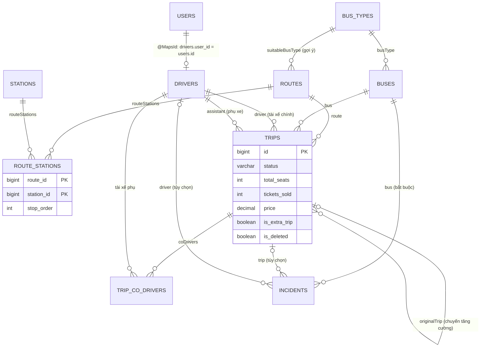
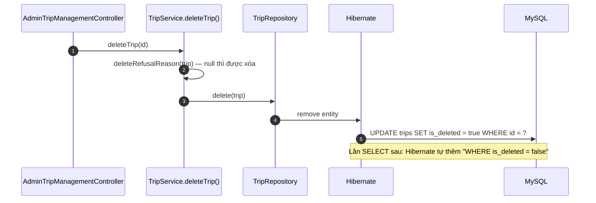
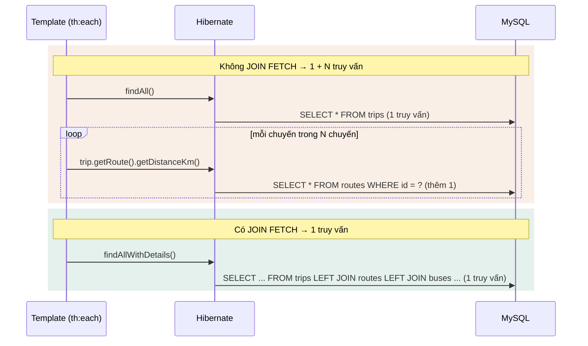
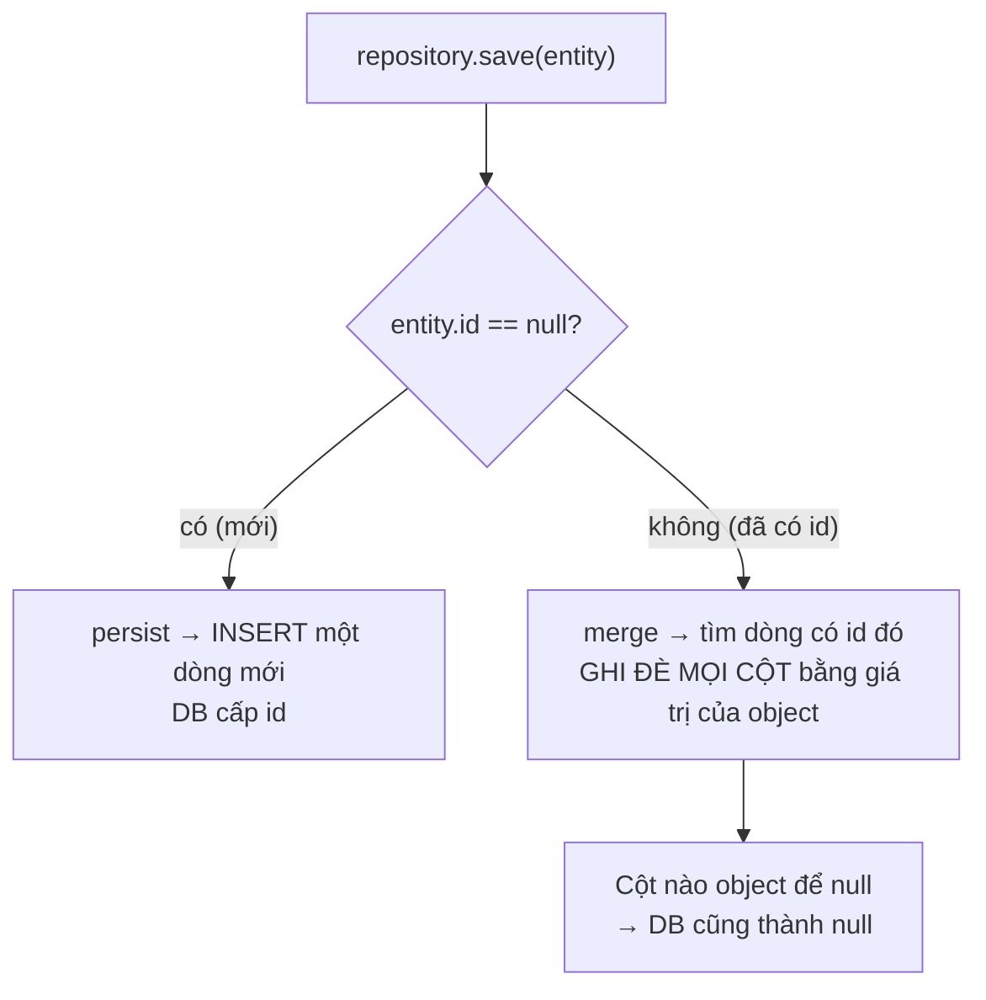
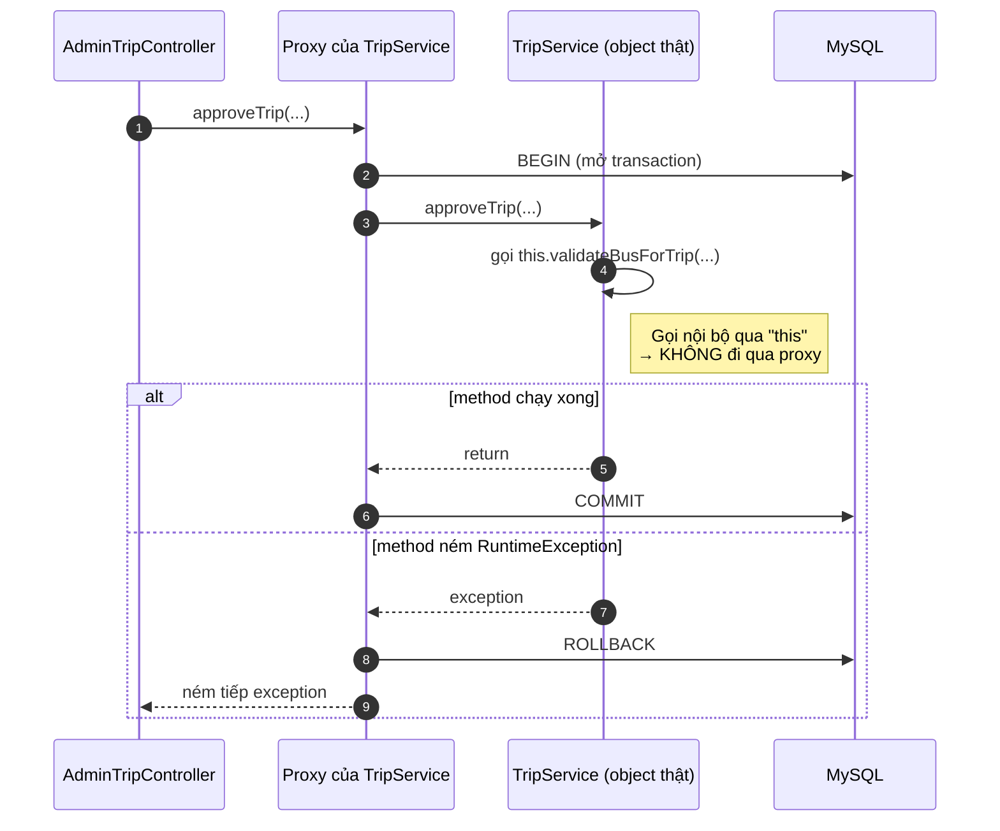
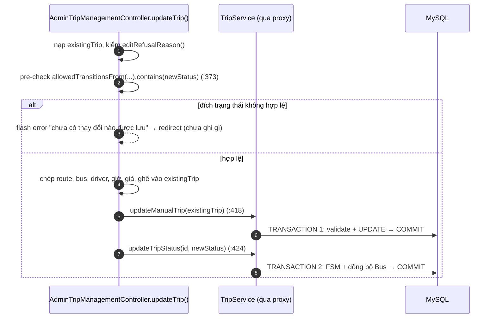
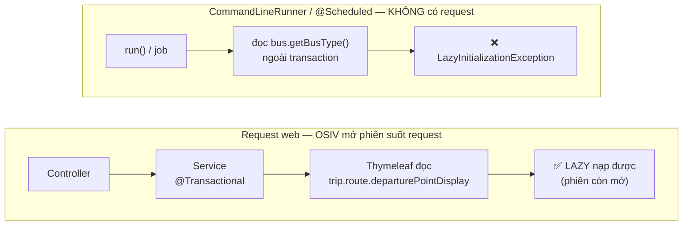
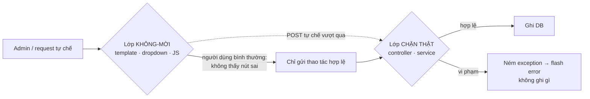

# Bài 00b — JPA/Hibernate, Transaction, xử lý lỗi và kiểm thử

> Bài nền thứ hai, sinh từ `docs/ai/03_defense_study_prompt.md` (PHẦN A2), ngày 2026-09-27. Học
> sau Bài 00a. Mọi ví dụ lấy từ code thật; số dòng là ảnh chụp ngày viết — lệch thì grep lại.
>
> Nhãn: [CODE] đọc thẳng từ code · [SPRING] hành vi chuẩn của Spring/Hibernate mà code không viết
> ra · [SUY LUẬN] suy luận của người viết.
>
> Viết tắt: `…/` = `src/main/java/giang/com/BusManagement/`, `test/` =
> `src/test/java/giang/com/BusManagement/`, `tpl/` = `src/main/resources/templates/`.

## §1. ORM và Entity

### 1.1. ORM là gì

Database lưu dữ liệu thành **bảng và dòng**; Java làm việc với **object**. Mỗi lần đọc/ghi, phải
có ai đó "phiên dịch" giữa hai thế giới. **ORM** (Object-Relational Mapping — ánh xạ object ↔ bảng)
là người phiên dịch đó. Bạn làm việc với object `Trip`, ORM lo viết câu SQL.

- **JPA** = bộ **quy tắc chuẩn** (các annotation `@Entity`, `@Id`...) mà Java đặt ra cho ORM.
- **Hibernate** = **phần mềm cụ thể** làm theo quy tắc đó; Spring Boot dùng Hibernate mặc định
  [SPRING].
- **Spring Data JPA** = lớp trên cùng, cho phép viết repository chỉ bằng interface (§2).

### 1.2. Các annotation cơ bản

[CODE] `…/domain/Trip.java:20-28`, `:82-83`:

```java
@SQLDelete(sql = "UPDATE trips SET is_deleted = true WHERE id = ?")  // xem §1.5
@SQLRestriction("is_deleted = false")                                 // xem §1.5
@Entity                     // class này là một bảng trong DB
@Table(name = "trips")      // tên bảng là "trips"
public class Trip {
    @Id                                                   // khóa chính
    @GeneratedValue(strategy = GenerationType.IDENTITY)   // MySQL tự tăng id (AUTO_INCREMENT)
    private Long id;
    ...
    @Enumerated(EnumType.STRING)   // lưu enum dạng chữ "ACTIVE", không lưu số thứ tự 0,1,2
    @Column(name = "status")       // tên cột
    private TripStatus status = TripStatus.PENDING_APPROVAL;
```

Vì sao `EnumType.STRING` quan trọng [SPRING]: nếu lưu theo số thứ tự (`ORDINAL`), chỉ cần chèn một
giá trị mới vào giữa enum là mọi dòng cũ đổi nghĩa. Lưu chữ thì không bị vậy. Dự án dùng `STRING`
cho mọi enum (`Trip.status`, `Bus.status` `Bus.java:39`, `Incident.incidentType`...).

`ddl-auto=update` (Bài 00a §8.2) nghĩa là Hibernate **đọc các annotation này để tự tạo/bổ sung
bảng**. Dự án không có công cụ migration (Flyway/Liquibase) — cấu trúc DB tiến hóa theo entity (§6).

### 1.3. Quan hệ giữa các entity

| Quan hệ | Nghĩa | Ví dụ thật |
|---|---|---|
| `@ManyToOne` | Nhiều object bên này trỏ tới một object bên kia (lưu một cột khóa ngoại) | `Trip.route`, `Trip.bus`, `Trip.driver`, `Trip.assistant` (`Trip.java:39-58`) |
| `@OneToMany(mappedBy = "...")` | Chiều ngược của `@ManyToOne`, **không** tạo cột; `mappedBy` chỉ ra field bên kia đang giữ khóa ngoại | `Route.routeStations` (`Route.java:44`) |
| `@ManyToMany` + `@JoinTable` | Nhiều–nhiều, cần bảng nối riêng | `Trip.coDrivers` → bảng `trip_co_drivers(trip_id, user_id)` (`Trip.java:63-64`) |
| `@OneToOne` + `@MapsId` | Một–một, **dùng chung khóa chính** | `Driver.user` (`Driver.java:25-26`): khóa chính của `drivers` chính là `users.id` |
| `@EmbeddedId` + `@Embeddable` | Khóa chính gồm **nhiều cột** | `RouteStation` có khóa `(routeId, stationId)` (`RouteStation.java:16`, `RouteStationId.java:9-13`) |
| Tự tham chiếu | Entity trỏ tới chính loại của nó | `Trip.originalTrip` (`Trip.java:88-90`): chuyến tăng cường trỏ về chuyến gốc |



Bảng `cost_parameters` đứng riêng, không quan hệ với bảng nào (một dòng cấu hình duy nhất —
`CostParameterService`).

**Vì sao `Driver` dùng `@MapsId`** [CODE] javadoc `…/service/DriverService.java` đầu class: tài xế
**là** một người dùng, nên khóa chính của `Driver` chính là `User.id` — không thể có `Driver` thiếu
`User`. Hệ quả: form tạo tài xế tạo **cả cặp** `User` + `Driver` (`DriverService.createDriver()`),
và xóa tài xế là xóa `User`, `cascade = ALL` ở `User.driver` (`User.java:72`) xóa kèm `Driver`.

**Vì sao `RouteStation` dùng khóa kép** [CODE] comment `RouteService.updateRoute()`: khóa là
`(routeId, stationId)`, nên "đổi trạm" của một điểm dừng thực chất là **đổi khóa chính** — không
update được, phải **xóa hết điểm dừng cũ rồi dựng lại**. Cũng vì khóa kép mà một trạm không thể
xuất hiện hai lần trên cùng tuyến (`RouteService.validateRoute()` chặn sớm để báo lỗi dễ hiểu).

### 1.4. Entity có method nghiệp vụ

Entity không chỉ là "túi dữ liệu". Một số luật **thuộc về chính đối tượng** được đặt ngay trong
entity [CODE]:

| Method | Luật | Vị trí |
|---|---|---|
| `Trip.getOccupancyRate()` | tỉ lệ lấp đầy = vé đã bán ÷ tổng ghế | `Trip.java:130` |
| `Trip.needsReinforcement()` | "chuyến đông" = lấp đầy > 0,90 | `Trip.java:137` |
| `Bus.needsMaintenance()` | km kể từ bảo trì ≥ ngưỡng | `Bus.java:48` |
| `Bus.isNearMaintenance(km)` | km hiện tại + km chuyến ≥ 90% ngưỡng | `Bus.java:72` |
| `Driver.isLicenseValid(ngày)` | bằng lái còn hạn **vào ngày đó** | `Driver.java:47` |
| `Route.getDepartureStation()` | trạm có `stopOrder` nhỏ nhất | `Route.java:100` |

Lợi ích: mọi nơi (scheduler, validator, dashboard, template) **hỏi** cùng một method, nên ngưỡng
chỉ nằm một chỗ. Ví dụ `TripService.isHotTrip()` gọi `trip.needsReinforcement()` thay vì tự so 0,9
(comment trong `isHotTrip`). Ngoại lệ đã biết: các service Decision Support không có entity `Trip`
trong tay (chỉ có con số dự báo) nên phải **khai báo lại** 0,90 kèm comment trỏ về nguồn
(`ForecastService.REINFORCEMENT_THRESHOLD`, `WhatIfSimulationService.REINFORCEMENT_THRESHOLD`).

### 1.5. Soft delete — "xóa" mà không xóa

[CODE] `Trip.java:20-21`:

- `@SQLDelete(sql = "UPDATE trips SET is_deleted = true WHERE id = ?")` — khi code gọi
  `tripRepository.delete(trip)`, Hibernate **không** chạy `DELETE`, mà chạy đúng câu `UPDATE` này.
- `@SQLRestriction("is_deleted = false")` — Hibernate **tự thêm** điều kiện này vào mọi câu
  `SELECT` trên bảng `trips`, nên chuyến đã "xóa" biến mất khỏi mọi màn hình.



Vì sao dùng soft delete [CODE] javadoc `Trip.java:13-19`: giữ toàn vẹn khóa ngoại và lịch sử (chuyến
đã có sự cố, có chuyến tăng cường trỏ về...). Chỉ `Trip` có soft delete; xe, tài xế, tuyến... bị
**chặn xóa** nếu còn lịch sử (§5.5).

### 1.6. Dấu thời gian tự động

- `@CreationTimestamp` — Hibernate tự ghi thời điểm lúc INSERT: `Trip.createdAt` (`Trip.java:115`),
  `Incident.reportedAt` (`Incident.java:76`).
- `@UpdateTimestamp` — tự ghi lại mỗi lần UPDATE: `CostParameters.updatedAt`
  (`CostParameters.java:56`).

Chú ý [CODE] javadoc `Trip.createdAt`: dữ liệu backfill mang `createdAt` = ngày **chạy script**, vì
`@CreationTimestamp` không cho lùi về quá khứ. Mọi phân tích theo thời gian dùng `departureTime`, không
dùng `createdAt`.

### 1.7. `equals` / `hashCode` chỉ theo id

Đã học ở Bài 00a §9. Nhắc lại lý do từ góc JPA: hai object Java cùng đại diện **một dòng DB** thì
phải "bằng nhau", và phép so sánh không được chạm vào quan hệ LAZY (§2.4) — nếu không, gọi
`hashCode()` có thể bắn truy vấn ngầm hoặc ném lỗi. Quy ước ghi ở javadoc `User.java:42-70`.

## §2. Repository — Spring Data JPA

### 2.1. `JpaRepository` cho sẵn gì

[CODE] `…/repository/TripRepository.java:18`: `public interface TripRepository extends
JpaRepository<Trip, Long>` — `Trip` là entity, `Long` là kiểu khóa chính. Chỉ cần `extends`, bạn có
sẵn [SPRING]:

| Method | Làm gì |
|---|---|
| `findById(id)` | Tìm theo khóa → `Optional<Trip>` |
| `findAll()` | Lấy tất cả |
| `save(entity)` | Thêm mới **hoặc** ghi đè — xem §3 |
| `delete(entity)` | Xóa (với `Trip`: soft delete) |
| `count()` | Đếm |
| `existsById(id)` | Có tồn tại không |

Lúc khởi động, Spring Data sinh một **proxy** cài đặt interface này (Bài 00a §3.3) [SPRING].

### 2.2. Ba kiểu truy vấn dự án dùng

Dự án **không có native SQL**: mọi truy vấn là một trong ba kiểu dưới [CODE, grep toàn bộ
`repository/`].

**Kiểu 1 — Derived query: tên method chính là câu truy vấn.** Spring Data đọc tên method, cắt thành
từng phần, dựng câu truy vấn [SPRING].

```java
boolean existsByBusIdAndStatusIn(Long busId, List<TripStatus> statuses);   // TripRepository.java:350
//      exists | By | Bus.Id = ? | And | Status IN (?)
// [SUY LUẬN — SQL tương đương]:
// SELECT COUNT(*) > 0 FROM trips WHERE bus_id = ? AND status IN (?, ?, ?) AND is_deleted = false

List<Trip> findByDepartureTimeBetweenAndStatus(LocalDateTime start, LocalDateTime end, TripStatus status); // :194
```

Để ý `is_deleted = false` tự xuất hiện — đó là `@SQLRestriction` (§1.5).

**Kiểu 2 — JPQL với `@Query` và `@Param`.** Khi điều kiện quá phức tạp để đặt tên.

[CODE] `TripRepository.java:117-129` (`existsOverlappingTripForDriver`):

```java
@Query("SELECT COUNT(t) > 0 FROM Trip t " +
       "LEFT JOIN t.coDrivers cd " +
       "WHERE (t.driver = :driver OR cd = :driver) " +                 // tài xế chính HOẶC tài xế phụ
       "AND t.status IN :statuses " +
       "AND (:excludeTripId IS NULL OR t.id <> :excludeTripId) " +     // bỏ qua chính chuyến đang sửa
       "AND (t.departureTime < :windowEnd AND t.arrivalTimeExpected > :windowStart)") // hai khoảng giao nhau
boolean existsOverlappingTripForDriver(
        @Param("driver") Driver driver,               // @Param nối tên ":driver" với tham số Java
        @Param("statuses") List<TripStatus> statuses,
        @Param("windowStart") LocalDateTime windowStart,
        @Param("windowEnd") LocalDateTime windowEnd,
        @Param("excludeTripId") Long excludeTripId);
```

Điều kiện "trùng lịch" `departureTime < windowEnd AND arrivalTimeExpected > windowStart` là công
thức chuẩn để kiểm **hai khoảng thời gian có giao nhau không**; chạm đúng biên thì **không** tính
là trùng.

**Kiểu 3 — Projection: chỉ lấy vài cột, trả `Object[]`.** [CODE] `TripRepository.java:440-442`:

```java
@Query("SELECT t.route.id, t.departureTime, t.ticketsSold, t.totalSeats FROM Trip t " +
       "WHERE t.status = :status AND t.totalSeats > 0 ORDER BY t.departureTime")
List<Object[]> findDemandHistoryByStatus(@Param("status") TripStatus status);
// mỗi phần tử: [routeId, departureTime, ticketsSold, totalSeats]
```

Service tự bóc từng ô và ép kiểu, ví dụ `ForecastService.toObservation()`:
`long routeId = ((Number) row[0]).longValue();`.

### 2.3. JPQL khác SQL thế nào

| JPQL | SQL |
|---|---|
| viết trên **entity và field Java**: `FROM Trip t WHERE t.bus = :bus` | viết trên **bảng và cột**: `FROM trips WHERE bus_id = ?` |
| đi theo quan hệ bằng dấu chấm: `t.route.id`, `t.driver.userId` | phải tự `JOIN` |
| so sánh cả object: `t.driver = :driver` | so sánh khóa: `driver_id = ?` |
| Hibernate dịch sang SQL của MySQL | chạy thẳng |

### 2.4. LAZY vs EAGER, và vấn đề N+1

- **EAGER** ("háo hức") = nạp quan hệ **ngay** cùng lúc với object chính.
- **LAZY** ("lười") = **chưa** nạp; chỉ khi code thật sự gọi `trip.getRoute()...` thì Hibernate mới
  chạy thêm một truy vấn. Trước lúc đó, field chứa một **proxy** giữ chỗ [SPRING].

Mặc định của JPA [SPRING]: `@ManyToOne` và `@OneToOne` là EAGER; `@OneToMany` và `@ManyToMany` là
LAZY. Dự án **chủ động ghi `fetch = FetchType.LAZY`** trên mọi `@ManyToOne` của `Trip`
(`Trip.java:39-63`), `Bus.busType`, `Incident`... Ngoại lệ: `Driver.user` (`Driver.java:25`) ghi
`@OneToOne` không kèm `fetch` ⇒ EAGER theo mặc định.

**Vấn đề N+1**: lấy danh sách N chuyến bằng 1 truy vấn, rồi template in tuyến của từng chuyến ⇒
mỗi chuyến phát sinh thêm 1 truy vấn nạp tuyến ⇒ tổng **1 + N** truy vấn.



Cách dự án tránh [CODE]:

- **`JOIN FETCH`** — ép nạp quan hệ ngay trong câu truy vấn. `TripRepository.findAllWithDetails()`
  (`:46-57`) nạp một lần route, bus, busType, driver + user, assistant + user, coDrivers. Có
  `DISTINCT` để khử dòng trùng khi join với danh sách `coDrivers`.
- **`@BatchSize(size = 20)`** trên `Route.routeStations` (`Route.java:44-45`) — khi cần nạp điểm
  dừng của nhiều tuyến, Hibernate gom **20 tuyến một lần** thay vì từng tuyến.

Vì sao `routeStations` dùng `@BatchSize` mà không JOIN FETCH chung với `coDrivers` — [CODE] comment
`Route.java:74-78`: Hibernate **không cho JOIN FETCH hai collection kiểu `List`** trong cùng một
câu (lỗi `MultipleBagFetchException`), mà `Trip.coDrivers` đã là một `List` được fetch rồi.

### 2.5. Cái bẫy của projection nhiều cột không `GROUP BY`

[CODE] `TripRepository.java:402-403` và `DashboardService.java:184-185`:

```java
@Query("SELECT SUM(t.ticketsSold), SUM(t.price * t.ticketsSold) FROM Trip t WHERE t.status IN :statuses")
List<Object[]> sumTicketsSoldAndRevenueByStatuses(...);        // trả List, dù chỉ có 1 dòng

List<Object[]> aggRows = tripRepository.sumTicketsSoldAndRevenueByStatuses(OPERATIONAL_STATUSES);
Object[] agg = aggRows.isEmpty() ? null : aggRows.get(0);        // service tự lấy dòng đầu
```

Bài học ghi ở `Proj_functions_summary.md` mục 10 [CODE]: khai báo kiểu trả về `Object[]` trực tiếp
khiến Spring Data hiểu nhầm, gây `ClassCastException` **lúc chạy** — biên dịch và test khởi động
không bắt được, chỉ lộ khi gọi qua HTTP thật. Cách chuẩn: trả `List<Object[]>` rồi lấy phần tử đầu.

### 2.6. Vì sao Decision Support đọc bằng projection

Roadmap Hidden Cost #4 [CODE]: trang danh sách chuyến nạp **toàn bộ entity** và đã lên tới ~8 MB HTML
(2.222 chuyến), trong khi các trang Dự báo / Đề xuất / What-if chỉ 16–46 KB vì đọc qua projection
vài cột. Bài học roadmap ghi lại: *code phân tích mới không dùng `findAll()` hay stream entity*.

## §3. `save()` là persist hay merge — gốc của một nhóm lỗi

### 3.1. Hai chế độ của `save()`

[SPRING] `save(entity)` kiểm entity có phải **mới** không — với khóa `Long`, "mới" nghĩa là
`id == null`:



Nhánh **merge** là chỗ nguy hiểm. Object từ form (`@ModelAttribute`, Bài 00a §4.3) là object **mới
toanh** do Spring dựng từ các ô form: ô nào form không gửi thì field đó `null`. Merge object này
xuống DB = xóa trắng mọi cột form không gửi.

### 3.2. Hệ quả thiết kế: tách **tạo** khỏi **sửa** ở mọi service

[CODE] `…/service/BusService.java`:

```java
@Transactional
public void saveBus(Bus bus) {                 // :65 — CHỈ để TẠO
    if (bus.getId() != null) {                 // :70 — "tripwire": có id nghĩa là ai đó đang muốn ghi đè
        throw new IllegalArgumentException(
                "saveBus() chỉ dùng để tạo xe mới. Cập nhật phải gọi updateBus(id, form).");
    }
    ... // điền mặc định odometer, validate
    busRepository.save(bus);                   // :87 — chắc chắn là INSERT
}

@Transactional
public void updateBus(Long id, Bus form) {     // :117 — id lấy từ URL, không tin id trong form
    Bus existing = busRepository.findById(id)  // :118 — nạp bản ghi THẬT từ DB
            .orElseThrow(...);
    ... // các guard
    existing.setLicensePlate(form.getLicensePlate());   // :182 — chép TỪNG field được phép sửa
    ...
    if (form.getOdometer() != null) { existing.setOdometer(form.getOdometer()); } // ô trống = giữ nguyên
    ...
    busRepository.save(existing);              // :198
}
```

Cùng khuôn này áp cho mọi entity có form: `StationService.createStation()/updateStation()`,
`RouteService.createRoute()/updateRoute()`, `DriverService.createDriver()/updateDriver()`,
`IncidentService.createIncident()/updateIncident()`, `AdminService.createNewUser()`,
`TripService.createManualTrip()`. Test canh cả loạt: `test/service/CreatePathIdTripwireTest.java`
(9 test).

### 3.3. Hai lỗi thật đã dạy bài học này

- **Lỗi #16** (`current_bugs_found.md`): trước đây xóa trắng ô odometer rồi bấm Lưu thì null bị điền
  mặc định 0 → mất số km trọn đời, báo THÀNH CÔNG. Sửa: "ô trống = giữ nguyên" trong `updateBus`.
- **Lỗi #21**: controller bind form thẳng vào entity bằng `@ModelAttribute` **không có
  `@InitBinder`** (cơ chế khai báo field nào được phép bind) ⇒ một POST tự chế tới `/create` gửi kèm
  `id=5` sẽ khiến `save()` thành **merge** và ghi đè bản ghi số 5. Javadoc `DriverService.createDriver()`
  ghi ca đã tái hiện thật: tài khoản admin duy nhất bị đổi mật khẩu và hạ xuống `ROLE_DRIVER`. Sửa:
  tripwire `id != null → từ chối` ở mọi lối tạo.

## §4. Transaction, proxy, persistence context

### 4.1. Transaction là gì

**Transaction** = một nhóm thao tác DB được làm **trọn gói**: hoặc tất cả thành công (**commit** —
chốt), hoặc có lỗi thì **rollback** (hoàn tác sạch như chưa từng làm). Ví dụ `approveTrip()` gán xe,
gán tài xế, đổi số ghế, chuyển `ACTIVE`: nếu validate thất bại giữa chừng thì không được để chuyến ở
trạng thái "đã gán xe nhưng chưa duyệt".

Trong Spring chỉ cần đặt `@Transactional` lên method của bean [SPRING]:

| Dạng | Nghĩa | Ví dụ |
|---|---|---|
| `@Transactional` | Mở transaction trước khi method chạy, commit khi method kết thúc bình thường, rollback khi method ném lỗi | `TripService.approveTrip()` `:955-956` |
| `@Transactional(readOnly = true)` | Transaction chỉ đọc — báo cho Hibernate không cần theo dõi thay đổi để ghi | mọi service Decision Support: `ForecastService.java:147`, `DashboardService.java:72`... |

**Lỗi nào gây rollback?** [SPRING] Mặc định: `RuntimeException` (và các lớp con) cùng `Error` →
rollback; checked exception (loại phải khai báo `throws`) → **không** rollback. Dự án chỉ ném
`RuntimeException` và các lớp con (`IllegalArgumentException`, `IllegalStateException`,
`EntityNotFoundException`) nên mọi lỗi nghiệp vụ đều rollback.

### 4.2. Proxy — `@Transactional` thực sự chạy ở đâu

Spring không sửa code của bạn. Nó tạo một **proxy** — một "người đứng cửa" bọc ngoài bean
`TripService`. Controller tưởng đang gọi `TripService`, thực ra gọi proxy; proxy mở transaction rồi
mới chuyển vào method thật [SPRING].



**Self-invocation** ("tự gọi mình"): khi một method trong `TripService` gọi method khác **của chính
nó** (`this.x()`), lời gọi đi thẳng vào object thật, **không qua proxy** ⇒ `@Transactional` đặt trên
method được gọi **không có tác dụng** [SPRING].

Dự án ghi rõ điều này ở javadoc `TripService.java:69-75`, phía trên `scanAndSuggestExtraTrips()`:

```java
 * @Transactional BẮT BUỘC ở đây vì:
 *   1. Giữ Hibernate session mở suốt vòng lặp → trip.getRoute() (lazy) không bị
 *      LazyInitializationException.
 *   2. Khi gọi createExtraTrip() từ cùng class (self-invocation), Spring AOP KHÔNG
 *      tạo proxy → @Transactional trên method đó bị bỏ qua.
@Scheduled(fixedRate = 10_000)
@Transactional
public void scanAndSuggestExtraTrips() { ... createExtraTrip(trip); ... }
```

Đọc hiểu: `createExtraTrip()` là method `private` được gọi nội bộ, nên muốn nó chạy trong
transaction thì transaction phải được mở **ở method ngoài cùng** — `scanAndSuggestExtraTrips()` —
nơi Spring gọi từ bên ngoài (qua proxy). Cả vòng quét là **một** transaction.

### 4.3. Persistence context và dirty checking

- **Persistence context** ("sổ theo dõi") = trong một phiên làm việc với DB, Hibernate ghi sổ mọi
  entity nó đã nạp. Entity nằm trong sổ gọi là **managed** (đang được quản lý) [SPRING].
- **Dirty checking** ("kiểm tra vết bẩn") = lúc commit, Hibernate so từng entity managed với bản
  chụp lúc nạp; field nào đổi thì **tự sinh `UPDATE`**, kể cả khi code không gọi `save()` [SPRING].
- Rollback = không có `UPDATE` nào được ghi, dù object trong RAM đã bị đổi.

Áp vào `TripService.approveTrip()` [CODE]:

```java
@Transactional
public String approveTrip(Long tripId, Long busId, ...) {        // :955-956
    Trip trip = tripRepository.findById(tripId).orElseThrow(...); // trip giờ là entity MANAGED
    requirePendingApproval(trip);                                 // :961 — kiểm trạng thái TRƯỚC
    ...
    trip.setBus(bus);                                             // :969 — đổi entity managed
    trip.setDriver(driver);
    ...
    String warning = validateBusForTrip(bus, trip, tripId);       // :1007 — có thể ném lỗi
    validateStaffForTrip(trip, tripId);
    changeStatusToActive(trip);                                   // :1010
    tripRepository.save(trip);
    return warning;
}
```

- `setBus()` rồi mới validate vẫn **an toàn**: nếu validate ném `IllegalArgumentException`, proxy
  rollback, thay đổi xe **không bao giờ xuống DB** [SPRING].
- Nhưng `requirePendingApproval()` **vẫn phải đứng trước** `setBus()` — javadoc `approveTrip()` ghi
  lý do [CODE]: để một chuyến sai trạng thái (vd `DEPARTED`) bị chặn **trước khi** con trỏ xe bị dời,
  và báo đúng lý do "sai trạng thái" thay vì một lỗi validate khác (lỗi #20).

### 4.4. Controller **không** có `@Transactional` ⇒ gọi hai service là hai transaction

[CODE] `AdminTripManagementController.updateTrip()` (`:340-452`) gọi **hai** method service:



Nếu transaction 2 thất bại thì transaction 1 **đã commit** — không có gì hoàn tác nó. Đó chính là
**lỗi #24**: trước đây chọn một trạng thái FSM cấm thì các trường khác đã được lưu, còn màn hình báo
như thể chưa lưu gì. Bản sửa: **hỏi trước** bằng `allowedTransitionsFrom()` (`:373`) khi chưa ghi gì;
và nếu bước 2 vẫn thất bại (chỉ còn xảy ra khi trạng thái đổi giữa hai request), câu báo nói thật
*"Thông tin chuyến ĐÃ được lưu, nhưng không đổi được trạng thái"* (`catch` ở `:433`) [CODE].

### 4.5. Open Session In View (OSIV)

**OSIV** — Spring Boot mặc định bật `spring.jpa.open-in-view` [SPRING]: phiên làm việc với DB
(`EntityManager`) được **mở suốt cả request web**, từ lúc vào controller tới lúc Thymeleaf render
xong. Dự án không tắt nó; log khởi động có cảnh báo mặc định về OSIV (roadmap Session Log ghi "the
two benign WARNs (open-in-view default; ...)").



Hệ quả thực tế [CODE]:

- Template đọc được quan hệ LAZY (`trip.route...`) dù service đã trả về — nhờ OSIV. Đây cũng là lý
  do chi phí N+1 ở các màn Model "bị che khuất" (javadoc
  `TripService.getAvailableAssistantsForTimeRange()`).
- Job nền và `CommandLineRunner` **không có request** nên **không có OSIV**. Roadmap Phase 5 ghi lỗi
  thật: lần chạy đầu của `HistoricalDataBackfill` chết với `LazyInitializationException` khi đọc
  `bus.getBusType()`; sửa bằng `findAllWithBusType()` (JOIN FETCH) — comment
  `HistoricalDataBackfill.java` trong `run()`. Scheduler thì giữ phiên bằng `@Transactional` (§4.2).
- Câu hỏi "controller sửa entity managed rồi service ném lỗi thì thay đổi có bị ghi không?" đã được
  rà và **kết luận là không** — `current_bugs_found.md`, mục "ĐÃ KIỂM ở lần rà 2026-09-19": OSIV giữ
  phiên mở nhưng **không có transaction** nên Hibernate không flush; các phiên sửa #14/#15/#18 đã
  chứng minh bằng thực nghiệm.

## §5. Xử lý lỗi và "hai lớp bảo vệ"

### 5.1. Quy ước exception của dự án

| Exception | Ý nghĩa trong dự án | Ví dụ |
|---|---|---|
| `IllegalArgumentException` | Vi phạm **luật nghiệp vụ / dữ liệu đầu vào** | "Xe ... đang bận trong khoảng thời gian này!" (`validateBusForTrip`) |
| `IllegalStateException` | Vi phạm **chính sách theo trạng thái** (FSM, xóa, duyệt) | `updateTripStatus()` `:642-646`; `requirePendingApproval()` `:892`; `deleteTrip()` `:1827` |
| `EntityNotFoundException` | Không tìm thấy bản ghi | `updateTripStatus()` `:639`, `deleteTrip()` `:1825` |
| `RuntimeException` | Không tìm thấy / lỗi chung ở các service danh mục | `BusService.updateBus()` "Không tìm thấy xe..." |

Controller **bắt riêng từng loại** để báo đúng giọng. [CODE] `AdminTripController.processManualApproval()`
(`:167-201`):

```java
try {
    String warning = tripService.approveTrip(tripId, busId, driverId, assistantId, coDriverIds);
    ... flash "success" ...
} catch (IllegalArgumentException e) {        // :180 — vi phạm ràng buộc → quay lại form duyệt
    redirectAttributes.addFlashAttribute("error", "⛔ Vi phạm ràng buộc: " + e.getMessage());
    return "redirect:/admin/trips/approve/" + tripId;
} catch (IllegalStateException e) {           // :184 — sai trạng thái → về hàng chờ
    redirectAttributes.addFlashAttribute("error", "⛔ " + e.getMessage());
    return "redirect:/admin/trips/pending";
} catch (Exception e) {                       // :196 — lỗi hệ thống thật
    redirectAttributes.addFlashAttribute("error", "Lỗi hệ thống: " + e.getMessage());
    return "redirect:/admin/trips/approve/" + tripId;
}
```

Lưu ý thứ tự `catch` [SPRING/Java]: lớp con phải đứng trước lớp cha, `Exception` luôn đứng cuối.

Dự án **không có `@ControllerAdvice`** (nơi xử lý lỗi tập trung cho mọi controller) — grep `src/main`
ra 0. Mỗi controller tự `try/catch`. Ưu: mỗi màn chọn được trang quay về. Nhược [SUY LUẬN]: code
`catch` lặp lại ở nhiều nơi, và một controller quên `try/catch` sẽ trả trang lỗi 500 — đó chính là
lỗi #25 (`/admin/users/save` từng không bắt lỗi trùng username).

### 5.2. Hai lớp bảo vệ: "không-mời" và "chặn thật"

Pattern xuyên suốt dự án [CODE, các javadoc nêu tên hai lớp này nhiều lần]:

- **Lớp không-mời** — giao diện **không đưa ra** thao tác sẽ bị từ chối: ẩn nút, dropdown chỉ liệt kê
  lựa chọn hợp lệ, JS kiểm trước.
- **Lớp chặn thật** — server **từ chối** request sai, kể cả request tự chế bỏ qua giao diện.



| Luật | Lớp không-mời | Lớp chặn thật |
|---|---|---|
| Chỉ xóa chuyến theo chính sách trạng thái | nút Xóa chỉ hiện khi `deletableIds.contains(trip.id)` (`trip-list.html:472`; tập tính ở `populateTripList()` `AdminTripManagementController.java:80-93`) | `TripService.deleteTrip()` → `deleteRefusalReason()` (`:1823-1830`) |
| Chỉ đổi trạng thái theo FSM | select trạng thái ở form Sửa chỉ liệt kê `allowedTransitionsFrom()` | pre-check `:373` + `canTransition()` trong `updateTripStatus()` (`:642`) |
| Bảng điều phối không được kích hoạt chuyến | chỉ có 3 nút Xuất phát / Hủy / Hoàn thành | `BOARD_ACTIONS` (`DispatchController.java:59`, kiểm ở `:108`) |
| Chỉ duyệt chuyến đang chờ duyệt | `showApproveForm()` không mở form cho chuyến khác `PENDING_APPROVAL` (`AdminTripController.java:75`) | `requirePendingApproval()` (`TripService.java:892`) |
| Không trùng nhân sự trên một chuyến | `validateNoDriverConflict()` ở JS (`trip-create-form.html:721`) | "Nhân sự trùng lặp" trong `validateStaffForTrip()` (`TripService.java:1283`) |

**Quy tắc một chiều** của dự án (roadmap §8, nhắc trong nhiều javadoc): lớp không-mời được phép mời
**ít hơn** thứ server chấp nhận, nhưng **không bao giờ được mời thứ server sẽ từ chối** — vì mời rồi
từ chối là trải nghiệm tệ và che giấu lỗi. Lỗi #23 và #24 chính là vi phạm quy tắc này (nút Hủy hiện
trên chuyến `DEPARTED`, select liệt kê đủ 5 trạng thái).

### 5.3. Toàn vẹn dữ liệu nằm ở service, không ở DB

[CODE] `application.properties:19`: URL kết nối có `sessionVariables=foreign_key_checks=0` — MySQL
**không kiểm khóa ngoại**. Xóa một xe còn bản ghi sự cố trỏ tới, DB sẽ im lặng để lại "tham chiếu
mồ côi". Vì vậy các guard nằm trong service — comment `BusService.java:248-255`:

```java
boolean hasAnyTrip = tripRepository.existsByBusId(id);          // :242 — xe đã từng chạy chuyến
if (hasAnyTrip) throw new RuntimeException("Không thể xóa xe này vì xe đã có dữ liệu lịch sử...");
...
// Kiểm tra ở tầng service là bắt buộc, KHÔNG thể dựa vào FK: JDBC URL đặt
// sessionVariables=foreign_key_checks=0 nên MySQL không chặn ...
if (incidentRepository.existsByBusId(id)) throw new RuntimeException("... đang có bản ghi sự cố ...");  // :256
```

Cùng khuôn: `DriverService.deleteDriver()`, `RouteService.deleteRoute()`, `StationService.deleteById()`.

## §6. Những gì dự án KHÔNG dùng — và trả lời thế nào khi bị hỏi

| Kỹ thuật | Có dùng? (bằng chứng) | Dự án làm gì thay | Trả lời gợi ý |
|---|---|---|---|
| Bean Validation `@Valid`, `@NotNull`... | ❌ grep `src/main` = 0; starter có trong `pom.xml:51` | validate viết tay ở service (`BusService.validate()`, `RouteService.validateRoute()`, `CostParameterService.validate()`) | Luật của hệ thống phụ thuộc DB và trạng thái (xe bận, giờ lái 8h...) — annotation trên field không diễn tả được; em gom vào service để có một chỗ duy nhất và câu báo lỗi nghiệp vụ tiếng Việt. Với ràng buộc đơn giản (không âm, bắt buộc) thì Bean Validation là hướng cải tiến. [SUY LUẬN] |
| `@ControllerAdvice` / `@ExceptionHandler` | ❌ grep = 0 | `try/catch` ở từng controller → flash | §5.1 |
| DTO riêng cho form, `@InitBinder` | ❌ form bind thẳng entity | tripwire `id != null` + "nạp bản ghi cũ rồi chép từng field" (§3) | Rủi ro mass-assignment đã được đóng ở tầng service sau lỗi #21; DTO form là cách triệt để hơn |
| Phân trang | ❌ | danh sách chuyến nạp toàn bộ | Roadmap Hidden Cost #4: trang danh sách chuyến ~8 MB với 2.222 chuyến; phân trang là việc cần làm đầu tiên |
| Flyway / Liquibase | ❌ | `ddl-auto=update` | Hibernate tự bổ sung bảng/cột; hạn chế: không có lịch sử thay đổi schema, không tự đổi tên/xóa cột |
| Đăng nhập, phân quyền theo `Role`, BCrypt | ❌ `SecurityConfig` permit-all; `AdminService` còn dòng comment `passwordEncoder` | `Role` chỉ để phân loại tài khoản | Non-Goal có chủ đích (roadmap §4); mật khẩu đang lưu thô — phải làm trước khi triển khai thật |
| Gửi mail | ❌ không có `JavaMailSender`; starter `pom.xml:39` | — | Non-Goal (roadmap §4) |
| Khóa ngoại được DB kiểm | ❌ `foreign_key_checks=0` | guard ở service (§5.3) | Nói thật đây là điểm yếu; toàn vẹn phụ thuộc vào việc mọi lối ghi đều đi qua service |
| Test controller bằng MockMvc, test đơn vị bằng Mockito | ❌ grep `src/test` = 0 | test tích hợp `@SpringBootTest` trên MySQL thật + chạy app thật (§7) | §7.4 |
| Native SQL | ❌ | derived query + JPQL | Không phụ thuộc cú pháp riêng của MySQL |

## §7. Kiểm thử

### 7.1. Bức tranh chung

[CODE] `src/test/java`: **18 class, 126 method `@Test`** (đếm 2026-09-27).

- **16 class** là test tích hợp: `@SpringBootTest` (khởi động **cả ứng dụng thật**, kết nối MySQL
  thật). 15 trong số đó kèm `@Transactional` (trừ `BusManagementApplicationTests` — chỉ kiểm ứng dụng
  khởi động được).
- **2 class** là JUnit thuần, không khởi động Spring: `TripServiceDriverShareTest`,
  `WhatIfCoverageTest` — kiểm các hàm tính toán thuần (`TripService.driverShareHours()`,
  `WhatIfSimulationService.coverableSlots()`), vốn được để `package-private` (không `private`) chính
  để test gọi trực tiếp được.
- Database riêng: `busmanagement_test`, `create-drop` (`src/test/resources/application.properties:22-23`)
  — chạy test **không đụng** dữ liệu thật (Phase 0 đã sửa lỗi trước đây `mvnw test` xóa DB thật).

**`@Transactional` trên class test** [SPRING] mang nghĩa khác trên code chính: mỗi test chạy trong
một transaction và **luôn rollback khi test kết thúc** ⇒ dữ liệu test dựng lên tự biến mất, các test
không ảnh hưởng nhau.

Khác biệt nhỏ với code chính: test dùng `@Autowired` trên field (Spring tiêm thẳng vào field), còn
code chính dùng constructor injection (Bài 00a §3.2). Với class test, cách này phổ biến và chấp nhận
được [SPRING].

### 7.2. Đọc một test tiêu biểu: `TripServiceStatusTransitionTest`

[CODE] `test/service/TripServiceStatusTransitionTest.java`:

```java
@SpringBootTest                 // :72 — khởi động cả app, TripService là bean thật
@Transactional                  // :73 — mỗi test rollback
class TripServiceStatusTransitionTest {
    @Autowired private TripService tripService;
    @Autowired private BusRepository busRepository;
    ...
    private static final double DISTANCE_KM = 120.0;
    private static final double START_ODOMETER = 1000.0;

    @BeforeEach                 // :101 — chạy TRƯỚC MỖI test: dựng dữ liệu sạch
    void setUp() {
        bus = new Bus();  ... bus.setOdometer(START_ODOMETER); bus.setStatus(BusStatus.TRAVELING);
        bus = busRepository.save(bus);
        Route route = new Route(); route.setDistanceKm(DISTANCE_KM); ...
        trip = new Trip(); ... trip.setStatus(TripStatus.DEPARTED);   // chuyến đang chạy
        trip = tripRepository.save(trip);
    }

    @Test                                                        // :158-176
    void completingAnAlreadyCompletedTrip_doesNotAddOdometerAgain() {
        tripService.updateTripStatus(trip.getId(), TripStatus.COMPLETED);   // hoàn thành lần 1
        double afterFirstCompletion = odometer();
        assertEquals(START_ODOMETER + DISTANCE_KM, afterFirstCompletion, 0.0001); // 1000 + 120

        tripService.updateTripStatus(trip.getId(), TripStatus.COMPLETED);   // "bấm lần 2"
        tripService.updateTripStatus(trip.getId(), TripStatus.COMPLETED);   // "bấm lần 3"

        assertEquals(afterFirstCompletion, odometer(), 0.0001);             // vẫn 1120, không cộng thêm
    }
}
```

Đọc theo mẫu **Arrange – Act – Assert** (Chuẩn bị – Hành động – Kiểm tra):

1. **Arrange** (`setUp`): xe odometer 1.000 km, tuyến 120 km, chuyến `DEPARTED`.
2. **Act**: gọi `updateTripStatus(..., COMPLETED)` ba lần.
3. **Assert**: odometer chỉ tăng **đúng một lần** (1.120 km).

Test này là "regression" cho **lỗi #6**: trước đây double-click nút "Hoàn thành" cộng km hai lần, vì
khối đồng bộ Bus chỉ xét trạng thái mới. Bản sửa là guard `if (trip.getStatus() == newStatus) return;`
(`TripService.java:663`). Class này còn nhóm test thứ hai cho **lỗi #20** (`:275-375`): duyệt một
chuyến `CANCELLED`/`COMPLETED`/`DEPARTED` phải bị từ chối **và DB không đổi gì**.

Test đi thành cặp có chủ đích (javadoc `:47-49`): một test chặn lỗi cộng lặp, một test
(`departedToCompleted_addsRouteDistanceExactlyOnce`, `:145`) chứng minh luồng đúng **vẫn** cộng km —
để bản sửa không "quá tay" thành không bao giờ cộng.

### 7.3. Test chưa đủ — dự án còn chạy app thật

Quy ước của dự án (`.claude/skills/verify/SKILL.md`, roadmap Session Log): mỗi thay đổi được kiểm
chứng bằng cách **chạy app thật trên MySQL thật** (profile mặc định, không bao giờ `demo`), gọi các
trang qua HTTP và đối chiếu DB trước/sau. Vì sao cần cả hai [CODE + SUY LUẬN]:

- Test tự động giữ luật **không bị hỏng lại** sau này (regression).
- Chạy app thật bắt những lỗi mà test service không thấy: lỗi template Thymeleaf, lỗi LAZY/OSIV, lỗi
  ép kiểu projection (§2.5 — "chỉ lộ khi gọi qua HTTP thật"), lỗi JS.

### 7.4. Câu trả lời mẫu: "Em kiểm thử hệ thống thế nào?"

> Em kiểm thử hai tầng. Thứ nhất, 126 test tự động trong 18 class — chủ yếu là test tích hợp
> `@SpringBootTest` chạy trên một MySQL riêng cho test, mỗi test tự rollback. Test tập trung vào luật
> nghiệp vụ của `TripService` và các service: FSM, giờ lái 8h, sức chứa xe, phân công phụ xe... Mỗi
> lỗi thật em sửa đều kèm một test tái hiện đúng lỗi đó, ví dụ `TripServiceStatusTransitionTest` chặn
> lỗi cộng odometer hai lần. Thứ hai, mỗi thay đổi em chạy app thật trên dữ liệu thật, gọi các màn qua
> HTTP và so DB trước/sau, vì có loại lỗi chỉ lộ khi render trang. Hạn chế em thừa nhận: chưa có test
> tầng controller bằng MockMvc và chưa có test giao diện tự động.

## §8. Bảng tra cứu thuật ngữ

| Thuật ngữ | Nghĩa đời thường | Ví dụ trong dự án |
|---|---|---|
| ORM | Người phiên dịch object ↔ bảng | Hibernate |
| JPA / Hibernate / Spring Data JPA | Bộ quy tắc / phần mềm làm theo quy tắc / lớp repository trên cùng | [SPRING] |
| `@Entity` / `@Table` | Class này là một bảng / tên bảng | `Trip.java:22-23` |
| `@Id` / `@GeneratedValue(IDENTITY)` | Khóa chính / DB tự tăng | `Trip.java:27-28` |
| `@Column` | Cấu hình cột | `Trip.java:83` |
| `@Enumerated(STRING)` | Lưu enum dạng chữ | `Trip.java:82` |
| `@ManyToOne` / `@OneToMany(mappedBy)` | Nhiều → một / chiều ngược, không tạo cột | `Trip.route`, `Route.routeStations` |
| `@ManyToMany` + `@JoinTable` | Nhiều – nhiều qua bảng nối | `Trip.coDrivers` (`Trip.java:63-64`) |
| `@OneToOne` + `@MapsId` | Một – một dùng chung khóa chính | `Driver.user` (`Driver.java:25-26`) |
| `@EmbeddedId` / `@Embeddable` | Khóa chính nhiều cột | `RouteStation`, `RouteStationId` |
| `cascade = ALL` | Thao tác trên cha lan xuống con | `User.driver` (`User.java:72`) |
| `@SQLDelete` / `@SQLRestriction` | Xóa = UPDATE cờ / tự lọc dòng đã xóa | `Trip.java:20-21` |
| `@CreationTimestamp` / `@UpdateTimestamp` | Tự ghi giờ tạo / giờ sửa | `Trip.java:115`, `CostParameters.java:56` |
| `ddl-auto` | Hibernate tự tạo/bổ sung bảng theo entity | `application.properties:18` |
| `JpaRepository` | Interface cho sẵn CRUD | `TripRepository.java:18` |
| Derived query | Tên method thành câu truy vấn | `existsByBusIdAndStatusIn` (`:350`) |
| JPQL / `@Query` / `@Param` | Truy vấn trên entity / khai báo nó / nối tham số | `existsOverlappingTripForDriver` (`:117-129`) |
| Projection | Chỉ lấy vài cột, trả `Object[]` | `findDemandHistoryByStatus` (`:440-442`) |
| LAZY / EAGER | Nạp khi cần / nạp ngay | `Trip.java:39` |
| Proxy (Hibernate) | Object giữ chỗ cho quan hệ LAZY | [SPRING] |
| N+1 | 1 truy vấn danh sách + N truy vấn phụ | §2.4 |
| `JOIN FETCH` | Ép nạp quan hệ trong cùng truy vấn | `findAllWithDetails` (`:46-57`) |
| `@BatchSize` | Gom nạp LAZY theo lô | `Route.java:45` |
| `MultipleBagFetchException` | Lỗi JOIN FETCH hai `List` cùng lúc | comment `Route.java:74-78` |
| persist / merge | INSERT dòng mới / ghi đè dòng có sẵn | §3.1 |
| Tripwire | Chốt chặn "có id thì từ chối tạo" | `BusService.java:70` |
| Mass assignment | Form gửi thêm field không được phép (vd `id`) | lỗi #21 |
| `@InitBinder` | Khai báo field nào được bind từ form | không dùng |
| Transaction / commit / rollback | Trọn gói / chốt / hoàn tác | §4.1 |
| `@Transactional(readOnly = true)` | Transaction chỉ đọc | `ForecastService.java:147` |
| Proxy (Spring AOP) | Người đứng cửa bọc bean, mở/đóng transaction | §4.2 |
| Self-invocation | Gọi method của chính mình, không qua proxy | javadoc `TripService.java:69-75` |
| Persistence context / managed entity | Sổ theo dõi entity đã nạp / entity trong sổ | §4.3 |
| Dirty checking / flush | Tự phát hiện field đổi / đẩy thay đổi xuống DB | §4.3 |
| OSIV | Giữ phiên DB mở suốt request web | §4.5 |
| `LazyInitializationException` | Đọc quan hệ LAZY khi phiên đã đóng | lỗi Phase 5 backfill |
| `IllegalArgumentException` / `IllegalStateException` | Vi phạm luật đầu vào / vi phạm chính sách trạng thái | §5.1 |
| `@ControllerAdvice` | Xử lý lỗi tập trung | không dùng |
| Lớp không-mời / lớp chặn thật | UI không đưa ra / server từ chối | §5.2 |
| `foreign_key_checks=0` | MySQL không kiểm khóa ngoại | `application.properties:19` |
| `@SpringBootTest` | Test khởi động cả app thật | `TripServiceStatusTransitionTest.java:72` |
| `@Transactional` trên test | Mỗi test tự rollback | `:73` |
| `@BeforeEach` / `@Test` / `assertEquals` | Chạy trước mỗi test / đánh dấu test / so kết quả | `:101`, `:158` |
| Regression test | Test chặn một lỗi cũ quay lại | lỗi #6 |
| Arrange – Act – Assert | Chuẩn bị – hành động – kiểm tra | §7.2 |

## §9. Câu hỏi hội đồng + gợi ý trả lời

**Q1. `@Transactional` hoạt động thế nào?**
Spring bọc bean bằng một proxy. Khi controller gọi method có `@Transactional`, proxy mở transaction,
gọi method thật, method xong thì commit, ném `RuntimeException` thì rollback. Ví dụ
`TripService.approveTrip()`: gán xe rồi validate, nếu validate ném lỗi thì cả việc gán xe cũng bị hoàn
tác. Cần nhớ: gọi nội bộ trong cùng class không qua proxy, nên dự án đặt `@Transactional` ở method
ngoài cùng như `scanAndSuggestExtraTrips()`.

**Q2. N+1 là gì, em xử lý ra sao?**
Lấy danh sách N bản ghi bằng một truy vấn rồi truy cập quan hệ LAZY của từng bản ghi thì phát sinh N
truy vấn phụ. Em dùng `JOIN FETCH` trong các truy vấn như `TripRepository.findAllWithDetails()` để nạp
route, xe, tài xế trong một truy vấn, và `@BatchSize(20)` cho `Route.routeStations` vì Hibernate không
cho JOIN FETCH hai danh sách cùng lúc. Các màn phân tích thì đọc bằng projection vài cột.

**Q3. Soft delete em làm thế nào? Sao không xóa hẳn?**
`Trip` có `@SQLDelete` để lệnh xóa thành `UPDATE is_deleted = true`, và `@SQLRestriction` để mọi
`SELECT` tự lọc chuyến đã xóa. Giữ lại vì chuyến gắn với lịch sử doanh thu, sự cố, chuyến tăng cường.
Việc được xóa hay không còn theo chính sách trạng thái ở `deleteRefusalReason()`: chuyến đã chạy
hoặc đã hoàn thành thì không xóa được.

**Q4. Sao em không dùng `@Valid`?**
Phần lớn luật của em phụ thuộc DB và trạng thái — xe có bận không, tài xế còn giờ lái không — nên đặt
ở service, một chỗ duy nhất, ném `IllegalArgumentException` kèm câu tiếng Việt. Ràng buộc đơn giản
(không âm, bắt buộc) cũng viết ở service, ví dụ `BusService.validate()`. Bean Validation cho các ràng
buộc đơn giản là hướng cải tiến; starter đã có sẵn trong `pom.xml`.

**Q5. Nếu admin gửi request có sẵn `id` vào form tạo mới thì sao?**
Đây đúng là lỗi #21 em đã sửa. `save()` với entity có id sẽ thành merge và ghi đè bản ghi cũ. Mọi
method tạo mới giờ đều có tripwire: `id != null` thì từ chối, ví dụ `BusService.saveBus()`. Còn sửa
thì nạp bản ghi theo id trên URL rồi chép từng field được phép, không merge object từ form. Có
`CreatePathIdTripwireTest` canh toàn bộ các lối tạo.

**Q6. Controller gọi hai method service thì có trọn gói không?**
Không, vì controller không có `@Transactional` nên đó là hai transaction. `updateTrip()` là ví dụ:
lưu thông tin rồi mới đổi trạng thái. Em đã gặp lỗi #24 vì vậy và sửa bằng cách kiểm trạng thái đích
hợp lệ trước khi ghi gì, và nếu bước hai vẫn lỗi thì báo thật rằng thông tin đã được lưu.

**Q7. Nếu hai admin cùng sửa một chuyến một lúc thì sao?**
Trả lời thật: hệ thống chưa có khóa lạc quan (`@Version`) hay khóa bi quan, nên người lưu sau sẽ ghi
đè người lưu trước [SUY LUẬN, grep `@Version` = 0]. Roadmap chỉ đặt kế hoạch khóa bi quan cho việc
trừ ghế khi đặt vé ở Phase 9. Hướng cải tiến: thêm `@Version` vào `Trip` để phát hiện xung đột.

**Q8. Toàn vẹn dữ liệu được đảm bảo ở đâu?**
Chủ yếu ở service. Kết nối MySQL đang tắt kiểm khóa ngoại (`foreign_key_checks=0`), nên các guard
"không xóa được vì còn lịch sử/sự cố" nằm trong `BusService.deleteBus()`, `DriverService.deleteDriver()`...
Em thừa nhận đây là điểm yếu: toàn vẹn phụ thuộc vào việc mọi lối ghi đều đi qua service.

**Q9. Vì sao template đọc được `trip.route...` dù quan hệ là LAZY?**
Nhờ Open Session In View, Spring Boot bật mặc định: phiên DB mở suốt request, nên Thymeleaf vẫn nạp
được. Nhưng job nền và `CommandLineRunner` không có request nên không có OSIV — em đã gặp
`LazyInitializationException` ở bộ sinh dữ liệu lịch sử và sửa bằng truy vấn `JOIN FETCH`.

**Q10. Test của em chạy trên dữ liệu nào, có làm hỏng dữ liệu thật không?**
Test chạy trên database riêng `busmanagement_test`, tạo mới mỗi lần; mỗi test có `@Transactional`
nên tự rollback. Dữ liệu thật không bị đụng — đây là việc em sửa ngay từ Phase 0, vì trước đó chạy
test từng xóa database thật.

## §10. Bài tập tự kiểm tra

**Câu hỏi ngắn**

1. `@ManyToOne` và `@OneToMany(mappedBy = ...)` — bên nào tạo cột khóa ngoại trong bảng?
2. `tripRepository.delete(trip)` sinh ra câu SQL gì? Vì sao?
3. `Driver.user` có `fetch = LAZY` không? Hệ quả là gì?
4. Viết SQL tương đương cho derived query `countByRouteIdAndStatus(Long routeId, TripStatus status)`.
5. `busRepository.save(bus)` với `bus.getId() == 7` làm gì với dòng số 7?
6. Một method `@Transactional` ném `IllegalArgumentException` — dữ liệu đã `set` trước đó có được ghi
   xuống DB không?
7. Vì sao `@Transactional` phải đặt ở `scanAndSuggestExtraTrips()` mà không đặt ở `createExtraTrip()`?
8. Vì sao `WhatIfCoverageTest` chạy được mà không cần `@SpringBootTest`?

**Bài tự trace**

9. Admin mở màn Sửa chuyến #50 (`ACTIVE`), đổi giá vé, chọn trạng thái `COMPLETED` rồi bấm Lưu.
   Trace: pre-check nào chạy, ở dòng nào, kết quả gì; có transaction nào được mở không; màn hình
   hiện gì; giá vé mới có được lưu không.

**Câu đọc code**

10. Trong `approveTrip()`, nếu chuyển dòng `requirePendingApproval(trip);` xuống **sau**
    `trip.setBus(bus);` thì với một chuyến `DEPARTED`, DB có bị đổi không? Và thông báo lỗi Admin thấy
    có còn đúng bản chất không?

```java
Trip trip = tripRepository.findById(tripId).orElseThrow(...);
requirePendingApproval(trip);          // :961
Bus bus = busRepository.findById(busId).orElseThrow(...);
Driver driver = driverRepository.findById(driverId).orElseThrow(...);
trip.setBus(bus);                      // :969
trip.setDriver(driver);
```

<details><summary>Đáp án</summary>

1. `@ManyToOne` — ví dụ `Trip.route` tạo cột `route_id` trong bảng `trips`. `@OneToMany(mappedBy)`
   chỉ là chiều ngược, không tạo cột.
2. `UPDATE trips SET is_deleted = true WHERE id = ?` — do `@SQLDelete` trên `Trip` (`Trip.java:20`).
   Soft delete để giữ lịch sử và khóa ngoại.
3. Không. `Driver.user` ghi `@OneToOne` không kèm `fetch`, mà mặc định của `@OneToOne` là EAGER ⇒ nạp
   `Driver` là nạp luôn `User`.
4. [SUY LUẬN — SQL tương đương]
   `SELECT COUNT(*) FROM trips WHERE route_id = ? AND status = ? AND is_deleted = false`
   (vế `is_deleted = false` do `@SQLRestriction`).
5. Merge: ghi đè **mọi cột** của dòng 7 bằng giá trị trong object, field nào `null` thì cột thành
   `NULL`. Vì vậy `BusService.saveBus()` từ chối entity có id, còn sửa phải qua `updateBus()`.
6. Không. `RuntimeException` (lớp cha của `IllegalArgumentException`) làm proxy rollback; mọi thay
   đổi trên entity managed bị bỏ.
7. `createExtraTrip()` là `private` và được gọi **nội bộ** từ `scanAndSuggestExtraTrips()` — lời gọi
   đó không qua proxy nên `@Transactional` ở đó vô tác dụng. Method ngoài cùng do Spring gọi (qua
   proxy) mới mở được transaction, và transaction đó còn giữ phiên mở để đọc `trip.getRoute()` LAZY.
8. Nó chỉ kiểm hàm tính toán thuần `WhatIfSimulationService.coverableSlots()` — một method `static`
   package-private, không cần bean, không cần DB.
9. `updateTrip()` nạp chuyến, `editRefusalReason()` cho qua (`ACTIVE` sửa được). Pre-check ở
   `AdminTripManagementController.java:373`: `allowedTransitionsFrom(ACTIVE)` = `[ACTIVE, DEPARTED,
   CANCELLED]`, không chứa `COMPLETED` ⇒ flash `error` "Không thể đổi trạng thái chuyến #50 từ
   [ACTIVE] sang [COMPLETED] — chưa có thay đổi nào được lưu. Các đích hợp lệ: [...]" và redirect về
   form sửa. **Chưa transaction nào được mở** (chưa gọi service). Giá vé mới **không** được lưu.
   (Bình thường select trạng thái đã không liệt kê `COMPLETED` — đây là lớp không-mời; pre-check là
   lớp chặn thật cho POST tự chế.)
10. **DB vẫn không bị đổi**: `validateBusForTrip`/`validateStaffForTrip` hoặc `requirePendingApproval`
    ném lỗi thì transaction rollback, `setBus()` không bao giờ xuống DB. Nhưng **thông báo có thể sai
    bản chất**: validate chạy trước có thể báo "xe đang bận" hay "tài xế quá giờ" thay vì "chuyến
    không ở trạng thái chờ duyệt". Javadoc `confirmAutoAssignedTrip()` ghi đúng lý do đặt guard lên
    đầu: "rẻ nhất, và báo đúng bệnh". (Trong bản hiện tại `requirePendingApproval` đứng trước
    `setBus`, nên với chuyến `DEPARTED`, ngay cả object trong RAM cũng không bị đổi.)

</details>

## Tóm tắt 5 điều quan trọng nhất

1. Entity là bảng; quan hệ `@ManyToOne` tạo cột khóa ngoại. Dự án chủ động dùng LAZY và chống N+1
   bằng `JOIN FETCH` / `@BatchSize` / projection. Chỉ `Trip` có soft delete.
2. `save()` với id có sẵn là **merge — ghi đè mọi cột**. Vì vậy mọi service tách **tạo** (tripwire
   `id != null`) khỏi **sửa** (nạp bản ghi cũ, chép từng field).
3. `@Transactional` chạy qua **proxy**: gọi nội bộ không qua proxy; `RuntimeException` → rollback;
   controller không có transaction nên gọi hai service là hai transaction (lỗi #24).
4. OSIV giúp template đọc được LAZY trong request web, nhưng job nền và `CommandLineRunner` không có
   nó.
5. Mọi luật có **hai lớp**: giao diện không mời thao tác sai, service/controller chặn thật. Toàn vẹn
   dữ liệu nằm ở service vì MySQL đang tắt kiểm khóa ngoại. Test: 126 test trên DB riêng, cộng chạy
   app thật.

**Điểm đáng ngờ / chưa đủ căn cứ ghi lại khi viết bài:**

- Không có `@Version` (grep = 0) ⇒ hai người cùng sửa một chuyến thì người sau ghi đè — suy luận từ
  code, chưa thấy tài liệu dự án nào nhắc (Q7).
- `Driver.user` là `@OneToOne` không ghi `fetch` ⇒ EAGER theo mặc định JPA, trong khi mọi quan hệ
  khác đều LAZY tường minh. Có thể là cố ý (tài xế hầu như luôn cần tên từ `User`), nhưng không thấy
  comment nào giải thích.
