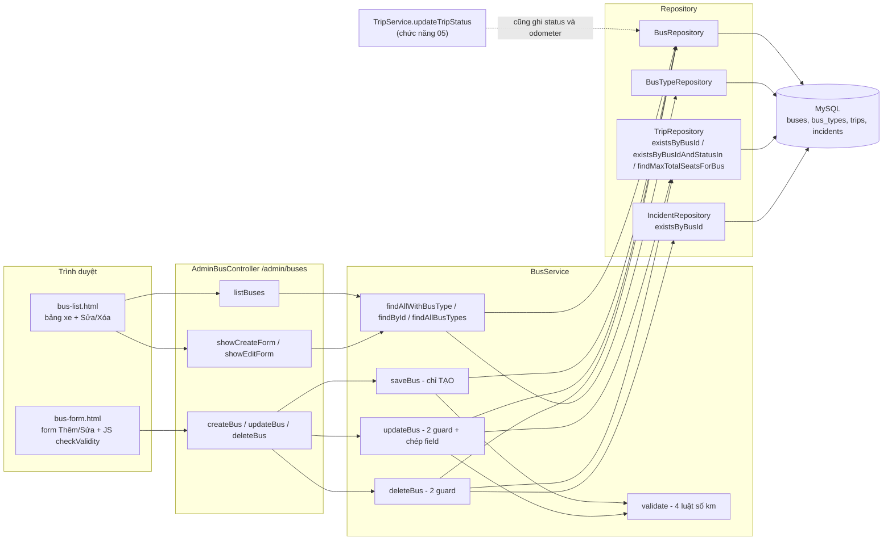
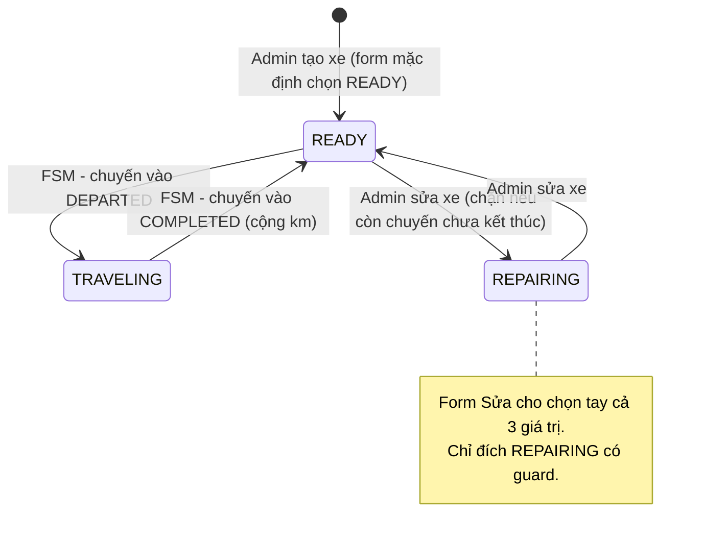
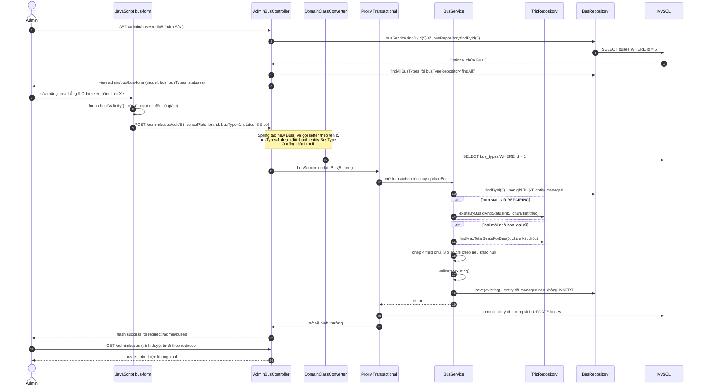
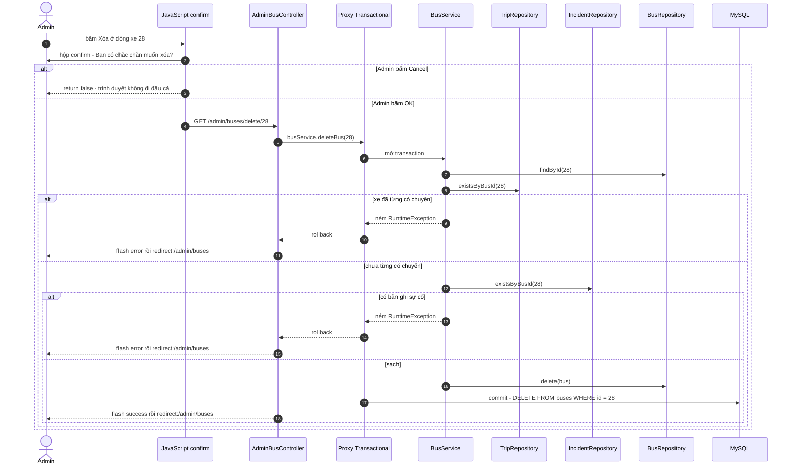

# Bài 01 — Bus Management (Quản lý xe khách)

> Bài chức năng đầu tiên, sinh từ `docs/ai/03_defense_study_prompt.md` (PHẦN B), ngày 2026-09-30.
> Học sau Bài 00a và 00b. Số dòng là ảnh chụp ngày viết — lệch thì grep lại.
>
> Nhãn: [CODE] đọc thẳng từ code · [SPRING] hành vi chuẩn của Spring/Hibernate mà code không viết
> ra · [SUY LUẬN] suy luận của người viết ("chưa kiểm chứng" nếu chưa chạy thử).
>
> Viết tắt: `…/` = `src/main/java/giang/com/BusManagement/`, `test/` =
> `src/test/java/giang/com/BusManagement/`, `tpl/` = `src/main/resources/templates/`.

---

## §1. Chức năng này là gì — nói kiểu đời thường

**Vấn đề thật của nhà xe.** Nhà xe có một đội xe. Với mỗi chiếc, người điều hành cần biết bốn
chuyện: xe nào (biển số, hãng), chở được bao nhiêu khách (loại xe → số ghế), xe đang ở đâu (sẵn
sàng / đang chạy / đang sửa), và **bao lâu nữa phải đưa đi bảo dưỡng** (đồng hồ km). Không có màn
này thì:

- người xếp lịch có thể gán một chiếc xe đã chạy quá hạn bảo dưỡng vào chuyến đi xa;
- không ai biết xe nào đang nằm xưởng;
- các màn phía sau (xếp chuyến, AI chọn xe, Dashboard, Đề xuất thay xe) **không có dữ liệu để
  làm việc** — tất cả đều đọc bảng `buses` mà màn này ghi vào.

Nói gọn: đây là **"sổ hồ sơ đội xe"**. Nó đơn giản (thêm / xem / sửa / xóa), nhưng mọi chức năng
khó hơn đều đứng trên nó.

**Một kịch bản cụ thể.** Anh admin mở Dashboard, bấm "Quản lý xe". Danh sách hiện 20 xe; xe
`29A-001.05` có huy hiệu đỏ **"Cần bảo trì gấp!"** vì đã chạy 5.100 km kể từ lần bảo dưỡng cuối,
vượt ngưỡng 5.000 km. Anh bấm **Sửa**, đổi "Trạng Thái Vận Hành" sang `REPAIRING`, bấm **Lưu**.

- Nếu xe không còn chuyến nào chưa chạy xong → màn hình quay về danh sách, hiện khung xanh
  *"Cập nhật thông tin xe thành công!"*, xe mang huy hiệu vàng "Bảo Trì".
- Nếu xe còn một chuyến đang bán vé → quay về danh sách, hiện khung đỏ *"Lỗi: Không thể chuyển
  trạng thái xe sang bảo trì vì xe đang được phân công cho chuyến xe chưa kết thúc…"*, và **không
  thông tin nào của xe bị đổi**.

Hôm sau xe bảo dưỡng xong: anh sửa lại, gõ "Km Lần Bảo Trì Cuối" bằng đúng số odometer hiện tại
(tức "vừa bảo dưỡng ở mốc này"), đặt lại `READY`. Huy hiệu đỏ biến mất vì km kể từ lần bảo trì cuối
về 0.

Anh thử **Xóa** một chiếc xe cũ → hệ thống từ chối vì xe đã có lịch sử chạy chuyến, và gợi ý đổi
sang bảo trì thay vì xóa.

---

## §2. Bản đồ tổng quan

### 2.1. Các mảnh ghép

| Loại | File | Trách nhiệm (1 dòng) |
|---|---|---|
| Template | `tpl/admin/bus/bus-list.html` | Bảng danh sách xe, flash message, nút Sửa/Xóa |
| Template + JS | `tpl/admin/bus/bus-form.html` | Form dùng chung cho Thêm và Sửa; khối `<script>` `:90-101` chặn submit khi ô `required` trống |
| Template (lối vào) | `tpl/admin/dashboard.html:83, :88` | Hai nút "Quản lý xe" và "Thêm xe" trên Dashboard |
| Controller | `…/controller/admin/AdminBusController.java` | 6 endpoint `/admin/buses/*`; **chỉ inject `BusService`** (mẫu chuẩn của dự án) |
| Service | `…/service/BusService.java` | Tạo / sửa / xóa có kiểm tra; là **lối ghi `buses` duy nhất từ giao diện** |
| Repository | `…/repository/BusRepository.java` | Đọc/ghi `buses`; `findAllWithBusType()` có `JOIN FETCH` |
| Repository | `…/repository/BusTypeRepository.java` | Chỉ dùng `findAll()` để đổ dropdown loại xe |
| Repository (mượn) | `…/repository/TripRepository.java:233, :350, :367-369` | Ba câu hỏi về chuyến của xe, phục vụ các guard |
| Repository (mượn) | `…/repository/IncidentRepository.java:56` | "Xe có bản ghi sự cố nào không" — guard xóa |
| Entity | `…/domain/Bus.java` | Bảng `buses` + 3 method nghiệp vụ về bảo trì |
| Entity | `…/domain/BusType.java` | Bảng `bus_types`: tên loại + số ghế |
| Enum | `…/domain/BusStatus.java` | `READY`, `TRAVELING`, `REPAIRING` |
| Test | `test/service/BusServiceTest.java` | 18 test ghim tạo/sửa, ba con số bảo trì, hai guard |
| Seed | `…/config/DataInitializer.java:58-60` | Nơi **duy nhất** tạo loại xe (profile `demo`) |

**Không có DTO riêng** — form bind thẳng vào entity `Bus` (Bài 00b §3.3, §6).

### 2.2. Bảng endpoint — đủ mọi điểm bắt đầu

Chức năng này **không** có `@Scheduled`, không có REST/`fetch()`, không có `CommandLineRunner`
riêng. Chỉ có 6 endpoint HTTP.

| HTTP | URL | Controller method | Được gọi từ đâu | Service chính | Kết quả |
|---|---|---|---|---|---|
| GET | `/admin/buses` | `listBuses()` `:19-23` | nút "Quản lý xe" `dashboard.html:83`; link "Xem tất cả" `dashboard-analytics.html:177`; link trong `incident-form.html:109`, `incident-list.html:149`; mọi redirect của màn này | `findAllWithBusType()` | view `admin/bus/bus-list` |
| GET | `/admin/buses/create` | `showCreateForm()` `:25-31` | nút "Thêm Xe Mới" `bus-list.html:20`; nút trên `dashboard.html:88` | `findAllBusTypes()` | view `admin/bus/bus-form` với `new Bus()` |
| POST | `/admin/buses/create` | `createBus()` `:33-42` | nút "Lưu Xe" khi `bus.id == null` (`bus-form.html:22`) | `saveBus()` | redirect `/admin/buses` + flash |
| GET | `/admin/buses/edit/{id}` | `showEditForm()` `:44-57` | nút "Sửa" `bus-list.html:79-80` | `findById()`, `findAllBusTypes()` | view `bus-form`, hoặc redirect + flash `error` nếu không thấy xe |
| POST | `/admin/buses/edit/{id}` | `updateBus()` `:59-70` | nút "Lưu Xe" khi `bus.id != null` (`bus-form.html:22`) | `updateBus(id, form)` | redirect `/admin/buses` + flash |
| GET | `/admin/buses/delete/{id}` | `deleteBus()` `:72-81` | nút "Xóa" + `confirm()` `bus-list.html:81-84` | `deleteBus()` | redirect `/admin/buses` + flash |

(Số dòng controller thuộc `…/controller/admin/AdminBusController.java`.)

### 2.3. Sơ đồ toàn cảnh



Cột `buses.status` có **hai người ghi** — màn này và FSM của chuyến. Vòng đời của nó:



### 2.4. Điều cốt lõi cần nhớ

1. **Tạo và Sửa là hai method khác nhau có chủ đích.** `saveBus()` chỉ tạo (từ chối entity đã có
   id), `updateBus(id, form)` nạp bản ghi cũ rồi **chép từng field** — ô số để trống nghĩa là
   **giữ nguyên**, không phải "về 0" (lỗi #16).
2. **Sửa xe có hai guard, đều đứng TRƯỚC mọi setter:** không cho `REPAIRING` khi xe còn chuyến
   chưa kết thúc (lỗi #15); không cho **hạ** loại xe xuống dưới số ghế đang bán (Group C(d)).
3. **Bốn luật số km** trong `validate()` dùng chung cho cả tạo lẫn sửa: không âm, odometer không
   nhỏ hơn km bảo trì cuối, ngưỡng > 0.
4. **Xóa là xóa cứng** (`DELETE`), nên bị chặn nếu xe đã từng có chuyến hoặc có sự cố — vì DB đã
   tắt kiểm tra khóa ngoại, service là lớp chặn duy nhất.
5. **Màn này là nguồn dữ liệu của cả hệ thống:** `validateBusForTrip`, AI chọn xe, Dashboard,
   Đề xuất thay xe, What-if đều đọc ba con số km và `status` mà nó ghi.

---

## §3. Trace chi tiết các luồng chính

**Chọn luồng nào và vì sao.** Luồng "xem danh sách" đã được trace trọn ở **Bài 00a §4.2** nên
không lặp lại. Hai luồng được chọn ở đây là hai luồng **chứa mọi luật nghiệp vụ** của chức năng:

- **Luồng A — Sửa xe** (`GET` rồi `POST /admin/buses/edit/{id}`): hai guard, quy tắc "ô trống =
  giữ nguyên", `validate()`, dirty checking. Đây là luồng hội đồng hỏi nhiều nhất và là nơi ba lỗi
  thật (#15, #16, C(d)) đã xảy ra.
- **Luồng B — Xóa xe** (`GET /admin/buses/delete/{id}`): xóa cứng, hai guard toàn vẹn dữ liệu, và
  câu hỏi "sao xóa bằng GET".

### 3.1. Luồng A — Sửa xe (ca thành công)

Dữ liệu minh hoạ: xe id 5, loại "Ghế ngồi" 50 chỗ, odometer 8.000, km bảo trì cuối 4.000, ngưỡng
5.000. Admin chỉ đổi hãng xe và **để trống** ô odometer.

**(a) Sơ đồ**



**(b) Bảng từng bước**

| # | Tầng | Vị trí | Method / thành phần | Nhận vào | Làm gì | Trả về / gọi tiếp | Nhãn |
|---|---|---|---|---|---|---|---|
| 1 | Trình duyệt | `bus-list.html:79-80` | link "Sửa" | — | `th:href="@{/admin/buses/edit/{id}(id=${bus.id})}"` sinh ra `/admin/buses/edit/5` | GET | [CODE] |
| 2 | Spring | — | DispatcherServlet | URL | Ghép `@RequestMapping("/admin/buses")` + `@GetMapping("/edit/{id}")`; lấy `5` từ đường dẫn vào `@PathVariable Long id` | `showEditForm(5, model, ra)` | [SPRING] |
| 3 | Controller | `AdminBusController.java:47-48` | `showEditForm()` | `id = 5` | `busService.findById(id).orElseThrow(...)` — không thấy thì ném `RuntimeException` | `Bus` | [CODE] |
| 4 | Service → Repo | `BusService.java:46-48` | `findById()` | 5 | chuyển tiếp, **không** `@Transactional` ở service | `Optional<Bus>` | [CODE] |
| 5 | Repo → DB | `JpaRepository.findById` | Spring Data | 5 | [SUY LUẬN — SQL tương đương] `SELECT * FROM buses WHERE id = 5` | dòng → `Bus` | [SPRING] |
| 6 | Controller | `:49-51` | `model.addAttribute` | — | đặt 3 key: `bus` (xe 5), `busTypes` (`busTypeRepository.findAll()` — `BusService.java:50-52`), `statuses` (`BusStatus.values()`) | — | [CODE] |
| 7 | Controller | `:52` | return | — | `"admin/bus/bus-form"` | ViewResolver | [CODE] |
| 8 | View | `bus-form.html:22` | `th:action` | `bus.id = 5` | `${bus.id == null} ? @{/admin/buses/create} : @{/admin/buses/edit/{id}(...)}` ⇒ form trỏ về `/admin/buses/edit/5` | HTML | [CODE] |
| 9 | View | `bus-form.html:28-76` | `th:object="${bus}"` + `th:field` | xe 5 | điền sẵn giá trị hiện tại vào từng ô; `th:field` sinh luôn thuộc tính `name` trùng tên field | HTML | [CODE]+[SPRING] |
| 10 | View | `:40-44`, `:51-54` | hai `<select>` | `busTypes`, `statuses` | liệt kê **mọi** loại xe và **cả 3** trạng thái | HTML | [CODE] |
| 11 | Admin | — | — | — | đổi hãng, **xoá trắng** ô Odometer, bấm "Lưu Xe" | sự kiện `submit` | — |
| 12 | JavaScript | `bus-form.html:93-98` | listener `submit` | form | `form.checkValidity()`: ô `required` trống hoặc số `< min` ⇒ `preventDefault()` (hủy gửi) và tô đỏ; ở đây hợp lệ vì ô Odometer **không** `required` | cho gửi | [CODE] |
| 13 | Trình duyệt | — | — | — | POST `/admin/buses/edit/5` với body `licensePlate=…&brand=…&busType=1&status=READY&odometer=&lastMaintenanceOdometer=4000&maintenanceThreshold=5000` | HTTP | [SUY LUẬN] |
| 14 | Spring | `AdminBusController.java:60` | `@ModelAttribute Bus bus` | body | tạo **`new Bus()`** rồi gọi setter theo tên ô; ô `odometer` rỗng ⇒ `null` | object rời, `id = null` | [SPRING] |
| 15 | Spring | — | `DomainClassConverter` | `busType=1` | đổi chuỗi "1" thành entity: gọi `BusTypeRepository.findById(1)` (Bài 00a §4.3) | `BusType` | [SPRING] |
| 16 | Controller | `:64` | `updateBus()` | `id` **từ URL**, `bus` từ form | gọi `busService.updateBus(id, bus)` — id đi **riêng**, không `bus.setId(id)` (comment `:62-63`) | → proxy | [CODE] |
| 17 | Proxy | `BusService.java:116` | `@Transactional` | — | **mở transaction** (ranh giới bắt đầu) | → `updateBus` thật | [SPRING] |
| 18 | Service | `:118-119` | `busRepository.findById(id)` | 5 | nạp bản ghi thật; không thấy ⇒ `RuntimeException("Không tìm thấy xe với ID: 5")` | `existing` (**managed**) | [CODE] |
| 19 | Service | `:135-142` | guard REPAIRING | `form.status` | chỉ chạy khi `form.getStatus() == REPAIRING`. Ở ca này status là `READY` ⇒ bỏ qua | — | [CODE] |
| 20 | Service | `:168-170` | guard hạ loại xe | 2 sức chứa | `newCapacity` / `oldCapacity` lấy từ hai `BusType`; chỉ chạy khi cả hai khác null **và** `new < old`. Ở ca này giữ nguyên loại ⇒ bỏ qua | — | [CODE] |
| 21 | Service | `:182-185` | chép 4 field chữ | form | `licensePlate`, `brand`, `busType`, `status` chép **nguyên** — kể cả khi null | — | [CODE] |
| 22 | Service | `:187-195` | chép 3 field số | form | mỗi ô chỉ chép khi `!= null`. `odometer` null ⇒ **giữ 8.000**; hai ô còn lại được chép | — | [CODE] |
| 23 | Service | `:197`, `:218-233` | `validate(existing)` | xe sau khi chép | 4 luật: odometer ≥ 0; km bảo trì cuối ≥ 0; odometer ≥ km bảo trì cuối; ngưỡng > 0. Hợp lệ | — | [CODE] |
| 24 | Service | `:198` | `busRepository.save(existing)` | entity managed có id | `save()` với id khác null ⇒ `merge`; entity đang managed nên merge không làm gì thêm (Bài 00b §3.1) | — | [SPRING] |
| 25 | Proxy | — | commit | — | **dirty checking** thấy `brand` đổi ⇒ sinh `UPDATE`. [SUY LUẬN — SQL tương đương] `UPDATE buses SET brand=?, bus_type_id=?, license_plate=?, last_maintenance_odometer=?, maintenance_threshold=?, odometer=?, status=? WHERE id=5` (Hibernate mặc định ghi mọi cột) — **ranh giới transaction kết thúc** | — | [SPRING] |
| 26 | Controller | `:65` | flash | — | `addFlashAttribute("success", "Cập nhật thông tin xe thành công!")` | — | [CODE] |
| 27 | Controller | `:69` | return | — | `"redirect:/admin/buses"` ⇒ HTTP 302 (mẫu PRG, Bài 00a §4.4) | — | [CODE]+[SPRING] |
| 28 | Trình duyệt → Controller | `:19-23` | `listBuses()` | — | GET mới; flash `success` được Spring chép vào Model của request này | `bus-list` | [SPRING] |
| 29 | DB | `BusRepository.java:16-17` | `findAllWithBusType()` | — | JPQL `SELECT DISTINCT b FROM Bus b LEFT JOIN FETCH b.busType` — một câu duy nhất, không N+1 (Bài 00b §2.4) | `List<Bus>` | [CODE] |
| 30 | View | `bus-list.html:24-27`, `:52-86` | `th:if="${success}"`, `th:each` | `success`, `buses` | hiện khung xanh; mỗi xe một dòng, cột "Chạy Từ Lần Bảo Trì Cuối" gọi thẳng `bus.getKmSinceLastMaintenance()` (`:63`), cột cảnh báo gọi `bus.needsMaintenance()` (`:73-76`) | HTML | [CODE] |

**Ranh giới transaction.** Có đúng **một** transaction ghi: mở ở bước 17, đóng ở bước 25, bao trọn
`updateBus()`. Controller gọi **một** method service ghi dữ liệu, nên không có chuyện "hai
transaction" như `AdminTripManagementController.updateTrip()` (Bài 00b §4.4). Các bước đọc
(3–6, 15, 29) chạy ngoài transaction của service, dựa vào phiên Hibernate mà OSIV giữ mở suốt
request (Bài 00b §4.5).

**Controller không inject repository** — `AdminBusController.java:17` chỉ có `BusService`. Đây
chính là mẫu roadmap §3 yêu cầu mọi controller mới phải theo ("follow the `AdminBusController`
pattern"), đối lập với `AdminTripManagementController`.

**(c) Code then chốt**

`…/service/BusService.java:116-199` (rút gọn):

```java
@Transactional                                   // mở/đóng transaction bao cả method
public void updateBus(Long id, Bus form) {       // id từ URL; form là object RỜI dựng từ ô form
    Bus existing = busRepository.findById(id)    // nạp bản ghi THẬT → entity managed
            .orElseThrow(() -> new RuntimeException("Không tìm thấy xe với ID: " + id));

    // GUARD 1 (lỗi #15): chỉ hỏi khi Admin muốn chuyển sang REPAIRING
    if (form.getStatus() == BusStatus.REPAIRING) {
        boolean hasUnfinishedTrips = tripRepository.existsByBusIdAndStatusIn(
                id, UNFINISHED_TRIP_STATUSES);   // {PENDING_APPROVAL, ACTIVE, DEPARTED}
        if (hasUnfinishedTrips) {
            throw new RuntimeException("Không thể chuyển trạng thái xe sang bảo trì ...");
        }
    }

    // GUARD 2 (Group C(d)): chỉ chặn khi loại mới NHỎ HƠN loại đang có
    Integer newCapacity = form.getBusType() != null ? form.getBusType().getCapacity() : null;
    Integer oldCapacity = existing.getBusType() != null ? existing.getBusType().getCapacity() : null;
    if (newCapacity != null && oldCapacity != null && newCapacity < oldCapacity) {
        Integer maxOpenSeats = tripRepository.findMaxTotalSeatsForBus(id, UNFINISHED_TRIP_STATUSES);
        if (maxOpenSeats != null && newCapacity < maxOpenSeats) {   // null = không có chuyến mở
            throw new RuntimeException(String.format("Không thể đổi xe %s sang loại %s ...", ...));
        }
    }

    // Chỉ tới đây mới bắt đầu SỬA entity — hai guard đã đứng trước mọi setter
    existing.setLicensePlate(form.getLicensePlate());   // 4 field chữ: chép nguyên
    existing.setBrand(form.getBrand());
    existing.setBusType(form.getBusType());
    existing.setStatus(form.getStatus());

    if (form.getOdometer() != null) {                   // 3 field số: TRỐNG = GIỮ NGUYÊN (lỗi #16)
        existing.setOdometer(form.getOdometer());
    }
    // ... tương tự cho lastMaintenanceOdometer, maintenanceThreshold

    validate(existing);                                 // 4 luật số km; ném IllegalArgumentException
    busRepository.save(existing);                       // thật ra dirty checking đã đủ
}
```

Vì sao "trống = giữ nguyên" chỉ áp cho **ba ô số**: javadoc `BusService.java:109-114` ghi rõ — bốn
ô chữ đều là `required` nên form thật không bao giờ gửi rỗng, và chúng không tham gia phép tính
nào; mất một trong số đó là lỗi hiển thị thấy ngay, còn một con số km sai thì lặng lẽ lan sang bộ
lọc bảo trì.

Hằng số dùng chung, `BusService.java:39-40`:

```java
private static final List<TripStatus> UNFINISHED_TRIP_STATUSES = List.of(
        TripStatus.PENDING_APPROVAL, TripStatus.ACTIVE, TripStatus.DEPARTED);
// = mọi trạng thái KHÔNG phải trạng thái cuối (COMPLETED, CANCELLED) của FSM chuyến,
//   và bằng đúng DriverService.BUSY_STATUSES — guard anh em khi khóa tài xế
```

### 3.2. Luồng B — Xóa xe

**(a) Sơ đồ**



**(b) Bảng từng bước** (ca thành công — xe mới tạo, chưa có chuyến, chưa có sự cố)

| # | Tầng | Vị trí | Method / thành phần | Nhận vào | Làm gì | Trả về / gọi tiếp | Nhãn |
|---|---|---|---|---|---|---|---|
| 1 | Trình duyệt | `bus-list.html:81-84` | thẻ `<a>` "Xóa" | — | `href` = `/admin/buses/delete/28`; `onclick="return confirm(...)"` | — | [CODE] |
| 2 | JavaScript | `:83` | `confirm()` | — | hộp hỏi lại; `return false` (Cancel) hủy việc đi theo link, `true` (OK) cho đi | GET | [CODE]+[SPRING — hành vi chuẩn của trình duyệt] |
| 3 | Spring | — | DispatcherServlet | URL | khớp `@GetMapping("/delete/{id}")`, `id = 28` | `deleteBus(28, ra)` | [SPRING] |
| 4 | Controller | `AdminBusController.java:75` | `deleteBus()` | 28 | gọi service trong `try` | → proxy | [CODE] |
| 5 | Proxy | `BusService.java:235` | `@Transactional` | — | mở transaction | — | [SPRING] |
| 6 | Service | `:237-238` | `findById` | 28 | không thấy ⇒ `RuntimeException("Không tìm thấy xe cần xóa với ID: 28")` | `bus` | [CODE] |
| 7 | Service → DB | `:242`, `TripRepository.java:233` | `existsByBusId(28)` | — | derived query. [SUY LUẬN — SQL tương đương] `SELECT 1 FROM trips WHERE bus_id = 28 AND is_deleted = false LIMIT 1` — vế `is_deleted = false` do `@SQLRestriction` của `Trip` tự thêm (Bài 00b §1.5) | `false` | [CODE]+[SPRING] |
| 8 | Service → DB | `:256`, `IncidentRepository.java:56` | `existsByBusId(28)` | — | [SUY LUẬN — SQL tương đương] `SELECT 1 FROM incidents WHERE bus_id = 28 LIMIT 1` — **không lọc** theo trạng thái sự cố | `false` | [CODE] |
| 9 | Service | `:261` | `busRepository.delete(bus)` | entity | đánh dấu xóa. `Bus` **không** có `@SQLDelete` ⇒ xóa cứng | — | [CODE] |
| 10 | Proxy | — | commit | — | [SUY LUẬN — SQL tương đương] `DELETE FROM buses WHERE id = 28` | — | [SPRING] |
| 11 | Controller | `:76`, `:80` | flash + redirect | — | `success` = "Xóa xe thành công!", `redirect:/admin/buses` | 302 | [CODE] |
| 12 | View | `bus-list.html:24-27` | `th:if="${success}"` | — | khung xanh; xe 28 không còn trong bảng | HTML | [CODE] |

**(c) Code then chốt** — `…/service/BusService.java:235-262`:

```java
@Transactional
public void deleteBus(Long id) {
    Bus bus = busRepository.findById(id).orElseThrow(...);

    boolean hasAnyTrip = tripRepository.existsByBusId(id);  // "đã từng" — không lọc trạng thái
    if (hasAnyTrip) {
        throw new RuntimeException("... Hãy đổi trạng thái sang bảo trì thay vì xóa cứng!");
    }
    // Phải tự kiểm ở đây vì URL datasource đặt foreign_key_checks=0: MySQL KHÔNG chặn,
    // xóa sẽ để lại incidents.bus_id trỏ vào xe không còn tồn tại.
    if (incidentRepository.existsByBusId(id)) {
        throw new RuntimeException("... Hãy xóa các bản ghi sự cố của xe ... trước ...");
    }
    busRepository.delete(bus);                               // DELETE thật, không soft delete
}
```

Chuỗi `foreign_key_checks=0` nằm ở `src/main/resources/application.properties:19`.

---

## §4. Luồng lỗi — đặt xe sang `REPAIRING` khi xe đang có chuyến chạy dở

Tình huống: xe 6 đang chở khách (chuyến 13 ở `DEPARTED`). Admin mở Sửa, chọn `REPAIRING`, **tiện
tay đổi luôn hãng xe**, bấm Lưu.

| Bước | Chuyện gì xảy ra | Vị trí | Nhãn |
|---|---|---|---|
| 1 | Bước 1–18 như luồng A; `existing` = xe 6 (managed) | — | [CODE] |
| 2 | `form.getStatus() == REPAIRING` ⇒ vào guard | `BusService.java:135` | [CODE] |
| 3 | `existsByBusIdAndStatusIn(6, [PENDING_APPROVAL, ACTIVE, DEPARTED])` ⇒ `true` vì chuyến 13 đang `DEPARTED`. [SUY LUẬN — SQL tương đương] `SELECT 1 FROM trips WHERE bus_id = 6 AND status IN ('PENDING_APPROVAL','ACTIVE','DEPARTED') AND is_deleted = false LIMIT 1` | `:136-137`, `TripRepository.java:350` | [CODE] |
| 4 | **Ném `RuntimeException`** "Không thể chuyển trạng thái xe sang bảo trì vì xe đang được phân công cho chuyến xe chưa kết thúc (chờ duyệt / đang bán vé / đang trên đường). Hãy hoàn thành hoặc hủy các chuyến đó trước!" | `:139-140` | [CODE] |
| 5 | Chưa setter nào chạy (setter bắt đầu ở `:182`) ⇒ hãng xe mới **chưa hề chạm** vào `existing` | — | [CODE] |
| 6 | Exception là unchecked ⇒ proxy **rollback** (Bài 00b §4.1). Với `EntityManager` do OSIV giữ, Spring còn xóa sạch các thay đổi chưa ghi trong phiên khi rollback — sổ lỗi ghi đây là điểm "ĐÃ KIỂM, không phải lỗi" (`current_bugs_found.md` mục 2026-09-19) | — | [SPRING] |
| 7 | Controller bắt bằng `catch (Exception e)` chung — **một** nhánh cho mọi loại lỗi | `AdminBusController.java:66-67` | [CODE] |
| 8 | Flash `error` = `"Lỗi: " + e.getMessage()` | `:67` | [CODE] |
| 9 | `redirect:/admin/buses` | `:69` | [CODE] |
| 10 | Admin thấy danh sách xe, khung đỏ `bus-list.html:28-31` chứa câu ở bước 4; xe 6 vẫn `TRAVELING`, hãng xe cũ | — | [CODE] |

**Bằng chứng từ app thật:** đúng thao tác này (kèm `brand` cố tình đổi thành `PROBE-15`) đã được
chạy trên xe thật số 6 ngày 2026-08-06 — flash lỗi như trên, DB **không đổi gì**, 0 dòng mang
brand `PROBE%` (`current_bugs_found.md`, mục #15).

**Các lỗi khác đi cùng một đường về** (khác nhau ở loại exception và câu chữ, giống nhau ở bước
7–10):

| Nguyên nhân | Ném ở | Loại |
|---|---|---|
| Hạ loại xe dưới số ghế chuyến mở đang bán | `BusService.java:173-178` | `RuntimeException` |
| Odometer âm / km bảo trì cuối âm / odometer < km bảo trì cuối / ngưỡng ≤ 0 | `:219-232` | `IllegalArgumentException` |
| Xe không tồn tại (POST sửa/xóa) | `:119`, `:238` | `RuntimeException` |
| POST tạo mang sẵn `id` | `:70-73` | `IllegalArgumentException` |
| Xe không tồn tại (GET form sửa) | `AdminBusController.java:48` | `RuntimeException` — flash **không** có tiền tố "Lỗi: " (`:54`) |

Lưu ý: lỗi của `validate()` ném **sau** các setter (`:197`). Vẫn an toàn vì rollback — không
`UPDATE` nào được ghi dù `existing` trong RAM đã đổi (Bài 00b §4.3).

---

## §5. Các luồng còn lại — trace rút gọn

- **Xem danh sách** — `[bus-list / dashboard]` → `AdminBusController.listBuses()` `:19-23` →
  `BusService.findAllWithBusType()` `:42-44` → `BusRepository.findAllWithBusType()` `:16-17` →
  view `admin/bus/bus-list`. Đã trace đủ ở Bài 00a §4.2. Điểm đáng chú ý: template gọi thẳng
  method nghiệp vụ của entity (`getKmSinceLastMaintenance()`, `needsMaintenance()`) và dùng
  `#numbers.formatDecimal(..., 1, 0)` để làm tròn; bảng rỗng có dòng nhắc `:87-91`.
- **Mở form Thêm** — `[nút Thêm Xe Mới]` → `showCreateForm()` `:25-31` → `new Bus()` +
  `findAllBusTypes()` + `BusStatus.values()` → view `bus-form`. `bus.id == null` nên `th:action`
  trỏ về `/admin/buses/create`. `<select>` trạng thái không có ô trống, nên xe mới mặc định hiện
  `READY` (giá trị đầu tiên của enum).
- **Lưu xe mới** — `[JS checkValidity]` → `createBus()` `:33-42` → `BusService.saveBus()`
  `:64-88` → `BusRepository.save()` → `INSERT` → `redirect:/admin/buses`. Điểm đáng chú ý:
  (1) **tripwire** `:70-73` — entity đã có `id` thì từ chối, để một POST tự chế không biến "tạo"
  thành "ghi đè" (lỗi #16/#21, Bài 00b §3.2); (2) chỉ ở luồng tạo, ô số trống mới nhận mặc định
  `0 / 0 / 5000` (`:76-84`); (3) `validate()` chạy **sau** khi điền mặc định (`:86`).

---

## §6. Hai lớp bảo vệ và tác động lên dữ liệu

### 6.1. Bảng "không-mời / chặn thật"

| Luật | Lớp không-mời (UI) | Lớp chặn thật (server) | POST tự chế vượt lớp đầu thì sao |
|---|---|---|---|
| Biển số, hãng, loại xe, trạng thái phải có | `required` (`bus-form.html:28-29, :34, :40, :51`) + JS `checkValidity()` `:96` | **Không có** — cố ý, javadoc `BusService.java:109-114` | Lọt: xe lưu được với biển số/hãng/loại rỗng. **Chỉ một lớp**, theo quyết định ghi ở #16 (i) |
| Odometer, km bảo trì cuối không âm | `min="0"` `:65`, `:70` | `validate()` `BusService.java:219-224` | Bị chặn: "Lỗi: Odometer không được âm!" |
| Ngưỡng bảo trì > 0 | `min="1"` `:75` | `validate()` `:230-232` | Bị chặn: "Lỗi: Ngưỡng cảnh báo bảo trì phải lớn hơn 0 km!" |
| Odometer ≥ km bảo trì cuối | **Không có** (HTML không so được hai ô) | `validate()` `:225-229` | Người dùng thường cũng đi tới đây; bị chặn kèm hai con số |
| Không `REPAIRING` khi còn chuyến chưa kết thúc | **Không có** — dropdown mời cả 3 trạng thái cho mọi xe (`:51-54`) | `updateBus()` `:135-142` | Bị chặn, không field nào bị ghi |
| Không hạ loại xe dưới ghế đang bán | **Không có** — dropdown mời mọi loại xe (`:40-44`) | `updateBus()` `:168-180` | Bị chặn, không field nào bị ghi |
| Không xóa xe có chuyến / có sự cố | Nút Xóa **luôn hiện**; `confirm()` chỉ hỏi lại, không lọc (`bus-list.html:81-84`) | `deleteBus()` `:242-259` | Bị chặn |
| "Tạo" không được ghi đè xe có sẵn | Form tạo không có ô `id` | tripwire `saveBus()` `:70-73` | Bị chặn: "saveBus() chỉ dùng để tạo xe mới…" |
| "Sửa" chỉ sửa đúng xe trên URL | — | `updateBus(id, form)` lấy id từ URL, bỏ qua `id` trong form (`AdminBusController.java:62-64`) | `id` gửi kèm bị lờ đi |

Đọc bảng này theo đúng quy tắc một chiều của dự án (Bài 00b §5.2): lớp chặn thật **luôn** phải
có cho luật quan trọng; lớp không-mời có thì tốt. Ở màn này, các luật về **dữ liệu chuyến**
(REPAIRING, loại xe, xóa) chỉ có lớp chặn thật — form không biết xe đang có chuyến nào.

### 6.2. Bảng "thay đổi gì trong DB"

| Thao tác | Bảng / cột | Từ → sang |
|---|---|---|
| Xem danh sách, mở form | — | Không ghi DB |
| Thêm xe | `buses` — thêm 1 dòng | `license_plate`, `brand`, `bus_type_id`, `status` như form; ba cột km như form hoặc mặc định `0 / 0 / 5000` |
| Sửa xe | `buses` — đúng 1 dòng `id` trên URL | 4 cột chữ ghi như form; mỗi cột km chỉ đổi nếu ô có giá trị. Ví dụ "vừa bảo dưỡng xong": `last_maintenance_odometer` 4.000 → 8.000 (= odometer), `status` `REPAIRING` → `READY` |
| Xóa xe | `buses` — xóa cứng 1 dòng | `DELETE`; không đụng `trips`/`incidents` (vì guard đã bảo đảm không còn dòng nào trỏ tới) |
| *(chức năng 05, không thuộc màn này)* chuyến vào `DEPARTED` | `buses.status` | → `TRAVELING` (`TripService.java:677-679`) |
| *(chức năng 05)* chuyến vào `COMPLETED` | `buses.status`, `buses.odometer` | → `READY`; odometer += `route.distanceKm` (`TripService.java:680-691`) |

Hai dòng cuối nhắc để thấy: `buses` có **hai người ghi**. Màn này ghi mọi cột; FSM chỉ ghi
`status` và `odometer`.

---

## §7. Annotation và cơ chế dùng trong chức năng này

| Annotation / cơ chế | Nghĩa đời thường | Tác dụng ở đây | Bỏ đi thì sao |
|---|---|---|---|
| `@Controller` + `@RequestMapping("/admin/buses")` | "Quầy lễ tân phụ trách mọi đường dẫn bắt đầu bằng /admin/buses" (00a §4) | `AdminBusController.java:12-13` | Không URL nào tới được màn này |
| `@RequiredArgsConstructor` + `private final` | Lombok tự viết constructor để Spring tiêm phụ thuộc (00a §3.2) | Controller `:14, :17`; service `BusService.java:19, :22-25` | Field null → `NullPointerException` |
| `@PathVariable` | Lấy `5` trong `/edit/5` | `:45`, `:60`, `:73` | Không biết sửa/xóa xe nào |
| `@ModelAttribute Bus bus` | Gom mọi ô form vào một `new Bus()` (00a §4.3) | `:34`, `:60` | Phải tự đọc từng tham số |
| `DomainClassConverter` | Tự đổi id loại xe trong form thành entity `BusType` | ô `busType` | `setBusType` nhận chuỗi, bind lỗi |
| `RedirectAttributes.addFlashAttribute` | Lời nhắn sống qua đúng một lần chuyển trang (00a §4.4) | `:37, :39, :54, :65, :67, :76, :78` | Sau redirect không hiện được thông báo |
| `@Transactional` | Làm trọn gói: xong hết hoặc hoàn tác sạch (00b §4) | `saveBus` `:64`, `updateBus` `:116`, `deleteBus` `:235` | Guard ném lỗi sau khi đã có ghi dở sẽ không được hoàn tác; dirty checking không có transaction để flush |
| Dirty checking | Hibernate tự `UPDATE` field đã đổi của entity managed lúc commit (00b §4.3) | `updateBus` `:182-198` | — (`save()` ở `:198` về lý thuyết là thừa) |
| `@Query` + `LEFT JOIN FETCH` | Nạp xe kèm loại xe trong một câu (00b §2.4) | `BusRepository.java:16-17` | N+1: mỗi dòng bảng thêm một câu `SELECT bus_types` |
| Derived query `existsBy...` | Spring Data đọc tên method để sinh câu truy vấn (00b §2.2) | `TripRepository.java:233, :350`; `IncidentRepository.java:56` | Phải viết JPQL tay |
| `@Query` trả số vô hướng | Chỉ lấy một con số, không nạp entity (Hidden Cost #4) | `findMaxTotalSeatsForBus` `TripRepository.java:367-369` | Nạp cả danh sách `Trip` chỉ để lấy max |
| `@SQLRestriction` trên `Trip` | Tự thêm `is_deleted = false` vào mọi truy vấn chuyến (00b §1.5) | ảnh hưởng `existsByBusId` | Chuyến đã xóa mềm cũng được đếm |
| `@EqualsAndHashCode(onlyExplicitlyIncluded = true)` + `@ToString.Exclude` | So sánh xe chỉ theo id; `toString` không đi vào loại xe (00a §9, 00b §1.7) | `Bus.java:20, :24, :29` | Nguy cơ đệ quy / LAZY load bất ngờ (Hidden Cost #9) |
| `@ManyToOne(fetch = LAZY)` | Loại xe chỉ nạp khi cần | `Bus.java:30-32` | EAGER: luôn nạp loại xe kể cả khi không dùng |
| `@Enumerated(EnumType.STRING)` | Lưu chữ `READY` thay vì số 0 | `Bus.java:39-40` | Lưu số thứ tự; thêm/đổi thứ tự enum là hỏng dữ liệu |
| `th:field`, `th:object`, `th:action` | Thymeleaf điền sẵn giá trị và sinh `name` cho ô form (00a §6) | `bus-form.html:22-23, :28-76` | Form không bind được |
| `class="needs-validation" novalidate` + JS | Tắt thông báo mặc định của trình duyệt, tự kiểm và tô đỏ kiểu Bootstrap | `bus-form.html:23, :90-101` | Trình duyệt tự hiện bong bóng lỗi mặc định |

---

## §8. Ví dụ tính tay — ba con số bảo trì

*(Tùy chọn cho chức năng này. Số liệu **minh hoạ**, chọn tròn cho dễ theo dõi.)*

Xe có: odometer = **8.000**, lastMaintenanceOdometer = **4.000**, maintenanceThreshold = **5.000**.

| Phép tính | Công thức trong code | Kết quả |
|---|---|---|
| Km kể từ lần bảo trì cuối | `odometer - lastMaintenanceOdometer` (`Bus.java:42-46`) | 8.000 − 4.000 = **4.000** |
| Quá hạn chưa? | `km >= threshold` (`Bus.java:48-52`) | 4.000 ≥ 5.000? **Không** → huy hiệu "An Toàn" |
| Cột "Chạy Từ Lần Bảo Trì Cuối" | `bus-list.html:63` | "4000 / 5000 km" |
| Sắp đến hạn (không tính chuyến)? | `km + 0 >= threshold × 0,9` (`Bus.java:72-76`) | 4.000 ≥ 4.500? **Không** |
| Gán vào chuyến tuyến 600 km? | `isNearMaintenance(600)` — gọi trong `validateBusForTrip` (`TripService.java:1189`) | 4.000 + 600 = 4.600 ≥ 4.500 ⇒ **bị chặn** "sẽ SẮP/QUÁ ngưỡng bảo trì" |
| Gán vào chuyến tuyến 300 km? | `isNearMaintenance(300)` | 4.300 ≥ 4.500? Không ⇒ **được** |

**Vì sao `validate()` cấm odometer < km bảo trì cuối** — tính lại đúng ca lỗi #16 cũ: ô odometer
bị đặt về 0 ⇒ km kể từ bảo trì = 0 − 4.000 = **−4.000**. Khi đó `−4.000 ≥ 5.000` sai mãi, và muốn
chạm 4.500 (90%) thì xe phải chạy thêm 8.500 km — trên thực tế xe **không bao giờ** bị nhắc bảo trì.

**Vì sao cấm ngưỡng = 0** — `needsMaintenance()` thành `km >= 0`. Kể cả ngay sau bảo dưỡng
(km = 0) thì `0 >= 0` vẫn đúng ⇒ xe bị coi là quá hạn **vĩnh viễn**, không thao tác nghiệp vụ nào
gỡ được (javadoc `BusService.java:212-216`).

---

## §9. Vì sao thiết kế như vậy + cạm bẫy + kiểm thử

### 9.1. Các quyết định thiết kế

| Quyết định | Tránh được gì | Vì sao không làm cách đơn giản hơn | Nguồn |
|---|---|---|---|
| Tách `saveBus()` (tạo) khỏi `updateBus(id, form)` (sửa) | `save()` trên object rời mang id là **merge ghi đè mọi cột** (Bài 00b §3.1) — gốc của #16 | "Một method `save` cho cả hai" chính là cách cũ đã gây mất số km | #16, `BusService.java:54-63` |
| Ô số trống = giữ nguyên, gõ `0` mới là 0 | Xoá trắng một ô mà mất số km trọn đời, không khôi phục được | Phương án "báo lỗi bắt nhập lại" bị loại: cùng nguyên tắc #11 — giá trị không mang thông tin không được giả làm giá trị thật; và không mất khả năng nào vì vẫn gõ được 0 | #16 (4 lý do) |
| Guard `REPAIRING` dùng **mọi** trạng thái chưa kết thúc, kể cả `DEPARTED` | Đánh dấu bảo trì giữa chuyến rồi bị `COMPLETED → READY` xoá âm thầm | Phương án "cho `COMPLETED` không ghi đè `REPAIRING`" bị loại: sửa một side-effect đang đúng tài liệu, và suốt chuyến xe vẫn bị đếm là "đang sửa" trong khi đang chạy | #15 |
| Guard loại xe phát biểu là **"không làm tệ hơn"** (chỉ chặn khi loại mới nhỏ hơn loại cũ) | Hạ xe 50 chỗ xuống 22 chỗ làm chuyến đang mở bán quá số ghế | Guard hiển nhiên "sức chứa mới < ghế đang bán" sẽ chặn **mọi** lần lưu xe 20 (đã vi phạm sẵn từ dữ liệu lịch sử), kể cả khi chỉ sửa odometer | Roadmap §8 2026-09-23; `BusService.java:155-163` |
| Guard đứng **trước** mọi setter | Báo lỗi nhưng field khác đã kịp bị sửa | Rollback vẫn cứu được, nhưng thứ tự này làm bằng chứng kiểm chứng rõ ràng ("brand cố tình đổi không bao giờ chạm DB") | #14/#20, roadmap §8 |
| Xóa cứng bị chặn khi xe có chuyến/sự cố; không có soft delete cho `Bus` | FK treo (DB tắt kiểm tra khóa ngoại) và mất lịch sử vận hành | Cho xóa rồi để FK treo làm hỏng dữ liệu của Đề xuất thay xe | Roadmap §9 (incident delete-guards) |
| Guard sự cố **không** lọc theo trạng thái (`RESOLVED` cũng chặn) | Sự cố đã đóng mất chủ — mà đó chính là dữ liệu Đề xuất thay xe dùng | "Chỉ chặn khi `OPEN`/`IN_PROGRESS`" mở lại đường tạo bản ghi mồ côi. Roadmap ghi rõ **đừng "tối ưu"** thành như vậy | Roadmap §9 |
| Cho "nghỉ hưu" xe bằng `REPAIRING` thay vì xóa | — | Cái giá được chấp nhận: xe đã có lịch sử không bao giờ xóa được | Hidden Cost #8 |
| Không tách `Bus.status` thành hai cột | — | Tách là cách "chuẩn" nhưng cần đổi schema và sửa 12 chỗ đọc — roadmap §3 cấm khi Phase 9 chưa làm; thay bằng cho mỗi người ghi một "cửa sổ độc quyền" | Roadmap §9 (`Bus.status` two writers) |

### 9.2. Bug thật đã từng xảy ra ở chức năng này

**Lỗi #16 — xoá trắng một ô là mất số km trọn đời.**
- *Hiểu sai điều gì:* coi "ô để trống" ở form **sửa** giống "ô để trống" ở form **tạo**. Bản cũ
  dùng một `saveBus()` cho cả hai: controller dựng `new Bus()` từ form, `setId(id)`, rồi service
  điền mặc định cho field null (odometer → 0) và `save()`.
- *Hậu quả đo trên app thật (2026-08-05):* xe 8.000 km → **0**, km kể từ bảo trì = −4.000, kèm
  thông báo **thành công**. Không có bản sao nào để khôi phục. Cùng lúc, form cho lưu odometer âm
  và ngưỡng 0 (xe bị khoá vĩnh viễn).
- *Sửa:* tách tạo/sửa, "trống = giữ nguyên", thêm `validate()` 4 luật, thêm `min` trên form, thêm
  tripwire id ở `saveBus()`.
- *Điều đáng kể khi bảo vệ:* dự án **đã** biết khuôn lỗi này ở chỗ khác —
  `IncidentService.updateIncident()` có javadoc "form không gửi X, nên lưu thẳng sẽ ghi đè X thành
  null". `BusService` là ngoại lệ đi ngược quy ước của chính dự án.

**Lỗi #15 — xe đang chạy vẫn đặt được `REPAIRING`, rồi dấu đó bị xoá âm thầm.**
- *Hiểu sai điều gì:* danh sách trạng thái chặn là `{PENDING_APPROVAL, ACTIVE}` — quên `DEPARTED`,
  đúng ca mạnh nhất (xe đang lăn bánh). Admin đánh dấu bảo trì giữa đường ⇒ thành công ⇒ khi chuyến
  `COMPLETED`, FSM đặt `READY` ⇒ dấu bảo trì biến mất không một dòng cảnh báo.
- *Bài học lớn hơn con số:* lúc đầu người rà định tố `COMPLETED → READY` là lỗi — nhưng đó là hành
  vi **đã tài liệu hoá** (`trip_lifecycle_fsm.md`). Lỗi thật nằm một bước trước đó. Và
  `DriverService.BUSY_STATUSES` — guard anh em cho tài xế — **luôn** có đủ ba trạng thái, trong khi
  comment của nó tự nhận "cùng nguyên tắc với `BusService`": câu đó sai cho tới ngày sửa.
- *Cái giá đã chấp nhận:* xe hỏng **giữa đường** giờ bị từ chối đánh dấu bảo trì (có thông báo).
  FSM không có `DEPARTED → CANCELLED`; mô hình hoá sự cố giữa đường là tính năng mới.

**Group C(d) — hạ loại xe là cửa sau của luật "ghế bán ≤ sức chứa" (#22).**
- *Hiểu sai điều gì:* luật #22 được đặt trong `validateBusForTrip()` nên chỉ kiểm lúc **gán xe vào
  chuyến**. Không ai nghĩ tới việc xe đổi loại **sau khi** đã gán.
- *Đo trước khi sửa:* 4 xe (6, 7, 14, 15) đang bán **đúng bằng** sức chứa ⇒ hạ một bậc là vỡ ngay;
  1 xe (20) đã vi phạm sẵn từ dữ liệu lịch sử — chính xe này làm đổi hình dạng bản sửa (§9.1).

**Mục đã được rà và RÚT (đừng nêu lại như lỗi mới):**
- *Xóa bằng GET* — `current_bugs_found.md` "ĐÃ LOẠI 2026-08-04": `test_case.md` dùng
  `GET /admin/buses/delete/1` làm quy trình test chính thức; CSRF đã tắt có chủ đích
  (`SecurityConfig.java:17`) nên đổi sang POST **không** tăng an toàn; bán kính đo được 0 xe xóa
  được. Đổi là lựa chọn của chủ dự án, không phải lỗi. *(Bài 00a §4.5 viết "nên chuẩn hóa" — đó là
  nhận xét chung về quy ước HTTP; lập trường chính thức của dự án là mục ĐÃ LOẠI này.)*
- *Soft delete che chuyến khỏi guard xóa* (`existsByBusId` không thấy chuyến đã xóa mềm) — RÚT, bán
  kính đo được = 0.
- *Xe 19 `TRAVELING` không có chuyến giải thích; xe 17 quá hạn mà vẫn `READY`* — fixture cố ý của
  `DataInitializer` / Hidden Cost #7.

### 9.3. Cạm bẫy và điểm lạ (ghi lại, không sửa)

1. **Form Sửa cho đặt tay `TRAVELING` và `READY` không kiểm gì.** Chỉ đích `REPAIRING` có guard.
   Admin có thể đặt `READY` cho một xe đang có chuyến `DEPARTED`, hoặc tạo xe mới với `TRAVELING`.
   Xe `TRAVELING` không chuyến nào giải thích sẽ bị `validateBusForTrip` từ chối
   (`TripService.java:1146-1155`, lỗi #19) cho tới khi sửa lại. Gốc của chuyện này đã được roadmap
   §9 gọi tên — `Bus.status` có hai người ghi — và **đã có quyết định không tách cột**; roadmap dặn
   không coi đây là phát hiện mới. [SUY LUẬN] việc đặt tay `READY` giữa chuyến chưa thấy sổ lỗi
   đo riêng.
2. **Biển số không duy nhất.** `Bus.licensePlate` không có ràng buộc `unique`, service không kiểm
   trùng — hai xe cùng biển số lưu được. Đây là hạn chế đã ghi trong
   `docs/architecture/database_schema.md:91` ("No unique constraint declared in entity"), không
   phải phát hiện mới.
3. **Không có màn quản lý loại xe.** Loại xe chỉ được tạo bởi `DataInitializer.java:58-60` (profile
   `demo`); `BusTypeRepository` chỉ được gọi `findAll()`. Trên một DB mới không chạy `demo`, dropdown
   loại xe trống và ô này lại `required` ⇒ [SUY LUẬN — chưa kiểm chứng] không tạo được xe nào qua
   form.
4. **Mâu thuẫn tài liệu ↔ code (theo thứ bậc: code thắng):**
   - `docs/development/current_functional_spec.md:26` ghi *"CRUD management of Bus Types"* — **không
     tìm thấy trong code** controller/service nào tạo, sửa, xóa `BusType`.
   - `docs/development/Proj_functions_summary.md` §3 (bullet `deleteBus()`) chỉ nhắc guard chuyến,
     **thiếu** guard sự cố `BusService.java:256-259` (câu thiếu, không sai).
   - Comment `BusService.java:130` và roadmap §9 ghi dòng FSM là `TripService:615/618` / `:618` — số
     dòng đã lệch; hiện là `TripService.java:678` và `:681`.
   - Comment `BusService.java:240-241` nói chặn xóa "để giữ lịch sử giao dịch/vé" — hệ thống không có
     giao dịch hay vé thật (`ticketsSold` chỉ là một con số, Hidden Cost #3). Câu báo lỗi hiện cho
     người dùng thì không nhắc vé.
5. **Hai admin cùng sửa một xe:** không có `@Version` ⇒ người lưu sau ghi đè người lưu trước (xem
   Bài 00b §9). Với xe, [SUY LUẬN] nguy hiểm nhất là ghi đè ngược một `odometer` vừa được FSM cộng
   km nếu form được mở trước lúc chuyến hoàn thành rồi mới bấm Lưu (form gửi lại số cũ). Chưa kiểm
   chứng, chưa thấy sổ lỗi ghi.
6. **Đổi xe giữa đường không được mô hình hoá** — chuyến chỉ biết một xe; km và trạng thái đi theo
   xe cũ (`current_bugs_found.md` "Mục nhỏ 2026-09-23"). Có thể sửa tay odometer ở màn này.
7. **Lỗi #29 (còn mở, thuộc chức năng 05):** xuất phát chuyến thứ hai khi xe còn chuyến `DEPARTED`,
   rồi hoàn thành chuyến đầu ⇒ xe về `READY` trong lúc chuyến sau đang chạy. Màn Quản lý xe sẽ hiển
   thị sai trạng thái trong ca đó.

### 9.4. Test đang giữ chức năng này

`test/service/BusServiceTest.java` — `@SpringBootTest` + `@Transactional`, chạy trên DB
`busmanagement_test`, **18 test**:

| Nhóm | Test | Chốt luật gì |
|---|---|---|
| Sửa: ô trống | `update_blankNumberKeepsExistingValue` `:95` | Lỗi #16: ô trống giữ nguyên 8000/4000/5000 |
| | `update_explicitZeroIsStillWritten` `:113` | **Đối trọng:** gõ 0 vẫn ghi 0 |
| | `update_stillWritesEverythingItShould` `:125` | **Đối trọng:** sửa bình thường ghi đủ field |
| Guard REPAIRING | `update_toRepairingIsAllowedWhenBusHasNoTrips` `:151` | Xe không chuyến → được |
| | `update_toRepairingIsBlockedWhenBusIsOnADepartedTrip` `:172` | Lỗi #15: `DEPARTED` chặn |
| | `update_toRepairingIsAllowedWhenOnlyTerminalTrips` `:192` | **Đối trọng:** chỉ có chuyến `COMPLETED`/`CANCELLED` → được |
| `validate()` | `update_rejectsNegativeNumbers` `:210`, `update_rejectsOdometerBelowLastMaintenance` `:226`, `update_rejectsNonPositiveThreshold` `:240` | Ba ca của 4 luật số km |
| Tạo | `create_appliesDefaultsWhenNumbersOmitted` `:255`, `create_rejectsInvalidNumbers` `:269` | Mặc định 0/0/5000 chỉ ở luồng tạo; tạo cũng validate |
| Tripwire | `saveBus_refusesEntityThatAlreadyHasAnId` `:283` | `saveBus()` từ chối entity có id |
| Guard loại xe | `update_toSmallerTypeIsBlockedWhenAnOpenTripSellsMoreSeats` `:342` | Chặn, và `brand` cố tình đổi **không** lọt (guard trước setter) |
| | `…IsAllowedWhenBusHasNoOpenTrips` `:360`, `…IgnoresFinishedTrips` `:371`, `update_toTypeExactlyMatchingOpenSeatsIsAllowed` `:384` | **Đối trọng:** không chuyến mở / chỉ chuyến đã xong / vừa khít đều được |
| | `update_keepingTheSameTypeIsAllowedEvenOnABusThatAlreadyOversells` `:403`, `update_upgradingIsAllowedEvenOnABusThatAlreadyOversells` `:417` | Nửa "không làm tệ hơn" (ca xe 20) |

Khuôn "một test chặn + các test đối trọng" là có chủ đích: bản sửa không được **quá tay** (ví dụ
trượt thành "cứ có chuyến là chặn" thì sau vài tháng không xe nào bảo trì được). Roadmap ghi các
test này đã được thử **không rỗng**: gỡ `DEPARTED` khỏi danh sách → đúng 1 test đỏ.

**Chưa có test tự động** cho: `deleteBus()` (hai guard xóa), `listBuses`/template, và mọi thứ ở
tầng controller (dự án không dùng MockMvc — Bài 00b §6). Các ca này có trong kịch bản test tay
`docs/testing/test_case.md:39-239` và đã được kiểm bằng cách chạy app thật (skill `verify`).

### 9.5. Liên kết

- **Màn này ảnh hưởng tới:** `validateBusForTrip` (chức năng 06 — đọc `status`, ba con số km, sức
  chứa); AI chọn xe `findBestAvailableBus` (08 — chỉ lấy xe `READY`, xếp theo km kể từ bảo trì);
  Dashboard (12 — đếm theo `status`, cảnh báo bảo trì); Đề xuất thay xe (16 — 70% điểm theo
  odometer); What-if (18 — đếm xe `READY`, sức chứa); form Tuyến (03 — dùng chung
  `findAllBusTypes()`, `AdminRouteController.java:110`); form Sự cố (11 — dropdown xe).
- **Màn này bị ảnh hưởng bởi:** FSM chuyến (05 — ghi `status`, cộng odometer); dữ liệu `trips` và
  `incidents` (quyết định guard); `DataInitializer`/`HistoricalDataBackfill` (13 — nguồn loại xe và
  odometer lịch sử).

---

## §10. Chuẩn bị bảo vệ

### 10.1. Tóm tắt 1 phút

> Màn Quản lý xe là sổ hồ sơ đội xe: thêm, xem, sửa, xóa xe với biển số, loại xe quyết định số
> ghế, trạng thái và ba con số bảo trì. Nó theo đúng kiến trúc phân lớp: `AdminBusController` chỉ
> gọi `BusService`, service mới chạm repository. Em tách tạo và sửa thành hai method: sửa thì nạp
> bản ghi cũ rồi chép từng field, ô số để trống nghĩa là giữ nguyên — vì trước đây một ô trống đã
> xoá mất số km trọn đời. Mọi thao tác ghi kiểm bốn luật về số km, và có hai ràng buộc với lịch
> chuyến: không cho đưa xe đi bảo trì khi còn chuyến chưa kết thúc, không cho hạ loại xe xuống dưới
> số ghế đang bán. Xóa là xóa cứng nên bị chặn nếu xe đã có chuyến hoặc sự cố; xe cũ được "nghỉ hưu"
> bằng trạng thái bảo trì. Dữ liệu màn này là đầu vào của kiểm tra luật, AI chọn xe và Dashboard.

### 10.2. Câu hỏi hội đồng + gợi ý trả lời

**1. (Cái gì) Chức năng Quản lý xe gồm những gì?**
Sáu endpoint dưới `/admin/buses`: danh sách, form thêm, lưu thêm, form sửa, lưu sửa, xóa
(`AdminBusController.java`). Mỗi xe có biển số, hãng, loại xe (quyết định số ghế), trạng thái
`READY/TRAVELING/REPAIRING`, và ba con số odometer, km lần bảo trì cuối, ngưỡng bảo trì. Danh sách
tự tính "đã chạy bao nhiêu km từ lần bảo trì cuối" và gắn cảnh báo khi vượt ngưỡng (`Bus.java:42-52`).

**2. (Thế nào) Khi em bấm Lưu ở form sửa, request đi qua những đâu?**
Trình duyệt kiểm các ô bắt buộc bằng JavaScript, rồi POST lên `/admin/buses/edit/{id}`. Spring
dựng một `Bus` mới từ form và đổi id loại xe thành entity nhờ `DomainClassConverter`. Controller
gọi `busService.updateBus(id, form)`; proxy mở transaction; service nạp xe thật, chạy hai guard,
chép field, gọi `validate()`. Lúc commit, Hibernate tự sinh `UPDATE`; controller đặt flash rồi
redirect về danh sách (mẫu PRG).

**3. (Vì sao) Sao không lưu thẳng object từ form cho gọn?**
Vì `save()` với object mang id là **merge**: mọi cột bị ghi đè bằng dữ liệu form, kể cả ô bỏ trống.
Đó chính là lỗi #16 — xoá trắng ô odometer thì số km trọn đời về 0, báo thành công. Nên em tách:
`saveBus()` chỉ tạo (từ chối nếu có id), `updateBus()` nạp bản ghi cũ và chỉ chép ô có giá trị.
Muốn đặt 0 thì gõ số 0 (`BusServiceTest.update_explicitZeroIsStillWritten`).

**4. (Vì sao) Sao không cho chuyển xe sang bảo trì khi xe còn chuyến?**
Vì FSM của chuyến tự đặt xe về `READY` khi chuyến hoàn thành (`TripService.java:681`). Nếu cho
đánh dấu bảo trì giữa chuyến, dấu đó sẽ bị xoá âm thầm — đúng lỗi #15. Guard chặn mọi chuyến chưa
kết thúc `{PENDING_APPROVAL, ACTIVE, DEPARTED}` (`BusService.java:39-40, :135-142`), cùng tập mà
`DriverService` dùng cho tài xế. Cái giá: xe hỏng giữa đường bị từ chối có thông báo, vì hệ thống
chưa mô hình hoá sự cố giữa đường.

**5. (Thế nào) Đổi loại xe bị chặn khi nào?**
Chỉ khi loại mới **nhỏ hơn** loại đang có **và** nhỏ hơn số ghế lớn nhất mà chuyến chưa kết thúc
của xe đang bán (`BusService.java:168-180`, `findMaxTotalSeatsForBus`). Giữ nguyên hoặc nâng loại
luôn được. Em phát biểu là "không làm tệ hơn" vì có một xe đã vi phạm sẵn từ dữ liệu cũ; nếu chặn
theo kiểu đơn giản thì xe đó không bao giờ lưu được nữa, kể cả khi chỉ sửa odometer.

**6. (Vì sao) Sao xóa xe lại bị chặn gần như luôn?**
Xóa là xóa cứng, mà URL kết nối DB đặt `foreign_key_checks=0` (`application.properties:19`) nên
MySQL không ngăn bản ghi mồ côi. Service tự kiểm: xe đã từng có chuyến hoặc có sự cố thì từ chối
(`BusService.java:242-259`). Dữ liệu lịch sử mô phỏng gắn mọi xe vào chuyến nên hầu như không xe nào
xóa được (Hidden Cost #8) — đó là đúng thiết kế; xe cũ được cho "nghỉ" bằng `REPAIRING`.

**7. (Vì sao) Sao xóa dùng GET, không phải POST?**
Đây là quy ước của các màn danh mục, có trong kịch bản test chính thức. Dự án không có đăng nhập và
tắt CSRF có chủ đích (`SecurityConfig.java:15-17`), nên đổi sang POST không làm an toàn hơn — POST
cũng giả mạo được như nhau. Lợi ích còn lại là tránh bị trình duyệt tải trước hay bấm nhầm link;
bù lại có `confirm()` và guard ở service. Nếu làm tiếp em sẽ chuẩn hóa sang POST như màn chuyến.

**8. (Nếu… thì sao) Nếu ai đó gửi POST tự chế bỏ qua form?**
Các luật về số km, trạng thái, loại xe và xóa đều nằm ở service nên vẫn bị chặn (bảng §6.1). Riêng
"biển số / hãng / loại / trạng thái bắt buộc" chỉ có ở HTML `required` và JavaScript — đó là lựa
chọn có ghi lý do (`BusService.java:109-114`): các ô này không tham gia phép tính nào. Một POST tự
chế mang `id` vào `/create` bị tripwire chặn (`:70-73`).

**9. (Hạn chế) Hai admin cùng sửa một xe thì sao?**
Không có khóa lạc quan (`@Version`), nên người lưu sau thắng. Hệ thống hiện nhắm một người điều
hành, không có đăng nhập, nên đây là giới hạn đã biết. Cách sửa chuẩn là thêm cột `@Version` để
Hibernate từ chối bản lưu dựa trên dữ liệu cũ.

**10. (Hạn chế) Em quản lý loại xe ở đâu?**
Trung thực: không có màn quản lý loại xe. Loại xe (Limousine 22, Giường nằm 40, Ghế ngồi 50) được
seed bởi `DataInitializer.java:58-60`. Form xe chỉ chọn trong danh sách có sẵn; số ghế đi theo loại
để tránh gõ sai (`bus-form.html:45-46`).

**11. (Thế nào) Trạng thái xe thay đổi tự động ở đâu?**
Trong `TripService.updateTripStatus()`: chuyến vào `DEPARTED` thì xe thành `TRAVELING`, vào
`COMPLETED` thì xe về `READY` và odometer cộng quãng đường tuyến (`TripService.java:676-692`).
`REPAIRING` thì chỉ Admin đặt ở màn này. Cột `status` vì thế có hai người ghi; em chọn cho mỗi bên
một "cửa sổ độc quyền" thay vì tách cột, vì tách cột cần đổi schema và sửa 12 chỗ đọc.

**12. (Thế nào) Em kiểm thử chức năng này ra sao?**
18 test trong `BusServiceTest` chạy trên MySQL test riêng, mỗi test rollback. Mỗi luật có một test
chặn và các test "đối trọng" để bản sửa không quá tay. Phần xóa và giao diện chưa có test tự động;
em kiểm bằng kịch bản trong `test_case.md` và chạy app thật — ví dụ lỗi #15 đã được thử trên xe
thật số 6, cố tình đổi thêm hãng xe để chứng minh không field nào lọt xuống DB.

### 10.3. Điểm phải nói thật

- **Không có đăng nhập / phân quyền, CSRF tắt** (roadmap §4 Non-Goal): ai vào được URL là thêm, sửa,
  xóa xe được. Màn này không có kiểm tra quyền nào.
- **Luật bảo trì là luật cố định trong code, không phải AI.** Ngưỡng "sắp đến hạn" 90% là hằng số
  `NEAR_MAINTENANCE_RATIO` (`Bus.java:59`), không cấu hình được (Hidden Cost #5).
- **Odometer của đội xe phần lớn đến từ dữ liệu mô phỏng** (profile `backfill` cộng km vào cả
  odometer lẫn km bảo trì cuối — Hidden Cost #7), không phải số liệu xe thật.
- **Ghi sự cố không tự đưa xe vào bảo trì** — đó là thao tác tay ở màn này (Phase 2, có chủ đích).
- **Không có màn loại xe**; spec ghi "CRUD Bus Types" là sai so với code.
- **Xe đã có lịch sử không xóa được**, và `Bus` không có xóa mềm.
- **Đổi xe giữa đường** và **xe hỏng giữa chuyến** không được mô hình hoá.

---

## §11. Bài tập tự kiểm tra

**Câu hỏi ngắn**

1. Form sửa gửi ô "Km Lần Bảo Trì Cuối" rỗng. Sau khi lưu, cột đó trong DB là gì?
2. Vì sao `AdminBusController.updateBus()` truyền `id` riêng mà không gọi `bus.setId(id)`?
3. Xe có một chuyến `COMPLETED` và một chuyến `CANCELLED`, không chuyến nào khác. Đặt `REPAIRING`
   được không? Test nào chứng minh?
4. Xe loại Giường nằm 40 chỗ, chuyến `ACTIVE` bán 30 ghế. Đổi sang Limousine 22 chỗ được không?
   Đổi sang Ghế ngồi 50 chỗ được không?
5. Xe có đúng một sự cố đã `RESOLVED` và chưa từng có chuyến. Xóa được không? Vì sao dự án cố ý như
   vậy?
6. Trong luồng sửa, có bao nhiêu transaction ghi dữ liệu? Mở và đóng ở đâu?
7. Nếu bỏ `LEFT JOIN FETCH b.busType` khỏi `findAllWithBusType()`, trang danh sách 20 xe (3 loại
   xe) phát sinh thêm bao nhiêu câu truy vấn — và vì sao không phải 20?

**Bài tự trace.** Admin mở "Thêm Xe Mới", nhập biển số, hãng, chọn loại xe, gõ Odometer **1000** và
Km Lần Bảo Trì Cuối **2000**, bỏ trống ngưỡng, bấm Lưu. Hãy viết chuỗi
`[JS] → Controller → Service → Repository → view`, nói rõ ngưỡng nhận giá trị gì, request có tới
server không, có câu `INSERT` nào không, và màn hình cuối cùng hiện gì.

**Câu đọc code.** `BusService.java:187-189`:

```java
if (form.getOdometer() != null) {
    existing.setOdometer(form.getOdometer());
}
```

Đoạn này làm gì? Nếu bỏ `if` (luôn gọi `existing.setOdometer(form.getOdometer())`) thì khi Admin
xoá trắng ô Odometer rồi Lưu, chuyện gì xảy ra — số km có mất như lỗi #16 cũ không?

**Bài tính tay.** Xe có odometer 12.000, km bảo trì cuối 8.000, ngưỡng 4.000. (a) Danh sách hiện
cảnh báo gì? (b) Gán vào chuyến tuyến 100 km được không? (c) Sau khi bảo dưỡng, Admin nên gõ gì vào
ô nào?

<details><summary>Đáp án</summary>

**Câu hỏi ngắn**

1. Giữ nguyên giá trị cũ — `updateBus` chỉ chép ô số khi khác `null` (`BusService.java:190-192`).
2. Để service **nạp bản ghi cũ** theo id rồi chép từng field. `setId` rồi `save` sẽ là merge ghi đè
   mọi cột, ô trống thành null/0 — đúng lỗi #16 (comment `AdminBusController.java:62-63`).
3. Được — `COMPLETED`/`CANCELLED` không thuộc `UNFINISHED_TRIP_STATUSES`.
   Test `update_toRepairingIsAllowedWhenOnlyTerminalTrips` (`BusServiceTest.java:192`).
4. Limousine 22: **không** (22 < 40 là hạ loại, và 22 < 30 ghế đang bán). Ghế ngồi 50: **được** —
   nâng loại không bao giờ bị guard này chặn.
5. Không. Guard sự cố không lọc theo trạng thái (`IncidentRepository.existsByBusId`). Lý do (roadmap
   §9): guard bảo vệ toàn vẹn tham chiếu, và sự cố đã đóng chính là dữ liệu cho Đề xuất thay xe. Muốn
   xóa xe thì phải xóa sự cố trước — một đánh đổi Admin tự quyết.
6. Một. Proxy mở khi vào `updateBus()` (`BusService.java:116`), commit khi method trả về (hoặc
   rollback khi ném lỗi).
7. Tối đa **3** câu phụ, không phải 20. Khi template đọc `bus.busType.typeName`, proxy LAZY của
   loại xe được nạp bằng một câu `SELECT ... FROM bus_types WHERE id = ?`; nhưng trong cùng một phiên
   (persistence context), mỗi loại xe chỉ nạp **một lần** — các xe cùng loại dùng chung entity đã
   nạp [SPRING]. N+1 thật sự nặng khi mỗi dòng trỏ tới một bản ghi **khác nhau** (ví dụ mỗi chuyến
   một tài xế). Dù vậy `JOIN FETCH` vẫn gọn hơn: một câu duy nhất, và không phụ thuộc vào OSIV để còn
   phiên mở lúc render (Bài 00b §2.4, §4.5).

**Bài tự trace**

- `[JS]` `bus-form.html:93-98`: `checkValidity()` — các ô `required` đều có, 1000 và 2000 đều ≥ `min`
  0, ô ngưỡng rỗng hợp lệ (không `required`) ⇒ **cho gửi**.
- POST `/admin/buses/create` → Spring bind `new Bus()`: odometer 1000.0, lastMaintenanceOdometer
  2000.0, maintenanceThreshold `null`, `id = null`.
- `AdminBusController.createBus()` `:33-36` → proxy mở transaction → `BusService.saveBus()`:
  `id == null` nên qua tripwire; ngưỡng `null` ⇒ gán **5000.0** (`:76-78`); hai ô kia giữ nguyên.
- `validate()` `:225-229`: 1000 < 2000 ⇒ ném `IllegalArgumentException("Odometer (1000.0 km) không
  được nhỏ hơn km lần bảo trì cuối (2000.0 km)!")`.
- `busRepository.save()` **không bao giờ chạy** ⇒ **không có `INSERT`**; proxy rollback.
- Controller `catch` `:38-39` → flash `error` = "Lỗi: Odometer (1000.0 km) không được nhỏ hơn km
  lần bảo trì cuối (2000.0 km)!" → `redirect:/admin/buses` → danh sách xe với khung đỏ, **không có
  xe mới**. Lưu ý: những gì Admin đã gõ bị mất (PRG đưa về danh sách, không về lại form).

**Câu đọc code**

Đoạn này áp luật "ô trống = giữ nguyên" cho odometer. Nếu bỏ `if`: `existing.setOdometer(null)` →
`validate()` gặp `getOdometer() == null` (`:219`) ⇒ ném "Odometer không được âm!" ⇒ rollback. Số km
**không** mất (khác lỗi #16 cũ, nhờ `validate()` có vế kiểm null), nhưng Admin bị báo một câu lỗi
sai sự thật và không lưu được bất kỳ thay đổi nào khi để trống ô này. Test
`update_blankNumberKeepsExistingValue` sẽ đỏ (ném exception thay vì giữ 8000).

**Bài tính tay**

(a) Km kể từ bảo trì = 12.000 − 8.000 = 4.000 ≥ ngưỡng 4.000 ⇒ `needsMaintenance()` đúng ⇒ huy hiệu
đỏ "Cần bảo trì gấp!"; cột hiện "4000 / 4000 km".
(b) Không — `validateBusForTrip` chặn ngay ở `needsMaintenance()` (`TripService.java:1173`), chưa
cần xét 100 km.
(c) Gõ **12000** vào ô "Km Lần Bảo Trì Cuối" (bằng odometer) ⇒ km kể từ bảo trì = 0 ⇒ hết cảnh
báo. Để trống ô Odometer (giữ nguyên) hoặc gõ đúng 12000; đặt lại trạng thái nếu cần.

</details>

---

## Tóm tắt 5 điều quan trọng nhất

1. Màn Quản lý xe là **nguồn dữ liệu** cho kiểm tra luật, AI chọn xe, Dashboard, Đề xuất thay xe —
   ba con số km và `status` nó ghi quyết định xe nào được xếp chuyến.
2. **Tạo ≠ Sửa**: `saveBus()` chỉ tạo (tripwire id), `updateBus(id, form)` nạp bản ghi cũ, chép từng
   field, ô số trống = giữ nguyên (lỗi #16).
3. Sửa xe có **hai guard đứng trước mọi setter**: `REPAIRING` khi còn chuyến chưa kết thúc (#15), hạ
   loại xe dưới ghế đang bán theo luật "không làm tệ hơn" (C(d)).
4. Xóa là **xóa cứng** nên bị chặn khi có chuyến hoặc sự cố, vì DB đã tắt kiểm tra khóa ngoại —
   service là lớp chặn duy nhất.
5. `Bus.status` có **hai người ghi** (màn này và FSM chuyến); dự án cố ý không tách cột và chỉ khoá
   đích `REPAIRING` — biết điều này là câu trả lời mạnh khi hội đồng hỏi về đồng bộ trạng thái.
