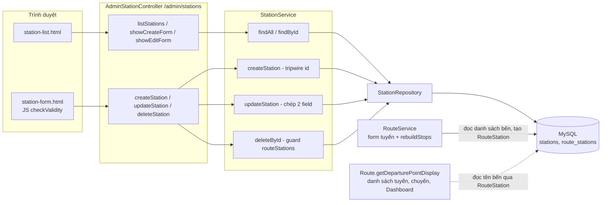
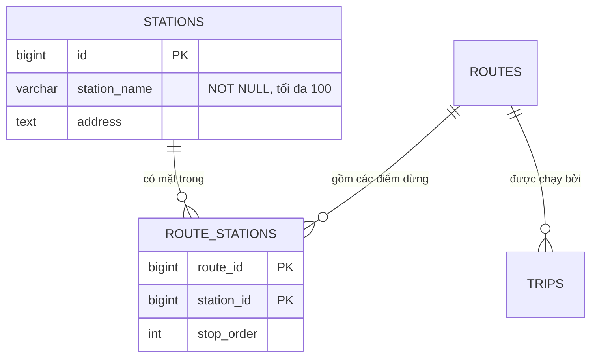
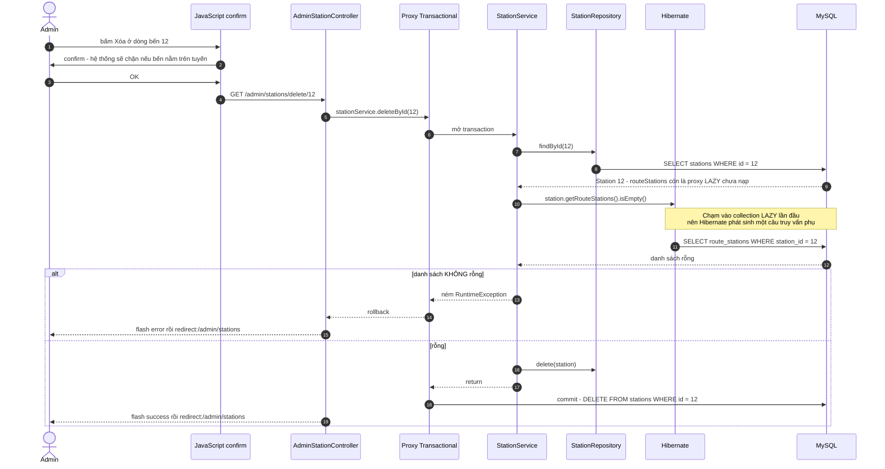
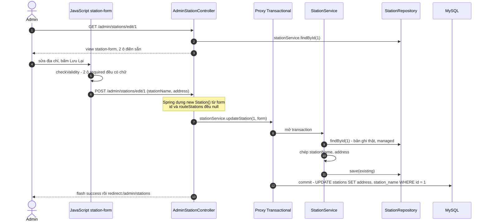

# Bài 02 — Station Management (Quản lý bến xe)

> Bài chức năng thứ hai, sinh từ `docs/ai/03_defense_study_prompt.md` (PHẦN B), ngày 2026-09-30.
> Học sau Bài 00a, 00b và 01. Số dòng là ảnh chụp ngày viết — lệch thì grep lại.
>
> Nhãn: [CODE] đọc thẳng từ code · [SPRING] hành vi chuẩn của Spring/Hibernate mà code không viết
> ra · [SUY LUẬN] suy luận của người viết ("chưa kiểm chứng" nếu chưa chạy thử).
>
> Viết tắt: `…/` = `src/main/java/giang/com/BusManagement/`, `test/` =
> `src/test/java/giang/com/BusManagement/`, `tpl/` = `src/main/resources/templates/`.
>
> Chức năng này có **cùng khung** với Bài 01 (Quản lý xe): cùng 6 endpoint, cùng kiểu form, cùng
> cách báo lỗi. Bài này **không giảng lại** phần giống nhau — chỉ dẫn "(xem Bài 01 §x)" — và tập
> trung vào ba chỗ khác: bến xe **không có luật số nào**, guard xóa đọc một **collection LAZY**, và
> bến là **nguyên liệu của tuyến**.

---

## §1. Chức năng này là gì — nói kiểu đời thường

**Vấn đề thật của nhà xe.** Một tuyến xe khách là một chuỗi điểm dừng: "Bến xe Mỹ Đình → Bến xe
Niệm Nghĩa". Nếu mỗi lần tạo tuyến người ta lại gõ tay tên bến, sẽ có "BX Mỹ Đình", "Bến Mỹ Đình",
"Mỹ Đình (HN)" — ba cách viết cho một chỗ, và không ai trả lời được câu "có bao nhiêu tuyến đi qua
Mỹ Đình?". Màn Quản lý bến xe là **danh bạ địa điểm dùng chung**: mỗi bến ghi một lần (tên + địa
chỉ), rồi mọi tuyến chọn từ danh bạ đó.

Dự án từng gặp đúng vấn đề này: `Route` trước đây có hai ô chữ tự do `departurePoint` /
`destinationPoint` song song với bảng `stations`, "gây bất nhất dữ liệu", nên đã bị xóa — nguồn sự
thật duy nhất giờ là bảng nối `RouteStation` [CODE] `…/domain/Route.java:31-35`.

Không có màn này thì: không tạo được tuyến (form tuyến chọn bến từ danh sách), và mọi màn hiện
"điểm đi → điểm đến" (danh sách tuyến, danh sách chuyến, Dashboard) không có gì để hiện.

**Một kịch bản cụ thể.** Nhà xe mở tuyến mới đi Vũng Tàu. Anh admin vào Dashboard, bấm "Quản lý
bến xe", thấy 11 bến. Anh bấm **Thêm Bến Xe Mới**, gõ "Bến xe Vũng Tàu", địa chỉ "192 Nam Kỳ Khởi
Nghĩa, Vũng Tàu", bấm **Lưu Lại** → quay về danh sách, khung xanh *"Thêm mới bến xe thành công!"*.
Giờ bến mới đã xuất hiện trong dropdown của form tạo tuyến.

Hôm sau anh thấy gõ sai địa chỉ → bấm **Sửa**, chữa lại, lưu. Anh thử **Xóa** "Bến xe Mỹ Đình" →
trình duyệt hỏi trước *"Hệ thống sẽ chặn xóa nếu bến xe này đang nằm trên lộ trình tuyến đường.
Bạn có muốn tiếp tục?"*; bấm OK → khung đỏ *"Lỗi: Không thể xóa bến xe này vì đang thuộc lộ trình
của một số tuyến đường hiện hành!"*.

---

## §2. Bản đồ tổng quan

### 2.1. Các mảnh ghép

| Loại | File | Trách nhiệm (1 dòng) |
|---|---|---|
| Template | `tpl/admin/station/station-list.html` | Bảng bến xe, flash, nút Sửa/Xóa (có `confirm()` báo trước luật chặn) |
| Template + JS | `tpl/admin/station/station-form.html` | Form Thêm/Sửa 2 ô; khối `<script>` `:47-58` chặn submit khi ô trống |
| Template (lối vào) | `tpl/admin/dashboard.html:76` | Nút "Quản lý bến xe" trên Dashboard |
| Controller | `…/controller/admin/AdminStationController.java` | 6 endpoint `/admin/stations/*`; chỉ inject `StationService` |
| Service | `…/service/StationService.java` | Tạo (tripwire id), sửa (chép 2 field), xóa (guard lộ trình) |
| Repository | `…/repository/StationRepository.java` | `JpaRepository` + một derived query **chưa ai gọi** |
| Entity | `…/domain/Station.java` | Bảng `stations`: `stationName`, `address`, + collection `routeStations` |
| Entity (liên quan) | `…/domain/RouteStation.java`, `RouteStationId.java` | Bảng nối tuyến ↔ bến, khoá kép `(routeId, stationId)`, có `stopOrder` |
| Người dùng bến | `…/service/RouteService.java:50-52, :160-173` | Đổ dropdown bến cho form tuyến; dựng `RouteStation` khi lưu tuyến |
| Test | `test/service/CreatePathIdTripwireTest.java:281, :321` | 2 test cho bến: tripwire tạo, và sửa chép field |
| Seed | `…/config/DataInitializer.java:166-172` | 7 bến mẫu (profile `demo`) |

### 2.2. Bảng endpoint — đủ mọi điểm bắt đầu

Không có `@Scheduled`, REST/`fetch()` hay `CommandLineRunner` riêng. Số dòng controller thuộc
`…/controller/admin/AdminStationController.java`.

| HTTP | URL | Controller method | Được gọi từ đâu | Service chính | Kết quả |
|---|---|---|---|---|---|
| GET | `/admin/stations` | `listStations()` `:18-22` | nút `dashboard.html:76`; mọi redirect của màn này | `findAll()` | view `admin/station/station-list` |
| GET | `/admin/stations/create` | `showCreateForm()` `:24-28` | nút "Thêm Bến Xe Mới" `station-list.html:20-21` | — | view `station-form` với `new Station()` |
| POST | `/admin/stations/create` | `createStation()` `:30-39` | nút "Lưu Lại" khi `station.id == null` (`station-form.html:22`) | `createStation()` | redirect `/admin/stations` + flash |
| GET | `/admin/stations/edit/{id}` | `showEditForm()` `:41-52` | nút "Sửa" `station-list.html:52-53` | `findById()` | view `station-form`, hoặc redirect + flash `error` |
| POST | `/admin/stations/edit/{id}` | `updateStation()` `:54-66` | nút "Lưu Lại" khi `station.id != null` | `updateStation(id, form)` | redirect `/admin/stations` + flash |
| GET | `/admin/stations/delete/{id}` | `deleteStation()` `:68-77` | nút "Xóa" + `confirm()` `station-list.html:54-57` | `deleteById()` | redirect `/admin/stations` + flash |

### 2.3. Sơ đồ toàn cảnh



Quan hệ dữ liệu — bến không trỏ tới ai; **tuyến trỏ tới bến** qua bảng nối:



### 2.4. Điều cốt lõi cần nhớ

1. **Bến là danh bạ dùng chung**; tên tuyến không được lưu ở đâu cả — nó được **suy ra** từ bến
   đầu và bến cuối của lộ trình (`Route.java:126-140`). Đổi tên một bến là đổi nhãn của mọi tuyến
   và mọi chuyến đi qua nó, kể cả chuyến trong quá khứ.
2. **Tạo và Sửa tách riêng** (khuôn Bài 01 §2.4): `createStation()` từ chối entity có id (lỗi #21),
   `updateStation(id, form)` nạp bản ghi cũ rồi chép đúng **hai** field.
3. **Guard xóa duy nhất:** bến đang nằm trong lộ trình của **bất kỳ** tuyến nào thì không xóa được.
   Guard đọc collection `routeStations` — một quan hệ LAZY — nên chạm DB thêm một câu.
4. **Không có luật kiểm dữ liệu nào ở server** cho tên/địa chỉ; chỉ có `required` ở HTML và JS.
5. Muốn xóa một bến đang dùng, phải **sửa hoặc xóa các tuyến** chứa nó trước — mà tuyến đã có
   chuyến thì không xóa được (Bài 03).

---

## §3. Trace chi tiết các luồng chính

**Chọn luồng nào và vì sao.** Luồng xem danh sách giống hệt Bài 00a §4.2 (chỉ khác là
`findAll()` thường, không cần `JOIN FETCH` vì template chỉ in hai cột chữ). Hai luồng được chọn:

- **Luồng A — Xóa bến**: chứa luật nghiệp vụ duy nhất của chức năng, và là chỗ có cơ chế ngầm đáng
  giảng (LAZY load trong transaction, `cascade = ALL`).
- **Luồng B — Sửa bến**: ngắn, nhưng là nơi lỗi #21 đã được sửa bằng cách tách upsert.

### 3.1. Luồng A — Xóa bến (ca thành công: bến mới tạo, chưa thuộc tuyến nào)

**(a) Sơ đồ**



**(b) Bảng từng bước**

| # | Tầng | Vị trí | Method / thành phần | Nhận vào | Làm gì | Trả về / gọi tiếp | Nhãn |
|---|---|---|---|---|---|---|---|
| 1 | Trình duyệt | `station-list.html:54-57` | thẻ `<a>` "Xóa" | — | `href` = `/admin/stations/delete/12`; `onclick="return confirm('Hệ thống sẽ chặn xóa nếu …')"` | — | [CODE] |
| 2 | JavaScript | `:56` | `confirm()` | — | OK ⇒ đi theo link; Cancel ⇒ `return false`, không có request nào | GET | [CODE] |
| 3 | Spring | — | DispatcherServlet | URL | khớp `@GetMapping("/delete/{id}")`, `id = 12` | `deleteStation(12, ra)` | [SPRING] |
| 4 | Controller | `AdminStationController.java:71` | `deleteStation()` | 12 | gọi service trong `try` | → proxy | [CODE] |
| 5 | Proxy | `StationService.java:60` | `@Transactional` | — | **mở transaction** | — | [SPRING] |
| 6 | Service → DB | `:62-63` | `stationRepository.findById(12)` | 12 | [SUY LUẬN — SQL tương đương] `SELECT id, station_name, address FROM stations WHERE id = 12`; không thấy ⇒ `RuntimeException("Không tìm thấy bến xe cần xóa với ID: 12")` | `Station` managed; `routeStations` **chưa nạp** | [CODE]+[SPRING] |
| 7 | Service | `:67` | `station.getRouteStations()` | — | `@OneToMany` mặc định **LAZY** (`Station.java:36`): lần đầu gọi `isEmpty()` trên collection, Hibernate mới đi lấy dữ liệu | — | [SPRING] |
| 8 | Hibernate → DB | — | nạp collection | — | [SUY LUẬN — SQL tương đương] `SELECT route_id, station_id, stop_order FROM route_stations WHERE station_id = 12` | `List<RouteStation>` rỗng | [SPRING] |
| 9 | Service | `:67-70` | guard | danh sách | `!= null && !isEmpty()` ⇒ ném lỗi. Ở đây rỗng ⇒ đi tiếp | — | [CODE] |
| 10 | Service | `:72` | `stationRepository.delete(station)` | entity | đánh dấu xóa; `cascade = ALL` (`Station.java:36`) sẽ xóa kèm mọi `RouteStation` trong collection — ở đây không có gì | — | [CODE]+[SPRING] |
| 11 | Proxy | — | commit | — | [SUY LUẬN — SQL tương đương] `DELETE FROM stations WHERE id = 12` — **đóng transaction** | — | [SPRING] |
| 12 | Controller | `:72`, `:76` | flash + redirect | — | `success` = "Xóa bến xe thành công!"; `redirect:/admin/stations` | 302 | [CODE] |
| 13 | Controller → View | `:18-22`, `station-list.html:25-28, :47` | `listStations()` | — | `findAll()` → bảng không còn bến 12, khung xanh | HTML | [CODE] |

**Ranh giới transaction:** một transaction, bao trọn `deleteById()` (bước 5 → 11). Bước 7–8 **bắt
buộc** nằm trong phiên Hibernate còn mở — ở đây có cả transaction lẫn OSIV nên luôn an toàn. Nếu
gọi `getRouteStations()` trên một `Station` đã tách khỏi phiên (ví dụ trong một job nền), sẽ gặp
`LazyInitializationException` (Bài 00b §4.5).

**(c) Code then chốt** — `…/service/StationService.java:60-73`:

```java
@Transactional                                              // cả method là một giao dịch
public void deleteById(Long id) {
    Station station = stationRepository.findById(id)        // nạp bến; routeStations CHƯA nạp
            .orElseThrow(() -> new RuntimeException("Không tìm thấy bến xe cần xóa với ID: " + id));

    // RÀNG BUỘC 3A: bến thuộc lộ trình của bất kỳ tuyến nào thì không cho xóa
    if (station.getRouteStations() != null                  // an toàn nếu collection null
            && !station.getRouteStations().isEmpty()) {     // ← dòng này làm Hibernate chạy SELECT phụ
        throw new RuntimeException(
                "Không thể xóa bến xe này vì đang thuộc lộ trình của một số tuyến đường hiện hành!");
    }

    stationRepository.delete(station);                      // DELETE thật (không soft delete)
}
```

Và phía entity — `…/domain/Station.java:35-37`:

```java
@ToString.Exclude                                           // không in collection khi log (Hidden Cost #9)
@OneToMany(mappedBy = "station", cascade = CascadeType.ALL) // "mappedBy": khoá ngoại nằm ở RouteStation.station
private List<RouteStation> routeStations;                   // mặc định LAZY
```

`mappedBy = "station"` nghĩa là "cột khoá ngoại không nằm ở bảng `stations`, mà ở field `station`
của `RouteStation`" — bến chỉ là **phía đọc ngược** của quan hệ (Bài 00b §1.3).

### 3.2. Luồng B — Sửa bến

**(a) Sơ đồ**



**(b) Bảng từng bước**

| # | Tầng | Vị trí | Method / thành phần | Nhận vào | Làm gì | Trả về / gọi tiếp | Nhãn |
|---|---|---|---|---|---|---|---|
| 1 | Controller | `AdminStationController.java:41-47` | `showEditForm()` | `id = 1` | `findById(id).orElseThrow(...)`; đặt `station` vào Model | `station-form` | [CODE] |
| 2 | View | `station-form.html:22-23` | `th:action`, `th:object` | `station.id = 1` | form trỏ về `/admin/stations/edit/1` | HTML | [CODE] |
| 3 | View | `:27-28`, `:33-34` | `th:field` | — | điền sẵn tên và địa chỉ; cả hai `required` | HTML | [CODE] |
| 4 | JavaScript | `:51-56` | listener `submit` | form | `checkValidity()` sai ⇒ `preventDefault()` + tô đỏ; đúng ⇒ cho gửi | POST | [CODE] |
| 5 | Spring | `AdminStationController.java:55` | `@ModelAttribute Station station` | body | `new Station()` + `setStationName`, `setAddress`; `id` và `routeStations` = `null` vì form không gửi | object rời | [SPRING] |
| 6 | Controller | `:60` | `updateStation()` | `id` từ URL | gọi `stationService.updateStation(id, station)` — **không** `station.setId(id)` (comment `:58-59`) | → proxy | [CODE] |
| 7 | Proxy | `StationService.java:51` | `@Transactional` | — | mở transaction | — | [SPRING] |
| 8 | Service → DB | `:53-54` | `findById(1)` | — | nạp bản ghi thật; không thấy ⇒ `RuntimeException` | `existing` managed | [CODE] |
| 9 | Service | `:55-56` | chép field | form | `setStationName`, `setAddress` — chép nguyên, kể cả null/rỗng | — | [CODE] |
| 10 | Service | `:57` | `save(existing)` | managed | merge trên entity đang managed: không làm gì thêm | — | [SPRING] |
| 11 | Proxy | — | commit | — | dirty checking ⇒ [SUY LUẬN — SQL tương đương] `UPDATE stations SET address=?, station_name=? WHERE id=1`. `routeStations` **không bị đụng** | — | [SPRING] |
| 12 | Controller | `:61`, `:65` | flash + redirect | — | `success` = "Cập nhật thông tin bến xe thành công!" | 302 | [CODE] |
| 13 | View (các màn khác) | `Route.java:126-140` | `getDeparturePointDisplay()` | — | từ giờ mọi màn hiện tuyến qua bến 1 đều đọc tên mới — không có bản sao tên nào để cập nhật | — | [CODE] |

**(c) Code then chốt** — `…/service/StationService.java:46-58`:

```java
/**
 * CẬP NHẬT một bến xe: nạp bản ghi theo id từ URL rồi chép hai field của form
 * ... Không merge nguyên object form, để routeStations (form không gửi) không bị đụng.
 */
@Transactional
public void updateStation(Long id, Station form) {
    Station existing = stationRepository.findById(id)        // bản ghi thật trong DB
            .orElseThrow(() -> new RuntimeException("Không tìm thấy bến xe với ID: " + id));
    existing.setStationName(form.getStationName());         // chỉ chép 2 field form có
    existing.setAddress(form.getAddress());
    stationRepository.save(existing);                        // dirty checking cũng đã đủ
}
```

Vì sao javadoc nói tới `routeStations`: nếu làm kiểu cũ (`form.setId(id)` rồi `save(form)`), JPA
**merge** object form vào bản ghi — mà object form có `routeStations = null`. Với `cascade = ALL`
(bao gồm MERGE), [SUY LUẬN — chưa kiểm chứng] việc merge một collection null lên entity thật là
đúng loại thao tác dễ gây hậu quả khó đoán cho quan hệ; tách "nạp rồi chép field" loại bỏ hẳn câu
hỏi đó. Điều **đã được đo** là phía tuyến: merge nguyên form từng xóa `suitable_bus_type_id` của
tuyến 1 thành NULL (lỗi #21).

---

## §4. Luồng lỗi — xóa bến đang thuộc lộ trình

Tình huống: Admin xóa bến 1 "Bến xe Mỹ Đình", đang là điểm đầu của vài tuyến.

| Bước | Chuyện gì xảy ra | Vị trí | Nhãn |
|---|---|---|---|
| 1 | Bước 1–8 như luồng A; câu truy vấn phụ trả về các dòng `route_stations` của bến 1 | — | [SPRING] |
| 2 | `!isEmpty()` đúng ⇒ **ném `RuntimeException`** "Không thể xóa bến xe này vì đang thuộc lộ trình của một số tuyến đường hiện hành!" | `StationService.java:67-70` | [CODE] |
| 3 | `delete()` ở `:72` **không bao giờ chạy** — nhờ vậy `cascade = ALL` không có cơ hội xóa kèm các dòng lộ trình | — | [CODE] |
| 4 | Unchecked exception ⇒ proxy **rollback**; không có gì để hoàn tác vì chưa ghi gì | — | [SPRING] |
| 5 | Controller bắt bằng `catch (Exception e)` chung | `AdminStationController.java:73-74` | [CODE] |
| 6 | Flash `error` = `"Lỗi: " + e.getMessage()` → `redirect:/admin/stations` | `:74`, `:76` | [CODE] |
| 7 | Danh sách bến với khung đỏ `station-list.html:29-32`; bến 1 vẫn còn | — | [CODE] |

Kịch bản này có trong test tay chính thức `docs/testing/test_case.md` TC_STA_004. Câu báo lỗi
**không** nói bến thuộc tuyến nào — Admin phải tự tìm ở màn Quản lý tuyến.

**Các lỗi khác cùng đường về:**

| Nguyên nhân | Ném ở | Loại | Ghi chú |
|---|---|---|---|
| POST tạo mang sẵn `id` | `StationService.java:38-42` | `IllegalArgumentException` | câu báo gồm id: "…Bến #1 đã tồn tại — muốn sửa thì dùng chức năng Sửa bến xe." |
| Bến không tồn tại (POST sửa / xóa) | `:54`, `:63` | `RuntimeException` | flash có tiền tố "Lỗi: " |
| Bến không tồn tại (GET form sửa) | `AdminStationController.java:45` | `RuntimeException` | flash **không** có "Lỗi: " (`:49`) — cùng bất nhất nhỏ như màn xe |
| Tên rỗng hẳn (`null`) hoặc dài quá 100 ký tự | từ DB khi ghi | lỗi Hibernate/JDBC | [SUY LUẬN — chưa kiểm chứng] form thật không gửi được `null` (ô `required`); nhưng ô tên **không có `maxlength`**, nên gõ quá 100 ký tự sẽ vượt `length = 100` (`Station.java:24`) và MySQL từ chối — Admin sẽ thấy một thông điệp kỹ thuật sau chữ "Lỗi: " |

---

## §5. Các luồng còn lại — trace rút gọn

- **Xem danh sách** — `[dashboard.html:76]` → `listStations()` `:18-22` →
  `StationService.findAll()` `:18-20` → `JpaRepository.findAll()` → view `station-list`. Template
  chỉ in `id`, `stationName`, `address` (`station-list.html:47-50`) nên **không** chạm
  `routeStations` ⇒ không có truy vấn phụ, không cần `JOIN FETCH`. Bảng rỗng có dòng nhắc `:60-64`.
- **Mở form Thêm** — `[nút Thêm Bến Xe Mới]` → `showCreateForm()` `:24-28` → `new Station()` →
  view `station-form`, `th:action` trỏ về `/create`. Không gọi service nào.
- **Lưu bến mới** — `[JS checkValidity]` → `createStation()` `:30-39` →
  `StationService.createStation()` `:36-44` → tripwire `id != null` → `stationRepository.save()`.
  Với `GenerationType.IDENTITY`, Hibernate phải chạy `INSERT` **ngay** lúc `save()` để lấy id do
  MySQL sinh (không đợi tới commit) [SPRING]. Không có `validate()` nào.

---

## §6. Hai lớp bảo vệ và tác động lên dữ liệu

### 6.1. Bảng "không-mời / chặn thật"

| Luật | Lớp không-mời (UI) | Lớp chặn thật (server) | POST tự chế vượt lớp đầu thì sao |
|---|---|---|---|
| Tên bến phải có | `required` `station-form.html:27` + JS `checkValidity()` `:53` | **Không có** trong service. Cột `NOT NULL` (`Station.java:24`) chỉ chặn `null`, không chặn chuỗi rỗng | [SUY LUẬN — chưa kiểm chứng] gửi `stationName=` (rỗng) thì Spring bind chuỗi `""` (dự án không cấu hình cắt chuỗi rỗng thành null) ⇒ lưu được bến không tên |
| Địa chỉ phải có | `required` `:33` | **Không có** — cột `address` cho phép null | Lọt: bến không địa chỉ |
| Tên tối đa 100 ký tự | **Không có** `maxlength` | Chỉ DB (`length = 100`) | Lỗi kỹ thuật từ DB (xem §4) |
| Không xóa bến đang thuộc tuyến | `confirm()` **báo trước** luật (`station-list.html:56`) nhưng nút Xóa luôn hiện, không lọc | `deleteById()` `StationService.java:67-70` | Bị chặn |
| "Tạo" không ghi đè bến có sẵn | form tạo không có ô `id` | tripwire `createStation()` `:38-42` | Bị chặn; bản ghi nạn nhân không đổi (test `:281`) |
| "Sửa" chỉ sửa đúng bến trên URL | — | `updateStation(id, form)` lấy id từ URL | `id` gửi kèm bị lờ đi |
| Không trùng tên bến | **Không có** | **Không có** — không `unique`, không kiểm | Tạo được hai "Bến xe Mỹ Đình" |

Nhận xét: đây là chức năng có **lớp chặn thật mỏng nhất** trong các màn danh mục. Bài 01 có
`validate()` 4 luật số; `RouteService` có `validateRoute()`; còn `StationService` không có hàm
validate nào. [SUY LUẬN] Lý do có thể là tên/địa chỉ không tham gia phép tính nào — cùng lập luận
javadoc `BusService.java:109-114` dùng cho bốn ô chữ của xe — nhưng không tìm thấy tài liệu nào
phát biểu quyết định này cho bến xe.

### 6.2. Bảng "thay đổi gì trong DB"

| Thao tác | Bảng / cột | Từ → sang |
|---|---|---|
| Xem danh sách, mở form | — | Không ghi DB |
| Thêm bến | `stations` | thêm 1 dòng (`station_name`, `address`) |
| Sửa bến | `stations` — dòng `id` trên URL | `station_name`, `address` đổi theo form. `route_stations` không đổi, nhưng **nhãn hiển thị** của mọi tuyến/chuyến đi qua bến đổi theo |
| Xóa bến | `stations` | `DELETE` 1 dòng. `route_stations` không đổi (guard bảo đảm không còn dòng nào trỏ tới) |
| *(Bài 03)* lưu tuyến | `route_stations` | xóa hết rồi dựng lại các dòng `(route_id, station_id, stop_order)` — đây là nơi bến được **gắn** vào tuyến |

---

## §7. Annotation và cơ chế dùng trong chức năng này

Các annotation giống hệt Bài 01 §7 (`@Controller`, `@RequestMapping`, `@RequiredArgsConstructor`,
`@PathVariable`, `@ModelAttribute`, `RedirectAttributes`, `@Transactional`, dirty checking,
`th:field`, `needs-validation`…) không nhắc lại. Chỉ ghi phần **mới** ở chức năng này:

| Annotation / cơ chế | Nghĩa đời thường | Tác dụng ở đây | Bỏ đi thì sao |
|---|---|---|---|
| `@OneToMany(mappedBy = "station")` | "Danh sách các lần bến này xuất hiện trong lộ trình; khoá ngoại nằm ở phía bên kia" (00b §1.3) | `Station.java:36` — cho phép guard hỏi `getRouteStations()` | Guard phải gọi một query riêng qua `RouteStationRepository` |
| LAZY (mặc định của `@OneToMany`) | "Chưa cần thì chưa lấy" | collection chỉ nạp khi guard chạm vào (bước 7–8) | EAGER: mỗi lần đọc danh sách bến sẽ kéo cả lộ trình |
| `cascade = CascadeType.ALL` | "Làm gì với bến thì làm y hệt với các dòng lộ trình của nó" | `Station.java:36` — kể cả REMOVE | Không ảnh hưởng hôm nay vì guard chặn trước; nhưng **nếu bỏ guard**, xóa bến sẽ âm thầm xóa luôn các điểm dừng khỏi mọi tuyến |
| `@EmbeddedId` + `@MapsId` | Khoá chính gồm hai cột, mỗi cột cũng là khoá ngoại (00b §1.3) | `RouteStation.java:16-18, :24, :30` | — ; hệ quả nghiệp vụ: một bến chỉ xuất hiện **một lần** mỗi tuyến (spec: không biểu diễn được A→B→A) |
| `@Column(nullable = false, length = 100)` | "Cột bắt buộc, tối đa 100 ký tự" — ràng buộc ở mức DB | `Station.java:24` | Hibernate sinh cột cho phép null / dài hơn |
| `@Column(columnDefinition = "TEXT")` | "Kiểu cột ghi đúng như chuỗi này" | `Station.java:27` — địa chỉ dài tùy ý | Mặc định `VARCHAR(255)` |
| `GenerationType.IDENTITY` | "Để MySQL tự đánh số id" (00b §1.2) | `Station.java:20` — buộc `INSERT` chạy ngay khi `save()` | — |
| Derived query `findByStationNameContainingIgnoreCase` | tên method ⇒ `WHERE LOWER(station_name) LIKE LOWER('%x%')` (00b §2.2) | `StationRepository.java:13` — **0 nơi gọi** | Không ảnh hưởng gì |

---

## §8. Ví dụ tính tay

Không áp dụng — chức năng này không có công thức hay phép tính nào.

---

## §9. Vì sao thiết kế như vậy + cạm bẫy + kiểm thử

### 9.1. Các quyết định thiết kế

| Quyết định | Tránh được gì | Vì sao không làm cách đơn giản hơn | Nguồn |
|---|---|---|---|
| Bến là entity riêng, tuyến nối tới bến qua `RouteStation` có `stopOrder` | Mỗi tuyến gõ tên bến một kiểu, không thống kê được | Cách "hai ô chữ điểm đi/đến trên tuyến" đã từng có và bị xóa vì bất nhất; bảng nối còn cho tuyến **nhiều điểm dừng** | `Route.java:31-35`; roadmap Phase 1 (owner duyệt "full dynamic multi-stop editor") |
| Tên tuyến không lưu, suy ra từ bến đầu/cuối | Hai nguồn sự thật lệch nhau | Lưu tên riêng thì đổi tên bến phải nhớ đổi cả tên tuyến | `current_functional_spec.md` (Route: "no name field") |
| Tách `createStation()` / `updateStation(id, form)` | POST tự chế tới `/create` mang `id=1` từng đổi tên bến 1 thành `HIJACKED-STATION` (đo thật, lỗi #21) | Chặn bằng `@InitBinder` chỉ là lớp không-mời; lời gọi nội bộ vẫn lọt — dự án đã ba lần chọn "chặn ở service" | #21 |
| Guard xóa theo "có trong lộ trình nào không" | Xóa bến làm tuyến mất điểm dừng, nhãn tuyến thành "(Chưa gán trạm)" | — | `StationService.java:65-70` |
| Không có soft delete cho bến | — | [SUY LUẬN] không cần: bến đang dùng thì guard đã chặn, bến chưa dùng thì xóa hẳn không mất lịch sử gì | — |

### 9.2. Bug thật đã từng xảy ra ở chức năng này

**Lỗi #21 (phần bến) — form "Thêm bến" ghi đè được bến có sẵn.**
- *Hiểu sai điều gì:* cho rằng "form tạo không có ô `id` nên request tạo không bao giờ mang `id`".
  Đúng với form thật, sai với request: controller bind thẳng vào entity bằng `@ModelAttribute` và
  **không có `@InitBinder`**, nên ai gửi `id=1` là Spring gán `station.id = 1`. Hàm `save()` cũ khi
  đó là một **upsert** (tạo hoặc sửa tùy có id) — `JpaRepository.save()` thấy id khác null thì
  **merge**, tức `UPDATE` bến 1 (Bài 00b §3).
- *Đo trên bản sao DB thật (2026-09-19):* `POST /stations/create` với id của bến 1 ⇒ tên bến 1
  thành `HIJACKED-STATION`, số bến vẫn 11 → 11 (không có dòng mới), báo **thành công**.
- *Sửa:* tách thành `createStation()` có tripwire và `updateStation(id, form)` nạp-rồi-chép. Cùng
  lần sửa áp cho sáu cửa tạo khác (tuyến, chuyến, sự cố, tài xế, user).
- *Chưa từng gây hại trên dữ liệu thật* — form thật không gửi `id` (bán kính UI = 0), nhưng một
  request tự chế là đủ.

Ngoài #21, sổ lỗi **không có lỗi nào riêng cho bến xe**. Mục "xóa bằng GET" (áp cho cả
`AdminStationController`) đã bị **rút** — xem Bài 01 §9.2.

### 9.3. Cạm bẫy và điểm lạ (ghi lại, không sửa)

1. **Đổi tên bến là sửa lịch sử.** Chuyến không chép tên bến; mọi nhãn tuyến được suy ra lúc hiển
   thị (`Route.java:126-140`). Đổi "Bến xe Mỹ Đình" thành "Bến xe Mỹ Đình (Mới)" thì các chuyến đã
   hoàn thành từ tháng trước cũng hiện tên mới. [SUY LUẬN] Với MVP đây là chấp nhận được (không có
   hoá đơn/vé in ra cần giữ nguyên văn), nhưng nên nói được khi bị hỏi.
2. **Không kiểm gì ở server cho tên/địa chỉ; không chống trùng tên.** Xem bảng §6.1. Không tìm thấy
   ghi chép nào trong sổ lỗi về điểm này.
3. **Muốn xóa bến đang dùng phải đi đường vòng.** Phải sửa từng tuyến chứa bến để bỏ nó ra (hoặc xóa
   tuyến). Tuyến đã có chuyến thì không xóa được (Bài 03), nên thực tế chỉ còn cách sửa tuyến — và
   sửa lộ trình của tuyến có chuyến lịch sử lại làm đổi nhãn của các chuyến đó (điểm 1). Câu báo lỗi
   cũng không nói bến thuộc tuyến nào.
4. **Mâu thuẫn tài liệu ↔ code (code thắng):**
   - `docs/testing/test_case.md` TC_STA_002 ghi *"`stationService.save(station)` gọi
     `stationRepository.save(station)`"* và TC_STA_003 ghi *"`station.setId(1L)` được gọi trước khi
     save (merge UPDATE)"* — **đã cũ** từ bản sửa #21: code hiện gọi `createStation()` và
     `updateStation(id, form)`, không còn `save()` hay `setId()`
     (`AdminStationController.java:33, :58-60`).
   - Tiêu đề lỗi #11 trong `current_bugs_found.md` gọi `CostParameterService.save()` là *"service
     DUY NHẤT không validate đầu vào"*; `StationService` cũng không có hàm validate nào. [SUY LUẬN]
     tiêu đề đó có lẽ chỉ xét các service nhận **số**; ghi lại để khỏi trích nguyên văn khi bảo vệ.
   - Comment `StationRepository.java:12` nói query tìm theo tên "phục vụ tính năng gợi ý khi khách
     đặt vé" — tính năng đặt vé (Phase 9) **chưa triển khai**; query có 0 nơi gọi.
   - Test tay TC_STA_001 kỳ vọng 7 bến (đúng với seed `demo`, `DataInitializer.java:166-172`); DB
     thật hiện có 11 bến (roadmap §8 ghi `stations 11`). Không mâu thuẫn — chỉ là hai bộ dữ liệu.
5. **Bến trùng trong một tuyến không biểu diễn được** — khoá chính `(routeId, stationId)`
   (`RouteStation.java:16-18`, `RouteStationId.java:13-16`), nên tuyến vòng A→B→A không tạo được.
   Spec đã ghi đây là giới hạn (`current_functional_spec.md:55`).

### 9.4. Test đang giữ chức năng này

| Test | Chốt luật gì |
|---|---|
| `CreatePathIdTripwireTest.createStation_refusesAnEntityThatAlreadyHasAnId_andLeavesTheRowUntouched` (`test/service/CreatePathIdTripwireTest.java:281`) | Tạo mang id ⇒ ném `IllegalArgumentException`, tên bến A **vẫn là "Bến A"**, số bến không đổi. Roadmap ghi đã thử không rỗng: tắt tripwire bến ⇒ đúng 1 test đỏ |
| `CreatePathIdTripwireTest.updateStation_copiesFieldsOntoTheExistingRow` (`:321`) | Sửa chép đúng tên + địa chỉ lên bản ghi cũ, **không đẻ dòng mới** |

Test chạy bằng `@SpringBootTest` + `@Transactional` trên DB `busmanagement_test`, gọi
`flushAndClear()` trước khi đọc lại để chắc chắn đọc từ DB chứ không từ bộ nhớ đệm của Hibernate.

**Chưa có test tự động** cho guard xóa `deleteById()` và cho màn danh sách. Các ca này có trong
test tay `docs/testing/test_case.md` TC_STA_001 → TC_STA_005 (lưu ý hai ca đã cũ ở §9.3).

### 9.5. Liên kết

- **Màn này ảnh hưởng tới:** form tuyến (Bài 03 — `AdminRouteController.java:109` đổ
  `routeService.findAllStations()`; `RouteService.rebuildStops()` `:160-173` tra từng bến theo id);
  mọi màn hiện nhãn tuyến qua `getDeparturePointDisplay()`/`getDestinationPointDisplay()`: danh sách
  tuyến, danh sách chuyến, form chuyến, Bảng điều hành, Dashboard, Dự báo…
- **Màn này bị ảnh hưởng bởi:** tuyến (quyết định bến nào xóa được); `DataInitializer` (bến mẫu).
  Bến **không** liên quan trực tiếp tới xe, tài xế hay chuyến.

---

## §10. Chuẩn bị bảo vệ

### 10.1. Tóm tắt 1 phút

> Màn Quản lý bến xe là danh bạ địa điểm dùng chung cho cả hệ thống. Mỗi bến có tên và địa chỉ;
> tuyến không lưu tên mà ghép các bến theo thứ tự qua bảng nối `RouteStation`, nên điểm đi và điểm
> đến của mọi tuyến đều suy ra từ đây. Chức năng đi đúng kiến trúc phân lớp:
> `AdminStationController` chỉ gọi `StationService`. Em tách tạo và sửa: tạo thì từ chối nếu request
> mang sẵn id, vì trước đây một POST tự chế đã ghi đè được bến có sẵn; sửa thì nạp bản ghi cũ rồi chỉ
> chép tên và địa chỉ. Luật nghiệp vụ duy nhất là không cho xóa bến đang nằm trong lộ trình của bất
> kỳ tuyến nào — service kiểm bằng cách đọc danh sách điểm dừng của bến trước khi xóa.

### 10.2. Câu hỏi hội đồng + gợi ý trả lời

**1. (Cái gì) Bến xe dùng để làm gì trong hệ thống?**
Là danh bạ điểm dừng dùng chung. Tuyến được dựng từ một danh sách bến có thứ tự (`RouteStation`
với `stopOrder`); bến đầu là điểm đi, bến cuối là điểm đến (`Route.java:100-140`). Trước đây tuyến
có hai ô chữ tự do song song với bảng bến và bị bất nhất, nên đã bỏ (`Route.java:31-35`).

**2. (Thế nào) Quan hệ giữa bến và tuyến được lưu thế nào?**
Bằng bảng `route_stations` với khoá kép `(route_id, station_id)` và cột `stop_order`. Trong code là
`@EmbeddedId RouteStationId` cộng hai `@ManyToOne` có `@MapsId` (`RouteStation.java:16-32`). Phía
bến có `@OneToMany(mappedBy = "station")` để đọc ngược "bến này nằm trên những tuyến nào"
(`Station.java:36-37`).

**3. (Thế nào) Khi xóa bến, hệ thống kiểm tra gì?**
Service nạp bến, gọi `getRouteStations().isEmpty()` (`StationService.java:67`). Collection này là
LAZY nên Hibernate chạy thêm một câu `SELECT` vào `route_stations`. Có dòng nào thì ném lỗi, không
thì `DELETE`. Mọi thứ trong một transaction nên nếu bị chặn thì không có gì được ghi.

**4. (Vì sao) Sao không để DB tự chặn bằng khoá ngoại?**
URL kết nối DB đặt `foreign_key_checks=0` (`application.properties:19`), nên MySQL không ngăn bản
ghi mồ côi; mọi guard toàn vẹn dữ liệu của dự án nằm ở service (Bài 00b §5.3). Thêm nữa, entity khai
`cascade = ALL` phía bến: nếu không có guard, xóa bến sẽ **xóa luôn** các điểm dừng khỏi tuyến chứ
không báo lỗi.

**5. (Vì sao) Sao sửa bến lại phải nạp bản ghi cũ rồi chép, không lưu thẳng object form?**
Vì lưu thẳng object có id là merge — ghi đè mọi thứ bằng nội dung form, kể cả phần form không gửi.
Và vì form tạo cũng từng dùng chung một hàm `save()`, một POST tự chế mang `id` đã đổi được tên bến
có sẵn (lỗi #21). Giờ `createStation()` từ chối id, `updateStation(id, form)` chỉ chép hai field.

**6. (Nếu… thì sao) Nếu em đổi tên một bến thì các chuyến cũ hiện thế nào?**
Hiện tên mới — chuyến không lưu bản sao tên bến, nhãn tuyến được tính lúc hiển thị. Đó là hệ quả
của việc chỉ có một nguồn sự thật. Nếu cần giữ tên lịch sử (ví dụ in vé), phải chụp tên vào chuyến
lúc bán — hiện hệ thống không có vé thật nên chưa cần.

**7. (Hạn chế) Có chống trùng tên bến hay kiểm dữ liệu không?**
Trung thực: không. Chỉ có `required` ở form và JavaScript; service không validate, cột tên không
`unique`. Tên/địa chỉ không tham gia phép tính nào nên rủi ro là hiển thị, không làm sai số liệu.
Nếu làm tiếp em sẽ thêm kiểm tra rỗng và trùng tên (không phân biệt hoa thường) ở service.

**8. (Hạn chế) Một tuyến đi qua cùng một bến hai lần được không?**
Không, vì khoá chính của `route_stations` là `(route_id, station_id)`. Tuyến vòng A→B→A không biểu
diễn được; spec đã ghi đây là giới hạn (`current_functional_spec.md:55`). Muốn hỗ trợ phải đổi khoá
chính thành `(route_id, stop_order)`.

**9. (Vì sao) Sao xóa bến dùng GET?**
Như màn xe (Bài 01 câu 7): quy ước chung của các màn danh mục, có trong test tay chính thức; CSRF
tắt có chủ đích nên POST không an toàn hơn; guard ở service chặn thiệt hại. Ở màn này `confirm()`
còn **báo trước luật** ("hệ thống sẽ chặn nếu…").

**10. (Thế nào) Em kiểm thử màn này ra sao?**
Có 2 test tự động trong `CreatePathIdTripwireTest`: tạo mang id bị từ chối và bến nạn nhân giữ
nguyên tên; sửa chép đúng hai field mà không tạo dòng mới. Guard xóa và danh sách được kiểm bằng
test tay TC_STA_001–005 và chạy app thật; bản sửa #21 được kiểm bằng cách phát lại nguyên văn request
phá hoại trên bản sao DB.

### 10.3. Điểm phải nói thật

- **Không có đăng nhập / phân quyền, CSRF tắt** (roadmap §4): ai vào được URL là sửa/xóa bến được.
- **Không có kiểm tra dữ liệu ở server** cho bến; không chống trùng tên.
- **Query tìm bến theo tên cho khách đặt vé chưa ai dùng** — Customer Portal (Phase 9) chưa làm;
  comment trong code nói về tính năng chưa tồn tại.
- **Đổi tên bến làm đổi nhãn của cả chuyến lịch sử.**
- Bến **không** có tọa độ, giờ mở cửa hay thông tin nào khác ngoài tên + địa chỉ.

---

## §11. Bài tập tự kiểm tra

**Câu hỏi ngắn**

1. Trang danh sách bến có phát sinh truy vấn vào `route_stations` không? Vì sao?
2. Trong `deleteById()`, dòng nào làm Hibernate chạy câu `SELECT` thứ hai?
3. `mappedBy = "station"` trong `Station.java` nghĩa là gì — cột khoá ngoại nằm ở bảng nào?
4. Admin gửi POST `/admin/stations/edit/3` với body có thêm `id=7`. Bến nào bị sửa?
5. Bến 5 chỉ nằm trên một tuyến đã có 400 chuyến lịch sử. Admin làm cách nào để xóa được bến 5, và
   cái giá là gì?
6. Nếu xóa guard ở `StationService.java:67-70`, xóa bến 1 sẽ gây ra điều gì với dữ liệu?

**Bài tự trace.** Admin mở "Thêm Bến Xe Mới", để **trống** ô Địa chỉ, gõ tên "Bến xe Vũng Tàu",
bấm Lưu Lại. Hãy viết chuỗi `[JS] → Controller → Service → Repository → view` và kết quả trên màn
hình. Sau đó làm lại với một POST tự chế (bỏ qua trình duyệt) có `stationName=Bến xe Vũng Tàu` và
**không có** `address`.

**Câu đọc code.** `StationService.java:38-43`:

```java
if (station.getId() != null) {
    throw new IllegalArgumentException(
            "createStation() chỉ dùng để tạo bến xe mới (id phải trống). Bến #" + station.getId()
                    + " đã tồn tại — muốn sửa thì dùng chức năng Sửa bến xe.");
}
stationRepository.save(station);
```

Đoạn này làm gì? Bỏ khối `if` thì một POST `/admin/stations/create` với `id=1&stationName=X` gây ra
điều gì, và người dùng thấy thông báo gì?

<details><summary>Đáp án</summary>

**Câu hỏi ngắn**

1. Không. Template chỉ in `id`, `stationName`, `address` (`station-list.html:47-50`); collection
   `routeStations` là LAZY và không ai chạm tới, nên Hibernate không nạp nó.
2. `station.getRouteStations().isEmpty()` ở `StationService.java:67` — lần đầu truy cập collection
   LAZY trong phiên còn mở.
3. Nghĩa là quan hệ được "sở hữu" bởi field `station` của `RouteStation`; khoá ngoại `station_id`
   nằm ở bảng `route_stations`, bảng `stations` không có cột nào cho quan hệ này.
4. Bến 3. `updateStation(id, form)` dùng id từ URL; `id` trong form bị bỏ qua
   (`AdminStationController.java:58-60`, `StationService.java:53`).
5. Không xóa được tuyến (đã có chuyến). Phải **sửa tuyến** thay bến 5 bằng bến khác, rồi mới xóa bến
   5. Cái giá: 400 chuyến lịch sử của tuyến đó sẽ hiện theo lộ trình mới (nhãn điểm đi/đến có thể
   đổi), vì nhãn được suy ra lúc hiển thị.
6. `cascade = ALL` sẽ xóa luôn các dòng `route_stations` của bến 1 — các tuyến chứa bến 1 mất điểm
   dừng đó, không có thông báo lỗi. [SUY LUẬN — chưa kiểm chứng] nếu tuyến chỉ còn một bến hoặc
   không còn bến nào, nhãn tuyến sẽ thành sai hoặc "(Chưa gán trạm)" (`Route.java:131`).

**Bài tự trace**

- *Qua trình duyệt:* `[JS]` `station-form.html:51-56` — ô Địa chỉ `required` đang trống ⇒
  `checkValidity()` sai ⇒ `preventDefault()`, form tô đỏ, **không có request nào** tới server.
  Màn hình vẫn là form, ô Địa chỉ viền đỏ.
- *POST tự chế:* `AdminStationController.createStation()` `:30-33` → bind `new Station()`: tên
  "Bến xe Vũng Tàu", `address = null`, `id = null` → proxy mở transaction →
  `StationService.createStation()` qua tripwire → `stationRepository.save()` → `INSERT` ngay
  (IDENTITY) → cột `address` cho phép null nên **thành công** → commit → flash "Thêm mới bến xe thành
  công!" → `redirect:/admin/stations` → danh sách có bến mới với ô địa chỉ trống. Đây là ví dụ luật
  chỉ có một lớp (§6.1).

**Câu đọc code**

Đoạn này là tripwire: chỉ cho `createStation()` tạo bến **mới**. Bỏ `if` thì `save()` gặp entity có
id = 1 ⇒ Spring Data coi là "không mới" ⇒ `merge` ⇒ `UPDATE stations SET station_name='X',
address=NULL WHERE id=1` — bến 1 bị đổi tên và **mất địa chỉ** (form tự chế không gửi address), số
bến không đổi, và người dùng thấy **"Thêm mới bến xe thành công!"**. Đúng lỗi #21; test
`createStation_refusesAnEntityThatAlreadyHasAnId_andLeavesTheRowUntouched` sẽ đỏ.

</details>

---

## Tóm tắt 5 điều quan trọng nhất

1. Bến là **danh bạ dùng chung**; nhãn mọi tuyến/chuyến được suy ra từ bến đầu và bến cuối qua
   `RouteStation` — đổi tên bến là đổi nhãn cả lịch sử.
2. **Tạo ≠ Sửa**: `createStation()` có tripwire id (lỗi #21), `updateStation(id, form)` nạp bản ghi
   cũ và chép đúng hai field.
3. Luật duy nhất: **không xóa bến đang thuộc lộ trình** — guard đọc collection LAZY `routeStations`
   trong transaction, và đứng chắn trước `cascade = ALL`.
4. Đây là màn có **lớp chặn thật mỏng nhất**: không validate tên/địa chỉ, không chống trùng tên.
5. Bến chỉ xuất hiện **một lần** mỗi tuyến vì khoá kép `(routeId, stationId)` — chuẩn bị sẵn câu trả
   lời về giới hạn này và về tuyến vòng.
