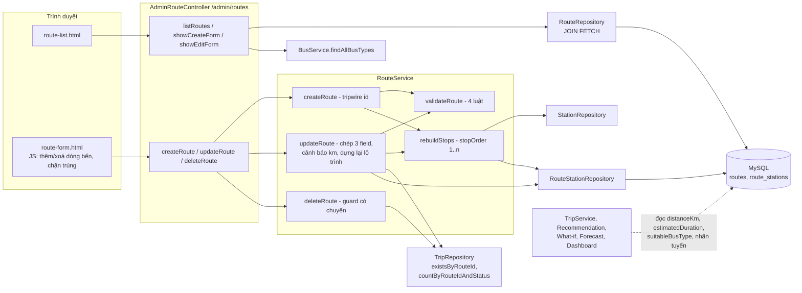
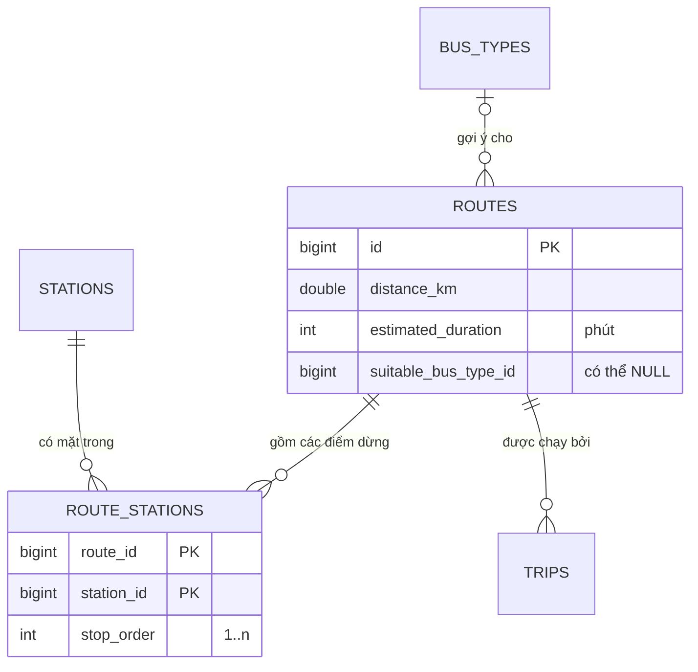
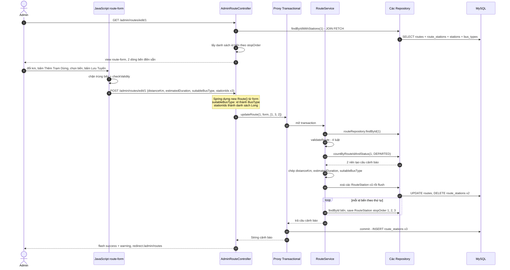
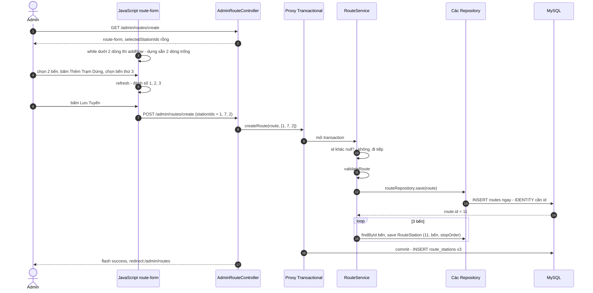

# Bài 03 — Route Management (Quản lý tuyến đường)

> Bài chức năng thứ ba, sinh từ `docs/ai/03_defense_study_prompt.md` (PHẦN B), ngày 2026-10-01.
> Học sau Bài 00a, 00b, 01 và 02. Số dòng là ảnh chụp ngày viết — lệch thì grep lại.
>
> Nhãn: [CODE] đọc thẳng từ code · [SPRING] hành vi chuẩn của Spring/Hibernate mà code không viết
> ra · [SUY LUẬN] suy luận của người viết ("chưa kiểm chứng" nếu chưa chạy thử).
>
> Viết tắt: `…/` = `src/main/java/giang/com/BusManagement/`, `test/` =
> `src/test/java/giang/com/BusManagement/`, `tpl/` = `src/main/resources/templates/`.
>
> Khung giống Bài 01 và 02: 6 endpoint, form, flash. Bài này **không giảng lại** phần giống nhau mà
> tập trung vào bốn chỗ mới: form gửi lên một **danh sách có thứ tự** (`List<Long> stationIds`) do
> JavaScript dựng, lộ trình được **xoá hết rồi dựng lại** mỗi lần sửa (khoá kép + `flush()`), một
> lần lưu có thể trả về **cảnh báo** chứ không chỉ thành công/thất bại, và ba con số của tuyến được
> **cả hệ thống đọc lại** (odometer, bảo trì, chi phí, số tài xế).

---

## §1. Chức năng này là gì — nói kiểu đời thường

**Vấn đề thật của nhà xe.** Tuyến là "khuôn" mà mọi chuyến xe chạy theo: đi từ đâu, qua những bến
nào, dài bao nhiêu km, mất bao lâu, nên chạy loại xe gì. Chuyến xe không tự ghi các thông tin này
mà trỏ về tuyến. Thiếu màn Quản lý tuyến thì:

- không mở được tuyến mới. Trước Phase 1, tuyến **chỉ có** nhờ dữ liệu seed (roadmap §5 Phase 1:
  *"Route currently has zero CRUD UI — only seeded via `DataInitializer`"*);
- không sửa được quãng đường gõ sai — mà quãng đường này là số km **cộng vào đồng hồ công-tơ-mét
  (odometer)** của xe mỗi khi một chuyến hoàn thành, nên gõ sai là kế hoạch bảo trì sai theo;
- không thêm được điểm dừng giữa đường (tuyến Hà Nội → Hải Phòng có ghé Hải Dương).

**Một kịch bản cụ thể.** Nhà xe mở tuyến Hà Nội → Hải Phòng có ghé Hải Dương. Anh admin vào
Dashboard, bấm **Quản Lý Tuyến Đường**, rồi bấm **Thêm Tuyến Mới**. Form có sẵn **hai dòng chọn
bến** (điểm đi, điểm đến). Anh gõ 120 km, 150 phút, chọn loại xe "Limousine", chọn dòng 1 =
"Bến xe Mỹ Đình", dòng 2 = "Bến xe Hải Dương", bấm **Thêm Trạm Dừng** để có dòng 3 = "Bến xe Niệm
Nghĩa", rồi bấm **Lưu Tuyến**. Hệ thống quay về danh sách, khung xanh *"Thêm mới tuyến đường thành
công!"*, dòng mới hiện "Bến xe Mỹ Đình → Bến xe Niệm Nghĩa", lộ trình `1. Mỹ Đình 2. Hải Dương
3. Niệm Nghĩa`.

Chiều hôm đó anh phát hiện quãng đường thật là 105 km, bấm **Sửa**, đổi 120 → 105, lưu. Tuyến này
đang có một chuyến **đang chạy** (`DEPARTED`), nên ngoài khung xanh còn có khung vàng: *"Tuyến này
đang có 1 chuyến trên đường (DEPARTED). Quãng đường mới (105 km, trước đây 120 km) sẽ được cộng vào
odometer của xe khi các chuyến đó hoàn thành…"*. Lưu vẫn diễn ra — hệ thống chỉ báo cho anh biết.

Cuối cùng anh thử **Xóa** một tuyến cũ. Trình duyệt hỏi *"Bạn có chắc chắn muốn xóa tuyến này?"*,
anh bấm OK, và nhận khung đỏ *"Lỗi: Không thể xóa tuyến này vì đã có chuyến xe sử dụng (dữ liệu lịch
sử vận hành và doanh thu phải được giữ nguyên)!"*.

---

## §2. Bản đồ tổng quan

### 2.1. Các mảnh ghép

| Loại | File | Trách nhiệm (1 dòng) |
|---|---|---|
| Template (lối vào) | `tpl/admin/dashboard.html:117` | Nút "Quản Lý Tuyến Đường" trên Dashboard |
| Template | `tpl/admin/route/route-list.html` | Bảng tuyến: nhãn điểm đi → điểm đến, lộ trình đầy đủ, km, phút, loại xe; flash `success`/`error`/`warning` |
| Template + JS | `tpl/admin/route/route-form.html` | Form Thêm/Sửa; khối `<script>` `:111-169` là trình sửa nhiều điểm dừng (thêm/xoá dòng, đánh số, chặn trùng bến) |
| Controller | `…/controller/admin/AdminRouteController.java` | 6 endpoint `/admin/routes/*`; inject `RouteService` và `BusService` (chỉ để lấy danh sách loại xe) |
| Service | `…/service/RouteService.java` | Tạo (tripwire id), sửa (chép field + cảnh báo km + dựng lại lộ trình), xoá (guard có chuyến), `validateRoute()` 4 luật |
| Repository | `…/repository/RouteRepository.java` | Hai JPQL `JOIN FETCH` nạp tuyến kèm bến và loại xe |
| Repository | `…/repository/RouteStationRepository.java` | Đọc lộ trình của một tuyến theo `stopOrder` |
| Repository (mượn) | `…/repository/TripRepository.java:240`, `:249` | `existsByRouteId` (guard xoá), `countByRouteIdAndStatus` (cảnh báo km) |
| Entity | `…/domain/Route.java` | Bảng `routes`: `distanceKm`, `estimatedDuration`, `suitableBusType`, collection `routeStations` + các hàm suy ra điểm đi/đến |
| Entity | `…/domain/RouteStation.java`, `RouteStationId.java` | Bảng nối `route_stations`, khoá kép `(route_id, station_id)`, cột `stop_order` |
| Test | `test/service/RouteServiceDistanceWarningTest.java` | 4 test cho cảnh báo km |
| Test | `test/service/CreatePathIdTripwireTest.java:260`, `:300` | Tripwire tạo tuyến; sửa tuyến chép field và dựng lại lộ trình |
| Seed | `…/config/DataInitializer.java:175-190`, `:237-248` | 6 tuyến mẫu, mỗi tuyến 2 bến (profile `demo`) |

### 2.2. Bảng endpoint — đủ mọi điểm bắt đầu

Không có `@Scheduled`, `fetch()`/REST hay `CommandLineRunner` riêng cho màn này. JavaScript của form
**không gọi server** — nó chỉ sửa giao diện rồi để form gửi bình thường. Số dòng controller thuộc
`…/controller/admin/AdminRouteController.java`.

| HTTP | URL | Controller method | Được gọi từ đâu | Service chính | Kết quả |
|---|---|---|---|---|---|
| GET | `/admin/routes` | `listRoutes()` `:22-26` | nút `dashboard.html:117`; nút "Hủy Bỏ" `route-form.html:87`; mọi redirect thành công | `findAllWithStations()` | view `admin/route/route-list` |
| GET | `/admin/routes/create` | `showCreateForm()` `:28-34` | nút "Thêm Tuyến Mới" `route-list.html:20`; redirect khi tạo lỗi | — (chỉ `addFormOptions`) | view `route-form`, `new Route()`, `selectedStationIds` rỗng |
| POST | `/admin/routes/create` | `createRoute()` `:41-53` | nút "Lưu Tuyến" khi `route.id == null` (`route-form.html:29`, `:88`) | `createRoute(route, stationIds)` | thành công: redirect `/admin/routes` + `success`; lỗi: redirect `/admin/routes/create` + `error` |
| GET | `/admin/routes/edit/{id}` | `showEditForm()` `:55-75` | nút "Sửa" `route-list.html:86-87`; redirect khi sửa lỗi | `findByIdWithStations(id)` | view `route-form` điền sẵn; không thấy: redirect `/admin/routes` + `error` |
| POST | `/admin/routes/edit/{id}` | `updateRoute()` `:77-95` | nút "Lưu Tuyến" khi `route.id != null` | `updateRoute(id, form, stationIds)` → `String` | thành công: redirect `/admin/routes` + `success` (+ `warning` nếu có); lỗi: redirect `/admin/routes/edit/{id}` + `error` |
| GET | `/admin/routes/delete/{id}` | `deleteRoute()` `:97-106` | nút "Xóa" + `confirm()` `route-list.html:88-91` | `deleteRoute(id)` | redirect `/admin/routes` + `success` hoặc `error` |

### 2.3. Sơ đồ toàn cảnh



Quan hệ dữ liệu:



### 2.4. Điều cốt lõi cần nhớ

1. **Tuyến không có tên.** Nhãn "điểm đi → điểm đến" được suy ra lúc hiển thị từ bến có
   `stopOrder` nhỏ nhất và lớn nhất (`Route.java:100-141`). Lộ trình chỉ nằm ở bảng nối
   `route_stations`.
2. **Thứ tự dòng trên form = thứ tự dừng.** Trình duyệt gửi nhiều tham số `stationIds` theo thứ tự
   các dòng; Spring gom thành `List<Long>`; `rebuildStops()` đánh `stopOrder` 1..n theo đúng thứ tự
   đó (`RouteService.java:160-173`).
3. **Sửa lộ trình = xoá hết rồi dựng lại**, có `flush()` ở giữa — vì khoá chính của `RouteStation`
   là cặp `(routeId, stationId)` nên không "sửa" được bến của một điểm dừng, và `cascade = ALL` không
   kèm `orphanRemoval` nên bỏ phần tử khỏi danh sách không xoá được gì (roadmap §9:1233).
4. **Bốn luật ở server** (`validateRoute()` `:197-218`): ít nhất 2 bến, không trùng bến, km > 0,
   phút > 0. **Một guard xoá**: tuyến đã có chuyến thì không xoá được. **Một cảnh báo**: đổi km khi
   tuyến còn chuyến `DEPARTED`.
5. **Ba con số của tuyến là đầu vào của nhiều chức năng khác**: `distanceKm` được đọc **lúc chạy**
   (odometer khi hoàn thành chuyến, kiểm tra bảo trì, chi phí nhiên liệu); `estimatedDuration` chỉ
   được đọc **lúc tạo chuyến** (giờ đến dự kiến, rồi từ đó ra số tài xế); `suitableBusType` chỉ là
   **gợi ý** xếp xe.

---

## §3. Trace chi tiết các luồng chính

**Chọn luồng nào và vì sao.**

- **Luồng A — Sửa tuyến**: luồng giàu cơ chế nhất của chức năng — bind danh sách `stationIds`,
  `DomainClassConverter` đổi id loại xe thành entity, `validateRoute()`, cảnh báo km, xoá-`flush()`-
  dựng lại lộ trình, và flash `warning`. Hiểu luồng này là hiểu gần hết chức năng.
- **Luồng B — Tạo tuyến**: chọn để giảng **phần JavaScript** (dòng bến được dựng ra sao, thứ tự đi
  lên server thế nào) và thứ tự ghi DB khi tuyến chưa có id.

Luồng xoá dùng làm luồng lỗi ở §4.

### 3.1. Luồng A — Sửa tuyến (ca có cảnh báo)

Tình huống: tuyến 1 đang là 120 km, lộ trình bến 1 → bến 2, có 2 chuyến `DEPARTED`. Admin đổi
thành 500 km và lộ trình bến 1 → bến 3 → bến 2. (Phần đổi km là ca đã chạy thật khi kiểm chứng Group
C(c): *"Tuyến 1 (2 chuyến `DEPARTED`) 120 → 500 km: success + warning"* — `current_bugs_found.md`,
khối "Group C(a) và C(c) ĐÃ SỬA".)

**(a) Sơ đồ**



**(b) Bảng từng bước**

| # | Tầng | Vị trí | Method / thành phần | Nhận vào | Làm gì | Trả về / gọi tiếp | Nhãn |
|---|---|---|---|---|---|---|---|
| 1 | Trình duyệt | `route-list.html:86-87` | thẻ `<a>` "Sửa" | — | `th:href="@{/admin/routes/edit/{id}(id=${route.id})}"` ⇒ `/admin/routes/edit/1` | GET | [CODE] |
| 2 | Spring | — | DispatcherServlet | URL | khớp `@GetMapping("/edit/{id}")`, `id = 1` | `showEditForm(1, model, ra)` | [SPRING] |
| 3 | Controller → Service | `AdminRouteController.java:58-59` | `routeService.findByIdWithStations(1)` | 1 | service chỉ chuyển tiếp (`RouteService.java:46-48`); **không** có `@Transactional` — chạy trong phiên Hibernate do OSIV mở (Bài 00b §4.5) | `Optional<Route>` | [CODE]+[SPRING] |
| 4 | Repository → DB | `RouteRepository.java:28-33` | JPQL `LEFT JOIN FETCH r.routeStations rs LEFT JOIN FETCH rs.station LEFT JOIN FETCH r.suitableBusType WHERE r.id = :id` | 1 | [SUY LUẬN — SQL tương đương] `SELECT r.*, rs.*, s.*, bt.* FROM routes r LEFT JOIN route_stations rs ON rs.route_id = r.id LEFT JOIN stations s ON s.id = rs.station_id LEFT JOIN bus_types bt ON bt.id = r.suitable_bus_type_id WHERE r.id = 1` — 2 dòng kết quả (một dòng mỗi bến), Hibernate gộp thành **một** `Route` có 2 `RouteStation` | `Route` đã nạp đủ | [SPRING] |
| 5 | Controller | `:59` | `orElseThrow(...)` | `Optional` | rỗng ⇒ `RuntimeException("Không tìm thấy tuyến với ID: 1")` ⇒ `catch` `:71-73` ⇒ flash `error` **không** có tiền tố "Lỗi: ", redirect `/admin/routes` | `Route` | [CODE] |
| 6 | Controller | `:63-65` | `getOrderedRouteStations().stream().map(rs -> rs.getStation().getId()).toList()` | `Route` | sắp lộ trình theo `stopOrder` (`Route.java:87-94`), lấy id bến | `[1, 2]` | [CODE] |
| 7 | Controller | `:67-70`, `:108-111` | `model.addAttribute` | — | key `route`, `selectedStationIds`; `addFormOptions` thêm `stations` (`stationRepository.findAll()`) và `busTypes` (`BusService.findAllBusTypes()` `BusService.java:50-52`) | `"admin/route/route-form"` | [CODE] |
| 8 | View | `route-form.html:20`, `:29` | tiêu đề + `th:action` | `route.id = 1` | tiêu đề "Sửa Tuyến Đường"; form trỏ về `/admin/routes/edit/1` | HTML | [CODE] |
| 9 | View | `:36-37`, `:42-43`, `:48-54` | `name=` + `th:value` / `th:selected` | `route` | điền km, phút; option loại xe được `selected` khi `route.suitableBusType.id == type.id`. Form này **không** dùng `th:object`/`th:field` như form bến — tự ghi `name` | HTML | [CODE] |
| 10 | View | `:74-83` | `th:each="stationId : ${selectedStationIds}"` | `[1, 2]` | mỗi id sinh **một dòng** `<select name="stationIds">`, option có `th:selected="${s.id == stationId}"` | 2 dòng | [CODE] |
| 11 | JavaScript | `:144-147` | vòng `while` + `refresh()` | DOM | đã có 2 dòng ≥ `MIN_STOPS = 2` nên không thêm; `refresh()` `:119-127` ghi số 1, 2 vào ô `.stop-index` và **khoá nút xoá** vì chỉ còn 2 dòng | — | [CODE] |
| 12 | JavaScript | `:134`, `:129-132` | `addRow()` khi bấm "Thêm Trạm Dừng" | — | `template.content.cloneNode(true)` nhân bản khối `<template id="stopRowTemplate">` (`:99-109`) và **gắn vào cuối** `#stopList`; `refresh()` đánh số 1, 2, 3 và mở khoá nút xoá | 3 dòng | [CODE] |
| 13 | Admin | — | thao tác | — | dòng 2 chọn bến 3, dòng 3 chọn bến 2 (không có nút kéo/đổi chỗ — muốn chèn giữa phải chọn lại giá trị các dòng) | — | [CODE] |
| 14 | JavaScript | `:151-159` | listener `submit` thứ nhất | các `<select>` | gom giá trị khác rỗng, so `new Set(values).size` với `values.length`; trùng ⇒ `preventDefault()` + `alert(...)`. Ở đây không trùng | — | [CODE] |
| 15 | JavaScript | `:161-167` | listener `submit` thứ hai | form | `checkValidity()`: các ô `required` (km, phút, mọi `<select>` bến) và `min` (`0.1`, `1`) phải đạt; sai ⇒ chặn + tô đỏ | POST | [CODE] |
| 16 | Trình duyệt | — | gửi form | — | body: `distanceKm=500&estimatedDuration=120&suitableBusType=1&stationIds=1&stationIds=3&stationIds=2` — **cùng một tên lặp lại ba lần, theo thứ tự trong trang** | POST | [SPRING] |
| 17 | Spring | `AdminRouteController.java:77-80` | bind tham số | body | `@PathVariable id = 1`; `@ModelAttribute Route`: `new Route()` rồi `setDistanceKm(500.0)`, `setEstimatedDuration(120)`; `suitableBusType=1` được `DomainClassConverter` đổi thành `BusType` id 1 (Bài 00a §4); chuỗi rỗng `""` ⇒ `null`. `id` và `routeStations` của object form = `null`. `@RequestParam(required = false) List<Long> stationIds` = `[1, 3, 2]` — **thứ tự được giữ** | object rời + danh sách | [SPRING] |
| 18 | Controller | `:85` | `routeService.updateRoute(id, route, stationIds)` | — | truyền id riêng, **không** `route.setId(id)` (comment `:83-84`) | → proxy | [CODE] |
| 19 | Proxy | `RouteService.java:115` | `@Transactional` | — | **mở transaction** | — | [SPRING] |
| 20 | Service → DB | `:117-118` | `routeRepository.findById(1)` | 1 | [SUY LUẬN — SQL tương đương] `SELECT id, distance_km, estimated_duration, suitable_bus_type_id FROM routes WHERE id = 1`; không thấy ⇒ `RuntimeException` | `existing` (managed) | [CODE]+[SPRING] |
| 21 | Service | `:120`, `:197-218` | `validateRoute(form, stationIds)` | form, `[1,3,2]` | (1) `null` hoặc `< 2` phần tử ⇒ lỗi; (2) `HashSet` nhỏ hơn danh sách ⇒ trùng bến ⇒ lỗi; (3) km `null` hoặc `<= 0`; (4) phút `null` hoặc `<= 0`. Tất cả là `IllegalArgumentException`. Ở đây qua hết | — | [CODE] |
| 22 | Service | `:124` | `Objects.equals(existing.getDistanceKm(), form.getDistanceKm())` | 120.0 vs 500.0 | **đọc km cũ trước khi chép** (comment `:122`); khác nhau ⇒ đi tiếp kiểm chuyến đang chạy | — | [CODE] |
| 23 | Service → DB | `:125`, `TripRepository.java:249` | `countByRouteIdAndStatus(1, DEPARTED)` | — | derived query; `Trip` có `@SQLRestriction("is_deleted = false")` (`Trip.java:21`) nên Hibernate tự thêm điều kiện. [SUY LUẬN — SQL tương đương] `SELECT COUNT(t.id) FROM trips t WHERE t.route_id = 1 AND t.status = 'DEPARTED' AND t.is_deleted = false` | `2` | [CODE]+[SPRING] |
| 24 | Service | `:126-132`, `:152-157` | `String.format(...)` + `formatKm()` | 2, 500.0, 120.0 | tạo câu cảnh báo; `formatKm` bỏ đuôi `.0` (500.0 ⇒ "500") | `warning` | [CODE] |
| 25 | Service | `:135-137` | chép field | form | `setDistanceKm`, `setEstimatedDuration`, `setSuitableBusType` — chép **nguyên**, kể cả `null` của loại xe ("Không giới hạn" là ý định hợp lệ, javadoc `:94-97`) | `existing` bị "bẩn" | [CODE] |
| 26 | Service | `:142` | `existing.setRouteStations(null)` | — | buông tham chiếu tới collection cũ (comment `:139-141`) | — | [CODE] |
| 27 | Service → DB | `:143`, `RouteStationRepository.java:14` | `findByRouteIdOrderByStopOrderAsc(1)` | 1 | [SUY LUẬN — SQL tương đương] `SELECT route_id, station_id, stop_order FROM route_stations WHERE route_id = 1 ORDER BY stop_order` | 2 `RouteStation` | [CODE]+[SPRING] |
| 28 | Service | `:143` | `deleteAll(...)` | 2 entity | **đánh dấu** xoá trong persistence context, chưa chạy SQL | — | [SPRING] |
| 29 | Service → DB | `:144` | `routeStationRepository.flush()` | — | ép Hibernate ghi **mọi** thay đổi đang chờ ngay bây giờ: [SUY LUẬN — SQL tương đương] `UPDATE routes SET distance_km = 500, estimated_duration = 120, suitable_bus_type_id = 1 WHERE id = 1` (dirty checking từ bước 25) và `DELETE FROM route_stations WHERE route_id = 1 AND station_id = ?` × 2. Transaction **vẫn mở** — chưa commit | — | [SPRING] |
| 30 | Service | `:146`, `:160-173` | `rebuildStops(existing, [1, 3, 2])` | — | vòng `for`, biến `stopOrder` bắt đầu 1 | — | [CODE] |
| 31 | Service → DB | `:163-164` | `stationRepository.findById(stationId)` | 1, rồi 3, rồi 2 | [SUY LUẬN — SQL tương đương] `SELECT … FROM stations WHERE id = ?` (bỏ qua nếu bến đã có trong persistence context); không thấy ⇒ `RuntimeException("Không tìm thấy bến xe #…")` | `Station` | [CODE]+[SPRING] |
| 32 | Service | `:166-171` | dựng `RouteStation` | — | `id = new RouteStationId(1, stationId)`, `route`, `station`, `stopOrder = 1, 2, 3` rồi `routeStationRepository.save(rs)` | — | [CODE] |
| 33 | Spring Data | — | `save()` thấy `id` **khác null** | `rs` | coi là "đã có" ⇒ gọi `merge` chứ không `persist` (Bài 00b §3.1). [SUY LUẬN — chưa kiểm chứng] Hibernate chạy `SELECT … FROM route_stations WHERE route_id = 1 AND station_id = ?`, không thấy dòng nào ⇒ lên lịch `INSERT` | — | [SPRING] |
| 34 | Service | `:148` | `return warning` | — | — | `String` | [CODE] |
| 35 | Proxy | — | commit | — | [SUY LUẬN — SQL tương đương] `INSERT INTO route_stations (route_id, station_id, stop_order) VALUES (1,1,1), (1,3,2), (1,2,3)` — **đóng transaction** | `warning` | [SPRING] |
| 36 | Controller | `:86-89` | flash | `warning` | `success` = "Cập nhật tuyến đường thành công!"; `warning != null` ⇒ thêm flash `warning` | — | [CODE] |
| 37 | Controller | `:94` | `return "redirect:/admin/routes"` | — | PRG (Bài 00a §4) | 302 | [CODE] |
| 38 | Controller → Repository → DB | `:22-26`, `RouteRepository.java:22-26` | `listRoutes()` → `findAllWithStations()` | — | **một** câu JPQL `SELECT DISTINCT r … LEFT JOIN FETCH` nạp mọi tuyến kèm bến và loại xe | `List<Route>` | [CODE] |
| 39 | View | `route-list.html:25-36`, `:59-84` | khung flash + bảng | `success`, `warning`, `routes` | khung xanh và **khung vàng** (`:33-36` — khung này thêm cùng bản sửa Group C(c)); dòng tuyến 1 hiện "… → …" qua `getDeparturePointDisplay()`/`getDestinationPointDisplay()`, lộ trình `1. … 2. … 3. …` qua `getOrderedRouteStations()`, `500 km` | HTML | [CODE] |

**Ranh giới transaction.** GET form sửa: **không** có transaction của service (chỉ có phiên do
OSIV). POST sửa: đúng **một** transaction, bao trọn `updateRoute()` (bước 19 → 35). Lần `flush()` ở
bước 29 **không** phải commit: nếu bước 31 ném lỗi (bến không tồn tại), toàn bộ — kể cả `UPDATE
routes` và hai `DELETE` đã chạy ở bước 29 — bị **rollback**, tuyến giữ nguyên như trước [SPRING].

**(c) Code then chốt**

`…/service/RouteService.java:115-149`:

```java
@Transactional                                                    // cả hàm là một giao dịch
public String updateRoute(Long id, Route form, List<Long> stationIds) {
    Route existing = routeRepository.findById(id)                 // bản ghi thật, theo id trên URL
            .orElseThrow(() -> new RuntimeException("Không tìm thấy tuyến với ID: " + id));

    validateRoute(form, stationIds);                              // 4 luật; sai thì ném, chưa ghi gì

    String warning = null;                                        // null = không có gì cần báo
    if (!Objects.equals(existing.getDistanceKm(), form.getDistanceKm())) {    // km THẬT SỰ đổi?
        long departedTrips = tripRepository.countByRouteIdAndStatus(id, TripStatus.DEPARTED);
        if (departedTrips > 0) {                                  // chỉ DEPARTED mới bị ảnh hưởng
            warning = String.format("Tuyến này đang có %d chuyến trên đường (DEPARTED). ...",
                    departedTrips, formatKm(form.getDistanceKm()), formatKm(existing.getDistanceKm()));
        }
    }

    existing.setDistanceKm(form.getDistanceKm());                 // chép đúng 3 field form có
    existing.setEstimatedDuration(form.getEstimatedDuration());
    existing.setSuitableBusType(form.getSuitableBusType());       // null là hợp lệ: "Không giới hạn"

    existing.setRouteStations(null);                              // buông collection cũ
    routeStationRepository.deleteAll(                             // xoá TƯỜNG MINH các điểm dừng cũ
            routeStationRepository.findByRouteIdOrderByStopOrderAsc(id));
    routeStationRepository.flush();                               // ghi DELETE ngay, trước khi INSERT lại

    rebuildStops(existing, stationIds);                           // dựng lại, stopOrder 1..n
    return warning;                                               // controller biến thành flash "warning"
}
```

`Objects.equals(a, b)` — so sánh "an toàn với null": hai bên đều `null` ⇒ `true`; một bên `null` ⇒
`false`; còn lại gọi `a.equals(b)`. Dùng nó thay `a.equals(b)` vì `distanceKm` là `Double` (có thể
`null`), gọi `.equals` trên `null` sẽ ném `NullPointerException`.

`…/service/RouteService.java:160-173`:

```java
private void rebuildStops(Route route, List<Long> stationIds) {
    int stopOrder = 1;                                            // điểm dừng đầu tiên = 1
    for (Long stationId : stationIds) {                           // đi đúng thứ tự form gửi lên
        Station station = stationRepository.findById(stationId)   // bến phải tồn tại thật
                .orElseThrow(() -> new RuntimeException("Không tìm thấy bến xe #" + stationId));

        RouteStation rs = new RouteStation();
        rs.setId(new RouteStationId(route.getId(), station.getId()));  // khoá kép tự dựng
        rs.setRoute(route);                                       // @MapsId("routeId")
        rs.setStation(station);                                   // @MapsId("stationId")
        rs.setStopOrder(stopOrder++);                             // gán rồi mới tăng: 1, 2, 3...
        routeStationRepository.save(rs);
    }
}
```

Phía controller, đoạn Stream ở bước 6 — `AdminRouteController.java:63-65`:

```java
List<Long> selectedStationIds = route.getOrderedRouteStations().stream()  // lộ trình đã sắp
        .map(rs -> rs.getStation().getId())                               // mỗi điểm dừng → id bến
        .toList();                                                        // gom thành List
```

Viết lại bằng vòng `for`:

```java
List<Long> selectedStationIds = new ArrayList<>();
for (RouteStation rs : route.getOrderedRouteStations()) {
    selectedStationIds.add(rs.getStation().getId());
}
```

**Vì sao cần `flush()` ở giữa.** Lý do đã được duyệt (roadmap §9:1233): *"then `flush()`es, so the
re-inserted rows cannot collide with the old ones inside the same transaction"*. Cụ thể [SUY LUẬN —
chưa kiểm chứng bằng cách bỏ dòng này]: nếu lộ trình mới **giữ lại** một bến cũ (ở đây bến 1 và bến
2), dòng mới có **đúng khoá** `(1, 1)` như dòng vừa xoá. Không `flush()` thì dòng cũ mới chỉ được
"đánh dấu xoá" trong bộ nhớ khi `save()` dòng mới chạy — Hibernate hoặc từ chối merge một entity đang
bị xoá, hoặc (khi tới lúc ghi) chạy `INSERT` trước `DELETE` theo thứ tự ghi mặc định của nó và đụng
khoá chính. Cả hai test sửa tuyến hiện có đều đi đúng ca "giữ lại bến cũ" (§9.4), nên đường này đang
được test giữ.

### 3.2. Luồng B — Tạo tuyến 3 bến

**(a) Sơ đồ**



**(b) Bảng từng bước** — chỉ ghi phần **khác** luồng A

| # | Tầng | Vị trí | Method / thành phần | Nhận vào | Làm gì | Trả về / gọi tiếp | Nhãn |
|---|---|---|---|---|---|---|---|
| 1 | Controller | `AdminRouteController.java:28-34` | `showCreateForm()` | — | `new Route()`, `selectedStationIds = List.of()` (rỗng), `addFormOptions` | `route-form` | [CODE] |
| 2 | View | `route-form.html:74` | `th:each` trên danh sách rỗng | — | **không** sinh dòng bến nào; nhưng khối `<template>` `:99-109` đã được Thymeleaf điền sẵn toàn bộ bến (`:104`) | HTML | [CODE] |
| 3 | JavaScript | `:112-113` | hàm tự chạy `(() => { 'use strict'; … })()` | — | bọc mọi biến trong một hàm để không rò ra toàn trang; chạy ngay khi trình duyệt đọc tới thẻ `<script>` ở cuối `<body>` (DOM phía trên đã có) | — | [CODE] |
| 4 | JavaScript | `:144-147` | `while (… .length < MIN_STOPS) addRow()` | 0 dòng | gọi `addRow()` hai lần ⇒ hai dòng trống "điểm đi", "điểm đến"; nút xoá bị khoá | 2 dòng | [CODE] |
| 5 | JavaScript | `:136-141` | listener `click` trên `#stopList` (uỷ quyền sự kiện) | click | `event.target.closest('.remove-stop')` tìm nút xoá gần nhất; nút bị khoá thì bỏ qua; không thì xoá cả dòng rồi `refresh()`. Một listener đặt trên khung cha xử lý được cả những dòng **thêm sau** | — | [CODE] |
| 6 | Trình duyệt | — | gửi form | — | `stationIds=1&stationIds=7&stationIds=2` (theo thứ tự dòng); **không** có `id` vì form không có ô ẩn nào chứa id | POST | [SPRING] |
| 7 | Spring | `AdminRouteController.java:41-44` | bind | — | `new Route()`, `id = null`; `stationIds = [1, 7, 2]` | — | [SPRING] |
| 8 | Controller | `:46` | `routeService.createRoute(route, stationIds)` | — | — | → proxy | [CODE] |
| 9 | Proxy | `RouteService.java:71` | `@Transactional` | — | mở transaction | — | [SPRING] |
| 10 | Service | `:73-77` | tripwire | `route.id` | khác `null` ⇒ `IllegalArgumentException("createRoute() chỉ dùng để tạo tuyến mới (id phải trống). Tuyến #… đã tồn tại — muốn sửa thì dùng chức năng Sửa tuyến.")` (lỗi #21). Ở đây `null` ⇒ đi tiếp | — | [CODE] |
| 11 | Service | `:78` | `validateRoute()` | — | như luồng A bước 21 | — | [CODE] |
| 12 | Service | `:82` | `route.setRouteStations(null)` | — | comment `:80-81`: lộ trình dựng tường minh bên dưới, không dựa vào cascade | — | [CODE] |
| 13 | Service → DB | `:83` | `routeRepository.save(route)` | `id = null` | `persist`; vì `GenerationType.IDENTITY` (`Route.java:27`) Hibernate phải chạy **ngay** `INSERT INTO routes (distance_km, estimated_duration, suitable_bus_type_id) VALUES (…)` để MySQL cấp id (Bài 02 §5) | `saved` có id, ví dụ 11 | [SPRING] |
| 14 | Service | `:84` | `rebuildStops(saved, [1, 7, 2])` | — | như luồng A bước 30-33, `RouteStationId(11, …)` | — | [CODE] |
| 15 | Proxy | — | commit | — | `INSERT route_stations` × 3 | — | [SPRING] |
| 16 | Controller | `:47`, `:52` | flash + redirect | — | `success` = "Thêm mới tuyến đường thành công!" → `redirect:/admin/routes` | 302 | [CODE] |

**Thứ tự ghi quan trọng.** `RouteStationId` cần `route.getId()` (`:167`), mà id chỉ có sau
`INSERT routes`. Vì vậy phải `save(route)` trước rồi mới dựng điểm dừng bằng đối tượng `saved`
(`:83-84`). Seed làm y hệt: `DataInitializer.java:242` lưu tuyến, `:244-245` mới nối bến.

**(c) Code then chốt** — `tpl/admin/route/route-form.html:119-147`:

```javascript
function refresh() {
    const rows = stopList.querySelectorAll('.stop-row');           // mọi dòng bến hiện có
    rows.forEach((row, i) => {
        row.querySelector('.stop-index').textContent = (i + 1);    // ô số thứ tự: 1, 2, 3...
    });
    rows.forEach(row => {                                          // chỉ còn 2 dòng thì khoá nút xoá
        row.querySelector('.remove-stop').disabled = rows.length <= MIN_STOPS;
    });
}

function addRow() {
    stopList.appendChild(template.content.cloneNode(true));        // nhân bản <template>, gắn CUỐI danh sách
    refresh();
}

// Tạo mới (chưa có dòng nào) → dựng sẵn 2 dòng trống cho điểm đi/điểm đến.
while (stopList.querySelectorAll('.stop-row').length < MIN_STOPS) {
    addRow();
}
refresh();
```

Chú ý: số hiện trong ô `.stop-index` **chỉ là hiển thị** — không có ô nào gửi số thứ tự lên server.
Thứ tự dừng được truyền **ngầm** bằng thứ tự các tham số `stationIds` trong body, và server tự đánh
lại 1..n. Nhờ vậy không thể có hai điểm dừng cùng `stopOrder` hay một lỗ hổng trong dãy số.

Hàm suy ra điểm đi, kèm bản vòng `for` — `…/domain/Route.java:100-108`:

```java
public Station getDepartureStation() {
    if (routeStations == null || routeStations.isEmpty()) {
        return null;                                              // tuyến chưa có bến
    }
    return routeStations.stream()
            .min(Comparator.comparing(RouteStation::getStopOrder)) // điểm dừng có stopOrder NHỎ nhất
            .map(RouteStation::getStation)                         // lấy bến của nó
            .orElse(null);
}
```

```java
// Viết lại bằng vòng for
RouteStation first = null;
for (RouteStation rs : routeStations) {
    if (first == null || rs.getStopOrder() < first.getStopOrder()) {
        first = rs;
    }
}
return (first != null) ? first.getStation() : null;
```

`getDestinationStation()` (`:114-122`) giống hệt nhưng dùng `max`.

---

## §4. Luồng lỗi — xoá tuyến đã có chuyến

Tình huống: Admin xoá tuyến 1, tuyến có hàng trăm chuyến lịch sử.

| Bước | Chuyện gì xảy ra | Vị trí | Nhãn |
|---|---|---|---|
| 1 | `<a>` "Xóa" có `onclick="return confirm('Bạn có chắc chắn muốn xóa tuyến này?');"` — câu hỏi **chung chung**, không báo trước luật (khác màn bến). OK ⇒ `GET /admin/routes/delete/1` | `route-list.html:88-91` | [CODE] |
| 2 | `deleteRoute(1)` gọi service trong `try` | `AdminRouteController.java:98-100` | [CODE] |
| 3 | Proxy mở transaction | `RouteService.java:183` | [SPRING] |
| 4 | `findByIdWithStations(1)` — nạp tuyến **kèm** điểm dừng (`JOIN FETCH`); không thấy ⇒ `RuntimeException("Không tìm thấy tuyến cần xóa với ID: 1")` | `:185-186` | [CODE] |
| 5 | `tripRepository.existsByRouteId(1)` — [SUY LUẬN — SQL tương đương] `SELECT 1 FROM trips WHERE route_id = 1 AND is_deleted = false LIMIT 1` | `:188`, `TripRepository.java:240` | [CODE]+[SPRING] |
| 6 | Có ⇒ **ném `RuntimeException`** "Không thể xóa tuyến này vì đã có chuyến xe sử dụng (dữ liệu lịch sử vận hành và doanh thu phải được giữ nguyên)!" | `:189-191` | [CODE] |
| 7 | `routeRepository.delete(route)` ở `:194` **không chạy** | — | [CODE] |
| 8 | Unchecked exception ⇒ proxy **rollback**; chưa ghi gì nên không có gì để hoàn tác | — | [SPRING] |
| 9 | `catch (Exception e)` ⇒ flash `error` = `"Lỗi: " + e.getMessage()` | `AdminRouteController.java:102-104` | [CODE] |
| 10 | `redirect:/admin/routes` ⇒ danh sách với khung đỏ (`route-list.html:29-32`); tuyến 1 vẫn còn. Dòng chữ nhỏ cuối trang (`:99-102`) vốn đã nói trước luật này | `:105` | [CODE] |

Ca thành công (tuyến chưa có chuyến nào): `delete(route)` ⇒ `cascade = ALL` trên
`Route.routeStations` (`Route.java:44`) xoá kèm các dòng điểm dừng đã nạp ở bước 4, rồi xoá tuyến.
[SUY LUẬN — SQL tương đương] `DELETE FROM route_stations WHERE route_id = ? AND station_id = ?` × n,
rồi `DELETE FROM routes WHERE id = ?`. Phase 1 đã kiểm chứng bằng app thật: *"deleting an unused
route succeeded and cascaded its `route_stations` away"* (roadmap §8, 2026-07-16).

**Các lỗi khác và đường về của chúng** — điểm khác Bài 01/02: lỗi khi **tạo/sửa** quay về **form**,
không quay về danh sách.

| Nguyên nhân | Ném ở | Loại | Quay về đâu, thấy gì |
|---|---|---|---|
| Ít hơn 2 bến (POST tự chế, hoặc không gửi `stationIds`) | `RouteService.java:198-201` | `IllegalArgumentException` | form, khung đỏ `route-form.html:24-26`: "Lỗi: Lộ trình phải có ít nhất 2 trạm (điểm đi và điểm đến)!" |
| Trùng bến | `:206-210` | `IllegalArgumentException` | form: "Lỗi: Một bến xe chỉ được xuất hiện một lần trong lộ trình…" |
| km `null`/`<= 0` hoặc phút `null`/`<= 0` | `:212-217` | `IllegalArgumentException` | form: "Lỗi: Quãng đường phải lớn hơn 0 km!" / "… 0 phút!" |
| POST tạo mang sẵn `id` | `:73-77` | `IllegalArgumentException` | form tạo, câu báo có id tuyến |
| Bến không tồn tại | `:163-164` | `RuntimeException` | form; mọi thứ đã ghi trong transaction (kể cả `INSERT routes` của luồng tạo) bị rollback |
| Tuyến không tồn tại (POST sửa) | `:117-118` | `RuntimeException` | redirect `/admin/routes/edit/{id}` ⇒ GET form lại không thấy ⇒ redirect danh sách với flash của **lần GET** (không có "Lỗi: "). [SUY LUẬN — chưa kiểm chứng] flash của lần POST bị đè vì cả hai cùng key `error` |
| Tuyến không tồn tại (GET form sửa) | `AdminRouteController.java:59` | `RuntimeException` | danh sách, khung đỏ **không** có tiền tố "Lỗi: " (`:72`) — cùng bất nhất nhỏ như màn xe và màn bến |

**Cái giá của "quay về form":** sau khi tạo lỗi, `showCreateForm()` dựng lại `new Route()` — mọi thứ
Admin đã gõ và các bến đã chọn **mất hết**. Sau khi sửa lỗi, form nạp lại **giá trị trong DB**, tức
các thay đổi chưa lưu cũng mất. Flash chỉ mang câu báo lỗi, không mang dữ liệu form [CODE]
(`AdminRouteController.java:48-50`, `:90-92`).

---

## §5. Các luồng còn lại — trace rút gọn

- **Xem danh sách** — `[dashboard.html:117]` → `listRoutes()` `:22-26` →
  `RouteService.findAllWithStations()` `:42-44` → `RouteRepository.findAllWithStations()` `:22-26`
  (JPQL `SELECT DISTINCT r … LEFT JOIN FETCH r.routeStations rs LEFT JOIN FETCH rs.station LEFT JOIN
  FETCH r.suitableBusType`) → view `route-list`. Template gọi nhiều hàm trên mỗi tuyến
  (`getDeparturePointDisplay()`, `getOrderedRouteStations()`, `suitableBusType.typeName`) nhưng tất
  cả dữ liệu đã nằm sẵn trong bộ nhớ nhờ `JOIN FETCH` ⇒ **một** câu SQL cho cả trang. Thời lượng
  được in thêm dạng giờ: `estimatedDuration / 60.0` làm tròn 1 chữ số (`route-list.html:78`). Không
  phân trang (Bài 00b §6).
- **Mở form Thêm** — `[nút Thêm Tuyến Mới]` → `showCreateForm()` `:28-34` → `addFormOptions()`
  `:108-111` → `routeService.findAllStations()` + `busService.findAllBusTypes()` → view `route-form`.
  Không ghi gì.

Luồng tạo (§3.2), sửa (§3.1), mở form sửa (§3.1 bước 1-11) và xoá (§4) đã trace ở trên — đủ 6
endpoint của bảng §2.2.

---

## §6. Hai lớp bảo vệ và tác động lên dữ liệu

### 6.1. Bảng "không-mời / chặn thật"

| Luật | Lớp không-mời (UI) | Lớp chặn thật (server) | POST tự chế vượt lớp đầu thì sao |
|---|---|---|---|
| Ít nhất 2 bến | JS dựng sẵn 2 dòng và khoá nút xoá khi còn 2 (`route-form.html:114`, `:125`, `:144-146`); mọi `<select>` bến `required` (`:76`, `:102`) | `validateRoute()` `RouteService.java:198-201` | Bị chặn |
| Không trùng bến | JS chặn submit + `alert()` (`:151-159`) | `validateRoute()` `:206-210`; tầng cuối là khoá chính `(route_id, station_id)` | Bị chặn với câu nghiệp vụ, không vỡ ở DB |
| km > 0 | `type="number" step="0.1" min="0.1" required` (`:36-37`) | `:212-214` | Bị chặn |
| phút > 0 | `type="number" min="1" required` (`:42-43`) | `:215-217` | Bị chặn |
| Bến phải tồn tại | dropdown chỉ liệt kê bến có thật | `rebuildStops()` `:163-164` | Bị chặn, rollback cả tuyến |
| Loại xe phải tồn tại | dropdown chỉ liệt kê loại có thật (`:48-54`) | **Không có** kiểm tra riêng | [SUY LUẬN — chưa kiểm chứng] `suitableBusType=999` (không tồn tại): `DomainClassConverter` gọi `findById` ra rỗng và trả `null` ⇒ tuyến lưu thành "Không giới hạn", **không báo lỗi** |
| Không xoá tuyến đã có chuyến | dòng chữ cuối trang báo trước (`route-list.html:99-102`); nút Xóa luôn hiện, `confirm()` chung chung | `deleteRoute()` `:188-192` | Bị chặn |
| "Tạo" không ghi đè tuyến có sẵn | form tạo không có ô `id` | tripwire `createRoute()` `:73-77` | Bị chặn; tuyến nạn nhân giữ km, loại xe và lộ trình (test `CreatePathIdTripwireTest:260`) |
| "Sửa" chỉ sửa đúng tuyến trên URL | — | `updateRoute(id, …)` lấy id từ URL | `id` gửi kèm bị bỏ qua |
| Đổi km khi có chuyến `DEPARTED` | — | **Cố ý không chặn** — chỉ cảnh báo (`:124-133`) | Lưu được, kèm flash `warning` |
| Giới hạn trên cho km / phút | **Không có** `max` | **Không có** | Nhập 4500 phút được (tuyến id 9 trên DB thật là 4500′ — `current_bugs_found.md`, mục #12) |
| Không trùng tuyến (cùng lộ trình) | **Không có** | **Không có** | Tạo được hai tuyến giống hệt nhau |

Tuyến có lớp chặn thật **dày hơn** bến xe (Bài 02 §6.1): bốn luật số và cấu trúc đều có ở cả hai
lớp. Javadoc `BusService.java:204` gọi `RouteService.validateRoute()` là **tiền lệ** mà các
service khác bắt chước.

### 6.2. Bảng "thay đổi gì trong DB"

| Thao tác | Bảng / cột | Từ → sang |
|---|---|---|
| Xem danh sách, mở form | — | Không ghi DB |
| Tạo tuyến | `routes` | thêm 1 dòng (`distance_km`, `estimated_duration`, `suitable_bus_type_id` hoặc NULL) |
| | `route_stations` | thêm n dòng `(route_id mới, station_id, stop_order = 1..n)` |
| Sửa tuyến | `routes` — dòng `id` trên URL | 3 cột đổi theo form; `suitable_bus_type_id` có thể thành NULL nếu chọn "Không giới hạn" |
| | `route_stations` | **xoá mọi dòng** của tuyến rồi thêm lại n dòng mới — kể cả khi lộ trình không đổi |
| | *(gián tiếp, về sau)* `buses.odometer` | mỗi chuyến `DEPARTED` của tuyến, khi hoàn thành, cộng **km mới** (`TripService.java:684-688`) — đây là lý do có cảnh báo |
| Xoá tuyến | `route_stations`, `routes` | `DELETE` các điểm dừng (cascade) rồi `DELETE` tuyến. Xoá **thật**, không soft delete |

---

## §7. Annotation và cơ chế dùng trong chức năng này

Những gì đã có ở Bài 01 §7 và Bài 02 §7 (`@Controller`, `@RequestMapping`, `@ModelAttribute`,
`RedirectAttributes`, `@Transactional`, dirty checking, `@OneToMany(mappedBy)`, LAZY, `cascade = ALL`,
`@EmbeddedId` + `@MapsId`, `GenerationType.IDENTITY`…) không nhắc lại. Chỉ ghi phần **mới**:

| Annotation / cơ chế | Nghĩa đời thường | Tác dụng ở đây | Bỏ đi thì sao |
|---|---|---|---|
| `@RequestParam(required = false) List<Long> stationIds` | "Gom mọi tham số cùng tên thành một danh sách, giữ đúng thứ tự; không có thì cho `null`" | `AdminRouteController.java:43`, `:80` | Bỏ `required = false`: thiếu tham số thì Spring trả lỗi 400 trước khi vào controller, Admin không thấy câu báo nghiệp vụ "ít nhất 2 trạm" |
| Nhiều `<select>` cùng `name="stationIds"` | "Trình duyệt gửi cùng một tên nhiều lần, theo thứ tự trong trang" | `route-form.html:76`, `:102` | — ; đây là cách duy nhất form gửi được **thứ tự** |
| `<template>` + `cloneNode(true)` | "Khuôn HTML trình duyệt không hiển thị; JS nhân bản ra khi cần" | `route-form.html:99-109`, `:130` | Phải tự dựng chuỗi HTML trong JS, và danh sách bến (do Thymeleaf điền) không có sẵn cho JS |
| Uỷ quyền sự kiện (`closest()`) | "Đặt một người gác ở cửa phòng thay vì mỗi ghế một người" | `:136-141` | Dòng thêm sau sẽ không có listener xoá |
| `JOIN FETCH` | "Nạp luôn quan hệ trong cùng câu truy vấn" (Bài 00b §2.4) | `RouteRepository.java:22-33` | Danh sách tuyến thành 1 + N câu truy vấn (mỗi tuyến một lần nạp điểm dừng, mỗi điểm dừng một lần nạp bến) |
| `SELECT DISTINCT` | "Khử tuyến trùng do join với nhiều điểm dừng" | `:22` | [SPRING] Hibernate 6 trở lên (dự án dùng Spring Boot `4.0.8`, `pom.xml:8`) đã tự khử trùng entity gốc, nên `findByIdWithStations` không có `DISTINCT` vẫn trả đúng một `Route` |
| Tham số `:id` không có `@Param` | — | `RouteRepository.java:32-33` | [SPRING] chạy được vì `spring-boot-starter-parent` biên dịch với cờ `-parameters`, giữ tên tham số `id` lúc chạy; dự án ở chỗ khác dùng `@Param` tường minh |
| `@BatchSize(size = 20)` | "Khi phải nạp điểm dừng, gom tối đa 20 tuyến một lần" | `Route.java:45` — phục vụ các **màn khác** (chuyến, bảng điều hành), nơi không `JOIN FETCH` được `routeStations` vì đã fetch `coDrivers` (`MultipleBagFetchException`, `Route.java:74-78`; roadmap §9:1236) | Màn danh sách chuyến thành N+1 trên điểm dừng |
| `cascade = ALL` **không** `orphanRemoval` | "Xoá tuyến thì xoá kèm điểm dừng; nhưng bỏ một điểm dừng khỏi danh sách thì **không** xoá nó" | `Route.java:44` | Nếu có `orphanRemoval = true`, có thể `clear()` danh sách thay vì `deleteAll` — nhưng dự án chọn xoá tường minh (roadmap §9:1233) |
| `flush()` | "Ghi ngay những gì đang chờ xuống DB, nhưng **chưa** commit" | `RouteService.java:144` | Xem §3.1 — dòng mới có thể đụng dòng cũ cùng khoá |
| `Objects.equals` | "So sánh không sợ `null`" | `:124` | `existing.getDistanceKm().equals(…)` ném `NullPointerException` nếu km cũ `null` |
| `Math.rint` | "Làm tròn về số nguyên gần nhất" | `formatKm()` `:156` — `km == Math.rint(km)` nghĩa là "km là số tròn" | Câu cảnh báo hiện "500.0 km" |
| Service trả `String` cảnh báo | "Kênh thứ ba: thành công **nhưng** có điều cần biết" | `updateRoute()` → `AdminRouteController.java:85-89` → `route-list.html:33-36`. Cùng kênh với `TripService.createManualTrip()/updateManualTrip()` (javadoc `RouteService.java:109-110`) | Hoặc phải chặn (sai ý chủ dự án), hoặc im lặng |

---

## §8. Ví dụ tính tay

Chức năng không có 🧮, mục này tùy chọn. Ba phép tính nhỏ có thật trong code — **số liệu minh hoạ**,
trừ chỗ ghi rõ.

**8.1. Đánh số điểm dừng.** Form gửi `stationIds = [5, 2, 9, 4]` (đã xoá một dòng ở giữa trên
trình duyệt, nên ô số hiển thị từng là 1, 2, 4, 5 trước khi `refresh()` đánh lại).
`rebuildStops()` (`RouteService.java:161-171`): `stopOrder` bắt đầu 1, mỗi vòng gán rồi tăng ⇒
`(5,1) (2,2) (9,3) (4,4)`. Điểm đi = bến 5 (`stopOrder` nhỏ nhất), điểm đến = bến 4 (lớn nhất).

**8.2. Cảnh báo km và odometer.** *(Lấy từ lần kiểm chứng thật của Group C(c), riêng odometer là
minh hoạ.)* Tuyến 1: 120 km, 2 chuyến `DEPARTED`. Admin sửa thành 500 km.
- `Objects.equals(120.0, 500.0)` = `false` ⇒ đếm `DEPARTED` = 2 > 0 ⇒ có cảnh báo
  (`RouteService.java:124-126`).
- `formatKm(500.0)`: `500.0 == Math.rint(500.0)` ⇒ `String.valueOf(500L)` = "500";
  `formatKm(120.0)` = "120" ⇒ câu: *"Tuyến này đang có 2 chuyến trên đường (DEPARTED). Quãng đường mới
  (500 km, trước đây 120 km)…"*. (Test `RouteServiceDistanceWarningTest:99-101` kiểm đúng các mẩu
  "500 km", "trước đây 120 km".)
- Một trong hai xe đang có odometer 10.000 km. Khi chuyến của nó hoàn thành, `updateTripStatus()`
  đọc `route.getDistanceKm()` **lúc đó** (`TripService.java:684-688`): 10.000 + 500 = **10.500**,
  không phải 10.000 + 120 = 10.120. Nếu 500 là số đúng (sửa lỗi gõ) thì đây là điều mong muốn; nếu
  tuyến thật sự đổi lộ trình sau khi xe đã xuất phát, xe bị cộng thừa 380 km.

**8.3. Thời lượng tuyến ⇒ số tài xế.** `estimatedDuration` không tự quyết định số tài xế, nhưng nó
sinh ra giờ đến dự kiến của chuyến (JS form tạo chuyến `trip-create-form.html:438`:
`arrMs = depMs + routeDurationMinutes × 60 × 1000`), và `validateStaffForTrip()` tính từ đó
(`TripService.java:1226-1236`):
- Tuyến 120 phút: 2 giờ ⇒ `ceil(2 / 8) = 1` tài xế.
- Tuyến 1800 phút (tuyến Hà Nội → Sài Gòn của seed, `DataInitializer.java:190`): 30 giờ ⇒
  `ceil(30 / 8) = ceil(3,75) = 4` tài xế.
Vì vậy một con số Admin gõ ở màn tuyến làm thay đổi luật kiểm tài xế ở màn chuyến (Bài 06).

---

## §9. Vì sao thiết kế như vậy + cạm bẫy + kiểm thử

### 9.1. Các quyết định thiết kế

| Quyết định | Tránh được gì | Vì sao không làm cách đơn giản hơn | Nguồn |
|---|---|---|---|
| Lộ trình là bảng nối có `stopOrder`, không phải 2 ô chữ điểm đi/đến | Tên bến gõ tay bất nhất; không có điểm dừng giữa | Hai ô chữ đã từng có và bị xoá | `Route.java:31-35`; `project_report.md` Incon #1 |
| Trình sửa nhiều điểm dừng động, `stopOrder` đánh lại 1..n | Lỗ hổng hoặc trùng số thứ tự | Cho Admin gõ số thứ tự thì phải kiểm thêm luật dãy số | roadmap §5 Phase 1 (owner duyệt *"full dynamic multi-stop editor"*) |
| Sửa lộ trình = xoá + `flush()` + dựng lại | Đụng khoá chính khi giữ lại bến cũ | Không "update" được một phần khoá chính; không có `orphanRemoval` | roadmap §9:1233 |
| Chặn trùng bến sớm ở service (và JS) | Lỗi vỡ khoá chính khó hiểu | Đây là **giới hạn mô hình**, không phải lựa chọn nghiệp vụ — tuyến vòng A→B→A cần thiết kế khoá khác | roadmap §9:1234; `current_functional_spec.md:55` |
| Tách `createRoute()` / `updateRoute(id, form)` | POST tự chế tới `/create` ghi đè tuyến 1 (đo thật, lỗi #21) | `@InitBinder` chỉ là lớp không-mời; dự án đã nhiều lần chọn "chặn ở service" | #21 |
| Chặn xoá tuyến đã có chuyến | Mất lịch sử vận hành, doanh thu, chuỗi dự báo | Cùng nguyên tắc `BusService.deleteBus()` (javadoc `RouteService.java:176-178`) | roadmap §5 Phase 1 *"Guard rules reuse existing patterns"* |
| Loại xe của tuyến là **gợi ý**, không phải luật | Form Tạo và form Sửa từng hiểu khác nhau | Rủi ro thật của xe sai loại (bán quá chỗ) đã có luật #22 chặn | javadoc `Route.java:53-66`; roadmap §9 (ruling #26) |
| Đổi km khi có chuyến `DEPARTED`: **cảnh báo, không chặn** | — | Hệ thống không phân biệt được "sửa lỗi gõ" với "đổi lộ trình thật"; chụp km vào chuyến lúc khởi hành cần thêm cột, trái §3 roadmap | javadoc `RouteService.java:103-110`; `current_functional_spec.md:58` |

### 9.2. Bug thật đã từng xảy ra ở chức năng này

**Lỗi #21 (phần tuyến) — form "Thêm tuyến" ghi đè được tuyến có sẵn.**
- *Hiểu sai điều gì:* tin rằng "form tạo không có ô `id` nên request tạo không mang `id`". Controller
  bind thẳng vào entity bằng `@ModelAttribute`, không có `@InitBinder`, nên ai gửi `id=1` là có
  `route.id = 1`. Tệ hơn màn bến: hàm cũ `saveRoute()` **dùng chính** `route.getId() == null` để
  **quyết định** tạo hay sửa (`current_bugs_found.md`, bảng "bảy đường tạo, sáu hở").
- *Đo trên bản sao DB thật (2026-09-19):* POST `/routes/create` mang id tuyến 1 ⇒ tuyến 1 từ
  **120 km / 120′ / loại 1, trạm 1→2** thành **999 km / 999′ / `suitable_bus_type_id = NULL`**, lộ
  trình thành 11→10, số tuyến 8 → 8. Cột form không gửi bị **xoá thành NULL** vì merge chép cả `null`.
  Bán kính: **416 chuyến** (388 `COMPLETED`, 2 `DEPARTED`) trỏ vào tuyến này — nhãn tuyến trên mọi màn,
  km cộng odometer lúc hoàn thành, chuỗi dự báo của tuyến 1 đều đổi theo.
- *Sửa:* tách thành `createRoute()` có tripwire và `updateRoute(id, form, stationIds)` nạp bản ghi
  rồi chép từng field (javadoc `RouteService.java:58-66`, `:87-97`). Kiểm chứng: phát lại nguyên văn
  request phá hoại ⇒ bị từ chối, tuyến 1 giữ nguyên; sửa tuyến 10 bằng form thật (đổi km, bỏ loại xe,
  đảo lộ trình 3→2→1) ⇒ đúng, không đẻ dòng mới.

**Group C(c) — sửa km khi tuyến còn chuyến đang chạy (không phải lỗi, mà là ruling).**
- *Phát hiện:* `updateTripStatus()` đọc `route.distanceKm` **lúc hoàn thành**, nên đổi km của tuyến
  khi xe đã chạy làm đổi số km cộng vào odometer. Bản sửa #18 đã đóng cạnh này cho `trip.route` (không
  cho sửa chuyến đã khởi hành), nhưng vẫn mở qua **entity tuyến**.
- *Vì sao không chặn:* sửa một quãng đường gõ sai thì **nên** áp vào chuyến đang chạy. Chủ dự án chốt
  2026-09-23: cảnh báo, không chặn. Thêm `TripRepository.countByRouteIdAndStatus`, `updateRoute()` đổi
  kiểu trả về thành `String`, và khung `alert-warning` cho `route-list.html`.

**Group C(a) và #26 — loại xe của tuyến.** Trước 2026-09-23, AI và dropdown Duyệt/Sửa **lọc cứng**
theo `suitableBusType` trong khi form Tạo và validator không xét — chuyến 3492 tạo được bằng xe 9 ghế
nhưng form Sửa chỉ mời Limousine. Nay là gợi ý ở mọi nơi: `preferredTypeThenLeastWorn()`
(`TripService.java:343-344`) xếp xe đúng loại lên đầu. Phần này học kỹ ở Bài 06/07.

**Javadoc hứa điều không có.** `Route.getSuitableBusType()` từng hứa *"nếu Admin chưa gán loại xe, hệ
thống tự gợi ý dựa trên quãng đường"* trong khi thân hàm luôn trả `null` ở nhánh đó. Sửa bằng cách
**xoá lời hứa**, không cài thêm luật mà chưa ai chốt (javadoc `Route.java:63-65`).

### 9.3. Cạm bẫy và điểm lạ (ghi lại, không sửa)

1. **`distanceKm` được đọc lúc chạy, `estimatedDuration` được chụp lúc tạo chuyến.** Đổi km ảnh
   hưởng ngay tới: odometer của chuyến `DEPARTED` khi hoàn thành (`TripService.java:684-688`), kiểm
   tra "sắp tới hạn bảo trì" khi xếp xe (`:1186-1188`, `:324`, `:1496-1497`), chi phí nhiên liệu ở Đề
   xuất (`RecommendationService.java:300-301`) và What-if (`WhatIfSimulationService.java:270-271`).
   Còn đổi phút thì **chuyến cũ không đổi** — chuyến lưu `arrivalTimeExpected` của riêng nó — chỉ
   chuyến tạo sau mới dùng số mới (form tạo chuyến, `TripService.java:157-160` cho chuyến tăng cường).
   Cảnh báo chỉ có cho km là đúng với sự bất đối xứng này.
2. **Sửa lộ trình là sửa lịch sử hiển thị.** Như đổi tên bến (Bài 02 §9.3): đổi bến đầu/cuối của tuyến
   thì mọi chuyến cũ, mọi chuỗi dự báo theo tuyến đều hiện nhãn mới.
3. **Lỗi thì mất dữ liệu đã gõ** (§4). Với form nhiều dòng bến, đây là chỗ khó chịu nhất cho người
   dùng; validate JS đã chặn phần lớn lỗi trước khi gửi.
4. **Không có nút đổi chỗ điểm dừng.** "Thêm Trạm Dừng" luôn gắn dòng mới **vào cuối** (`:130`) —
   tức là sau điểm đến. Muốn chèn một bến vào giữa phải chọn lại giá trị các dòng phía sau.
5. **Loại xe không tồn tại bị nuốt thành "Không giới hạn"** (§6.1, chưa kiểm chứng).
6. **Không giới hạn trên cho phút**, mà phút quyết định số tài xế bắt buộc (§8.3). `current_bugs_found.md`
   (mục #12) ghi *"ngòi nổ nằm trong tay Admin"*: thêm một tuyến 9 giờ là đủ làm lệch
   dropdown tài xế với validator. Lịch sử mô phỏng chỉ dùng tuyến ≤ 8 giờ
   (`HistoricalDataBackfill.java:141`, `:284-285`).
7. **Chuyến đã xoá mềm không chặn được việc xoá tuyến.** `existsByRouteId` đi qua `@SQLRestriction`
   nên không thấy chuyến `is_deleted = true`. Sổ lỗi đã xét và **RÚT** mục này (bán kính đo được = 0,
   cùng loại ghi chú soft-delete mà roadmap §9 chấp nhận) — nói được khi bị hỏi, không trình bày như
   lỗi.
8. **Mỗi lần sửa đều xoá và chèn lại toàn bộ điểm dừng**, kể cả khi chỉ đổi km. Với 2-5 bến thì không
   đáng kể; [SUY LUẬN — chưa kiểm chứng] mỗi `save()` một điểm dừng còn kéo theo một `SELECT` do đi
   nhánh `merge` (§3.1 bước 33).
9. **Mâu thuẫn tài liệu/comment ↔ code (code thắng):**
   - Javadoc `RouteRepository.java:15-21` nói gọi `getDeparturePointDisplay()` *"ngoài transaction (ví
     dụ trong Thymeleaf) sẽ ném LazyInitializationException nếu không JOIN FETCH sẵn"*. Dự án **không**
     tắt `spring.jpa.open-in-view` (grep `src/` không thấy cấu hình này) nên OSIV đang bật mặc định
     (Bài 00b §4.5) và template vẫn nạp LAZY được. [SUY LUẬN] Lý do thật để dùng `JOIN FETCH` ở màn
     danh sách là **tránh N+1**, không phải tránh exception — trừ khi gọi từ job nền / `CommandLineRunner`.
   - Roadmap §9:1233 và javadoc `CostParameterService.java:57` còn gọi tên hàm cũ
     `RouteService.saveRoute()`; từ bản sửa #21 hàm đó đã tách thành `createRoute()`/`updateRoute()`.
   - `Proj_functions_summary.md:31` ghi `getSuitableBusType()` *"không có AI logic dù docstring nói
     có"* — docstring đã được sửa ngày 2026-09-23 (`Route.java:53-66`), nay không còn hứa gì.
   - `docs/testing/test_case.md` **không có** nhóm test tay cho màn tuyến (các tiền tố hiện có: BUS,
     STA, TRIP, APR, FSM, AI, INC, DEL, FC, RC, VR, SEC).

### 9.4. Test đang giữ chức năng này

| Test | Chốt luật gì |
|---|---|
| `RouteServiceDistanceWarningTest.changingTheDistance_whileATripIsOnTheRoad_savesAndWarns` (`:93`) | Có 1 chuyến `DEPARTED`, đổi 120 → 500 ⇒ có cảnh báo chứa "1 chuyến trên đường", "500 km", "trước đây 120 km"; **và km mới vẫn được lưu** (cảnh báo, không chặn) |
| `…keepingTheSameDistance_doesNotWarn_evenWithATripOnTheRoad` (`:109`) | Giữ nguyên km ⇒ không cảnh báo dù có chuyến đang chạy |
| `…changingTheDistance_withNoTripOnTheRoad_doesNotWarn` (`:117`) | Không có chuyến đang chạy ⇒ không cảnh báo |
| `…finishedAndUpcomingTrips_doNotCount_onlyDepartedOnesAreStillToBeCredited` (`:122`) | `COMPLETED` và `ACTIVE` không tính — chỉ `DEPARTED` |
| `CreatePathIdTripwireTest.createRoute_refusesAnEntityThatAlreadyHasAnId_andLeavesRouteAndStopsUntouched` (`:260`) | Tạo mang id ⇒ `IllegalArgumentException`; tuyến nạn nhân giữ 120 km, 120 phút, loại xe, lộ trình A→B; số tuyến không đổi |
| `CreatePathIdTripwireTest.updateRoute_copiesFieldsOntoTheExistingRow_andRebuildsStops` (`:300`) | Sửa chép km, phút, loại xe `null`; lộ trình A→B thành **B→C→A đúng thứ tự gửi**; không đẻ tuyến mới |

Cả hai class là `@SpringBootTest` + `@Transactional` trên DB `busmanagement_test`, dùng
`flushAndClear()` (`RouteServiceDistanceWarningTest.java:189-192`) để đọc lại từ DB thật. Sổ lỗi ghi
các test đã thử **không rỗng**: tắt cảnh báo ⇒ đỏ test cảnh báo; đếm mọi trạng thái thay vì chỉ
`DEPARTED` ⇒ đỏ test đối trọng.

Hai test sửa tuyến đều gửi lại **bến cũ** (cùng `[A, B]` hoặc `B, C, A`), nên đường "xoá → `flush()`
→ chèn lại cùng khoá" đang chạy qua test mỗi lần.

**Chưa có test tự động** cho: guard xoá `deleteRoute()`, bốn luật của `validateRoute()`, bến không tồn
tại, và JavaScript của form. Các ca này được kiểm bằng cách chạy app thật lúc giao Phase 1 (roadmap §8,
2026-07-16: *"duplicate-station and single-station submissions were blocked; deleting a route in use
was blocked"*).

### 9.5. Liên kết

- **Màn này ảnh hưởng tới:**
  - FSM chuyến (Bài 05): odometer cộng `distanceKm` khi `COMPLETED`.
  - Xếp xe và kiểm tài xế (Bài 06): `distanceKm` trong kiểm tra bảo trì; giờ đến (từ
    `estimatedDuration`) quyết định số tài xế; `suitableBusType` xếp thứ tự xe.
  - Tạo chuyến thủ công (Bài 07): dropdown tuyến đọc `routeRepository.findAllWithStations()` **thẳng
    từ controller** (`AdminTripManagementController.java:111`, `:274`) — anti-pattern đã biết
    (roadmap §9, `project_report.md` Warn #4), không đi qua `RouteService`.
  - Chuyến tăng cường (Bài 08): giờ đến = khởi hành + `estimatedDuration` (`TripService.java:157-160`).
  - Dashboard, Dự báo, Đề xuất, What-if (Bài 12, 14, 17, 18): đều đọc `findAllWithStations()`
    (`DashboardService.java:201`, `ForecastService.java:239`, `RecommendationService.java:102`,
    `WhatIfSimulationService.java:178`); chi phí nhiên liệu = đơn giá × `distanceKm`.
- **Màn này bị ảnh hưởng bởi:** bến xe (Bài 02 — nguồn của dropdown, và guard xoá bến đọc
  `route_stations`); loại xe (Bài 01 — `BusService.findAllBusTypes()`); chuyến (quyết định tuyến có
  xoá được không, và có cảnh báo khi sửa km không).

---

## §10. Chuẩn bị bảo vệ

### 10.1. Tóm tắt 1 phút

> Màn Quản lý tuyến định nghĩa khuôn cho mọi chuyến xe: quãng đường, thời gian dự kiến, loại xe gợi ý
> và một lộ trình nhiều điểm dừng có thứ tự. Tuyến không lưu tên; điểm đi và điểm đến được suy ra từ
> bến đầu và bến cuối trong bảng nối `RouteStation`. Trên form, JavaScript cho thêm hoặc bớt dòng bến;
> thứ tự các dòng được gửi lên thành một danh sách id và service đánh số thứ tự 1 đến n. Khi sửa, em
> xoá toàn bộ điểm dừng cũ, flush, rồi dựng lại, vì khoá chính của điểm dừng là cặp tuyến-bến. Service
> kiểm bốn luật: ít nhất hai bến, không trùng bến, quãng đường và thời gian phải dương. Tuyến đã có
> chuyến thì không xoá được. Nếu đổi quãng đường khi còn chuyến đang chạy, hệ thống vẫn lưu nhưng cảnh
> báo, vì số km mới sẽ cộng vào odometer khi chuyến hoàn thành.

### 10.2. Câu hỏi hội đồng + gợi ý trả lời

**1. (Cái gì) Một tuyến gồm những thông tin gì, và sao không có tên tuyến?**
`distanceKm`, `estimatedDuration` (phút), `suitableBusType` (có thể trống) và danh sách điểm dừng
`routeStations` (`Route.java:37-51`). Không có cột tên: nhãn "điểm đi → điểm đến" được tính từ điểm
dừng có `stopOrder` nhỏ nhất và lớn nhất (`Route.java:100-141`). Trước đây có hai ô chữ điểm đi/đến
song song với bảng bến và bị bất nhất nên đã xoá (`Route.java:31-35`) — chỉ còn một nguồn sự thật.

**2. (Thế nào) Làm sao form gửi được thứ tự các điểm dừng?**
Mỗi dòng là một `<select name="stationIds">` (`route-form.html:76`). Trình duyệt gửi tham số cùng tên
nhiều lần theo thứ tự trong trang; Spring gom thành `List<Long>` giữ nguyên thứ tự
(`AdminRouteController.java:43`). `rebuildStops()` duyệt danh sách và gán `stopOrder` 1, 2, 3…
(`RouteService.java:160-173`). Số thứ tự hiện trên form chỉ là hiển thị, không được gửi lên.

**3. (Thế nào) Khi sửa lộ trình, dữ liệu trong DB thay đổi thế nào?**
Trong một transaction: nạp tuyến, kiểm luật, chép 3 field, rồi `deleteAll` các `RouteStation` cũ,
`flush()` để `DELETE` chạy ngay, rồi chèn lại từng điểm dừng với `stopOrder` mới
(`RouteService.java:135-146`). Nếu giữa chừng có lỗi (bến không tồn tại) thì rollback toàn bộ, kể cả
những câu đã `flush`.

**4. (Vì sao) Sao không cập nhật điểm dừng mà phải xoá đi tạo lại?**
Khoá chính của `RouteStation` là cặp `(routeId, stationId)` (`RouteStation.java:16-18`,
`RouteStationId.java:14-15`). Đổi bến của một điểm dừng là đổi khoá chính — JPA không cho sửa khoá
chính. Quan hệ cũng chỉ có `cascade = ALL` không có `orphanRemoval`, nên bỏ phần tử khỏi danh sách
không xoá được gì. Lý do này được ghi và duyệt ở roadmap §9.

**5. (Vì sao) `flush()` ở giữa để làm gì, nó có commit không?**
Không commit — chỉ ghi các thay đổi đang chờ xuống DB trong cùng transaction. Cần nó vì lộ trình mới
thường giữ lại bến cũ, tức dòng mới trùng khoá với dòng vừa xoá; phải chắc chắn `DELETE` đã chạy
trước khi `INSERT` (roadmap §9: *"so the re-inserted rows cannot collide with the old ones"*). Lỗi
xảy ra sau đó vẫn rollback được.

**6. (Vì sao) Sửa quãng đường khi xe đang chạy, sao hệ thống không chặn?**
Vì `updateTripStatus()` cộng `route.distanceKm` vào odometer **lúc hoàn thành**
(`TripService.java:684-688`), nên số mới sẽ áp cho chuyến đang chạy. Nếu Admin đang sửa lỗi gõ thì
đó là điều đúng; nếu tuyến thật sự đổi thì sai — hệ thống không phân biệt được. Chủ dự án chọn
**cảnh báo**: lưu như thường và hiện số chuyến bị ảnh hưởng, km cũ và mới
(`RouteService.java:124-133`). Chụp km vào chuyến lúc xuất phát sẽ cần thêm cột, trái nguyên tắc
không phình bảng `trips` (roadmap §3).

**7. (Thế nào) Em tránh N+1 ở màn danh sách tuyến thế nào?**
`findAllWithStations()` dùng `LEFT JOIN FETCH` nạp tuyến, điểm dừng, bến và loại xe trong một câu
(`RouteRepository.java:22-26`). Ở các màn chuyến thì không làm vậy được vì Hibernate cấm fetch hai
collection kiểu `List` cùng lúc (`MultipleBagFetchException`, đụng `Trip.coDrivers`), nên
`Route.routeStations` có `@BatchSize(20)` để gom nạp (`Route.java:45`, `:74-78`).

**8. (Nếu… thì sao) Một tuyến đi A → B → A được không?**
Không. Khoá chính `(route_id, station_id)` cấm một bến xuất hiện hai lần. Service chặn sớm bằng
`HashSet` (`RouteService.java:206-210`), JS chặn trước khi gửi (`route-form.html:151-159`). Đây là
giới hạn mô hình được ghi rõ (roadmap §9:1234, `current_functional_spec.md:55`); muốn hỗ trợ phải đổi
khoá thành `(route_id, stop_order)`.

**9. (Nếu… thì sao) Ai đó gửi POST `/admin/routes/create` kèm `id=1`?**
Trước đây hàm `saveRoute()` thấy id khác null sẽ **sửa** tuyến 1 — đo thật: tuyến 1 thành 999 km, mất
loại xe, đổi lộ trình, kéo theo 416 chuyến (lỗi #21). Nay `createRoute()` ném
`IllegalArgumentException` ngay đầu hàm (`RouteService.java:73-77`); test
`createRoute_refusesAnEntityThatAlreadyHasAnId…` khẳng định tuyến nạn nhân không đổi.

**10. (Cái gì) Loại xe phù hợp của tuyến có bắt buộc không?**
Không — là **gợi ý**. Không validator nào kiểm. Các dropdown chọn xe và AI xếp xe đúng loại lên đầu
rồi mới tới loại khác (`TripService.preferredTypeThenLeastWorn()` `:343`). Rủi ro thật của xe khác
loại — bán quá số ghế — do luật #22 chặn. Chủ dự án chốt 2026-09-23 và 2026-09-24 (javadoc
`Route.java:53-61`).

**11. (Hạn chế) Màn này còn thiếu gì?**
Trung thực: lỗi khi lưu làm mất dữ liệu đã gõ; không có nút đổi chỗ điểm dừng; không giới hạn trên cho
thời lượng, mà thời lượng quyết định số tài xế; không chống trùng tuyến; chưa có test tự động cho
guard xoá và bốn luật validate (đã kiểm bằng chạy app thật lúc giao Phase 1).

### 10.3. Điểm phải nói thật

- **Không có đăng nhập / phân quyền, CSRF tắt** (roadmap §4): ai vào được URL là sửa/xoá tuyến được.
  Xoá bằng GET — xem Bài 01 §9.2 vì sao mục này đã bị rút khỏi sổ lỗi.
- **Loại xe chỉ là gợi ý**, không phải luật.
- **Comment còn dùng chữ "AI"** cho phần tự xếp xe (javadoc `Route.java:59`) — đó là thuật toán theo
  luật, không phải học máy.
- **Lịch sử chuyến là mô phỏng** (profile `backfill`) và chỉ dùng tuyến ≤ 8 giờ; các tuyến dài không có
  dữ liệu dự báo.
- **Sửa km khi xe đang chạy chỉ được cảnh báo**, và **sửa lộ trình làm đổi nhãn của chuyến lịch sử**.
- Tuyến **không** có giá vé, lịch chạy cố định hay tọa độ — giá nằm ở từng chuyến.

---

## §11. Bài tập tự kiểm tra

**Câu hỏi ngắn**

1. Trên form, Admin xoá dòng 2 trong 4 dòng bến. Trước khi gửi, các ô số thứ tự hiện gì, và server
   nhận `stopOrder` bao nhiêu cho mỗi bến?
2. Vì sao `createRoute()` phải gọi `routeRepository.save(route)` **trước** `rebuildStops()`?
3. Admin chỉ đổi thời lượng 120 → 150 phút của một tuyến đang có 3 chuyến `DEPARTED`. Có cảnh báo
   không? Giờ đến dự kiến của 3 chuyến đó có đổi không?
4. Trong `updateRoute()`, câu `UPDATE routes` thực sự được gửi xuống DB ở dòng nào?
5. Tuyến 4 có 1 chuyến `ACTIVE` và 5 chuyến `COMPLETED`, không có `DEPARTED`. Admin đổi km. Có cảnh
   báo không, vì sao?
6. Xoá tuyến chưa có chuyến nào thì bảng `route_stations` thay đổi thế nào, và nhờ cơ chế nào?
7. Nếu bỏ `required = false` ở `@RequestParam List<Long> stationIds`, một POST không có tham số
   `stationIds` sẽ cho kết quả gì khác?

**Bài tự trace.** Admin mở form tạo tuyến, gõ 80 km, 90 phút, chọn dòng 1 = bến 3, dòng 2 = bến 3
(trùng), bấm Lưu Tuyến. Viết chuỗi `[JS] → Controller → Service → Repository → view` và kết quả trên
màn hình. Sau đó làm lại với một **POST tự chế** (bỏ qua trình duyệt) có
`distanceKm=80&estimatedDuration=90&stationIds=3&stationIds=3`.

**Câu đọc code.** `RouteService.java:142-146`:

```java
existing.setRouteStations(null);
routeStationRepository.deleteAll(routeStationRepository.findByRouteIdOrderByStopOrderAsc(id));
routeStationRepository.flush();

rebuildStops(existing, stationIds);
```

Đoạn này làm gì? Nếu bỏ dòng `deleteAll(...)` (giữ nguyên các dòng còn lại), sửa tuyến từ lộ trình
A→B thành C→D sẽ để lại dữ liệu gì trong `route_stations`, và danh sách tuyến hiện lộ trình ra sao?

<details><summary>Đáp án</summary>

**Câu hỏi ngắn**

1. `refresh()` đánh lại ô số thành 1, 2, 3 (`route-form.html:119-123`). Server nhận 3 tham số
   `stationIds` theo thứ tự còn lại và gán `stopOrder` 1, 2, 3 (`RouteService.java:161-170`). Ô số
   không được gửi lên.
2. `RouteStationId` cần `route.getId()` (`:167`); với `GenerationType.IDENTITY`, id chỉ có sau khi
   `INSERT routes` chạy ở `save()` (`:83`).
3. Không — cảnh báo chỉ xét `distanceKm` (`:124`). Giờ đến của chuyến cũ **không** đổi: mỗi chuyến lưu
   `arrivalTimeExpected` riêng; `estimatedDuration` chỉ dùng khi tạo chuyến mới.
4. Ở `routeStationRepository.flush()` (`:144`) — flush ghi **mọi** thay đổi đang chờ, gồm cả thay đổi
   của `existing` từ `:135-137` (dirty checking), không chỉ các `DELETE`.
5. Không. `countByRouteIdAndStatus(id, DEPARTED)` = 0. `ACTIVE` chưa lăn bánh nên chạy theo km mới là
   đúng; `COMPLETED` đã được cộng xong (test `:122`).
6. Mọi dòng của tuyến bị `DELETE`, nhờ `cascade = ALL` trên `Route.routeStations` (`Route.java:44`);
   `deleteRoute()` nạp tuyến kèm điểm dừng bằng `findByIdWithStations` (`RouteService.java:185`).
7. Hiện tại: `stationIds = null` ⇒ `validateRoute()` ném "Lộ trình phải có ít nhất 2 trạm…" ⇒ quay về
   form với khung đỏ. Bỏ `required = false`: Spring từ chối request trước khi vào controller (lỗi
   400 thiếu tham số) — Admin thấy trang lỗi thay vì câu báo nghiệp vụ.

**Bài tự trace**

- *Qua trình duyệt:* `[JS]` listener submit `route-form.html:151-159` — `values = ['3','3']`,
  `new Set(values).size = 1 ≠ 2` ⇒ `preventDefault()` + `alert('Một bến xe chỉ được xuất hiện một lần
  trong lộ trình…')`. **Không có request nào.** Màn hình vẫn là form, dữ liệu còn nguyên.
- *POST tự chế:* `AdminRouteController.createRoute()` `:41-46` → bind `new Route()` (80 km, 90 phút,
  `id = null`, loại xe `null`), `stationIds = [3, 3]` → proxy mở transaction →
  `RouteService.createRoute()` qua tripwire `:73` → `validateRoute()`: đủ 2 phần tử nhưng
  `HashSet{3}` có kích thước 1 ⇒ `IllegalArgumentException` `:207-209` → rollback (chưa ghi gì) →
  `catch` `:48-50` → flash `error` "Lỗi: Một bến xe chỉ được xuất hiện một lần trong lộ trình. Vui lòng
  kiểm tra lại các trạm đã chọn!" → `redirect:/admin/routes/create` → `showCreateForm()` dựng form
  **trống**, khung đỏ `route-form.html:24-26`, JS dựng lại 2 dòng trống. Không chạm repository nào.

**Câu đọc code**

Đoạn này xoá toàn bộ điểm dừng cũ của tuyến, ép ghi xuống DB ngay, rồi chèn lộ trình mới. Bỏ
`deleteAll(...)`: không có gì bị xoá (`setRouteStations(null)` không xoá vì không có `orphanRemoval`);
`rebuildStops` chèn thêm `(id, C, 1)` và `(id, D, 2)` ⇒ bảng còn **cả bốn** dòng `(A,1) (B,2) (C,1)
(D,2)`. Danh sách tuyến sẽ hiện lộ trình 4 bến với hai số 1 và hai số 2; điểm đi/đến lấy theo
`min`/`max` của `stopOrder` nên tuỳ thứ tự phần tử mà ra A hoặc C, B hoặc D. [SUY LUẬN — chưa
kiểm chứng] Nếu lộ trình mới giữ lại A thì `save()` dòng `(id, A)` đi nhánh `merge`, tìm thấy dòng cũ
và chỉ ghi đè `stop_order` của nó thay vì báo lỗi; hai test sửa tuyến ở §9.4 sẽ đỏ vì danh sách bến
đọc lại không khớp.

</details>

---

## Tóm tắt 5 điều quan trọng nhất

1. Tuyến = **ba con số + một lộ trình có thứ tự**; không có tên, nhãn được suy ra từ bến đầu và bến
   cuối qua `RouteStation.stopOrder`.
2. Thứ tự dòng trên form chính là thứ tự dừng: JS dựng các `<select name="stationIds">`, Spring gom
   thành `List<Long>`, `rebuildStops()` đánh 1..n.
3. Sửa lộ trình = **xoá hết → `flush()` → dựng lại**, vì khoá kép `(routeId, stationId)` và không có
   `orphanRemoval` (roadmap §9).
4. `validateRoute()` có 4 luật, xoá tuyến bị chặn khi đã có chuyến, tạo có tripwire (lỗi #21), và
   đổi km khi có chuyến `DEPARTED` thì **cảnh báo, không chặn** (Group C(c)).
5. `distanceKm` được đọc lúc chạy (odometer, bảo trì, chi phí); `estimatedDuration` được chụp lúc tạo
   chuyến (giờ đến ⇒ số tài xế); `suitableBusType` chỉ là gợi ý xếp xe.
