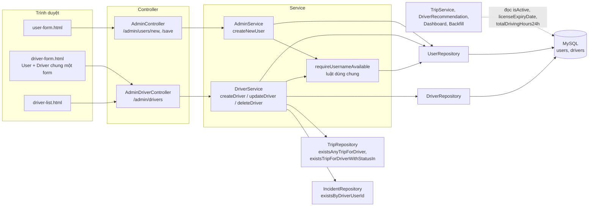
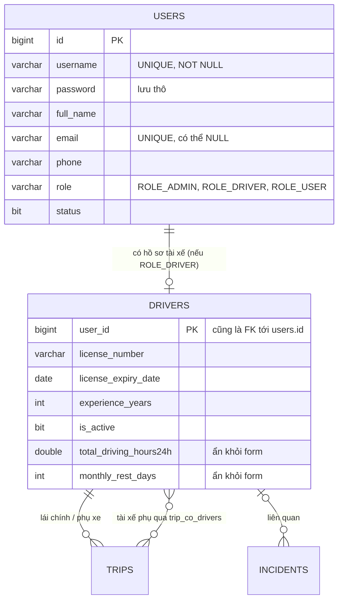
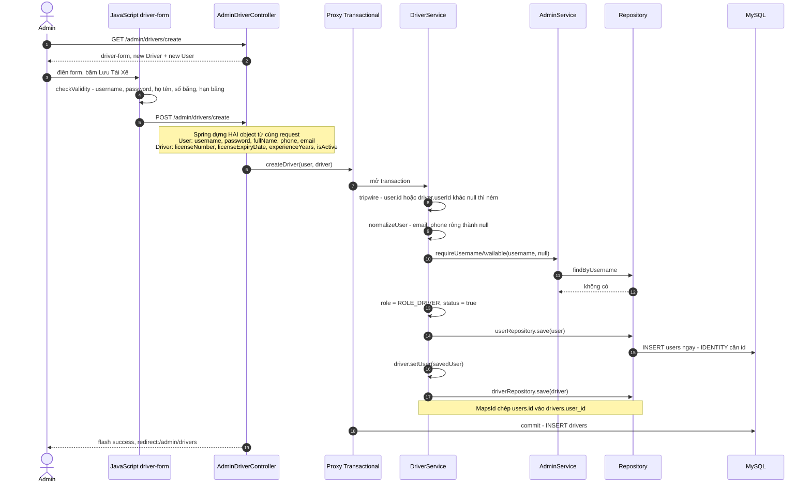
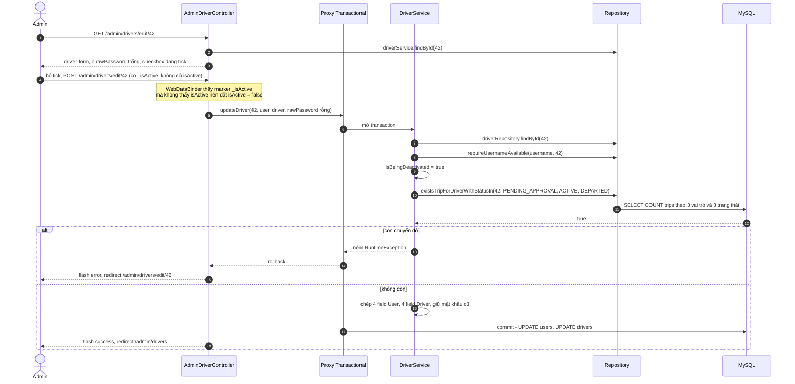

# Bài 04 — Driver & User Management (Quản lý tài xế và tài khoản)

> Bài chức năng thứ tư, sinh từ `docs/ai/03_defense_study_prompt.md` (PHẦN B), ngày 2026-10-01.
> Học sau Bài 00a, 00b, 01, 02 và 03. Số dòng là ảnh chụp ngày viết — lệch thì grep lại.
>
> Nhãn: [CODE] đọc thẳng từ code · [SPRING] hành vi chuẩn của Spring/Hibernate mà code không viết
> ra · [SUY LUẬN] suy luận của người viết ("chưa kiểm chứng" nếu chưa chạy thử).
>
> Viết tắt: `…/` = `src/main/java/giang/com/BusManagement/`, `test/` =
> `src/test/java/giang/com/BusManagement/`, `tpl/` = `src/main/resources/templates/`.
>
> Bài gồm **hai màn**: Quản lý tài xế (`/admin/drivers`, đủ 6 endpoint như Bài 01–03) và màn tạo
> tài khoản (`/admin/users/new`, `/admin/users/save` trong `AdminController`). Endpoint
> `/admin/dashboard` cũng nằm trong `AdminController` nhưng thuộc **Bài 12**. Phần mới so với các bài
> trước: **một form, hai entity** (`User` + `Driver`) nối bằng khoá chung `@MapsId`; ô checkbox cần
> **"field marker"** `_isActive`; mật khẩu dùng **ô riêng** khi sửa; và một luật dùng chung giữa hai
> service (`requireUsernameAvailable`).

---

## §1. Chức năng này là gì — nói kiểu đời thường

**Vấn đề thật của nhà xe.** Mỗi chuyến cần ít nhất một tài xế, và hệ thống chỉ được giao chuyến cho
người **đang làm việc** và **còn bằng lái vào ngày khởi hành**. Màn Quản lý tài xế là nơi giữ hai
thông tin đó cho đúng: số bằng, hạn bằng, kinh nghiệm, và công tắc "Đang hoạt động". Mọi chức năng
xếp người — form tạo chuyến, duyệt chuyến AI, gợi ý tài xế, bảng điều hành — đều đọc từ đây.

Không có màn này thì tài xế chỉ có nhờ dữ liệu seed (roadmap §5 Phase 1: *"Driver CRUD does not
currently exist — only seeded via `DataInitializer`"*), không ai sửa được hạn bằng lái khi tài xế
gia hạn, và không có cách cho một người nghỉ việc mà vẫn giữ lịch sử các chuyến họ đã lái.

Màn **tạo tài khoản** (`/admin/users/new`) nhỏ hơn: tạo tài khoản `ROLE_ADMIN` hoặc `ROLE_USER`. Vì
hệ thống **không có đăng nhập**, các tài khoản này hiện không dùng vào việc gì (§10.3).

**Một kịch bản cụ thể.** Nhà xe tuyển anh Nguyễn Văn A. Chị admin vào Dashboard, bấm **Quản lý tài
xế**, rồi **Thêm Tài Xế Mới**. Form có hai phần: *Thông tin tài khoản* (tên đăng nhập `tx_nguyenvana`,
mật khẩu, họ tên, điện thoại, email để trống) và *Hồ sơ nghề nghiệp* (số bằng `B2-123`, hạn bằng
2027-06-30, 4 năm kinh nghiệm, công tắc "Đang hoạt động" bật sẵn). Bấm **Lưu Tài Xế** → danh sách,
khung xanh *"Thêm mới tài xế thành công!"*.

Ba tháng sau anh A xin nghỉ, nhưng vẫn còn một chuyến đang bán vé ngày mai. Chị admin bấm **Sửa**, bỏ
tick "Đang hoạt động", lưu → khung đỏ *"Lỗi: Không thể khóa tài xế này vì đang được phân công cho
chuyến xe chưa kết thúc (chờ duyệt / đang bán vé / đang trên đường). Hãy gỡ tài xế khỏi các chuyến
đó trước!"*. Chị đổi tài xế của chuyến đó, quay lại khoá được. Chị thử **Xóa** hẳn anh A → bị chặn,
vì anh A đã từng lái chuyến: *"…Hãy khóa hồ sơ (bỏ tick 'Đang hoạt động') thay vì xóa cứng!"*.

---

## §2. Bản đồ tổng quan

### 2.1. Các mảnh ghép

| Loại | File | Trách nhiệm (1 dòng) |
|---|---|---|
| Template (lối vào) | `tpl/admin/dashboard.html:110`, `:93` | Nút "Quản lý tài xế" và nút tạo tài khoản trên Dashboard |
| Template | `tpl/admin/driver/driver-list.html` | Bảng tài xế: họ tên, username, liên hệ, bằng lái + nhãn "Hết hạn", trạng thái; nút Sửa/Xóa |
| Template + JS | `tpl/admin/driver/driver-form.html` | Form gộp hai phần User + Driver; ô mật khẩu đổi tên giữa Thêm/Sửa; marker `_isActive`; JS `:119-130` chặn submit khi ô bắt buộc trống |
| Template | `tpl/admin/user-form.html` | Form tạo tài khoản (username, mật khẩu, họ tên, điện thoại, vai trò) |
| Controller | `…/controller/admin/AdminDriverController.java` | 6 endpoint `/admin/drivers/*`; chỉ inject `DriverService` |
| Controller | `…/controller/admin/AdminController.java:41-69` | `GET /admin/users/new`, `POST /admin/users/save` |
| Service | `…/service/DriverService.java` | Tạo cặp User+Driver, sửa (chép field, guard khoá), xoá (2 guard) |
| Service | `…/service/AdminService.java` | Tạo tài khoản không phải tài xế; luật "username duy nhất" dùng chung |
| Repository | `…/repository/DriverRepository.java:17-18` | `findAllWithUser()` (`JOIN FETCH d.user`) |
| Repository | `…/repository/UserRepository.java:12` | `findByUsername()` |
| Repository (mượn) | `TripRepository.java:257-276`, `IncidentRepository.java:62` | Guard: tài xế từng/đang có chuyến; tài xế có bản ghi sự cố |
| Entity | `…/domain/User.java` | Bảng `users`: username (unique), password, fullName, email (unique), phone, role, status + quan hệ ngược `driver` |
| Entity | `…/domain/Driver.java` | Bảng `drivers`: khoá chính **là** `user_id`; số bằng, hạn bằng, kinh nghiệm, `isActive`, hai cột ẩn |
| Enum | `…/domain/Role.java` | `ROLE_ADMIN`, `ROLE_DRIVER`, `ROLE_USER` |
| Test | `test/service/AdminServiceTest.java`; `test/service/CreatePathIdTripwireTest.java:195`, `:227`, `:240`; `test/domain/EntityEqualsHashCodeCycleTest.java:88` | 6 test luật tài khoản; 3 tripwire; vòng User↔Driver không đệ quy |
| Seed | `…/config/DataInitializer.java:290-300` | `createDriver()` mẫu — form gộp bắt chước đúng hàm này |

### 2.2. Bảng endpoint — đủ mọi điểm bắt đầu

Không có `@Scheduled`, `fetch()`/REST hay `CommandLineRunner` riêng. JS của hai form chỉ kiểm tra
phía trình duyệt, không gọi server. `ADC` = `AdminDriverController.java`, `AC` = `AdminController.java`.

| HTTP | URL | Controller method | Được gọi từ đâu | Service chính | Kết quả |
|---|---|---|---|---|---|
| GET | `/admin/drivers` | `ADC.listDrivers()` `:19-23` | nút `dashboard.html:110`; "Hủy Bỏ" `driver-form.html:109`; mọi redirect thành công | `findAllWithUser()` | view `admin/driver/driver-list` |
| GET | `/admin/drivers/create` | `ADC.showCreateForm()` `:25-30` | "Thêm Tài Xế Mới" `driver-list.html:20`; redirect khi tạo lỗi | — | view `driver-form` với `new Driver()` + `new User()` |
| POST | `/admin/drivers/create` | `ADC.createDriver()` `:39-51` | "Lưu Tài Xế" khi `driver.userId == null` (`driver-form.html:29`) | `createDriver(user, driver)` | redirect `/admin/drivers` + `success`; lỗi: redirect `/admin/drivers/create` + `error` |
| GET | `/admin/drivers/edit/{id}` | `ADC.showEditForm()` `:53-65` | "Sửa" `driver-list.html:82-83`; redirect khi sửa lỗi | `findById(id)` | view `driver-form` điền sẵn; không thấy: redirect `/admin/drivers` + `error` |
| POST | `/admin/drivers/edit/{id}` | `ADC.updateDriver()` `:67-81` | "Lưu Tài Xế" khi `driver.userId != null` | `updateDriver(id, user, driver, rawPassword)` | redirect `/admin/drivers` + `success`; lỗi: redirect `/admin/drivers/edit/{id}` + `error` |
| GET | `/admin/drivers/delete/{id}` | `ADC.deleteDriver()` `:83-92` | "Xóa" + `confirm()` `driver-list.html:84-87` | `deleteDriver(id)` | redirect `/admin/drivers` + `success`/`error` |
| GET | `/admin/users/new` | `AC.showUserForm()` `:42-52` | nút `dashboard.html:93`; redirect khi lưu lỗi | — | view `admin/user-form`, `roles` = mọi vai trò **trừ** `ROLE_DRIVER` |
| POST | `/admin/users/save` | `AC.saveUser()` `:60-69` | "Tạo tài khoản" `user-form.html:22`, `:54` | `AdminService.createNewUser(user)` | redirect `/admin/dashboard?success=user`; lỗi: redirect `/admin/users/new` + `error` |

### 2.3. Sơ đồ toàn cảnh



Quan hệ dữ liệu — hai bảng chung một khoá:



### 2.4. Điều cốt lõi cần nhớ

1. **Tài xế = một `User` + một `Driver` dùng chung một id.** `Driver.userId` vừa là khoá chính vừa là
   khoá ngoại tới `users.id` (`@MapsId`, `Driver.java:18-28`). Không thể có `Driver` thiếu `User`, nên
   màn này tạo và xoá **cả cặp** (javadoc `DriverService.java:18-25`; roadmap §9:1230).
2. **Một form, hai `@ModelAttribute`.** Spring dựng **cả** `User` lẫn `Driver` từ cùng một request,
   khớp theo tên ô; hai class không có field trùng tên nên mỗi ô chỉ rơi vào một object (javadoc
   `AdminDriverController.java:32-38`).
3. **"Khoá" thay cho "xoá".** Tài xế đã từng chạy chuyến hoặc có bản ghi sự cố thì không xoá cứng
   được; muốn cho nghỉ thì bỏ tick "Đang hoạt động". Và không được khoá người còn chuyến
   `PENDING_APPROVAL`/`ACTIVE`/`DEPARTED`.
4. **Hai trường quyết định việc xếp chuyến:** `isActive` và `licenseExpiryDate`. Bằng lái được xét
   **vào ngày khởi hành** (`Driver.isLicenseValid(LocalDate)`), còn nhãn "Hết hạn" ở danh sách xét
   **hôm nay**.
5. **Username duy nhất** được kiểm ở **một chỗ** (`AdminService.requireUsernameAvailable()`), cả màn
   tài xế lẫn màn tài khoản cùng gọi; màn tài khoản **không** cho tạo `ROLE_DRIVER` (lỗi #25).

---

## §3. Trace chi tiết các luồng chính

**Chọn luồng nào và vì sao.**

- **Luồng A — Tạo tài xế**: chỗ duy nhất trong dự án mà một form sinh ra **hai entity** trong một
  transaction, theo đúng thứ tự `@MapsId` bắt buộc. Cũng là chỗ có tripwire kiểm **hai** khoá.
- **Luồng B — Sửa tài xế và khoá hồ sơ**: chứa luật nghiệp vụ quan trọng nhất của màn (không khoá
  người còn chuyến dở), cơ chế marker `_isActive`, và cách giữ mật khẩu cũ.

### 3.1. Luồng A — Tạo tài xế

**(a) Sơ đồ**



**(b) Bảng từng bước**

| # | Tầng | Vị trí | Method / thành phần | Nhận vào | Làm gì | Trả về / gọi tiếp | Nhãn |
|---|---|---|---|---|---|---|---|
| 1 | Controller | `AdminDriverController.java:25-30` | `showCreateForm()` | — | đặt `driver = new Driver()` và `user = new User()` vào Model | `driver-form` | [CODE] |
| 2 | View | `driver-form.html:20`, `:29` | tiêu đề + `th:action` | `driver.userId == null` | "Thêm Tài Xế Mới"; form trỏ `/admin/drivers/create` | HTML | [CODE] |
| 3 | View | `:49-52` | ô mật khẩu | `driver.userId == null` | khi **tạo**: hiện ô `name="password"` `required` (bind thẳng vào `User.password`); ô `rawPassword` không hiện | HTML | [CODE] |
| 4 | View | `:100-102` | công tắc | — | `<input type="hidden" name="_isActive" value="on">` + checkbox `name="isActive" value="true"`; khi tạo `th:checked` = `true` | HTML | [CODE] |
| 5 | JavaScript | `:122-128` | listener `submit` | form | `checkValidity()`: các ô `required` (username `:37`, password `:49`, họ tên `:57`, số bằng `:77`, hạn bằng `:83`) và `min="0"` ở kinh nghiệm (`:91`); sai ⇒ chặn + tô đỏ | POST | [CODE] |
| 6 | Trình duyệt | — | gửi form | — | ví dụ `username=tx_nguyenvana&password=123&fullName=Nguyễn Văn A&phone=&email=&licenseNumber=B2-123&licenseExpiryDate=2027-06-30&experienceYears=4&_isActive=on&isActive=true` | POST | [SPRING] |
| 7 | Spring | `AdminDriverController.java:40-41` | `@ModelAttribute("user") User` + `@ModelAttribute("driver") Driver` | cùng một body | Spring tạo **hai** object và đổ **mọi** tham số vào cả hai, mỗi object nhận ô trùng tên field của nó, lờ đi phần còn lại. `phone=""`, `email=""` thành chuỗi rỗng; `licenseExpiryDate` đổi chuỗi `yyyy-MM-dd` thành `LocalDate`; `isActive=true` thành `Boolean.TRUE` | `user`, `driver` (đều chưa có id) | [SPRING] |
| 8 | Controller | `:44` | `driverService.createDriver(user, driver)` | — | gọi trong `try` | → proxy | [CODE] |
| 9 | Proxy | `DriverService.java:66` | `@Transactional` | — | **mở transaction** | — | [SPRING] |
| 10 | Service | `:68-73` | tripwire **hai khoá** | `user.id`, `driver.userId` | một trong hai khác `null` ⇒ `IllegalArgumentException("createDriver() chỉ dùng để tạo tài xế mới (id phải trống). Hồ sơ #… đã tồn tại — muốn sửa thì dùng chức năng Sửa tài xế.")` (lỗi #21) | — | [CODE] |
| 11 | Service | `:74`, `:172-179` | `normalizeUser(user)` | `email=""`, `phone=""` | chuỗi trắng ⇒ `null`. Lý do (javadoc `:168-171`): `email` là cột `unique` — tài xế thứ hai cũng để trống email sẽ trùng chuỗi `""` với người đầu | — | [CODE] |
| 12 | Service → Service | `:75` → `AdminService.java:65-75` | `requireUsernameAvailable(username, null)` | — | username trống ⇒ `IllegalArgumentException("Tên đăng nhập không được để trống!")`; `findByUsername` có kết quả mà id khác `currentUserId` (ở đây `null`) ⇒ `"Tên đăng nhập '…' đã tồn tại, vui lòng chọn tên khác!"`. Hàm này **không** có `@Transactional` riêng nên chạy **trong** transaction của `createDriver` | — | [CODE]+[SPRING] |
| 13 | Repository → DB | `UserRepository.java:12` | `findByUsername` | — | derived query. [SUY LUẬN — SQL tương đương] `SELECT … FROM users WHERE username = 'tx_nguyenvana'` | `Optional.empty()` | [SPRING] |
| 14 | Service | `:77-78` | `setRole(ROLE_DRIVER)`, `setStatus(TRUE)` | — | **ép** vai trò, bất kể form gửi gì | — | [CODE] |
| 15 | Service → DB | `:79` | `userRepository.save(user)` | `id = null` | `persist`; `User.id` là `IDENTITY` (`User.java:21`) nên Hibernate chạy **ngay** `INSERT INTO users (username, password, full_name, email, phone, role, status) VALUES (…)` để lấy id | `savedUser`, ví dụ id 42 | [SPRING] |
| 16 | Service | `:81` | `driver.setUser(savedUser)` | — | nối hồ sơ vào tài khoản vừa có id | — | [CODE] |
| 17 | Service | `:82-84` | mặc định `isActive` | — | `null` ⇒ `TRUE`. Thực tế hiếm khi `null` vì field đã khởi tạo `= true` (`Driver.java:34`) | — | [CODE] |
| 18 | Service | `:85` | `driverRepository.save(driver)` | `userId = null` | Spring Data thấy id `null` ⇒ `persist`. `@MapsId` (`Driver.java:26`) khiến Hibernate **chép id của `user`** (42) vào `driver.userId` | managed | [SPRING] |
| 19 | Proxy | — | commit | — | [SUY LUẬN — SQL tương đương] `INSERT INTO drivers (user_id, license_number, license_expiry_date, experience_years, is_active, total_driving_hours24h, monthly_rest_days) VALUES (42, 'B2-123', '2027-06-30', 4, 1, NULL, NULL)` — **đóng transaction** | — | [SPRING] |
| 20 | Controller | `AdminDriverController.java:45`, `:50` | flash + redirect | — | `success` = "Thêm mới tài xế thành công!" → `redirect:/admin/drivers` | 302 | [CODE] |
| 21 | Controller → DB | `:19-23`, `DriverRepository.java:17-18` | `findAllWithUser()` | — | JPQL `SELECT DISTINCT d FROM Driver d LEFT JOIN FETCH d.user` — **một** câu cho cả trang | `List<Driver>` | [CODE] |
| 22 | View | `driver-list.html:25-28`, `:57-89` | bảng | `drivers`, `success` | khung xanh; dòng mới: họ tên, username, `—` ở cột liên hệ (phone `null`), số bằng in hoa **bằng CSS** (`:69`), hạn bằng không có nhãn "Hết hạn", "Đang hoạt động" | HTML | [CODE] |

**Ranh giới transaction:** một transaction bao trọn `createDriver()` (bước 9 → 19), gồm cả lời gọi
sang `AdminService` (bước 12). Nếu `driverRepository.save()` hỏng sau khi `INSERT users` đã chạy ở
bước 15, cả hai bị **rollback** — không bao giờ để lại tài khoản tài xế không có hồ sơ [SPRING].

**(c) Code then chốt**

`…/service/DriverService.java:66-86`:

```java
@Transactional                                                  // User và Driver: cùng thành hoặc cùng hỏng
public void createDriver(User user, Driver driver) {
    if (user.getId() != null || driver.getUserId() != null) {   // tripwire: CẢ HAI phải chưa có khoá
        throw new IllegalArgumentException("createDriver() chỉ dùng để tạo tài xế mới ...");
    }
    normalizeUser(user);                                        // "" → null cho email, phone
    adminService.requireUsernameAvailable(user.getUsername(), null);  // luật dùng chung (lỗi #25)

    user.setRole(Role.ROLE_DRIVER);                             // ép vai trò, không tin form
    user.setStatus(Boolean.TRUE);
    User savedUser = userRepository.save(user);                 // INSERT users NGAY để có id

    driver.setUser(savedUser);                                  // @MapsId sẽ lấy id từ đây
    if (driver.getIsActive() == null) {
        driver.setIsActive(Boolean.TRUE);
    }
    driverRepository.save(driver);                              // INSERT drivers (user_id = id của User)
}
```

`…/domain/Driver.java:18-28` — khoá chung:

```java
@Id
@EqualsAndHashCode.Include
private Long userId;            // khoá chính của drivers — KHÔNG có @GeneratedValue

@ToString.Exclude
@OneToOne                       // một tài xế ↔ một tài khoản; mặc định EAGER
@MapsId                         // "lấy khoá chính của tôi từ chính quan hệ này"
@JoinColumn(name = "user_id")   // cột drivers.user_id vừa là PK vừa là FK
private User user;
```

`@MapsId` — nôm na là "hồ sơ này không tự đánh số; số của nó **chính là** số của tài khoản nó gắn
vào". Vì vậy `Driver` không có `@GeneratedValue`, và phải `save(user)` **trước** thì mới có số để
chép sang (Bài 00b §1.3).

### 3.2. Luồng B — Sửa tài xế: bỏ tick "Đang hoạt động" khi còn chuyến dở

Tình huống: tài xế id 42 đang `isActive = true`, có một chuyến `ACTIVE` ngày mai. Admin bỏ tick
"Đang hoạt động", để trống ô mật khẩu, bấm lưu.

**(a) Sơ đồ**



**(b) Bảng từng bước**

| # | Tầng | Vị trí | Method / thành phần | Nhận vào | Làm gì | Trả về / gọi tiếp | Nhãn |
|---|---|---|---|---|---|---|---|
| 1 | Controller | `AdminDriverController.java:56-57` | `driverService.findById(42)` | 42 | `DriverService.java:49-51` chỉ chuyển tiếp; không thấy ⇒ `RuntimeException` ⇒ flash `error` **không** có "Lỗi: " (`:62`), redirect danh sách | `Driver` | [CODE] |
| 2 | Repository → DB | — | `findById` của `JpaRepository` | 42 | `Driver.user` là `@OneToOne` không ghi `fetch` ⇒ **EAGER** (Bài 00b §2.4). [SUY LUẬN — SQL tương đương] `SELECT d.*, u.* FROM drivers d JOIN users u ON u.id = d.user_id WHERE d.user_id = 42` | `Driver` + `User` | [SPRING] |
| 3 | Controller | `:58-60` | Model | — | key `driver` và `user` = `driver.getUser()` — form dùng **hai** key | `driver-form` | [CODE] |
| 4 | View | `driver-form.html:20`, `:29` | — | `userId = 42` | "Sửa Hồ Sơ Tài Xế"; action `/admin/drivers/edit/42` | HTML | [CODE] |
| 5 | View | `:51-52` | ô mật khẩu | — | khi **sửa**: ô tên `rawPassword`, không `required`, gợi ý "Để trống nếu không đổi". Comment `:45-48` giải thích: nếu vẫn tên `password`, để trống sẽ bind chuỗi rỗng vào `User.password` | HTML | [CODE] |
| 6 | View | `:102` | checkbox | `driver.isActive = true` | `th:checked` theo giá trị trong DB ⇒ đang tick | HTML | [CODE] |
| 7 | Trình duyệt | — | Admin bỏ tick | — | checkbox **không tick thì trình duyệt không gửi gì** cho ô đó; ô ẩn `_isActive=on` vẫn được gửi | POST | [SPRING] |
| 8 | Spring | `AdminDriverController.java:68-71` | bind | body | `id = 42`; `User` và `Driver` mới toanh từ form; `rawPassword = ""` (`@RequestParam(required = false) String`). **Field marker**: `WebDataBinder` thấy `_isActive` mà không thấy `isActive` ⇒ đặt `driver.isActive = false`. Không có marker, field giữ giá trị khởi tạo `true` (`Driver.java:34`) và việc bỏ tick vô tác dụng (comment `driver-form.html:96-99`) | `formUser`, `formDriver` | [SPRING] |
| 9 | Controller | `:74` | `updateDriver(id, user, driver, rawPassword)` | — | — | → proxy | [CODE] |
| 10 | Proxy | `DriverService.java:93` | `@Transactional` | — | mở transaction | — | [SPRING] |
| 11 | Service → DB | `:95-96` | `driverRepository.findById(42)` | — | bản ghi thật (kèm `User` — EAGER) | `existing` managed | [CODE] |
| 12 | Service | `:98-99` | `normalizeUser` + `requireUsernameAvailable(username, 42)` | — | truyền `42` để **không tự báo trùng với chính mình** (javadoc `AdminService.java:61-62`) | — | [CODE] |
| 13 | Service | `:104-105` | `isBeingDeactivated` | `existing.isActive = true`, `formDriver.isActive = false` | `TRUE.equals(cũ) && !TRUE.equals(mới)` ⇒ `true`. Chỉ xét khi **chuyển** từ hoạt động sang khoá | — | [CODE] |
| 14 | Service → DB | `:106`, `TripRepository.java:269-276` | `existsTripForDriverWithStatusIn(42, BUSY_STATUSES)` | `BUSY_STATUSES` = `PENDING_APPROVAL`, `ACTIVE`, `DEPARTED` (`DriverService.java:42-43`) | JPQL xét **cả ba vai trò**: tài xế chính, phụ xe, tài xế phụ (`LEFT JOIN t.coDrivers`). [SUY LUẬN — SQL tương đương] `SELECT COUNT(t.id) > 0 FROM trips t LEFT JOIN trip_co_drivers cd ON cd.trip_id = t.id WHERE (t.driver_id = 42 OR t.assistant_id = 42 OR cd.driver_id = 42) AND t.status IN ('PENDING_APPROVAL','ACTIVE','DEPARTED') AND t.is_deleted = false` | `true` | [CODE]+[SPRING] |
| 15 | Service | `:107-109` | ném lỗi | — | `RuntimeException("Không thể khóa tài xế này vì đang được phân công cho chuyến xe chưa kết thúc …")` | ↑ | [CODE] |
| 16 | Proxy | — | rollback | — | chưa chép field nào ⇒ không có gì để hoàn tác | ↑ | [SPRING] |
| 17 | Controller | `AdminDriverController.java:76-78` | `catch (Exception e)` | — | flash `error` = "Lỗi: " + câu trên; `redirect:/admin/drivers/edit/42` | 302 | [CODE] |
| 18 | View | `driver-form.html:24-26` | khung đỏ trên form | `error` | form nạp lại từ DB ⇒ checkbox **vẫn tick** (DB vẫn `is_active = 1`) | HTML | [CODE] |

**Nhánh không còn chuyến dở** (bước 14 trả `false`, hoặc Admin không đổi trạng thái):

| # | Vị trí | Làm gì | Nhãn |
|---|---|---|---|
| 15′ | `DriverService.java:112-116` | chép `username`, `fullName`, `email`, `phone` sang `existing.getUser()` | [CODE] |
| 16′ | `:117-119` | `rawPassword` khác `null` và không trắng ⇒ đặt mật khẩu mới; trống ⇒ **giữ nguyên** mật khẩu cũ | [CODE] |
| 17′ | `:121-124` | chép `licenseNumber`, `licenseExpiryDate`, `experienceYears`, và `isActive = TRUE.equals(form)` | [CODE] |
| 18′ | `:126-127` | `save(user)`, `save(existing)` trên entity đang managed — dirty checking đã đủ, `save()` chỉ để rõ ý | [SPRING] |
| 19′ | commit | [SUY LUẬN — SQL tương đương] `UPDATE users SET username=?, full_name=?, email=?, phone=? WHERE id=42` và `UPDATE drivers SET license_number=?, license_expiry_date=?, experience_years=?, is_active=0 WHERE user_id=42`. **Không** đụng `role`, `status`, `total_driving_hours24h`, `monthly_rest_days` | [SPRING] |
| 20′ | `AdminDriverController.java:75`, `:80` | flash "Cập nhật hồ sơ tài xế thành công!" → danh sách, nhãn "Đã khóa" (`driver-list.html:79`) | [CODE] |

Phase 1 đã kiểm chứng cả hai nhánh bằng app thật (roadmap §8, 2026-07-16): *"unticking 'Đang hoạt
động' flipped `is_active` 1→0 (proving the `_isActive` field marker works)"* và *"deactivating a driver
holding an `ACTIVE`+`PENDING_APPROVAL` trip was blocked … and `is_active` stayed 1"*.

**(c) Code then chốt** — `…/service/DriverService.java:101-124`:

```java
// RÀNG BUỘC: Không cho khóa tài xế đang còn chuyến dở dang.
boolean isBeingDeactivated = Boolean.TRUE.equals(existing.getIsActive())   // TRƯỚC: đang hoạt động
        && !Boolean.TRUE.equals(formDriver.getIsActive());                 // SAU: bị bỏ tick
if (isBeingDeactivated && tripRepository.existsTripForDriverWithStatusIn(userId, BUSY_STATUSES)) {
    throw new RuntimeException("Không thể khóa tài xế này vì đang được phân công ...");
}

User user = existing.getUser();                     // tài khoản thật đi kèm hồ sơ
user.setUsername(formUser.getUsername());           // chép đúng 4 field tài khoản
user.setFullName(formUser.getFullName());
user.setEmail(formUser.getEmail());
user.setPhone(formUser.getPhone());
if (rawPassword != null && !rawPassword.isBlank()) {  // có gõ mật khẩu mới thì mới đổi
    user.setPassword(rawPassword);                     // lưu THÔ, không mã hoá
}

existing.setLicenseNumber(formDriver.getLicenseNumber());       // chép 4 field hồ sơ
existing.setLicenseExpiryDate(formDriver.getLicenseExpiryDate());
existing.setExperienceYears(formDriver.getExperienceYears());
existing.setIsActive(Boolean.TRUE.equals(formDriver.getIsActive())); // null cũng thành false
```

`Boolean.TRUE.equals(x)` — so sánh "an toàn với null": `x` là `null` thì ra `false` chứ không ném
`NullPointerException` như khi viết `x == true` với `Boolean`. Dự án dùng mẫu này ở mọi chỗ đọc
`isActive` (`TripService.java:484`, `:1302`…).

---

## §4. Luồng lỗi — xoá tài xế đã có lịch sử

| Bước | Chuyện gì xảy ra | Vị trí | Nhãn |
|---|---|---|---|
| 1 | Nút "Xóa" có `confirm('Bạn có chắc chắn muốn xóa tài xế này?')` — câu chung chung; luật được báo trước bằng dòng chữ nhỏ cuối trang | `driver-list.html:84-87`, `:95-99` | [CODE] |
| 2 | `GET /admin/drivers/delete/42` → `deleteDriver(42)` trong `try` | `AdminDriverController.java:84-86` | [CODE] |
| 3 | Proxy mở transaction; `driverRepository.findById(42)`; không thấy ⇒ `RuntimeException("Không tìm thấy tài xế cần xóa với ID: 42")` | `DriverService.java:142-145` | [CODE] |
| 4 | **Guard 1** `existsAnyTripForDriver(42)` — mọi vai trò, **mọi trạng thái**. [SUY LUẬN — SQL tương đương] như bước 14 luồng B nhưng không có điều kiện `status` | `:147`, `TripRepository.java:257-262` | [CODE] |
| 5 | Có ⇒ ném `RuntimeException("Không thể xóa tài xế này vì đã có dữ liệu lịch sử vận hành … Hãy khóa hồ sơ (bỏ tick 'Đang hoạt động') thay vì xóa cứng!")` | `:148-150` | [CODE] |
| 6 | Proxy rollback (chưa ghi gì) → `catch` → flash `error` "Lỗi: …" → `redirect:/admin/drivers` → khung đỏ `driver-list.html:29-32` | `AdminDriverController.java:88-91` | [SPRING]+[CODE] |

Nếu qua guard 1, còn **guard 2** `incidentRepository.existsByDriverUserId(42)` (`DriverService.java:158`,
`IncidentRepository.java:62`) — tài xế có bản ghi sự cố (dù sự cố đã `RESOLVED`) cũng không xoá được.
Câu báo gợi ý ba lối thoát: gỡ tài xế khỏi sự cố ("Không xác định"), xoá sự cố, hoặc khoá hồ sơ
(`:159-162`). Khác với xe, `Incident.driver` là tùy chọn nên lối "gỡ khỏi sự cố" tồn tại.

Qua cả hai guard: `userRepository.delete(driver.getUser())` (`:165`) — xoá **tài khoản**, và
`cascade = ALL` trên `User.driver` (`User.java:72`) xoá kèm hồ sơ. [SUY LUẬN — SQL tương đương]
`DELETE FROM drivers WHERE user_id = 42` rồi `DELETE FROM users WHERE id = 42`. Javadoc `:138-140` và
roadmap §9:1230 giải thích vì sao xoá từ phía `User`: chỉ xoá `Driver` sẽ để lại một tài khoản
`ROLE_DRIVER` "mồ côi" mà không màn nào quản lý được.

**Trên dữ liệu thật, gần như mọi tài xế đều rơi vào bước 5.** Lịch sử mô phỏng (profile `backfill`)
gán chuyến cho cả 33 tài xế đang hoạt động, nên chỉ **3/36** tài xế còn xoá cứng được (roadmap §6
Hidden Cost #8). Đây không phải lỗi — kịch bản "xoá tài xế chưa có chuyến thành công" của Phase 1 chỉ
không tái hiện được trên DB này; cần thì tạo một tài xế mới để demo.

**Các lỗi khác và đường về:**

| Nguyên nhân | Ném ở | Loại | Quay về đâu, thấy gì |
|---|---|---|---|
| Username trống | `AdminService.java:66-67` | `IllegalArgumentException` | form, "Lỗi: Tên đăng nhập không được để trống!" |
| Username đã thuộc người khác | `:69-74` | `IllegalArgumentException` | form, "Lỗi: Tên đăng nhập '…' đã tồn tại, vui lòng chọn tên khác!" |
| POST tạo mang `id` hoặc `userId` | `DriverService.java:68-73` | `IllegalArgumentException` | form tạo |
| Email trùng người khác | **không** kiểm ở service — DB từ chối (`User.java:31`) | lỗi Hibernate/JDBC | [SUY LUẬN — chưa kiểm chứng] form với một câu kỹ thuật sau "Lỗi: ". Khi **tạo**, `INSERT users` chạy ngay ở `save()` nên lỗi nổ trong service; khi **sửa**, `UPDATE` chỉ chạy lúc commit, lỗi nổ ở proxy nhưng vẫn rơi vào `catch (Exception)` của controller |
| Tài xế không tồn tại (GET form sửa) | `AdminDriverController.java:57` | `RuntimeException` | danh sách, khung đỏ **không** có "Lỗi: " (`:62`) — cùng bất nhất nhỏ như Bài 01–03 |

Như Bài 03 §4: lỗi khi tạo quay về form **trống**, lỗi khi sửa quay về form **nạp lại từ DB** — dữ
liệu Admin vừa gõ mất (`AdminDriverController.java:46-48`, `:76-78`).

---

## §5. Các luồng còn lại — trace rút gọn

- **Xem danh sách tài xế** — `[dashboard.html:110]` → `listDrivers()` `:19-23` →
  `DriverService.findAllWithUser()` `:45-47` → `DriverRepository.findAllWithUser()` `:17-18` (JPQL
  `JOIN FETCH d.user`) → `driver-list`. Nhãn "Hết hạn" dùng `driver.isLicenseValid()` **không tham số**
  = so với hôm nay (`driver-list.html:72`, `Driver.java:59-61`); `licenseExpiryDate` `null` cũng hiện
  "Hết hạn" vì `isLicenseValid` trả `false` khi ngày `null` (`Driver.java:48`).
- **Mở form Thêm tài xế** — `[Thêm Tài Xế Mới]` → `showCreateForm()` `:25-30` → view. Không gọi service.
- **Mở form tạo tài khoản** — `[dashboard.html:93]` → `AdminController.showUserForm()` `:42-52` →
  `new User()` + `roles` = `Role.values()` lọc bỏ `ROLE_DRIVER` bằng Stream (`:48-50`) → `user-form`.
  Comment `:45-47` gọi đây là **lớp không-mời**; lớp chặn thật ở `AdminService.createNewUser()`.
- **Lưu tài khoản** — `[user-form.html:54]` → `AdminController.saveUser()` `:60-69` →
  `AdminService.createNewUser()` `:37-53`: tripwire id (`:39-43`) → từ chối `ROLE_DRIVER` (`:44-48`) →
  `requireUsernameAvailable(username, null)` (`:49`) → `userRepository.save(user)` (`:52`, mật khẩu
  lưu thô — comment `:50-51` *"Thực tế nên mã hóa password tại đây"*) → `redirect:/admin/dashboard?success=user`.
  Dashboard báo thành công bằng **tham số URL**, không phải flash: `th:if="${param.success}"` →
  "Thao tác thành công!" (`dashboard.html:21-22`). Lỗi: flash `error` → `redirect:/admin/users/new` →
  khung đỏ `user-form.html:19-21`.

Đoạn Stream ở `AdminController.java:48-50` viết lại bằng vòng `for`:

```java
List<Role> roles = new ArrayList<>();
for (Role r : Role.values()) {        // ROLE_ADMIN, ROLE_DRIVER, ROLE_USER
    if (r != Role.ROLE_DRIVER) {      // bỏ vai trò tài xế
        roles.add(r);
    }
}
model.addAttribute("roles", roles);   // còn ROLE_ADMIN, ROLE_USER
```

---

## §6. Hai lớp bảo vệ và tác động lên dữ liệu

### 6.1. Bảng "không-mời / chặn thật"

| Luật | Lớp không-mời (UI) | Lớp chặn thật (server) | POST tự chế vượt lớp đầu thì sao |
|---|---|---|---|
| Username bắt buộc và duy nhất | `required` (`driver-form.html:37`, `user-form.html:25`) | `AdminService.requireUsernameAvailable()` `:65-75`; cuối cùng là `unique` ở DB | Bị chặn với câu nghiệp vụ |
| Email duy nhất | **Không có** | **Chỉ DB** (`User.java:31`) | Lỗi kỹ thuật (§4) |
| Không tạo `ROLE_DRIVER` ở màn tài khoản | dropdown không có `ROLE_DRIVER` (`AdminController.java:48-50`) | `createNewUser()` `:44-48` | Bị chặn, không để lại user mồ côi (test `AdminServiceTest:58`) |
| Tài xế luôn có vai trò `ROLE_DRIVER` | form không có ô vai trò | `createDriver()` ép `ROLE_DRIVER` (`:77`); `updateDriver()` không chép `role` | `role=ROLE_ADMIN` gửi kèm bị ghi đè / lờ đi |
| "Tạo" không ghi đè tài khoản có sẵn | form không có ô id | tripwire `createDriver()` `:68-73`, `createNewUser()` `:39-43` | Bị chặn (3 test tripwire, §9.4) |
| "Sửa" chỉ sửa đúng tài xế trên URL | — | `updateDriver(userId, …)` lấy id từ URL | id gửi kèm bị lờ đi |
| Không khoá tài xế còn chuyến dở | **Không có** — checkbox luôn bỏ được | `updateDriver()` `:104-110` | Bị chặn |
| Không xoá tài xế có lịch sử / có sự cố | dòng chữ báo trước `driver-list.html:95-99`; nút Xóa luôn hiện | `deleteDriver()` `:147-163` | Bị chặn |
| Họ tên, số bằng, hạn bằng, mật khẩu (khi tạo) bắt buộc | `required` + JS `checkValidity()` | **Không có** | [SUY LUẬN — chưa kiểm chứng] lưu được tài xế thiếu hạn bằng; hệ quả an toàn: `isLicenseValid` trả `false` nên người đó bị loại khỏi **mọi** phân công (`Driver.java:48`) và hiện "Hết hạn" |
| Kinh nghiệm ≥ 0 | `min="0"` (`:91`) | **Không có** | Lưu được số âm |
| Số bằng in hoa | chỉ **CSS** `text-uppercase` (`:77`, `driver-list.html:69`) — đổi cách **hiển thị**, không đổi giá trị gửi đi | **Không có** | DB lưu đúng như gõ (`b2-123`), màn hình vẫn hiện `B2-123` |
| Số bằng duy nhất | **Không có** | **Không có** | Hai tài xế cùng số bằng |
| Hai cột ẩn `totalDrivingHours24h`, `monthlyRestDays` không sửa qua UI | không có ô trên form (roadmap §9:1232) | `updateDriver()` không chép; **`createDriver()` lưu nguyên object form** | [SUY LUẬN — chưa kiểm chứng] POST tạo kèm `totalDrivingHours24h=7` sẽ được bind và lưu, làm tài xế mới có sẵn 7 giờ nền hôm nay |

### 6.2. Bảng "thay đổi gì trong DB"

| Thao tác | Bảng / cột | Từ → sang |
|---|---|---|
| Xem danh sách, mở form | — | Không ghi DB |
| Tạo tài xế | `users` | thêm 1 dòng, `role = 'ROLE_DRIVER'`, `status = 1`, email/phone trống ⇒ `NULL` |
| | `drivers` | thêm 1 dòng, `user_id` = id vừa sinh; `total_driving_hours24h`, `monthly_rest_days` = `NULL` |
| Sửa tài xế | `users` | `username`, `full_name`, `email`, `phone`; `password` **chỉ** khi gõ mật khẩu mới |
| | `drivers` | `license_number`, `license_expiry_date`, `experience_years`, `is_active` |
| Khoá tài xế | `drivers.is_active` | `1 → 0`. Từ lúc đó người này biến khỏi mọi dropdown xếp chuyến và bị validator từ chối (`TripService.java:1302-1305`) |
| Xoá tài xế | `drivers`, `users` | `DELETE` cả hai dòng (cascade từ `User.driver`). Xoá thật, không soft delete |
| Tạo tài khoản | `users` | thêm 1 dòng `ROLE_ADMIN` hoặc `ROLE_USER`; email `NULL` (form không có ô email); phone **không** được chuẩn hoá — để trống thì lưu chuỗi `""` |

---

## §7. Annotation và cơ chế dùng trong chức năng này

Phần đã học ở Bài 01–03 (`@Controller`, `@ModelAttribute`, flash, `@Transactional`, tripwire, dirty
checking, `JOIN FETCH`…) không nhắc lại. Chỉ ghi phần **mới**:

| Annotation / cơ chế | Nghĩa đời thường | Tác dụng ở đây | Bỏ đi thì sao |
|---|---|---|---|
| `@OneToOne` + `@MapsId` | "Hồ sơ dùng chung số với tài khoản" (Bài 00b §1.3) | `Driver.java:25-27` | Phải có cột khoá riêng cho `drivers` và một cột `user_id` thêm; một tài khoản có thể bị gắn hai hồ sơ |
| `@OneToOne(mappedBy = "user", fetch = LAZY, cascade = ALL)` | "Phía đọc ngược; xoá tài khoản thì xoá luôn hồ sơ" | `User.java:71-73` | Bỏ `cascade`: `deleteDriver()` xoá `User` sẽ để lại dòng `drivers` trỏ vào id không còn (DB không chặn vì `foreign_key_checks=0`) |
| Hai `@ModelAttribute` trong một method | "Một form đổ vào hai object; mỗi ô vào object có field cùng tên" | `AdminDriverController.java:40-41`, `:69-70` | Phải viết một DTO gộp — dự án không dùng DTO cho form (Bài 00b §6) |
| Field marker `_isActive` | "Ô ẩn báo cho Spring: form có checkbox này; không thấy giá trị thì hiểu là bỏ tick" | `driver-form.html:100` | Bỏ tick không có tác dụng — `isActive` giữ mặc định `true` (`Driver.java:34`) |
| `@RequestParam(required = false) String rawPassword` | "Nhận một ô lẻ không thuộc object nào" | `AdminDriverController.java:71` | Dùng chung `password` ⇒ để trống là xoá mật khẩu |
| `@Column(unique = true)` | "DB không cho hai dòng trùng giá trị" | `User.java:25` (username), `:31` (email) | Username trùng chỉ còn do service chặn |
| `@Enumerated(EnumType.STRING)` | "Lưu tên enum dạng chữ" (Bài 00b §1.2) | `User.java:36-37` — cột `role` chứa `'ROLE_DRIVER'` | Lưu số thứ tự 0, 1, 2 — đổi thứ tự enum là hỏng dữ liệu |
| `jakarta.transaction.Transactional` | Annotation transaction của chuẩn Jakarta EE, **khác gói** với `org.springframework…Transactional` dùng ở mọi service khác | `AdminService.java:8`, `:37` | [SPRING] Spring nhận cả hai loại; với lỗi unchecked cả hai đều rollback, nên hành vi ở đây không khác. Chỉ là bất nhất phong cách |
| `${param.success}` | "Đọc tham số trên URL" — khác với flash attribute | `dashboard.html:21` | — ; vì là tham số URL, bấm F5 vẫn còn thông báo |
| Gọi service từ service | "Một luật, một chỗ" | `DriverService.java:35`, `:75`, `:99` gọi `AdminService.requireUsernameAvailable()` | Hai bản luật trôi lệch nhau — đúng chuyện đã xảy ra trước lỗi #25 |
| Hai bản `isLicenseValid` | "Một luật, nhận ngày làm tham số" | `Driver.java:47-61` — bản có ngày cho xếp chuyến, bản không tham số cho nhãn hiển thị | Xem §8 |

---

## §8. Ví dụ tính tay

Chức năng không có 🧮, mục này tùy chọn. **Số liệu minh hoạ.**

**8.1. Bằng lái "còn hiệu lực" vào ngày nào?** `isLicenseValid(onDate)` =
`licenseExpiryDate != null && licenseExpiryDate.isAfter(onDate)` (`Driver.java:48`). `isAfter` là
"**sau hẳn**", không tính bằng. Tài xế có hạn bằng **2026-10-15**:

| Ngày khởi hành (`onDate`) | `2026-10-15.isAfter(onDate)` | Được xếp chuyến? |
|---|---|---|
| 2026-10-14 | `true` | Có |
| 2026-10-15 | `false` | **Không** — ngày hết hạn coi như đã hết |
| 2026-11-01 | `false` | Không |

Hôm nay là 2026-10-01 ⇒ danh sách tài xế **không** hiện nhãn "Hết hạn" (`isLicenseValid()` so với
hôm nay ⇒ `true`), nhưng một chuyến khởi hành 2026-10-20 sẽ không mời người này. Đây đúng là lỗi đã
sửa ngày 2026-07-20: trước đó cả việc xếp chuyến cũng so với hôm nay (roadmap §8, "Bug fix: licence
validity now evaluated on the departure date").

**8.2. Khi nào guard "khoá" chạy?** `DriverService.java:104-106`:

| DB `isActive` | Form `isActive` | `isBeingDeactivated` | Có truy vấn chuyến? |
|---|---|---|---|
| `true` | `false` (bỏ tick) | `true` | **Có** — còn chuyến dở thì chặn |
| `true` | `true` | `false` | Không |
| `false` | `true` (mở khoá) | `false` | Không — mở khoá không cần kiểm |
| `false` | `false` | `false` | Không — người đã khoá từ trước được sửa thông tin khác bình thường |

---

## §9. Vì sao thiết kế như vậy + cạm bẫy + kiểm thử

### 9.1. Các quyết định thiết kế

| Quyết định | Tránh được gì | Vì sao không làm cách đơn giản hơn | Nguồn |
|---|---|---|---|
| Một form gộp tạo cả `User` + `Driver` | Tài khoản tài xế không có hồ sơ | Hai bước (tạo user rồi gắn hồ sơ) tách bạch hơn nhưng tốn hai màn; form gộp bắt chước `DataInitializer.createDriver()` | roadmap §9:1230 (owner duyệt) |
| Xoá tài xế bằng cách xoá `User` | User `ROLE_DRIVER` mồ côi | Form gộp không có cách gắn hồ sơ vào tài khoản có sẵn | roadmap §9:1230; javadoc `DriverService.java:138-140` |
| Guard khoá dùng đúng tập "bận" của `TripService` | Hai định nghĩa "bận" lệch nhau | Định nghĩa mới thì phải giữ đồng bộ bằng tay | roadmap §9:1231; `TripService.java:716-717` |
| Guard xoá theo "từng có chuyến", không lọc trạng thái | Mất lịch sử vận hành | Cùng nguyên tắc `BusService.deleteBus()` | javadoc `DriverService.java:131-136` |
| Guard sự cố không lọc trạng thái sự cố | Bản ghi sự cố mồ côi (`foreign_key_checks=0`) | Sự cố `RESOLVED` vẫn là dữ liệu | roadmap §9:1200 (owner duyệt) |
| Ẩn `monthlyRestDays`, `totalDrivingHours24h` khỏi form | Ô nhập "có vẻ có tác dụng" | `monthlyRestDays` không ai đọc; `totalDrivingHours24h` là giờ nền mock, đúng ra do thiết bị GPS nạp | roadmap §9:1232 (owner duyệt); comment `TripService.java:817-825` |
| Ô `rawPassword` riêng khi sửa | Để trống mật khẩu là xoá mật khẩu | — | comment `driver-form.html:45-48` |
| Luật username ở **một** chỗ | Tạo user và tạo tài xế xử lý trùng khác nhau | — | lỗi #25; javadoc `AdminService.java:55-64` |
| Màn tài khoản không mời `ROLE_DRIVER` + service từ chối | User tài xế mồ côi | Bỏ hẳn màn là lựa chọn khác; chủ dự án chọn giữ | lỗi #25 |

### 9.2. Bug thật đã từng xảy ra ở chức năng này

**Lỗi #21 (phần tài xế và tài khoản) — tài khoản admin duy nhất bị biến thành tài xế.**
- *Hiểu sai điều gì:* tin rằng form tạo không có ô id thì request tạo không có id. `@ModelAttribute`
  không có `@InitBinder` nên ai gửi `id=1` là có `user.id = 1`, và `userRepository.save()` thành
  **merge** (Bài 00b §3).
- *Đo trên bản sao DB thật (2026-09-19):* `POST /drivers/create` với id của **user 1 = admin** (chưa có
  hồ sơ tài xế) ⇒ flash *"Thêm mới tài xế thành công!"*; admin thành `hijacked-admin`, `ROLE_DRIVER`,
  mật khẩu mới, thêm một dòng `drivers` (36 → 37). **Tài khoản admin duy nhất biến mất.** Với user đã
  là tài xế thì thất bại nhờ Hibernate ném `NonUniqueObjectException` — javadoc
  `DriverService.java:62-64` gọi đó là *"lưới tình cờ, không phải luật"*. Ở cửa `/users/save`: một user
  tài xế bị đổi thành `ROLE_ADMIN` kèm mật khẩu mới (javadoc `AdminService.java:21-24`).
- *Sửa:* tripwire ở đầu `createDriver()` (kiểm **cả** `user.id` lẫn `driver.userId`) và
  `createNewUser()`. Test khẳng định admin giữ username, vai trò, mật khẩu và không bị gắn hồ sơ.

**Lỗi #25 — màn tạo tài khoản: trùng username ⇒ HTTP 500; mời `ROLE_DRIVER` ⇒ user mồ côi.**
- *Trước khi sửa:* `AdminController.saveUser()` là endpoint ghi **duy nhất** không có `try/catch`, và
  `createNewUser()` không kiểm username. Đo trên app thật: POST `username=admin` ⇒ **HTTP 500**
  Whitelabel, log `Duplicate entry 'admin'`. Nửa thứ hai: chọn `ROLE_DRIVER` ⇒ user 42 có vai trò tài xế
  và **0** dòng `drivers` — không hiện ở `/admin/drivers`, `/admin/drivers/edit/42` báo không tìm thấy,
  và không có màn nào xoá được.
- *Hiểu sai điều gì:* hai cửa tạo tài khoản giữ hai cách xử lý khác nhau — `DriverService` có hàm kiểm
  username riêng, `AdminService` thì không, và dropdown vai trò lấy nguyên `Role.values()`.
- *Sửa:* luật dồn về `AdminService.requireUsernameAvailable()` (bản riêng của `DriverService` bị xoá),
  `createNewUser()` từ chối `ROLE_DRIVER`, controller bọc `try/catch`, dropdown lọc `ROLE_DRIVER`.

**Lỗi bằng lái xét theo hôm nay (2026-07-20).** Thuộc phần xếp chuyến (Bài 06) nhưng sinh ra
`Driver.isLicenseValid(LocalDate)` — xem §8.1.

**Mục đã rút: #17 "Sửa hạn bằng lái không kiểm lại các chuyến đã phân công".** Rút ngắn hạn bằng có
thể để lại chuyến `ACTIVE` với tài xế hết hạn, nhưng sổ lỗi xếp vào "ĐÃ LOẠI — đừng nêu lại": bất biến
dự án tuyên bố là bằng hợp lệ **lúc phân công**; bán kính đo được 0; và chặn sửa sẽ **sai** vì bằng
hết hạn là sự kiện thật phải ghi được. Nếu làm, hình dạng đúng là **cảnh báo** kèm danh sách chuyến.

### 9.3. Cạm bẫy và điểm lạ (ghi lại, không sửa)

1. **Không có màn danh sách / sửa / xoá tài khoản.** Tài khoản tạo ở `/admin/users/new` chỉ hiện lại
   dưới dạng con số `totalUsers` trên Dashboard (`AdminController.java:34`). Lỗi #25 cũng ghi:
   `AdminController` *"chỉ có `/users/new` + `/users/save`"*.
2. **Vai trò và cột `status` không có tác dụng.** Không có đăng nhập; grep `src/main` không thấy chỗ nào
   đọc `getRole()` ngoài lời từ chối `ROLE_DRIVER`, cũng không thấy chỗ nào đọc `User.status`.
3. **Mật khẩu lưu thô** (`User.java:28` *"Nên được mã hóa BCrypt"*, `AdminService.java:50-51`).
4. **Email trùng ra lỗi kỹ thuật**; số bằng không chống trùng; số bằng "in hoa" chỉ là CSS (§6.1).
5. **Lỗi thì mất dữ liệu đã gõ** (§4).
6. **Chuyến đã xoá mềm không chặn xoá tài xế** — `existsAnyTripForDriver` đi qua `@SQLRestriction`.
   Sổ lỗi đã **RÚT** mục này (bán kính 0), nêu được khi bị hỏi, không trình bày như lỗi.
7. **Hai cột ẩn có thể lọt qua POST tạo** (§6.1, chưa kiểm chứng).
8. **`AdminController` inject thẳng `UserRepository`, `BusRepository`, `TripRepository`** (`:26-28`,
   comment `// Giả định bạn đã có`) — chỉ để đếm cho Dashboard (Bài 12). Phần `/users/*` đi đúng qua
   `AdminService`. Đây là cùng loại anti-pattern roadmap §9 nêu với `AdminTripManagementController`.
9. **`AdminService` dùng `jakarta.transaction.Transactional`** trong khi mọi service khác dùng của
   Spring (§7) — không đổi hành vi, chỉ bất nhất.
10. **Mâu thuẫn tài liệu ↔ code (code thắng):**
    - Roadmap §8 (2026-07-16) viết *"blank password left the old **hash** untouched"* — mật khẩu không
      hề được băm; đúng ra là "giữ nguyên mật khẩu cũ".
    - Bảng tham số trong `DriverService.java:42-43` và roadmap trỏ về `TripService.isDriverBusyInWindow()`
      — tập trạng thái hai bên hiện **khớp** (`TripService.java:716-717`), chỉ cần nhớ đây là hai
      **bản khai báo**, đổi một bên phải đổi bên kia.
    - `docs/testing/test_case.md` **không có** nhóm test tay cho màn tài xế hay màn tài khoản.

### 9.4. Test đang giữ chức năng này

| Test | Chốt luật gì |
|---|---|
| `AdminServiceTest.createNewUser_savesAnAdminOrUserAccount` (`:36`) | Tạo được tài khoản `ROLE_ADMIN` |
| `…createNewUser_refusesADuplicateUsername_beforeTheDatabaseDoes` (`:43`) | Trùng username ⇒ `IllegalArgumentException` "đã tồn tại", DB vẫn chỉ 1 dòng. Sổ lỗi: tắt luật thì lỗi đổi thành `DataIntegrityViolationException` — đúng triệu chứng HTTP 500 cũ |
| `…createNewUser_refusesABlankUsername` (`:53`) | Username toàn khoảng trắng bị từ chối |
| `…createNewUser_refusesRoleDriver_becauseADriverNeedsAProfile` (`:58`) | `ROLE_DRIVER` bị từ chối, câu báo chỉ sang `/admin/drivers/create`, không để lại user |
| `…requireUsernameAvailable_allowsAnAccountToKeepItsOwnName` (`:66`) | Sửa giữ tên của chính mình thì qua; id khác thì bị chặn |
| `…driverService_delegatesTheUsernameRule_soBothDoorsAgree` (`:75`) | Tạo tài xế trùng username với một user thường ⇒ cùng câu từ chối — chốt việc uỷ quyền |
| `CreatePathIdTripwireTest.createDriver_refusesAUserThatAlreadyHasAnId_andLeavesTheAccountUntouched` (`:195`) | Đúng kịch bản #21: admin giữ username, `ROLE_ADMIN`, mật khẩu, không bị gắn hồ sơ |
| `…createDriver_refusesADriverProfileThatAlreadyHasAUserId` (`:227`) | `driver.userId` có sẵn ⇒ từ chối, không tạo user nào |
| `…createNewUser_refusesAnEntityThatAlreadyHasAnId_andLeavesTheAccountUntouched` (`:240`) | User tài xế không bị tự phong `ROLE_ADMIN` |
| `EntityEqualsHashCodeCycleTest.userDriverCycle_doesNotRecurse` (`test/domain/…:88`) | `hashCode`/`equals`/`toString` của cặp `User`↔`Driver` không đệ quy vô hạn (Hidden Cost #9) |

**Chưa có test tự động** cho: `updateDriver()` (guard khoá, giữ mật khẩu, chép field),
`deleteDriver()` (hai guard, cascade), và `Driver.isLicenseValid()` — grep `src/test` không thấy
`existsAnyTripForDriver`, `existsTripForDriverWithStatusIn`, `existsByDriverUserId` hay
`isLicenseValid`. Các ca này đã được kiểm bằng app thật lúc giao Phase 1 (roadmap §8, 2026-07-16).

### 9.5. Liên kết

- **Màn này ảnh hưởng tới:**
  - Validator và mọi đường xếp người (Bài 06–09): `isActive` và `isLicenseValid(ngày khởi hành)` ở
    `TripService.java:484-492` (AI chọn tài xế), `:1302-1310`, `:1326-1330`, `:1350-1357` (validator
    tài xế chính / phụ / phụ xe), `:1531-1532`, `:1560-1561`, `:1632-1633`, `:1680-1681` (các dropdown).
  - Giờ lái trong ngày: `totalDrivingHours24h` cộng vào khi xét **hôm nay** (`TripService.java:827-831`).
  - Gợi ý tài xế (Bài 15): `DriverRecommendationService.java:85-93`.
  - Dashboard (Bài 12): `DashboardService.java:239`, `DriverRepository.java:20-34`.
  - Lịch sử mô phỏng (Bài 13): backfill chỉ dùng tài xế đang hoạt động (`HistoricalDataBackfill.java:167`).
- **Màn này bị ảnh hưởng bởi:** chuyến (quyết định có khoá / xoá được không); sự cố (Bài 11 — chặn xoá).

---

## §10. Chuẩn bị bảo vệ

### 10.1. Tóm tắt 1 phút

> Màn Quản lý tài xế giữ hồ sơ của người lái: tài khoản, số bằng, hạn bằng, kinh nghiệm và trạng thái
> hoạt động. Một tài xế gồm hai bản ghi — `User` và `Driver` — dùng chung một khoá nhờ `@MapsId`, nên
> em làm một form gộp: Spring dựng cả hai object từ cùng request, service lưu `User` trước để có id
> rồi mới lưu `Driver`, tất cả trong một transaction. Hai luật nghiệp vụ chính: không được khoá tài
> xế còn chuyến chờ duyệt, đang bán vé hoặc đang chạy; và không xoá cứng tài xế đã từng có chuyến hay
> có sự cố — khi đó phải khoá thay vì xoá. Hai trường `isActive` và hạn bằng quyết định ai được xếp
> chuyến; hạn bằng được xét theo ngày khởi hành. Luật tên đăng nhập duy nhất nằm ở một chỗ, dùng chung
> với màn tạo tài khoản.

### 10.2. Câu hỏi hội đồng + gợi ý trả lời

**1. (Cái gì) Vì sao tài xế lại tách thành hai bảng `users` và `drivers`?**
`users` giữ thông tin tài khoản dùng chung cho mọi vai trò (username, mật khẩu, họ tên, vai trò);
`drivers` giữ phần nghề nghiệp chỉ tài xế có (bằng lái, kinh nghiệm, trạng thái). Khoá chính của
`drivers` chính là `user_id` (`@MapsId`, `Driver.java:18-28`), nên quan hệ là đúng một-một và không có
hồ sơ nào thiếu tài khoản.

**2. (Thế nào) Một form mà lưu được hai bảng là thế nào?**
Controller nhận hai tham số `@ModelAttribute("user") User` và `@ModelAttribute("driver") Driver`
(`AdminDriverController.java:40-41`). Spring đổ mọi ô của request vào cả hai object theo tên field; hai
class không có field trùng tên nên mỗi ô chỉ vào một bên. `createDriver()` lưu `User` trước — lúc đó
MySQL cấp id — rồi gắn `Driver` vào `User` và lưu, `@MapsId` tự chép id sang (`DriverService.java:79-85`).

**3. (Vì sao) Sao phải lưu `User` trước?**
Vì `Driver` không tự sinh khoá; khoá của nó lấy từ `User`. `User.id` là `IDENTITY`, chỉ có sau khi
`INSERT users` chạy. Cả hai nằm trong một `@Transactional`, nên nếu lưu `Driver` hỏng thì `INSERT users`
cũng bị hoàn tác — không bao giờ có tài khoản tài xế mồ côi.

**4. (Thế nào) Bỏ tick "Đang hoạt động" thì Spring biết bằng cách nào?**
Checkbox không tick thì trình duyệt không gửi gì. Form có thêm ô ẩn `_isActive` (`driver-form.html:100`);
Spring thấy ô đánh dấu này mà không thấy `isActive` thì hiểu là bỏ tick và đặt `false`. Không có nó,
field giữ giá trị mặc định `true` của entity và việc bỏ tick vô tác dụng. Phase 1 đã kiểm chứng
`is_active` 1→0.

**5. (Vì sao) Sao không cho khoá tài xế đang có chuyến?**
Nếu khoá, chuyến `ACTIVE`/`PENDING_APPROVAL`/`DEPARTED` của họ sẽ còn tài xế mà validator coi là không
hợp lệ. Service kiểm bằng `existsTripForDriverWithStatusIn` trên cả ba vai trò (`DriverService.java:104-110`),
dùng đúng tập "bận" mà `TripService.isDriverBusyInWindow()` đã định nghĩa, để không có hai định nghĩa
"bận" khác nhau (roadmap §9).

**6. (Vì sao) Sao không xoá được tài xế cũ, mà chỉ khoá?**
Chuyến đã chạy, dữ liệu dự báo, giờ lái đều trỏ tới tài xế; DB tắt kiểm khoá ngoại nên xoá sẽ để lại
tham chiếu treo. Service chặn nếu tài xế từng có chuyến hoặc có bản ghi sự cố (`:147-163`). Hệ quả biết
trước: trên dữ liệu thật chỉ 3/36 tài xế còn xoá được (Hidden Cost #8) — người nghỉ việc thì khoá.

**7. (Thế nào) Bằng lái được kiểm thế nào?**
`isLicenseValid(LocalDate)` trả đúng khi hạn bằng **sau hẳn** ngày được hỏi (`Driver.java:47-49`). Mọi
đường xếp người truyền **ngày khởi hành**; nhãn "Hết hạn" ở danh sách dùng bản không tham số, so với
hôm nay. Trước 2026-07-20 xếp chuyến cũng so với hôm nay, nên chuyến tháng sau vẫn duyệt được cho tài
xế hết bằng tuần sau — đã sửa ở gốc, vẫn một luật duy nhất.

**8. (Nếu… thì sao) Ai đó gửi POST tạo tài xế kèm `id=1` (id của admin)?**
Trước đây `save()` thành merge và tài khoản admin bị đổi tên, hạ thành tài xế (đo thật, lỗi #21). Nay
`createDriver()` ném ngay nếu `user.id` hoặc `driver.userId` khác null (`DriverService.java:68-73`); test
khẳng định admin giữ nguyên tên, vai trò, mật khẩu.

**9. (Cái gì) Màn tạo tài khoản dùng để làm gì, sao không tạo được tài xế ở đó?**
Tạo tài khoản `ROLE_ADMIN`/`ROLE_USER`. Tài xế phải có hồ sơ `Driver` đi kèm, mà màn này chỉ tạo
`User` — trước đây chọn `ROLE_DRIVER` sinh ra tài khoản không màn nào thấy được (lỗi #25). Giờ dropdown
không mời và service từ chối (`AdminService.java:44-48`).

**10. (Hạn chế) Phần tài khoản còn thiếu gì?**
Trung thực: không có đăng nhập nên vai trò chưa có tác dụng; mật khẩu lưu thô; không có màn
danh sách/sửa/xoá tài khoản; email trùng chỉ do DB chặn nên báo lỗi kỹ thuật. Đăng nhập và phân quyền
là Non-Goal của đề tài (roadmap §4).

**11. (Nếu… thì sao) Sửa tài xế mà để trống mật khẩu thì sao?**
Mật khẩu cũ giữ nguyên. Khi sửa, ô mật khẩu có tên `rawPassword` — không trùng field nào của `User` —
và service chỉ đổi khi chuỗi không trống (`DriverService.java:117-119`). Nếu dùng chung tên `password`,
ô trống sẽ bind chuỗi rỗng và xoá mật khẩu.

### 10.3. Điểm phải nói thật

- **Không có đăng nhập / phân quyền, mật khẩu lưu thô, CSRF tắt** (roadmap §4). `Role` và tài khoản
  `ROLE_ADMIN`/`ROLE_USER` hiện chỉ là dữ liệu.
- **`totalDrivingHours24h` là giờ nền mock**, chỉ cộng khi xét ngày hôm nay, không sửa được qua UI; comment
  trong code nói về "IoT/GPS" là hướng tương lai, **hệ thống không có GPS** (`TripService.java:817-825`).
- **`monthlyRestDays` có trong DB nhưng không ai đọc** — luật "nghỉ 2 ngày/tháng" của đề xuất ban đầu
  chưa làm (roadmap §9:1232).
- **Không có cổng tài xế**: tài xế không tự đăng nhập xem lịch; mọi thứ do Admin nhập
  (`current_functional_spec.md:16`).
- **Lịch sử chuyến là mô phỏng**, và chính nó làm gần hết tài xế không xoá được (Hidden Cost #8).

---

## §11. Bài tập tự kiểm tra

**Câu hỏi ngắn**

1. Trong `createDriver()`, nếu đảo thứ tự — `driverRepository.save(driver)` chạy trước
   `userRepository.save(user)` — vấn đề là gì?
2. Ô mật khẩu trên form **tạo** và form **sửa** có `name` khác nhau thế nào, và vì sao?
3. Tài xế đang bị khoá (`isActive = false`) và vẫn còn một chuyến `ACTIVE` (dữ liệu cũ). Admin chỉ sửa
   số điện thoại, không đụng checkbox. Có bị chặn không?
4. Admin tạo tài xế thứ hai với ô email để trống. Nếu không có `normalizeUser()`, chuyện gì xảy ra?
5. Hạn bằng 2026-12-31. Chuyến khởi hành 2026-12-31 lúc 06:00 có mời người này không?
6. Vì sao `deleteDriver()` gọi `userRepository.delete(...)` chứ không `driverRepository.delete(...)`?
7. Sau khi tạo tài khoản thành công ở `/admin/users/new`, thông báo "Thao tác thành công!" đến từ flash
   hay từ đâu? Bấm F5 thì sao?

**Bài tự trace.** Admin mở `/admin/users/new`, gõ username `admin` (đã có), mật khẩu `x`, chọn
`ROLE_USER`, bấm "Tạo tài khoản". Viết chuỗi `Controller → Service → Repository → view` và kết quả trên
màn hình. Sau đó làm lại với một POST tự chế `username=ketoan&password=x&role=ROLE_DRIVER`.

**Câu đọc code.** `DriverService.java:104-106`:

```java
boolean isBeingDeactivated = Boolean.TRUE.equals(existing.getIsActive())
        && !Boolean.TRUE.equals(formDriver.getIsActive());
if (isBeingDeactivated && tripRepository.existsTripForDriverWithStatusIn(userId, BUSY_STATUSES)) {
```

Đoạn này làm gì? Nếu bỏ vế `isBeingDeactivated &&` (chỉ còn kiểm chuyến), điều gì thay đổi với một tài
xế đang hoạt động bình thường có một chuyến `ACTIVE`, khi Admin muốn sửa số điện thoại của họ?

<details><summary>Đáp án</summary>

**Câu hỏi ngắn**

1. `driver` chưa được gắn `user` có id, nên `@MapsId` không có id để chép sang — `Driver` không có
   `@GeneratedValue` nên không có khoá. [SUY LUẬN — chưa kiểm chứng] Hibernate sẽ ném lỗi khi persist
   (id rỗng / quan hệ chưa lưu), transaction rollback. Đúng thứ tự là `User` trước để MySQL cấp id.
2. Tạo: `name="password"` (bind thẳng vào `User.password`, `required`). Sửa: `name="rawPassword"`
   (`driver-form.html:49-52`) — một tham số lẻ (`AdminDriverController.java:71`) để phân biệt "không đổi"
   với "đổi"; dùng chung `password` thì ô trống sẽ ghi đè mật khẩu thành rỗng.
3. Không. `isBeingDeactivated` chỉ đúng khi DB đang `true` và form `false`; ở đây DB đã `false` nên guard
   không chạy (bảng §8.2).
4. Email `""` được lưu; người thứ hai cũng `""` ⇒ trùng cột `unique` (`User.java:31`) ⇒ DB từ chối, Admin
   thấy lỗi kỹ thuật. `normalizeUser` biến `""` thành `NULL`, mà nhiều `NULL` không vi phạm `unique`.
5. Không. Xếp chuyến dùng `departure.toLocalDate()` = 2026-12-31; `2026-12-31.isAfter(2026-12-31)` =
   `false` (`Driver.java:48`). Giờ trong ngày không tham gia.
6. Vì `User.driver` có `cascade = ALL` (`User.java:72`): xoá `User` kéo theo `Driver`. Xoá riêng `Driver`
   sẽ để lại một `User` `ROLE_DRIVER` mồ côi mà không màn nào quản lý được (javadoc `DriverService.java:138-140`).
7. Từ **tham số URL** `?success=user` (`AdminController.java:68`), template đọc `${param.success}`
   (`dashboard.html:21`). F5 tải lại cùng URL nên thông báo vẫn hiện — khác flash chỉ sống một lần.

**Bài tự trace**

- *Username trùng:* trình duyệt gửi `POST /admin/users/save` → bind `User` (`id = null`, role
  `ROLE_USER`) → `AdminController.saveUser()` `:61-63` → proxy mở transaction (`jakarta` `@Transactional`)
  → `AdminService.createNewUser()`: tripwire qua (`:39`), không phải `ROLE_DRIVER` (`:44`) →
  `requireUsernameAvailable("admin", null)` → `UserRepository.findByUsername("admin")` tìm thấy, id khác
  `null` ⇒ `IllegalArgumentException("Tên đăng nhập 'admin' đã tồn tại, vui lòng chọn tên khác!")`
  (`:69-73`) → rollback → `catch` `:64-66` → flash `error` "Lỗi: …" → `redirect:/admin/users/new` → form
  trống, khung đỏ `user-form.html:19-21`. (Trước lỗi #25: HTTP 500.)
- *POST tự chế `ROLE_DRIVER`:* bind `role = ROLE_DRIVER` (dropdown không có nhưng request vẫn gửi được) →
  `createNewUser()` qua tripwire → `:44-47` ném `IllegalArgumentException("Tài khoản tài xế phải được tạo
  ở màn Quản Lý Tài Xế (/admin/drivers/create)…")` → không chạm repository nào → flash lỗi → form. Không
  có dòng `users` nào được tạo (test `AdminServiceTest:58`).

**Câu đọc code**

Đoạn này chỉ chạy truy vấn "còn chuyến dở không" khi Admin đang **chuyển** tài xế từ hoạt động sang
khoá. Bỏ vế `isBeingDeactivated &&`: mọi lần sửa của một tài xế có chuyến `ACTIVE` đều bị chặn với câu
"Không thể khóa tài xế này…" — kể cả khi chỉ đổi số điện thoại hay gia hạn bằng lái — tức không sửa được
hồ sơ của bất kỳ tài xế đang làm việc nào. Ngoài ra mỗi lần sửa còn tốn thêm một truy vấn không cần.

</details>

---

## Tóm tắt 5 điều quan trọng nhất

1. Tài xế = **`User` + `Driver` chung một khoá** (`@MapsId`); tạo bằng một form gộp, lưu `User` trước
   rồi `Driver`, trong một transaction; xoá từ phía `User` để cascade kéo theo `Driver`.
2. Hai `@ModelAttribute` từ một form; marker `_isActive` làm cho bỏ tick có tác dụng; ô `rawPassword`
   riêng giữ mật khẩu cũ khi để trống.
3. **Khoá thay cho xoá**: không xoá tài xế từng có chuyến hoặc có sự cố; không khoá tài xế còn chuyến
   `PENDING_APPROVAL`/`ACTIVE`/`DEPARTED` (cùng tập "bận" với `TripService`).
4. `isActive` và `isLicenseValid(ngày khởi hành)` quyết định ai được xếp chuyến; nhãn "Hết hạn" ở danh
   sách xét hôm nay.
5. Luật username duy nhất ở **một** chỗ (`AdminService.requireUsernameAvailable()`); màn tạo tài khoản
   không cho tạo `ROLE_DRIVER`, có tripwire, và bắt lỗi thay vì HTTP 500 (lỗi #21, #25).
