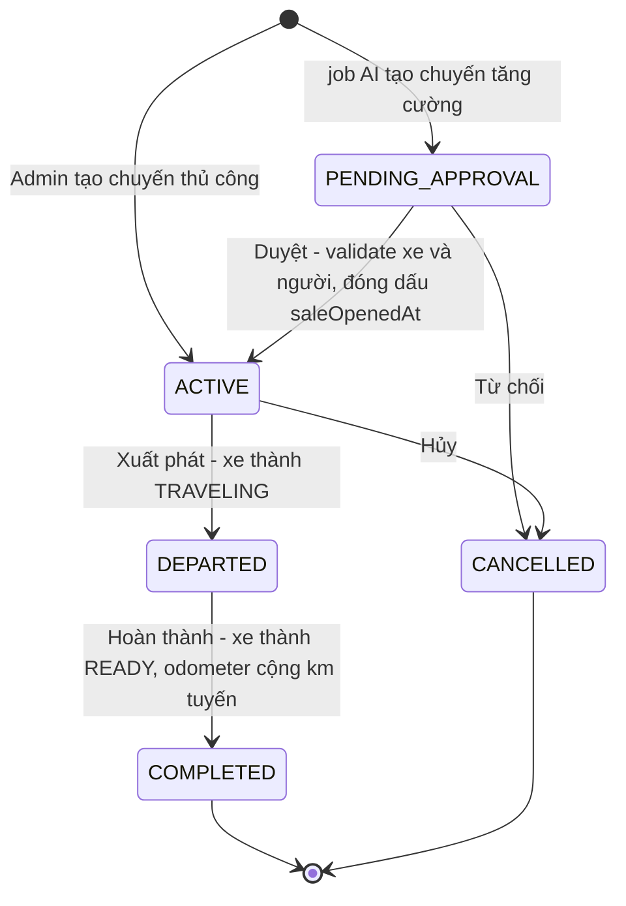
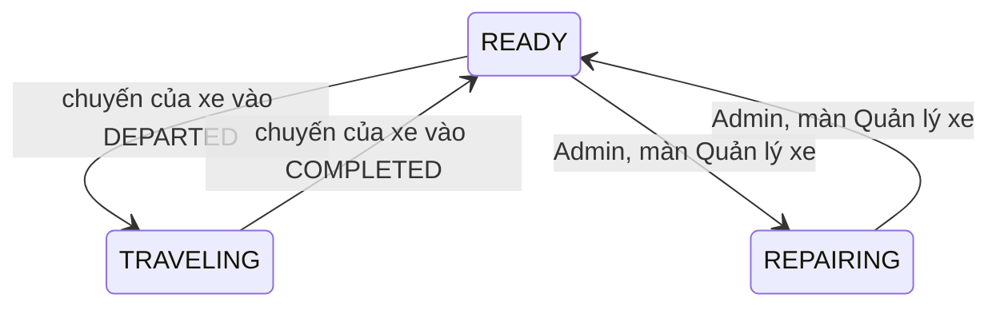
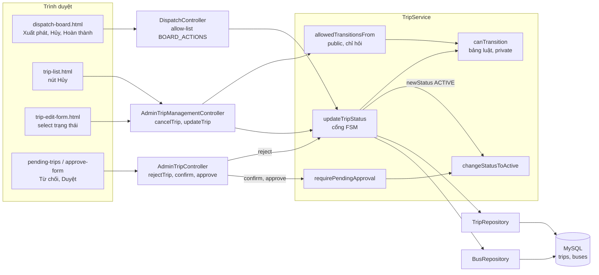
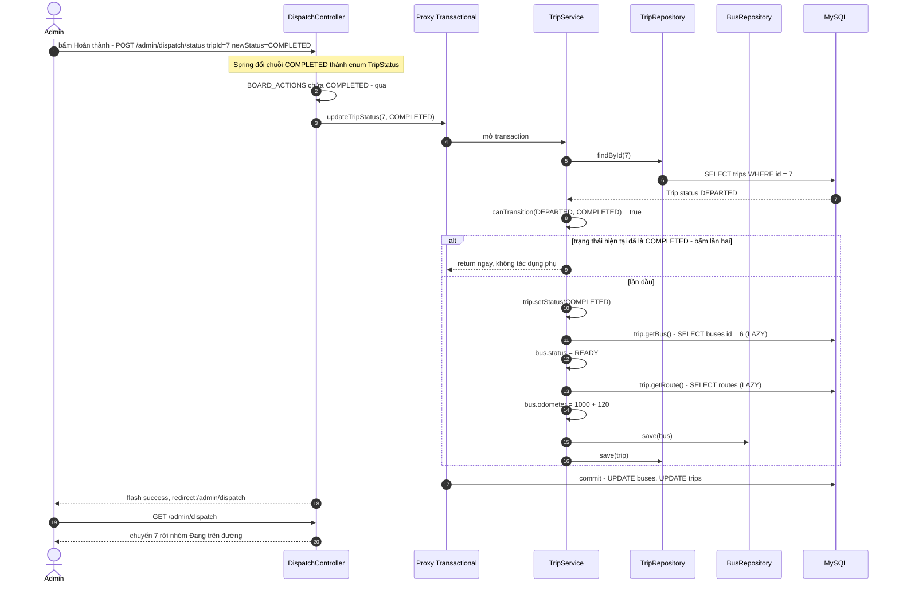
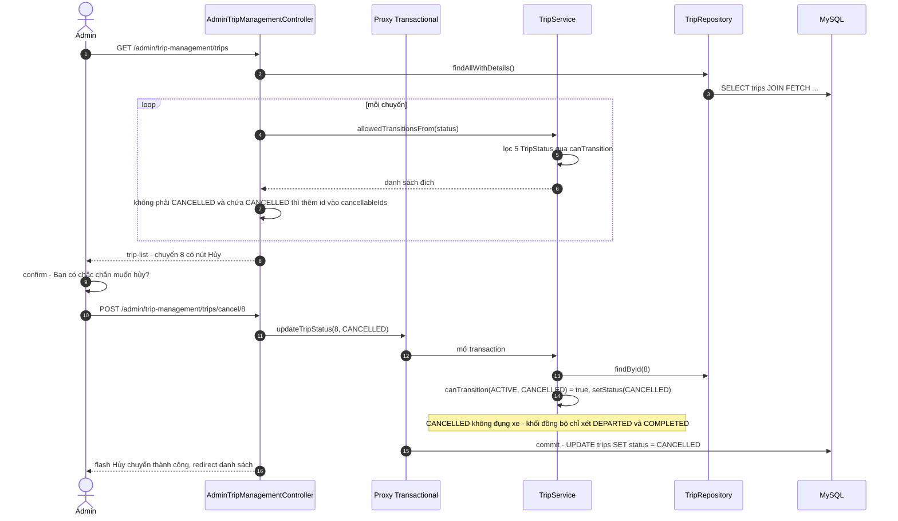

# Bài 05 — Trip FSM & Bus Status Synchronization (Vòng đời chuyến và đồng bộ trạng thái xe)

> Bài chức năng thứ năm, sinh từ `docs/ai/03_defense_study_prompt.md` (PHẦN B), ngày 2026-10-05.
> Học sau Bài 00a, 00b, 01–04. Số dòng là ảnh chụp ngày viết — lệch thì grep lại.
>
> Nhãn: [CODE] đọc thẳng từ code · [SPRING] hành vi chuẩn của Spring/Hibernate mà code không viết
> ra · [SUY LUẬN] suy luận của người viết ("chưa kiểm chứng" nếu chưa chạy thử).
>
> Viết tắt: `…/` = `src/main/java/giang/com/BusManagement/`, `test/` =
> `src/test/java/giang/com/BusManagement/`, `tpl/` = `src/main/resources/templates/`,
> `TS` = `…/service/TripService.java`.
>
> **Phạm vi.** Bài này **không có màn hình riêng**. Nó là một **bộ luật** sống trong `TripService`
> (khoảng `TS:574-695`, cộng `:892-899`, `:1451-1455`, `:1910-1915`) mà bốn màn khác gọi vào: Bảng
> điều hành (Bài 10), Danh sách / Sửa chuyến (Bài 07), Duyệt chuyến (Bài 09), và job AI (Bài 08). Ở
> đây chỉ trace **phần FSM** của các màn đó; phần còn lại (validate, form, JS) thuộc bài của chúng.

---

## §1. Chức năng này là gì — nói kiểu đời thường

**Vấn đề thật của nhà xe.** Một chuyến xe đi qua nhiều giai đoạn: đề xuất → mở bán vé → xe lăn
bánh → về bến. Có những bước **không được phép**: chuyến đã về bến thì không thể "mở bán lại", xe
đang chạy giữa đường thì không thể "hủy" như chưa từng chạy. Nếu để Admin đổi trạng thái tuỳ ý, dữ
liệu sẽ kể một câu chuyện vô lý — và tệ hơn, những con số **đi theo** trạng thái (xe đang chạy hay
rảnh, đồng hồ km của xe) sẽ sai.

**FSM** (*Finite State Machine — máy trạng thái hữu hạn*) — nôm na là "một bảng luật: đang ở ô nào
thì được bước sang ô nào". Dự án có đúng một bảng như vậy cho chuyến xe, và một nơi duy nhất thực thi
nó. Kèm theo bảng luật là **tác dụng phụ** (*side effect* — "việc phải làm thêm mỗi khi bước vào một
ô"): xe bắt đầu chạy thì đánh dấu xe `TRAVELING`; chuyến về bến thì trả xe về `READY` và **cộng số km
của tuyến vào đồng hồ km (odometer) của xe**.

Không có nó thì ai khổ? Người điều hành: xe đã về bến mà hệ thống vẫn coi là đang chạy, nên AI không
xếp xe đó cho chuyến mới; đồng hồ km không tăng nên xe tới hạn bảo trì mà không ai biết.

**Một kịch bản cụ thể** (số chuyến, biển số, km là minh hoạ). Sáng thứ Hai, chuyến #7 Hà Nội → Hải Phòng (120 km) đang bán vé. 6 giờ, chị
admin mở **Bảng Điều Hành**, thấy chuyến #7 ở nhóm "Trễ giờ" (đến giờ mà chưa bấm xuất phát). Chị bấm
**Xuất phát** → khung xanh *"Đã cập nhật chuyến #7 sang trạng thái DEPARTED."*; chuyến chuyển sang
nhóm "Đang trên đường", xe 29A-001.06 thành `TRAVELING`. 9 giờ xe về bến, chị bấm **Hoàn thành** → xe
về `READY`, đồng hồ km của xe tăng thêm 120. Chị lỡ tay bấm **Hoàn thành** hai lần — lần thứ hai
không cộng thêm km nào (đây chính là một lỗi thật đã sửa, §9.2).

Chiều hôm đó chị thử **Hủy** một chuyến đang chạy bằng một request tự chế → bị từ chối: *"Không thể
hủy: Lỗi luồng vận hành: Không thể chuyển trạng thái chuyến xe từ [DEPARTED] sang [CANCELLED]."*

---

## §2. Bản đồ tổng quan

### 2.1. Các mảnh ghép

| Loại | File | Trách nhiệm (1 dòng) |
|---|---|---|
| Enum | `…/domain/TripStatus.java:4` | 5 trạng thái chuyến, **thứ tự khai báo**: `ACTIVE, PENDING_APPROVAL, DEPARTED, COMPLETED, CANCELLED` |
| Enum | `…/domain/BusStatus.java:4-6` | `READY`, `TRAVELING`, `REPAIRING` |
| Entity | `…/domain/Trip.java:82-84`, `:95-96` | `status` (mặc định `PENDING_APPROVAL`), `saleOpenedAt` (mốc mở bán) |
| Entity | `…/domain/Bus.java:35-46` | `status`, `odometer`, `lastMaintenanceOdometer`, `getKmSinceLastMaintenance()` |
| Service — luật | `TS:575-585` `canTransition()` | Bảng whitelist (private) |
| Service — luật | `TS:602-606` `allowedTransitionsFrom()` | Cửa sổ **public** duy nhất nhìn vào bảng, cho UI hỏi |
| Service — thực thi | `TS:636-695` `updateTripStatus()` | Kiểm bảng → guard cùng trạng thái → đổi trạng thái → đồng bộ xe |
| Service — helper | `TS:1910-1915` `changeStatusToActive()` | Đặt `ACTIVE` + đóng dấu `saleOpenedAt` nếu chưa có |
| Service — guard | `TS:892-899` `requirePendingApproval()` | Hai lối duyệt chỉ nhận chuyến `PENDING_APPROVAL` (lỗi #20) |
| Service | `TS:1451-1455` `rejectTrip()` | Từ chối chuyến đề xuất = `updateTripStatus(id, CANCELLED)` |
| Controller | `…/controller/admin/DispatchController.java` | Lối vào chính của `DEPARTED`/`COMPLETED`; allow-list `BOARD_ACTIONS` (`:59-60`) |
| Controller | `…/controller/admin/AdminTripManagementController.java` | Hủy (`:454-466`), Sửa đổi trạng thái (`:339-444`), quyết định nút Hủy (`:80-101`) |
| Controller | `…/controller/admin/AdminTripController.java:210-220` | Từ chối chuyến đề xuất |
| Template | `tpl/admin/dispatch-board.html` | Nút Xuất phát (`:79-84`, `:199-204`), Hủy (`:85-91`, `:205-211`), Hoàn thành (`:144-149`) |
| Template | `tpl/admin/trip-list.html:462-470`; `trip-edit-form.html:201-204` | Nút Hủy; select trạng thái |
| Template | `tpl/admin/pending-trips.html:144-147`; `approve-form.html:199-204`, `:336-337` | Nút Từ chối |
| Test | `test/service/TripServiceStatusTransitionTest.java` (10 test); `TripServicePolicyExposureTest.java` (5 test, 3 về FSM) | §9.4 |
| Tài liệu | `docs/architecture/trip_lifecycle_fsm.md` | Đặc tả FSM — đọc kèm |

### 2.2. Bảng endpoint — đủ mọi điểm bắt đầu

FSM được chạm theo ba cách: **ghi qua cổng FSM** (`updateTripStatus`), **vào `ACTIVE` không qua cổng**
(`changeStatusToActive` trực tiếp), và **hỏi** bảng luật (`allowedTransitionsFrom`). Không có `fetch()`
nào trong luồng. `DC` = `DispatchController.java`, `ATM` = `AdminTripManagementController.java`, `ATC` =
`AdminTripController.java`.

| HTTP / trigger | URL | Controller method | Được gọi từ đâu | Service chính | Kết quả |
|---|---|---|---|---|---|
| GET | `/admin/dispatch` | `DC.viewBoard()` `:62-92` | menu; mọi redirect của `changeStatus()` | `getDispatchBoardTrips(now + 48h)` (`TS:1765-1768`) | view `admin/dispatch-board` — quyết định chuyến nào có nút gì (chi tiết: Bài 10) |
| POST | `/admin/dispatch/status` | `DC.changeStatus()` `:104-125` | 3 nút trên `dispatch-board.html` (hidden `newStatus` = `DEPARTED` / `CANCELLED` / `COMPLETED`) | `updateTripStatus(tripId, newStatus)` | redirect `/admin/dispatch` + `success`/`error` |
| POST | `/admin/trip-management/trips/cancel/{id}` | `ATM.cancelTrip()` `:454-466` | nút Hủy + `confirm()` `trip-list.html:462-470` | `updateTripStatus(id, CANCELLED)` | redirect `/admin/trip-management/trips` |
| POST | `/admin/trip-management/trips/update` | `ATM.updateTrip()` `:339-444` | select `status` `trip-edit-form.html:201` (chi tiết: Bài 07) | pre-check `allowedTransitionsFrom` → `updateManualTrip` → `updateTripStatus` nếu trạng thái đổi | redirect danh sách / form sửa |
| POST | `/admin/trips/reject/{id}` | `ATC.rejectTrip()` `:210-220` | "Từ chối" `pending-trips.html:144`, `approve-form.html:199`, `:336` | `TripService.rejectTrip()` → `updateTripStatus(id, CANCELLED)` | redirect `/admin/trips/pending` |
| GET | `/admin/trip-management/trips`, `/trips/filter` | `ATM.listAllTrips()` `:33`, `filterTrips()` `:43` → `populateTripList()` `:80-101` | menu, mọi redirect về danh sách | `allowedTransitionsFrom(status)` | `cancellableIds` quyết định nút Hủy |
| GET | `/admin/trip-management/trips/edit/{id}` | `ATM.showEditTripForm()` `:248-295` | nút Sửa | `allowedTransitionsFrom(trip.status)` (`:282`) | `statuses` = option của select |
| POST | `/admin/trips/confirm` | `ATC.confirmAutoAssigned()` `:135` | màn Duyệt (Bài 09) | `confirmAutoAssignedTrip()` → `requirePendingApproval` (`TS:918`) → `changeStatusToActive` (`TS:932`) | **vào `ACTIVE` không qua `canTransition`** |
| POST | `/admin/trips/approve` | `ATC.processManualApproval()` `:166` | màn Duyệt (Bài 09) | `approveTrip()` → `requirePendingApproval` (`TS:961`) → `changeStatusToActive` (`TS:1010`) | như trên |
| POST | `/admin/trip-management/trips/create` | `ATM.createTrip()` `:120-177` | form Tạo (Bài 07) | controller đặt `ACTIVE` (`:161`) → `createManualTrip()` → `changeStatusToActive` (`TS:1054`) | chuyến **sinh ra** ở `ACTIVE` |
| `@Scheduled` mỗi 10 s | — | `TS.scanAndSuggestExtraTrips()` `:76-78` | job nền (Bài 08) | `createExtraTrip()` đặt `PENDING_APPROVAL` (`TS:166`) | chuyến **sinh ra** ở `PENDING_APPROVAL` |
| `CommandLineRunner` | profile `demo` / `backfill` | `DataInitializer` `:332`, `HistoricalDataBackfill` `:347` | lúc khởi động (Bài 13) | `setStatus()` thẳng — **cố ý đi vòng FSM** khi dựng dữ liệu | dữ liệu seed / lịch sử |

### 2.3. Sơ đồ toàn cảnh

Vòng đời của chuyến (bảng luật `canTransition`, `TS:575-585`) và tác dụng phụ khi **vào** từng trạng
thái:



Cột `buses.status` đi theo (chỉ hai dòng do FSM ghi; `REPAIRING` là việc của Bài 01):



Ai gọi vào đâu:



### 2.4. Điều cốt lõi cần nhớ

1. **Một bảng luật, một chỗ.** `canTransition()` là private; UI chỉ được **hỏi** qua
   `allowedTransitionsFrom()`. Chỉ có 5 bước hợp lệ (cộng "giữ nguyên"); `COMPLETED` và `CANCELLED`
   là **trạng thái cuối** (*terminal state* — "ô cuối, không đi đâu được nữa").
2. **FSM chỉ hỏi "bước này có hợp lệ không", không hỏi "xe/người có hợp lệ không".**
   `updateTripStatus()` **không** gọi `validateBusForTrip()`/`validateStaffForTrip()` (javadoc
   `TS:610-614`). Vì vậy mỗi lối gọi có thể truyền `ACTIVE` phải tự validate — hoặc bị chặn không cho
   truyền (allow-list `BOARD_ACTIONS`, lỗi #10).
3. **Tác dụng phụ chạy khi VÀO trạng thái, không chạy khi "set lại" trạng thái đang có.** Guard
   `TS:663-665` biến "set lại" thành **no-op** (*"thao tác không làm gì"*) — thiếu nó thì bấm "Hoàn
   thành" hai lần là cộng km hai lần (lỗi #6).
4. **Có bốn lối vào `ACTIVE`, chỉ một lối đi qua `canTransition()`.** Ba lối còn lại gọi thẳng
   `changeStatusToActive()`; hai lối duyệt được bảo vệ bằng `requirePendingApproval()` (lỗi #20), lối
   tạo mới thì không có trạng thái nguồn để kiểm.
5. **Cặp `TRAVELING` ↔ `READY` chỉ đúng khi xe của chuyến không đổi giữa chừng.** FSM không nhớ đã
   đánh dấu xe nào — nó đọc lại `trip.getBus()` ở cả hai đầu. Bất biến này (*invariant* — "điều luôn
   phải đúng") được giữ **bên ngoài** FSM: chuyến `DEPARTED` không sửa được (lỗi #14/#18), xe có
   chuyến chưa kết thúc không đặt được `REPAIRING` (lỗi #15).

---

## §3. Trace chi tiết các luồng chính

**Chọn luồng nào và vì sao.**

- **Luồng A — Bảng điều hành: "Hoàn thành" một chuyến `DEPARTED`** (kèm nhánh bấm lần hai). Đây là
  bước duy nhất có **đủ** mọi thành phần của FSM: kiểm bảng luật, guard cùng trạng thái, đổi trạng
  thái, đồng bộ xe, cộng odometer, và hai entity cùng được ghi trong một transaction. Cũng là nơi xảy
  ra lỗi nặng nhất của chức năng (#6).
- **Luồng B — Danh sách chuyến: nút "Hủy" một chuyến `ACTIVE`.** Cho thấy nửa còn lại: UI **hỏi**
  bảng luật để quyết định có hiện nút hay không (lỗi #23), rồi cùng bảng luật đó **chặn thật** ở
  server.

### 3.1. Luồng A — "Hoàn thành" trên Bảng điều hành

Tình huống (số liệu minh hoạ): chuyến #7 đang `DEPARTED`, xe #6 đang `TRAVELING`, `odometer = 1000`,
tuyến 120 km.

**(a) Sơ đồ**



**(b) Bảng từng bước**

| # | Tầng | Vị trí | Method / thành phần | Nhận vào | Làm gì | Trả về / gọi tiếp | Nhãn |
|---|---|---|---|---|---|---|---|
| 1 | View | `dispatch-board.html:127-149` | dòng "Đang trên đường" | `inProgressTrips` | mỗi chuyến `DEPARTED` có một form POST trần: hidden `tripId`, hidden `newStatus=COMPLETED`, nút "Hoàn thành". **Không** có `confirm()`, nút **không** bị vô hiệu sau khi bấm | POST | [CODE] |
| 2 | Trình duyệt | — | gửi form | — | body `tripId=7&newStatus=COMPLETED` | POST | [SPRING] |
| 3 | Spring | `DC:104-107` | `@RequestParam Long tripId`, `@RequestParam TripStatus newStatus` | chuỗi | `DispatcherServlet` tìm handler theo `@RequestMapping("/admin/dispatch")` + `@PostMapping("/status")`; bộ chuyển đổi chuỗi → enum biến `"COMPLETED"` thành `TripStatus.COMPLETED` (sai chính tả ⇒ lỗi 400 trước khi vào method) | `changeStatus(7, COMPLETED, …)` | [SPRING] |
| 4 | Controller | `DC:108-114` | allow-list | `COMPLETED` | `BOARD_ACTIONS = {DEPARTED, CANCELLED, COMPLETED}` (`:59-60`) chứa ⇒ đi tiếp. Không chứa (vd `ACTIVE`) ⇒ flash `error` "Bảng điều hành không hỗ trợ…" và **không gọi service** | — | [CODE] |
| 5 | Controller | `DC:116` | `tripService.updateTripStatus(7, COMPLETED)` | — | gọi trong `try` | → proxy | [CODE] |
| 6 | Proxy | `TS:636` | `@Transactional` | — | **mở transaction** (Bài 00b §4.2) | — | [SPRING] |
| 7 | Service → DB | `TS:638-639` | `tripRepository.findById(7)` | 7 | không thấy ⇒ `EntityNotFoundException("Không tìm thấy chuyến đi với ID: 7")`. [SUY LUẬN — SQL tương đương] `SELECT * FROM trips WHERE id = 7 AND is_deleted = false` (vế cuối do `@SQLRestriction`, `Trip.java:21`, Bài 00b §1.5). Các quan hệ `route`, `bus`… là LAZY (`Trip.java:39-47`) nên **chưa** nạp | `trip` managed, `status = DEPARTED` | [CODE]+[SPRING] |
| 8 | Service | `TS:642-646` → `:575-585` | `canTransition(DEPARTED, COMPLETED)` | — | `from != to`; `switch (from)` nhánh `DEPARTED -> to == COMPLETED` ⇒ `true`. Nếu `false` ⇒ ném `IllegalStateException("Lỗi luồng vận hành: Không thể chuyển trạng thái chuyến xe từ [..] sang [..].")` (§4) | — | [CODE] |
| 9 | Service | `TS:663-665` | guard cùng trạng thái | `DEPARTED` vs `COMPLETED` | khác nhau ⇒ đi tiếp. **Nhánh bấm lần hai**: trạng thái đã là `COMPLETED` ⇒ bước 8 vẫn `true` (vì `from == to`), và dòng này `return` ngay — xem bảng nhánh bên dưới | — | [CODE] |
| 10 | Service | `TS:667-671` | đổi trạng thái | `COMPLETED` | không phải `ACTIVE` ⇒ `trip.setStatus(COMPLETED)` (chỉ đổi object trong RAM) | — | [CODE] |
| 11 | Service → DB | `TS:676` | `trip.getBus() != null` | — | lần đầu chạm `bus` LAZY ⇒ Hibernate nạp. [SUY LUẬN — SQL tương đương] `SELECT * FROM buses WHERE id = 6`. Chuyến không có xe ⇒ bỏ qua cả khối đồng bộ, chỉ đổi trạng thái chuyến | `bus` (status `TRAVELING`, odometer 1000) | [SPRING] |
| 12 | Service | `TS:680-681` | `newStatus == COMPLETED` | — | `bus.setStatus(READY)` | — | [CODE] |
| 13 | Service → DB | `TS:684` | `trip.getRoute()` | — | nạp LAZY `route`. [SUY LUẬN — SQL tương đương] `SELECT * FROM routes WHERE id = ?`. Tuyến `null` hoặc `distanceKm` `null` ⇒ **không cộng km**, xe vẫn về `READY` | `distanceKm = 120.0` | [CODE]+[SPRING] |
| 14 | Service | `TS:685-688` | cộng odometer | `odometer = 1000.0` | `currentOdo` = odometer, hoặc `0.0` nếu `null`; `setOdometer(1000 + 120)`. **Không** đụng `lastMaintenanceOdometer` ⇒ `getKmSinceLastMaintenance()` tăng đúng 120 (`Bus.java:42-46`) | — | [CODE] |
| 15 | Service | `TS:691`, `:694` | `busRepository.save(bus)`, `tripRepository.save(trip)` | entity managed | cả hai đã managed, nên dirty checking đã đủ — `save()` chỉ để rõ ý (Bài 00b §4.3) | — | [SPRING] |
| 16 | Proxy | — | **commit** | — | Hibernate so bản chụp ⇒ hai câu ghi. [SUY LUẬN — SQL tương đương] `UPDATE buses SET status = 'READY', odometer = 1120, … WHERE id = 6` và `UPDATE trips SET status = 'COMPLETED', … WHERE id = 7` (Hibernate mặc định ghi đủ các cột của entity). **Đóng transaction** | — | [SPRING] |
| 17 | Controller | `DC:117-118`, `:124` | flash + redirect | — | `success` = "Đã cập nhật chuyến #7 sang trạng thái COMPLETED." → `redirect:/admin/dispatch` | 302 | [CODE] |
| 18 | Controller → DB | `DC:62-66` → `TS:1765-1768` → `TripRepository.java:288-302` | `viewBoard()` → `getDispatchBoardTrips(now + 48h)` | — | JPQL `SELECT DISTINCT t FROM Trip t LEFT JOIN FETCH t.route … WHERE t.status IN (ACTIVE, DEPARTED) AND t.departureTime <= :until` — chuyến #7 giờ là `COMPLETED` nên **không** còn trong kết quả | `List<Trip>` | [CODE] |
| 19 | Controller | `DC:69-90` | chia nhóm bằng Stream | danh sách | `inProgress` = `DEPARTED`; `overdue` = `ACTIVE` đã tới giờ; `upcoming` = `ACTIVE` chưa tới giờ; mỗi nhóm sắp theo giờ khởi hành; đưa vào Model các key `inProgressTrips`, `overdueTrips`, `upcomingTrips`, `windowHours`, `now` | view `admin/dispatch-board` | [CODE] |
| 20 | View | `dispatch-board.html:31-34` | khung xanh | `success` | hiện câu ở bước 17; chuyến #7 biến khỏi bảng | HTML | [CODE] |

**Nhánh "bấm lần hai"** (chuyến #7 đã `COMPLETED`, odometer đã là 1120):

| # | Vị trí | Làm gì | Nhãn |
|---|---|---|---|
| 8′ | `TS:576-577` | `from == to` ⇒ `canTransition` trả `true` — "giữ nguyên luôn hợp lệ" | [CODE] |
| 9′ | `TS:663-665` | `trip.getStatus() == newStatus` ⇒ `return`. Không đổi gì, **không** chạm `bus`, không cộng km | [CODE] |
| 16′ | proxy | commit một transaction không có câu ghi nào [SPRING] | [SPRING] |
| 17′ | `DC:117-118` | vẫn flash *"Đã cập nhật chuyến #7 sang trạng thái COMPLETED."* — câu báo thành công dù không có gì thay đổi; vô hại | [CODE] |

Trước ngày 2026-07-30 **không có** dòng `:663-665`, nên bước 9′ đi tiếp xuống khối đồng bộ và cộng
120 km lần nữa (§8.1).

**Ranh giới transaction:** đúng **một** transaction, mở ở bước 6 và đóng ở bước 16. Controller không
có `@Transactional` nhưng chỉ gọi **một** method service, nên trạng thái chuyến và trạng thái + km của
xe được ghi **cùng nhau hoặc không cái nào** [SPRING]. Bước 18 là request GET mới, đọc trong
transaction riêng (nếu có) — không liên quan.

**(c) Code then chốt**

`TS:636-695` (rút gọn):

```java
@Transactional                                           // trip và bus: cùng thành hoặc cùng hỏng
public void updateTripStatus(Long tripId, TripStatus newStatus) {
    Trip trip = tripRepository.findById(tripId)
            .orElseThrow(() -> new EntityNotFoundException("Không tìm thấy chuyến đi với ID: " + tripId));

    if (!canTransition(trip.getStatus(), newStatus)) {   // 1. hỏi bảng luật
        throw new IllegalStateException(String.format(
                "Lỗi luồng vận hành: Không thể chuyển trạng thái chuyến xe từ [%s] sang [%s].",
                trip.getStatus(), newStatus));
    }

    if (trip.getStatus() == newStatus) {                 // 2. "set lại" ≠ "bước vào": không làm gì
        return;                                          //    (lỗi #6 — KHÔNG được bỏ)
    }

    if (newStatus == TripStatus.ACTIVE) {                // 3. đổi trạng thái
        changeStatusToActive(trip);                      //    vào ACTIVE: kèm đóng dấu saleOpenedAt
    } else {
        trip.setStatus(newStatus);
    }

    if (trip.getBus() != null) {                         // 4. đồng bộ xe — chỉ xét newStatus
        if (newStatus == TripStatus.DEPARTED) {
            trip.getBus().setStatus(BusStatus.TRAVELING);   // xe lên đường
            busRepository.save(trip.getBus());
        } else if (newStatus == TripStatus.COMPLETED) {
            trip.getBus().setStatus(BusStatus.READY);       // xe rảnh trở lại
            if (trip.getRoute() != null && trip.getRoute().getDistanceKm() != null) {
                double currentOdo = trip.getBus().getOdometer() != null
                        ? trip.getBus().getOdometer() : 0.0;            // null coi như 0
                trip.getBus().setOdometer(currentOdo + trip.getRoute().getDistanceKm()); // + km tuyến
            }
            busRepository.save(trip.getBus());
        }
    }
    tripRepository.save(trip);
}
```

Để ý khối 4 **chỉ nhìn `newStatus`**, không nhìn trạng thái cũ. Nó "an toàn" chỉ vì khối 1 và 2 đã
bảo đảm rằng tới được đây nghĩa là **thật sự vừa chuyển** sang `newStatus`. Đó là lý do comment
`TS:648-662` viết hoa "KHÔNG BỎ GUARD NÀY".

`TS:575-585` — bảng luật, dạng *switch expression* (Bài 00a §2.6):

```java
private boolean canTransition(TripStatus from, TripStatus to) {
    if (from == to)
        return true;                         // giữ nguyên luôn hợp lệ
    return switch (from) {                   // switch TRẢ VỀ một boolean
        case PENDING_APPROVAL -> to == TripStatus.ACTIVE || to == TripStatus.CANCELLED;
        case ACTIVE           -> to == TripStatus.DEPARTED || to == TripStatus.CANCELLED;
        case DEPARTED         -> to == TripStatus.COMPLETED;
        default               -> false;      // COMPLETED, CANCELLED: trạng thái cuối
    };
}
```

Viết lại bằng `if` cho dễ đọc:

```java
if (from == to) return true;
if (from == TripStatus.PENDING_APPROVAL) return to == TripStatus.ACTIVE || to == TripStatus.CANCELLED;
if (from == TripStatus.ACTIVE)           return to == TripStatus.DEPARTED || to == TripStatus.CANCELLED;
if (from == TripStatus.DEPARTED)         return to == TripStatus.COMPLETED;
return false;                            // mọi trường hợp khác
```

Switch này **có** `default` — ngược với `deleteRefusalReason()` cố ý **không có** `default` (Bài 00a
§2.6). Vì sao khác nhau: xem §9.1.

### 3.2. Luồng B — Nút "Hủy" một chuyến `ACTIVE` trên danh sách chuyến

Tình huống (số liệu minh hoạ): chuyến #8 `ACTIVE`, đã bán 12 vé, xe #5 `READY`.

**(a) Sơ đồ**



**(b) Bảng từng bước**

| # | Tầng | Vị trí | Method / thành phần | Nhận vào | Làm gì | Trả về / gọi tiếp | Nhãn |
|---|---|---|---|---|---|---|---|
| 1 | Controller | `ATM:33-38` | `listAllTrips()` | — | `tripRepository.findAllWithDetails()` — **controller inject thẳng repository** (`:22`), anti-pattern đã biết của roadmap §3; phần FSM thì vẫn đi qua service | `List<Trip>` | [CODE] |
| 2 | Controller | `ATM:80-95` | `populateTripList()` | danh sách | vòng `for` trên danh sách đã nạp, **không** truy vấn thêm; với mỗi chuyến: `status != CANCELLED` **và** `allowedTransitionsFrom(status).contains(CANCELLED)` ⇒ thêm id vào `cancellableIds` (`:88-91`) | 3 tập id | [CODE] |
| 3 | Service | `TS:602-606` | `allowedTransitionsFrom(ACTIVE)` | `ACTIVE` | duyệt `TripStatus.values()` theo thứ tự khai báo, giữ `to` nào `canTransition(ACTIVE, to)` đúng ⇒ `[ACTIVE, DEPARTED, CANCELLED]` (§8.2). Không có `@Transactional`, không chạm DB | `List<TripStatus>` | [CODE] |
| 4 | Controller | `ATM:96-100` | Model | — | key `trips`, `statuses`, `editableIds`, `cancellableIds`, `deletableIds` | `admin/trip-list` | [CODE] |
| 5 | View | `trip-list.html:462-470` | `th:if="${cancellableIds.contains(trip.id)}"` | — | chuyến #8 có nút Hủy: form POST tới `/admin/trip-management/trips/cancel/8`, `onsubmit="return confirm('Bạn có chắc chắn muốn hủy chuyến xe này?')"`. Chuyến `DEPARTED`/`COMPLETED`/`CANCELLED` **không** có nút | HTML | [CODE] |
| 6 | JavaScript | `trip-list.html:466` | `confirm()` | — | Admin bấm **Cancel** ⇒ `onsubmit` trả `false`, không gửi gì; bấm **OK** ⇒ gửi POST | POST | [CODE] |
| 7 | Spring | `ATM:454` | `@PathVariable Long id` | `/cancel/8` | đọc `8` từ URL | `cancelTrip(8, …)` | [SPRING] |
| 8 | Controller | `ATM:457` | `tripService.updateTripStatus(8, CANCELLED)` | — | **hằng số** `CANCELLED` — lối này không bao giờ truyền được `ACTIVE` (javadoc `TS:625-626`) | → proxy | [CODE] |
| 9 | Proxy | `TS:636` | `@Transactional` | — | mở transaction | — | [SPRING] |
| 10 | Service → DB | `TS:638-639` | `findById(8)` | — | như Luồng A bước 7 | `trip` `ACTIVE` | [SPRING] |
| 11 | Service | `TS:642`, `:581` | `canTransition(ACTIVE, CANCELLED)` | — | nhánh `ACTIVE -> to == DEPARTED \|\| to == CANCELLED` ⇒ `true` | — | [CODE] |
| 12 | Service | `TS:663-671` | guard + đổi | — | khác trạng thái ⇒ `trip.setStatus(CANCELLED)` | — | [CODE] |
| 13 | Service | `TS:676-693` | khối đồng bộ | `newStatus = CANCELLED` | không phải `DEPARTED` cũng không phải `COMPLETED` ⇒ **không làm gì với xe**. Xe #5 vẫn `READY` (nó chưa từng bị đánh `TRAVELING`, vì chuyến chưa xuất phát). Vì `getBus()` có được gọi ở `:676` nhưng chỉ so với `null`, [SUY LUẬN] Hibernate không cần nạp xe (chưa kiểm chứng) | — | [CODE] |
| 14 | Proxy | — | commit | — | [SUY LUẬN — SQL tương đương] `UPDATE trips SET status = 'CANCELLED', … WHERE id = 8`. `tickets_sold` **giữ nguyên 12** — không có hoàn vé | — | [SPRING] |
| 15 | Controller | `ATM:458`, `:465` | flash + redirect | — | `success` = "Hủy chuyến thành công!" → `redirect:/admin/trip-management/trips` | 302 | [CODE] |
| 16 | View | `trip-list.html` | danh sách | — | chuyến #8 hiện nhãn `CANCELLED` (`:440-441`), **mất** nút Hủy (bước 2: `status == CANCELLED` bị loại). Nút Sửa và Xóa vẫn còn — sửa được (`editRefusalReason` cho `CANCELLED`, `ATM:244`), xóa được dù có vé (`deleteRefusalReason`, `TS:1875`) | HTML | [CODE] |

**Ranh giới transaction:** bước 1–4 là request GET (đọc). Bước 9–14 là **một** transaction; không có
gì khác được ghi.

**Hệ quả xa (Bài 08).** Nếu #8 là **chuyến tăng cường** AI tạo, `CANCELLED` không nằm trong tập "đã
đề xuất rồi" của `hasAlreadySuggested()` (`TS:1735-1742`; `trip_lifecycle_fsm.md` §6.1), nên lần quét
10 giây kế tiếp có thể đề xuất một chuyến tăng cường mới cho cùng chuyến gốc — có chủ đích.

**(c) Code then chốt**

`ATM:84-95` — UI hỏi luật, không chép luật:

```java
for (Trip trip : trips) {
    if (editRefusalReason(trip) == null) {                       // chính sách SỬA (lỗi #18)
        editableIds.add(trip.getId());
    }
    if (trip.getStatus() != TripStatus.CANCELLED                 // chuyến đã hủy: nút Hủy vô nghĩa
            && tripService.allowedTransitionsFrom(trip.getStatus())
                    .contains(TripStatus.CANCELLED)) {           // FSM có nhận bước "→ CANCELLED"?
        cancellableIds.add(trip.getId());
    }
    if (tripService.deleteRefusalReason(trip) == null) {         // chính sách XÓA
        deletableIds.add(trip.getId());
    }
}
```

`TS:602-606` — liệt kê bảng luật, không định nghĩa lại:

```java
public List<TripStatus> allowedTransitionsFrom(TripStatus from) {
    return java.util.Arrays.stream(TripStatus.values())   // 5 trạng thái, theo thứ tự khai báo enum
            .filter(to -> canTransition(from, to))        // giữ đích nào bảng luật cho phép
            .collect(Collectors.toList());                // gom thành List
}
```

Viết lại bằng vòng `for`:

```java
List<TripStatus> result = new ArrayList<>();
for (TripStatus to : TripStatus.values()) {     // ACTIVE, PENDING_APPROVAL, DEPARTED, COMPLETED, CANCELLED
    if (canTransition(from, to)) {              // chính bảng luật private ở trên
        result.add(to);
    }
}
return result;
```

---

## §4. Luồng lỗi — Hủy một chuyến đang chạy (`DEPARTED → CANCELLED`)

Nút Hủy **không hiện** trên chuyến `DEPARTED` (Luồng B bước 2). Nhưng một trang cũ còn mở, hoặc một
POST tự chế, vẫn gửi được. Lần kiểm chứng lại lỗi #23 (2026-09-19) đã gửi đúng request này lên bản
sao DB thật (`cancel/3`, chuyến 3 `DEPARTED`) — kết quả dưới đây là kết quả đo được.

| Bước | Chuyện gì xảy ra | Vị trí | Nhãn |
|---|---|---|---|
| 1 | `POST /admin/trip-management/trips/cancel/3` → `cancelTrip(3)` gọi `updateTripStatus(3, CANCELLED)` trong `try` | `ATM:456-457` | [CODE] |
| 2 | Proxy mở transaction; `findById(3)` ⇒ `status = DEPARTED` | `TS:636-639` | [SPRING] |
| 3 | `canTransition(DEPARTED, CANCELLED)`: nhánh `DEPARTED -> to == COMPLETED` ⇒ `false` | `TS:582` | [CODE] |
| 4 | Ném `IllegalStateException("Lỗi luồng vận hành: Không thể chuyển trạng thái chuyến xe từ [DEPARTED] sang [CANCELLED].")` — **trước** mọi lệnh ghi | `TS:643-645` | [CODE] |
| 5 | Exception là *unchecked* (kế thừa `RuntimeException`) ⇒ proxy **rollback**. Không có gì để hoàn tác vì chưa đổi gì | — | [SPRING] |
| 6 | `catch (IllegalStateException e)` ⇒ flash `error` = "Không thể hủy: " + câu ở bước 4 | `ATM:459-461` | [CODE] |
| 7 | `redirect:/admin/trip-management/trips` → khung đỏ trên danh sách; chuyến 3 vẫn `DEPARTED`, xe vẫn `TRAVELING` | `ATM:465` | [CODE] |

Đo thật (`current_bugs_found.md` #23, phần kiểm chứng lại): *flash "Không thể hủy: Lỗi luồng vận hành:
… từ [DEPARTED] sang [CANCELLED]", DB không đổi.*

**Vì sao FSM cấm `DEPARTED → CANCELLED`?** Xe đã lăn bánh; "hủy" sẽ xoá dấu vết rằng chuyến đã chạy.
Hệ quả có chủ đích nhưng cần biết: hệ thống **không mô hình hoá sự cố giữa đường** — xe hỏng giữa
đường thì chuyến vẫn chỉ có lối ra `COMPLETED` (roadmap §9, ghi chú #15). Thêm lối đó là **tính năng
mới**, không phải sửa lỗi.

**Các lỗi khác và đường về:**

| Nguyên nhân | Ném ở | Loại | Ai bắt, quay về đâu |
|---|---|---|---|
| Dispatch gửi `newStatus=ACTIVE` hoặc `PENDING_APPROVAL` (tự chế) | `DC:108-114` — **không** ném, chặn trước service | — | flash *"Bảng điều hành không hỗ trợ chuyển chuyến #… sang trạng thái ACTIVE. Việc kích hoạt chuyến phải thực hiện ở màn Phê Duyệt…"* → `/admin/dispatch` |
| Dispatch: bước sai bảng luật (vd `ACTIVE → COMPLETED` tự chế) | `TS:643` | `IllegalStateException` | `DC:119-120` "Không thể đổi trạng thái: …" → `/admin/dispatch` |
| `newStatus` không phải tên enum (`newStatus=XYZ`) | Spring, trước khi vào method | lỗi chuyển kiểu | [SPRING] HTTP 400, **không** có flash — controller không bao giờ chạy |
| Chuyến không tồn tại / đã xóa mềm | `TS:639` | `EntityNotFoundException` (unchecked) | Dispatch: `catch (Exception)` `DC:121-122` "Lỗi: Không tìm thấy chuyến đi với ID: …"; Hủy: `ATM:462-463` "Lỗi: …" |
| Từ chối (request tự chế) một chuyến `DEPARTED` hoặc `COMPLETED` | `TS:643` (qua `rejectTrip`) | `IllegalStateException` | `ATC:216-217` gộp chung `catch (Exception)` ⇒ "Lỗi: Lỗi luồng vận hành: …" → `/admin/trips/pending`. Còn với chuyến `ACTIVE` thì **không** lỗi: `ACTIVE → CANCELLED` hợp lệ, nên "từ chối" sẽ **hủy** nó; với chuyến đã `CANCELLED` là no-op. `rejectTrip` không tự kiểm `PENDING_APPROVAL` (§9.3) |
| Duyệt chuyến không còn `PENDING_APPROVAL` | `TS:892-899` `requirePendingApproval()` | `IllegalStateException` | Bài 09 — "Chuyến #… đang ở trạng thái …, không phải PENDING_APPROVAL nên không thể phê duyệt…" |
| Sửa chuyến, chọn đích không hợp lệ | `ATM:373-380` — kiểm **trước** khi ghi | — | flash "… chưa có thay đổi nào được lưu. Các đích hợp lệ: […]" → form sửa (Bài 07) |

---

## §5. Các luồng còn lại — trace rút gọn

- **Xuất phát (`ACTIVE → DEPARTED`) trên Bảng điều hành** — `[dispatch-board.html:79-84 / :199-204,
  newStatus=DEPARTED]` → `DC.changeStatus()` → allow-list qua → `TS.updateTripStatus()` → `canTransition`
  nhánh `ACTIVE` ⇒ `true` → `setStatus(DEPARTED)` → `bus.setStatus(TRAVELING)` + `busRepository.save`
  (`TS:677-679`) → commit → `redirect:/admin/dispatch`. **Không có điều kiện thời gian**: nút Xuất phát
  hiện cả ở nhóm "Sắp khởi hành" (chuyến chưa tới giờ), và FSM không so `departureTime` với giờ hiện
  tại [CODE].
- **Hủy trên Bảng điều hành** — `[dispatch-board.html:85-91 / :205-211, confirm('Hủy chuyến này?')]` →
  như Luồng B từ bước 9. Chỉ hiện ở hai nhóm `ACTIVE`; nhóm "Đang trên đường" không có nút Hủy.
- **Từ chối chuyến đề xuất** — `[pending-trips.html:144-147 / approve-form.html:199-204, :336-337]` →
  `ATC.rejectTrip()` `:210-220` → proxy mở transaction ở `TS.rejectTrip()` `:1451` → gọi
  `updateTripStatus()` **nội bộ** (`:1453`). Đây là *self-invocation* (Bài 00b §4.2): `@Transactional`
  của `updateTripStatus` không có tác dụng ở lời gọi này, nhưng không sao — nó chạy **bên trong**
  transaction của `rejectTrip` [SPRING]. Rồi `log.info("❌ Admin từ chối…")` → flash "Đã từ chối chuyến
  tăng cường #…" → `/admin/trips/pending`. Ở `approve-form.html`, nút Từ chối nằm **ngoài** form duyệt
  và trỏ tới form riêng `rejectTripForm` qua thuộc tính `form=` — trước đây nó nằm trong form duyệt và
  bấm "Từ chối" lại **kích hoạt** chuyến (lỗi #27, comment `:327-330`).
- **Sửa chuyến kèm đổi trạng thái** — `[select status trip-edit-form.html:201-204]` → `ATM.updateTrip()`:
  pre-check `allowedTransitionsFrom(existing.status).contains(newStatus)` (`:373`) → chép field →
  `updateManualTrip()` (**transaction 1**, validate xe + người) → nếu trạng thái đổi:
  `updateTripStatus()` (**transaction 2**, `:423-425`). Đây là lối thứ hai truyền được `ACTIVE` vào
  `updateTripStatus` (chuyến `PENDING_APPROVAL` → `ACTIVE`), và nó an toàn vì transaction 1 đã chạy đủ
  validator. Chi tiết hai transaction: Bài 00b §4.4 và Bài 07.
- **Mở form Sửa** — `showEditTripForm()` đưa `statuses = allowedTransitionsFrom(trip.status)` (`ATM:282`):
  chuyến `ACTIVE` chỉ thấy `ACTIVE / DEPARTED / CANCELLED`, chuyến `CANCELLED` chỉ thấy `CANCELLED`.
  Chuyến `DEPARTED`/`COMPLETED` không mở được form (`editRefusalReason`, `ATM:256-260`).
- **Vào `ACTIVE` qua duyệt** — `ATC.confirmAutoAssigned()` / `processManualApproval()` →
  `confirmAutoAssignedTrip()` / `approveTrip()` → `requirePendingApproval(trip)` **ngay đầu**
  (`TS:918`, `:961`) → … validate (Bài 06) … → `changeStatusToActive(trip)` (`TS:932`, `:1010`) →
  `save`. Không đi qua `canTransition()`. Không đổi trạng thái xe: `PENDING_APPROVAL → ACTIVE` không
  có dòng nào trong khối đồng bộ (xe vẫn `READY` tới lúc xuất phát).
- **Sinh ra ở `ACTIVE`** — `ATM.createTrip()` đặt `trip.setStatus(ACTIVE)` (`:161`) rồi
  `createManualTrip()`: tripwire `id != null ⇒ ném` (`TS:1040-1044`, lỗi #21) → validate →
  `changeStatusToActive()` (`:1054`). Chuyến còn *transient* (*"chưa có dòng nào trong DB"*) nên không
  có trạng thái nguồn để kiểm.
- **Sinh ra ở `PENDING_APPROVAL`** — job `@Scheduled(fixedRate = 10_000)` `TS:76-78` →
  `createExtraTrip()` đặt `PENDING_APPROVAL` (`TS:166`). Đây cũng là giá trị mặc định của field
  (`Trip.java:84`).
- **Dữ liệu seed và lịch sử** — `DataInitializer:332` (profile `demo`) và `HistoricalDataBackfill:347`
  (profile `backfill`) gọi `setStatus()` thẳng. Cố ý: dựng dữ liệu không đi qua service (roadmap §5
  Phase 5, "DataInitializer sets the precedent that seeding bypasses services"). Backfill tự cộng
  odometer cho chuyến `COMPLETED` nó tạo ra, **đúng như FSM** — nhưng cộng vào **cả hai** cột (§8.3).

---

## §6. Hai lớp bảo vệ và tác động lên dữ liệu

### 6.1. Bảng "không-mời / chặn thật"

Hai lớp đã học ở Bài 00b §5.2. Ở chức năng này, lớp chặn thật của mọi luật trạng thái đều quy về
**một** chỗ: `canTransition()`; riêng việc **vào `ACTIVE`** có thêm hai chốt.

| Luật | Lớp không-mời (UI) | Lớp chặn thật (server) | POST tự chế vượt lớp đầu thì sao |
|---|---|---|---|
| Chỉ 5 bước trong bảng luật | nút Hủy theo `cancellableIds` (`trip-list.html:463`); select Sửa theo `allowedTransitionsFrom` (`ATM:282`); bảng điều hành chỉ render đúng nút hợp lệ cho từng nhóm | `canTransition()` trong `updateTripStatus()` (`TS:642-646`) | `IllegalStateException` → flash lỗi (§4) |
| Sửa không được để lại "lưu nửa chừng" khi đích sai | select chỉ mời đích hợp lệ | pre-check `ATM:373-380` trước bước ghi đầu tiên (lỗi #24) | "chưa có thay đổi nào được lưu" |
| Bảng điều hành không kích hoạt chuyến | không có nút gửi `ACTIVE` | allow-list `BOARD_ACTIONS` `DC:59-60`, `:108-114` (lỗi #10) | Bị chặn trước khi gọi service |
| Chỉ chuyến `PENDING_APPROVAL` được duyệt | màn Duyệt chỉ mở cho chuyến chờ duyệt (Bài 09) | `requirePendingApproval()` `TS:892-899`, gọi **trước** `setBus()` (lỗi #20) | Bị chặn, xe của chuyến không bị dời (test §9.4) |
| "Tạo" không được ghi đè chuyến có sẵn | form tạo không có ô id | tripwire `createManualTrip()` `TS:1040-1044` (lỗi #21) | Bị chặn |
| Set lại cùng trạng thái không chạy lại tác dụng phụ | **Không có** — nút Hoàn thành không bị vô hiệu sau khi bấm, không `confirm()` | guard `TS:663-665` (lỗi #6) | No-op, vẫn báo thành công |
| Chuyến đang chạy không đổi xe / tuyến | nút Sửa ẩn với `DEPARTED` | `editRefusalReason()` ở cả GET và POST sửa (`ATM:256`, `:363`) (lỗi #14/#18) | Bị chặn — đây là thứ giữ cặp `TRAVELING`↔`READY` |
| Xe có chuyến chưa kết thúc không đặt `REPAIRING` | — | `BusService.updateBus()` (Bài 01; lỗi #15) | Bị chặn — để FSM không xoá âm thầm dấu sửa chữa |
| Xuất phát đúng giờ | **Không có** | **Không có** | Xuất phát được một chuyến của tuần sau |
| Từ chối chỉ áp cho chuyến chờ duyệt | nút Từ chối chỉ ở màn chờ duyệt | **Không có riêng** — chỉ có bảng luật | [SUY LUẬN — chưa kiểm chứng] POST `/admin/trips/reject/{id}` cho chuyến `ACTIVE` sẽ **hủy** nó (bước hợp lệ), báo "Đã từ chối chuyến tăng cường" |

### 6.2. Bảng "thay đổi gì trong DB"

| Thao tác | Bảng / cột | Từ → sang |
|---|---|---|
| Xem bảng điều hành, danh sách, form | — | Không ghi DB |
| Vào `ACTIVE` (duyệt, xác nhận, sửa từ `PENDING_APPROVAL`) | `trips.status`, `trips.sale_opened_at` | `PENDING_APPROVAL → ACTIVE`; `sale_opened_at` `NULL → now()` (chỉ khi đang `NULL`). `buses` không đổi |
| Tạo chuyến thủ công | `trips` | thêm 1 dòng `status = 'ACTIVE'`, `sale_opened_at = now()` |
| Xuất phát | `trips.status`; `buses.status` | `ACTIVE → DEPARTED`; xe `→ TRAVELING` |
| Hoàn thành | `trips.status`; `buses.status`, `buses.odometer` | `DEPARTED → COMPLETED`; xe `→ READY`; `odometer += routes.distance_km`. `last_maintenance_odometer` **không đổi** |
| Hủy / Từ chối | `trips.status` | `PENDING_APPROVAL`/`ACTIVE → CANCELLED`. Xe không đổi; `tickets_sold` giữ nguyên |
| Set lại cùng trạng thái | — | Không ghi gì (guard `TS:663-665`) |
| Bước bị bảng luật từ chối | — | Không ghi gì (ném trước mọi `set`) |

---

## §7. Annotation và cơ chế dùng trong chức năng này

Phần đã học (`@Transactional`, proxy, dirty checking, LAZY, flash, `@PathVariable`/`@RequestParam`)
chỉ nhắc khi có điểm **mới** ở đây.

| Annotation / cơ chế | Nghĩa đời thường | Tác dụng ở đây | Bỏ đi thì sao |
|---|---|---|---|
| FSM dạng whitelist | "Chỉ liệt kê bước **được** đi; không có trong danh sách là cấm" | `canTransition()` `TS:575-585` | Phải liệt kê bước **cấm** — quên một dòng là thủng |
| `default -> false` trong switch | "Trạng thái nào không được nêu tên thì không đi đâu được" | `TS:583` — gom `COMPLETED`, `CANCELLED` | Bỏ `default`: switch trên enum không phủ đủ ⇒ lỗi biên dịch. Đây là lựa chọn *fail-closed* ("khi không chắc thì chặn") — §9.1 |
| Guard "cùng trạng thái" | "Set lại ≠ bước vào" | `TS:663-665` | Lỗi #6: cộng odometer mỗi lần bấm |
| `@Enumerated(EnumType.STRING)` | "Lưu tên enum dạng chữ" (Bài 00b §1.2) | `Trip.java:82`, `Bus.java:39` — cột chứa `'DEPARTED'`, `'TRAVELING'` | Lưu số thứ tự — đổi thứ tự enum là hỏng dữ liệu. Thứ tự enum **có** ý nghĩa ở chỗ khác: thứ tự option của select (`TS:600`) |
| Chuyển chuỗi → enum cho `@RequestParam TripStatus` | "Spring tự đổi chữ `COMPLETED` thành giá trị enum" | `DC:106` | Phải nhận `String` rồi tự `TripStatus.valueOf()` như `filterTrips()` `ATM:46` |
| `EnumSet.of(...)` | "Một tập hợp các giá trị enum, tra cứu rất nhanh" | `BOARD_ACTIONS` `DC:59-60` | Dùng `List` cũng được; `EnumSet` nói rõ đây là **tập** |
| Allow-list ở controller | "Màn hình chỉ nhận những đích nó thật sự hiển thị" | `DC:108-114` | Lỗi #10: kích hoạt chuyến qua bảng điều hành mà không validate |
| `@Transactional` bao cả trip lẫn bus | "Trạng thái chuyến và trạng thái xe cùng thành hoặc cùng hỏng" | `TS:636` | [SUY LUẬN] Mỗi `save()` tự là một transaction riêng (Bài 00b §4.1): có thể chuyến `COMPLETED` mà xe vẫn `TRAVELING` nếu lỗi giữa chừng |
| LAZY + truy cập trong transaction | "Chưa cần thì chưa nạp; chạm tới thì nạp, miễn transaction còn mở" | `trip.getBus()`, `trip.getRoute()` `TS:676-688` | Ngoài transaction sẽ gặp `LazyInitializationException` (Bài 00b §2.4) |
| Self-invocation | "Gọi nội bộ thì không qua proxy" (Bài 00b §4.2) | `rejectTrip()` → `updateTripStatus()` `TS:1453` | Bỏ `@Transactional` ở `rejectTrip`: [SUY LUẬN] lời gọi nội bộ chạy **không có** transaction — LAZY `bus` sẽ lỗi nếu nhánh đồng bộ cần nó (nhánh `CANCELLED` thì không) |
| `IllegalStateException` | "Thao tác sai thời điểm / sai trạng thái" — quy ước của dự án (Bài 00b §5.1) | `TS:643`, `:896` | Controller có `catch` riêng cho nó (`DC:119`, `ATM:459`) để in câu nghiệp vụ khác với lỗi hệ thống |

---

## §8. Ví dụ tính tay

Chức năng không có 🧮, mục này tùy chọn — nhưng odometer là chỗ dễ bị hỏi nhất.

**8.1. Bấm "Hoàn thành" hai lần — trước và sau bản sửa #6.** Số liệu **thật**, lấy từ lần tái hiện
trong `current_bugs_found.md` #6 (chuyến #2545, xe #23, tuyến 120 km), cột `last_maintenance_odometer`
không đổi suốt ví dụ.

| Thời điểm | `odometer` | `kmSinceLastMaintenance` = odometer − lastMaintenanceOdometer | Ghi chú |
|---|---|---|---|
| Chuyến #2545 **đã** `COMPLETED` (trước khi tái hiện) | **1080** | **0** | trạng thái sổ lỗi ghi lại |
| Gửi `COMPLETED` thêm một lần, **trước** bản sửa | **1200** | **120** | cộng thừa đúng 120 km, app vẫn báo thành công |
| Gửi `COMPLETED` ba lần liên tiếp, **sau** bản sửa | **1080** | **0** | guard `TS:663-665` ⇒ no-op |

Sổ lỗi không ghi odometer **trước** lần hoàn thành hợp lệ, nên bảng bắt đầu từ mốc chuyến đã
`COMPLETED`. Điều chắc chắn: mỗi lần gửi thừa cộng đúng `route.distanceKm` = 120.

**8.2. Vì sao vài chục km sai lại quan trọng.** Số liệu **minh hoạ**. Xe có
`maintenanceThreshold = 5000` ⇒ ngưỡng "sắp đến hạn" = 5000 × 0,9 = **4500** (`Bus.java:59`, `:72-76`).
Trước chuyến, `kmSinceLastMaintenance = 4200`. Tuyến 120 km.

| | Sau khi hoàn thành | Xét chuyến kế tiếp 120 km: `isNearMaintenance(120)` = (kmSince + 120) ≥ 4500? | AI có chọn xe? (`TS:328-329`) |
|---|---|---|---|
| Đúng (một lần) | 4200 + 120 = **4320** | 4320 + 120 = 4440 ≥ 4500? **Không** | **Có** |
| Sai (hai lần) | 4200 + 240 = **4440** | 4440 + 120 = 4560 ≥ 4500? **Có** | **Không** — xe tốt bị loại |

Đây đúng là chuỗi hậu quả sổ lỗi mô tả: odometer sai → `kmSinceLastMaintenance` sai → xe bị loại khỏi
`findBestAvailableBus()`, cảnh báo bảo trì sai, và màn Đề Xuất Thay Xe (70% điểm theo odometer) xếp sai.

**8.3. FSM cộng một cột, backfill cộng hai cột — vì sao khác.** Số liệu **minh hoạ**, xe
`odometer = 10 000`, `lastMaintenanceOdometer = 6000` ⇒ kmSince = 4000; một chuyến `COMPLETED` 120 km.

| Ai cộng | `odometer` | `lastMaintenanceOdometer` | kmSince | Ý nghĩa |
|---|---|---|---|---|
| FSM (`TS:688`) | 10 120 | 6000 | **4120** | Chuyến **mới** chạy thật ⇒ tiến gần tới bảo trì |
| Backfill (`HistoricalDataBackfill:270-271`) | 10 120 | 6120 | **4000** | Chuyến **quá khứ** mô phỏng ⇒ không được làm xe "đến hạn bảo trì" giả |

Roadmap §8 (2026-07-20, "Odometer sync") giải thích: dời **cả hai** cột cùng một lượng thì kmSince
không đổi *"by arithmetic, not by luck"* — lịch sử mô phỏng làm tăng tổng km (cho màn Đề Xuất Thay Xe)
mà không đẩy cả đội xe vào vùng bảo trì.

**8.4. `allowedTransitionsFrom` cho từng trạng thái.** Duyệt `TripStatus.values()` theo thứ tự khai
báo `ACTIVE, PENDING_APPROVAL, DEPARTED, COMPLETED, CANCELLED` (`TripStatus.java:4`):

| `from` | Kiểm lần lượt 5 đích | Kết quả (đúng thứ tự trả về) |
|---|---|---|
| `PENDING_APPROVAL` | ACTIVE ✔, PENDING ✔ (chính nó), DEPARTED ✘, COMPLETED ✘, CANCELLED ✔ | `[ACTIVE, PENDING_APPROVAL, CANCELLED]` |
| `ACTIVE` | ACTIVE ✔ (chính nó), PENDING ✘, DEPARTED ✔, COMPLETED ✘, CANCELLED ✔ | `[ACTIVE, DEPARTED, CANCELLED]` |
| `DEPARTED` | chỉ DEPARTED (chính nó) và COMPLETED | `[DEPARTED, COMPLETED]` |
| `COMPLETED` | chỉ chính nó | `[COMPLETED]` |
| `CANCELLED` | chỉ chính nó | `[CANCELLED]` |

Bảng này được chốt nguyên văn bằng test (`TripServicePolicyExposureTest.java:48-59`). Để ý chuyến
`PENDING_APPROVAL` thấy `ACTIVE` **trước** chính nó trong select Sửa — vì thứ tự là thứ tự enum, không
phải "trạng thái hiện tại trước".

---

## §9. Vì sao thiết kế như vậy + cạm bẫy + kiểm thử

### 9.1. Các quyết định thiết kế

| Quyết định | Tránh được gì | Vì sao không làm cách đơn giản hơn | Nguồn |
|---|---|---|---|
| `TripService` là nơi **duy nhất** giữ luật vòng đời | Mỗi màn tự viết luật rồi lệch nhau | — | `trip_lifecycle_fsm.md:3` *"sole authoritative implementation"*; roadmap §2 coi FSM là nền móng không viết lại |
| Whitelist + `default -> false` | Trạng thái mới thêm vào tự động "không đi đâu được" (fail-closed) | `deleteRefusalReason()` thì **không** có `default`, vì ở đó **mỗi** trạng thái có thông điệp riêng nên buộc người thêm phải quyết định. Ở đây chỉ có câu hỏi có/không | [SUY LUẬN] theo lập luận cùng loại trong javadoc `requirePendingApproval()` `TS:873-878` |
| "Set lại cùng trạng thái" **hợp lệ** nhưng là no-op | Giữ hợp đồng cũ "Same state set again → Always allowed" (không biến double-click thành lỗi) mà vẫn không chạy lại tác dụng phụ | Cấm hẳn `from == to` sẽ đổi hợp đồng đã ghi trong tài liệu | lỗi #6; `trip_lifecycle_fsm.md` §3 |
| FSM **không** validate xe/người; lối gọi tự lo | Không trộn "bước có hợp lệ không" với "tài nguyên có hợp lệ không"; `validateBusForTrip` cần `bus != null`; `updateTrip` sẽ validate hai lần | Validate trong `updateTripStatus` (phương án b) — bị loại | lỗi #10 (phương án a, chủ dự án duyệt) |
| Allow-list `BOARD_ACTIONS` ở **controller** | Bảng điều hành phơi ra bước nó không định phơi | Câu hỏi "màn hình phơi đích nào" là việc của controller | lỗi #10; javadoc `DC:44-58` |
| `requirePendingApproval()` ở **service**, đứng **trước** `setBus()` | Duyệt lại chuyến `CANCELLED`/`COMPLETED`/`DEPARTED`; dời xe của chuyến đang chạy | Câu hỏi về **trạng thái nguồn** là bất biến vòng đời ⇒ thuộc `TripService`. **Không** dồn guard vào `changeStatusToActive()`: lối tạo mới đến đó với trạng thái đã là `ACTIVE` ⇒ sẽ vỡ toàn bộ chức năng tạo chuyến | lỗi #20; roadmap §9 (Developer Note #20); javadoc `TS:1899-1903` |
| Không gộp hai lối duyệt vào `updateTripStatus(id, ACTIVE)` | — | Đó là "sửa tận gốc", nhưng tái cấu trúc đường bán vé, trái §3 "minimize changes to TripService", cho một lỗ có khả năng chạm từ UI = 0 | roadmap §9 (đã xét và từ chối, 2026-08-12) |
| `allowedTransitionsFrom()` public, `canTransition()` vẫn private | UI chép bảng luật bằng tay rồi lệch (lỗi #23/#24) | Lật `canTransition` thành public thì ai cũng gọi được, nhưng không ai nhận danh sách đích để dựng select | javadoc `TS:587-601`; lỗi #23 |
| Giữ **một** cột `Bus.status` cho hai người ghi (FSM ghi `TRAVELING`/`READY`, Admin ghi `REPAIRING`) | — | Tách cột là cách "chuẩn", nhưng cần đổi schema + 12 chỗ đọc ⇒ trái §3. Thay vào đó cho mỗi người ghi một **cửa sổ độc quyền** (#14, #15) | roadmap §9 (Developer Note `Bus.status`, chủ dự án duyệt) |
| Cấm `DEPARTED → CANCELLED` | Xoá dấu vết chuyến đã chạy | Hệ quả chấp nhận: không mô hình hoá sự cố giữa đường | `trip_lifecycle_fsm.md` §5; roadmap §9 (#15) |

### 9.2. Bug thật đã từng xảy ra ở chức năng này

**Lỗi #6 — "Hoàn thành" hai lần cộng odometer hai lần (2026-07-30).**
- *Hiểu sai điều gì:* `canTransition()` cho `from == to` qua (có chủ đích), còn khối đồng bộ xe chỉ
  xét `newStatus`. Hai mảnh đều "đúng" một mình, ghép lại thì "set lại" bị đối xử như "bước vào".
- *Chạm tới thế nào:* chỉ cần **double-click** nút Hoàn thành — form POST trần, không `confirm()`,
  không vô hiệu nút. Tái hiện thật: chuyến #2545, xe #23 odometer 1080 → 1200, app báo thành công.
- *Bằng chứng nó là lỗi chứ không phải tính năng:* tài liệu FSM ghi mọi tác dụng phụ là "on
  **entry**"; lối gọi anh em (`updateTrip`) đã tự kiểm `status != newStatus` trước khi gọi.
- *Sửa:* một guard `if (trip.getStatus() == newStatus) return;` đặt **sau** `canTransition()` (để hợp
  đồng "set lại hợp lệ" vẫn còn). Test non-vacuous: tắt guard ⇒ test đỏ với `expected: <1120.0> but
  was: <1360.0>`. Commit riêng `daf4810`.

**Lỗi #10 — Bảng điều hành kích hoạt chuyến mà không validate (2026-08-04).** `changeStatus()` nhận
`newStatus` tuỳ ý; gửi `ACTIVE` cho chuyến `PENDING_APPROVAL` ⇒ mở bán vé với xe quá hạn bảo trì, tài
xế hết bằng, thậm chí chuyến chưa có xe. *Hiểu sai:* tin rằng FSM là cổng nghiệp vụ, trong khi nó chỉ
là bảng bước đi. *Sửa:* allow-list `BOARD_ACTIONS` + javadoc "tripwire" ở `updateTripStatus()` liệt kê
**đúng bốn** lối gọi để lần rà sau đếm lại. Không chạm được từ UI — phải tự chế request.

**Lỗi #20 — Hai lối duyệt đi vòng FSM (2026-08-12).** `approveTrip()`/`confirmAutoAssignedTrip()` kết
thúc bằng `changeStatusToActive()`, không qua `canTransition()`. POST tự chế duyệt được chuyến
`CANCELLED` (tái hiện thật trên chuyến 2749, cả hai cửa, app báo "thành công"). *Hiểu sai:*
`Proj_functions_summary.md` miễn trừ cả **ba** method dùng `changeStatusToActive()` với lý do "tạo/duyệt
— không có from-state", đúng với `createManualTrip()` và **sai** với hai method kia (cả hai mở đầu bằng
`findById`). Roadmap §9 rút bài học: *"a claim that is true of the case in front of the author gets
stated as a claim about every case"*. *Sửa:* `requirePendingApproval()`, đặt trước `setBus()`.

**Lỗi #14 / #18 — Đổi xe hoặc tuyến của chuyến đang chạy.** FSM đánh `TRAVELING` cho xe A lúc xuất
phát; đổi chuyến sang xe B; lúc hoàn thành FSM trả **B** về `READY` ⇒ A kẹt `TRAVELING` vĩnh viễn.
Đổi tuyến thì đổi luôn số km cộng lúc hoàn thành. *Hiểu sai:* javadoc cũ của `updateTrip()` khẳng định
"đồng bộ BusStatus cũng chạy đúng trên bus mới" — điều mà chính điều kiện `status != newStatus` không
cho xảy ra. *Sửa:* chuyến `DEPARTED`/`COMPLETED` không sửa được trường nào (`editRefusalReason`), FSM
không bị đụng.

**Lỗi #15 — `REPAIRING` đặt giữa chuyến bị `COMPLETED` xoá âm thầm.** Hai người ghi cùng một cột;
FSM ghi `READY` lúc hoàn thành đè mất dấu sửa chữa của Admin. *Sửa:* cấm `REPAIRING` khi xe còn chuyến
chưa kết thúc (Bài 01).

**Lỗi #23 / #24 — UI chép bảng luật bằng tay rồi lệch.** Nút Hủy hiện trên chuyến `DEPARTED` (5 nút
chết trên dữ liệu thật); select Sửa liệt kê đủ 5 trạng thái, chọn đích sai thì các trường khác **đã**
lưu (transaction 1) trước khi FSM từ chối (transaction 2). *Sửa:* `allowedTransitionsFrom()` + pre-check.

**Từ `project_report.md`:** Bug #1 *"`BusStatus.TRAVELING` không tự động cập nhật"* — khối đồng bộ xe
trong `updateTripStatus()` là bản sửa của lỗi đó; Bug #3 *"`cancelTrip()` bypass FSM"* — nay gọi
`updateTripStatus(id, CANCELLED)`.

### 9.3. Cạm bẫy và điểm lạ (ghi lại, không sửa)

1. **FSM không có điều kiện thời gian.** Xuất phát được một chuyến của tuần sau, hoàn thành ngay sau
   khi xuất phát; `Trip` không có giờ đến thực tế (roadmap §9, #18).
2. **Chuyến thủ công sinh ra ở `ACTIVE`, bỏ qua `PENDING_APPROVAL`.** `project_report.md` Warn #2 vẫn
   ghi **CÒN MỞ** — chờ chủ dự án quyết định có nên đi qua bước duyệt không.
3. **`rejectTrip()` không tự kiểm `PENDING_APPROVAL`** (§4, §6.1) — "từ chối" một chuyến `ACTIVE` qua
   request tự chế sẽ hủy nó. [SUY LUẬN — chưa kiểm chứng.] Không thấy mục này trong
   `current_bugs_found.md` hay `project_report.md`; nêu như một quan sát, chưa phải lỗi đã xác nhận —
   kết quả cuối (chuyến `CANCELLED`) cũng là một bước hợp lệ mà nút Hủy vẫn làm được.
4. **Hai lần báo thành công cho một việc.** Double-click "Hoàn thành" ⇒ hai flash "Đã cập nhật…" dù lần
   hai không làm gì (`DC:117-118`). Vô hại.
5. **Bảng điều hành có thể hiện câu báo kỹ thuật.** `newStatus` sai tên enum ⇒ HTTP 400 không có giao
   diện thân thiện (Spring chặn trước controller). Chỉ xảy ra với request tự chế.
6. **`Bus.status` có thể lệch với lịch chuyến** khi Admin đặt tay `READY`/`TRAVELING` ở màn Quản lý xe
   (Bài 01 §9.3). Xe 19 `TRAVELING` không có chuyến nào là **fixture cố ý** của seed — sổ lỗi xếp vào
   "ĐÃ LOẠI", đừng nêu như lỗi.
7. **Mâu thuẫn tài liệu / comment ↔ code (code thắng):**
   - Nhiều **số dòng** trong comment đã lệch: javadoc `changeStatusToActive()` ghi `canTransition:541`,
     `requirePendingApproval()` ghi `canTransition:536-546` — thật ra `TS:575-585`; javadoc
     `TS:1896-1897` và `trip_lifecycle_fsm.md` §5.1 ghi `createTrip():117` — dòng `setStatus(ACTIVE)`
     thật ở `ATM:161`; javadoc `editRefusalReason()` ghi `TripService:621-627` (đoạn cộng odometer) —
     thật ở `TS:684-689`. Bảng §5.1 của `trip_lifecycle_fsm.md` (`updateTripStatus():579/:605`,
     `:869`, `:931`, `:953`) cũng lệch. Logic mô tả vẫn đúng.
   - `Proj_functions_summary.md:51` viết *"Mọi thay đổi status hợp lệ **phải** đi qua
     `updateTripStatus()`"* — thực tế có ba lối vào `ACTIVE` không đi qua; chính các dòng `:53-55`
     ngay dưới đã đính chính (lỗi #20).
   - `trip_lifecycle_fsm.md` §7 ghi luật bằng lái là `licenseExpiryDate <= today` — code xét **ngày khởi
     hành** (`Driver.isLicenseValid(LocalDate)`, Bài 04 §8.1). Thuộc Bài 06, ghi ở đây vì nằm trong tài
     liệu FSM.

### 9.4. Test đang giữ chức năng này

| Test | Chốt luật gì |
|---|---|
| `TripServiceStatusTransitionTest.departedToCompleted_addsRouteDistanceExactlyOnce` (`:145`) | `DEPARTED → COMPLETED` cộng đúng 120 km **một lần**, xe về `READY` — chống sửa quá tay |
| `…completingAnAlreadyCompletedTrip_doesNotAddOdometerAgain` (`:158`) | Lỗi #6: gọi `COMPLETED` thêm hai lần, odometer và `kmSinceLastMaintenance` không đổi |
| `…settingTheSameStatusAgain_isStillAllowedAndNotAnError` (`:179`) | Set lại cùng trạng thái **không** ném lỗi — hợp đồng cũ được giữ |
| `…invalidTransitionIsStillRejected` (`:191`) | `COMPLETED → ACTIVE` vẫn bị bảng luật chặn |
| `…approveTrip_onCancelledTrip_isRefusedAndChangesNothing` (`:275`) | Lỗi #20: duyệt chuyến `CANCELLED` ⇒ `IllegalStateException` nêu "PENDING_APPROVAL", DB không đổi |
| `…approveTrip_onCompletedTrip_isRefusedAndChangesNothing` (`:290`) | Như trên với `COMPLETED` |
| `…approveTrip_onDepartedTrip_isRefusedAndDoesNotMoveTheBusPointer` (`:306`) | Chuyến `DEPARTED` bị từ chối và **xe của nó không bị đổi** — vì sao guard phải đứng trước `setBus()` |
| `…confirmAutoAssignedTrip_onCancelledTrip_isRefusedAndChangesNothing` (`:333`) | Cửa duyệt thứ hai, cùng guard |
| `…approveTrip_onPendingTrip_stillActivates` (`:347`) | Đối trọng: chuyến chờ duyệt vẫn duyệt được, `saleOpenedAt` được đóng dấu |
| `…confirmAutoAssignedTrip_onPendingTrip_stillActivates` (`:362`) | Đối trọng cho cửa xác nhận 1-click |
| `TripServicePolicyExposureTest.allowedTransitions_matchTheDocumentedWhitelist_includingSelf` (`:48`) | Bảng §8.4, nguyên văn và đúng thứ tự |
| `…allowedTransitions_isExactlyWhatUpdateTripStatusAccepts_onAll25Pairs` (`:62`) | **Tương đương**: thứ UI được mời đúng bằng thứ FSM nhận, trên cả 5 × 5 cặp |
| `…cancelButtonRule_theBoardWillOffer_onlyPendingAndActive` (`:81`) | Nút Hủy chỉ cho `PENDING_APPROVAL`/`ACTIVE`; ghi rõ lớp UI loại thêm "đã hủy" |

Bài 00b §7.2 đã đọc kỹ cách `TripServiceStatusTransitionTest` dựng dữ liệu (seed thẳng `DEPARTED` qua
repository, `@Transactional` để rollback).

**Chưa có test tự động** cho: allow-list `BOARD_ACTIONS` (sổ lỗi #10: test sẽ chỉ kiểm
`EnumSet.contains`, dự án chưa có MockMvc — đã kiểm bằng app thật), nhánh `ACTIVE → DEPARTED` đặt xe
`TRAVELING` (grep `src/test` không thấy test nào gọi `updateTripStatus(..., DEPARTED)` rồi kiểm
`BusStatus.TRAVELING`; hành vi này đã kiểm bằng app thật lúc giao Phase 1, roadmap §8 2026-07-16), và
`rejectTrip()`.

### 9.5. Liên kết

- **FSM ảnh hưởng tới:**
  - Xếp xe của AI (Bài 08): chỉ xe `READY` là ứng viên (`busRepository.findByStatus(READY)`, `TS:318`);
    lọc bảo trì theo km (`TS:328-329`) đọc odometer mà FSM cộng.
  - Validator (Bài 06): xe `TRAVELING` không chuyến `DEPARTED` nào giải thích thì bị từ chối
    (`TS:1146`); tập "bận" `PENDING_APPROVAL/ACTIVE/DEPARTED` là phần bù của hai trạng thái cuối.
  - Guard khoá tài xế (Bài 04) và guard `REPAIRING` (Bài 01) dùng đúng tập "chưa kết thúc" đó
    (`BusService.java:39-40`).
  - Quét chuyến đông (Bài 08): `isHotTrip()` đọc `getHoursOnSale()` = từ `saleOpenedAt` tới giờ
    (`Trip.java:149-153`, `TS:128`) — mốc do `changeStatusToActive()` đóng dấu.
  - Dashboard (Bài 12): đếm xe `READY`/`TRAVELING` (`DashboardService.java:156-157`).
  - Đề Xuất Thay Xe (Bài 16): xếp hạng 70% theo odometer.
  - Dự báo, Recommendation (Bài 14, 17): chỉ đọc chuyến `COMPLETED` (`ForecastService.java:211`,
    `RecommendationService.java:271`).
- **FSM bị ảnh hưởng bởi:** km của tuyến (Bài 03 — sửa km khi có chuyến `DEPARTED` thì **cảnh báo**,
  vì FSM đọc km lúc hoàn thành); chính sách sửa chuyến (Bài 07); màn Duyệt (Bài 09).

---

## §10. Chuẩn bị bảo vệ

### 10.1. Tóm tắt 1 phút

> Mỗi chuyến xe có một vòng đời năm trạng thái: chờ duyệt, đang bán vé, đã xuất phát, hoàn thành và
> đã hủy. Em quản lý nó bằng một máy trạng thái dạng whitelist trong `TripService`: chỉ năm bước được
> phép, hai trạng thái cuối không đi đâu được nữa, và mọi bước khác bị từ chối bằng
> `IllegalStateException`. Mỗi bước kéo theo tác dụng phụ trong cùng một transaction: xuất phát thì xe
> thành "đang chạy", hoàn thành thì xe về "sẵn sàng" và đồng hồ km cộng thêm quãng đường tuyến. Giao
> diện không tự chép luật mà hỏi service qua `allowedTransitionsFrom()`, nên nút bấm luôn khớp luật.
> Em đã sửa một lỗi thật: bấm "Hoàn thành" hai lần bị cộng km hai lần — nay "set lại cùng trạng thái"
> là thao tác rỗng. FSM chỉ kiểm bước đi; việc kiểm xe và tài xế nằm ở màn duyệt.

### 10.2. Câu hỏi hội đồng + gợi ý trả lời

**1. (Cái gì) FSM của em có những trạng thái và bước nào?**
Năm trạng thái (`TripStatus.java:4`). Năm bước: `PENDING_APPROVAL → ACTIVE` (duyệt) hoặc
`→ CANCELLED` (từ chối); `ACTIVE → DEPARTED` hoặc `→ CANCELLED`; `DEPARTED → COMPLETED`
(`TS:575-585`). `COMPLETED`, `CANCELLED` là trạng thái cuối. Chuyến sinh ra ở `PENDING_APPROVAL` (do
AI) hoặc thẳng `ACTIVE` (Admin tạo tay).

**2. (Thế nào) Bấm "Hoàn thành" thì code chạy qua đâu?**
Form POST tới `/admin/dispatch/status`; `DispatchController.changeStatus()` kiểm đích nằm trong
`BOARD_ACTIONS` rồi gọi `TripService.updateTripStatus()` (`@Transactional`). Hàm này nạp chuyến, hỏi
`canTransition()`, kiểm guard cùng trạng thái, đặt `COMPLETED`, rồi với xe của chuyến: đặt `READY` và
cộng `route.distanceKm` vào `odometer` (`TS:680-691`). Commit ghi cả `trips` lẫn `buses`, rồi redirect
về bảng với flash thành công.

**3. (Vì sao) Sao dùng whitelist chứ không liệt kê các bước cấm?**
Whitelist "đóng mặc định": bước nào không được nêu tên là cấm. Với `default -> false` (`TS:583`), thêm
một trạng thái mới thì nó tự động không đi đâu được cho tới khi có người viết luật cho nó. Liệt kê bước
cấm thì quên một dòng là thủng.

**4. (Vì sao) FSM có kiểm xe quá hạn bảo trì, tài xế hết bằng không?**
Không, và cố ý. `updateTripStatus()` chỉ trả lời "bước này có hợp lệ không" (javadoc `TS:610-614`).
Ràng buộc xe/người nằm ở các cổng duyệt và tạo/sửa (Bài 06). Hệ quả: lối gọi nào truyền được `ACTIVE`
thì phải tự validate — bảng điều hành thì bị allow-list cấm truyền `ACTIVE` (lỗi #10).

**5. (Nếu… thì sao) Admin bấm "Hoàn thành" hai lần?**
Lần hai, `canTransition(COMPLETED, COMPLETED)` vẫn `true` nhưng guard `TS:663-665` `return` ngay, không
cộng km. Trước bản sửa 2026-07-30, lần hai cộng thêm 120 km (tái hiện thật 1080 → 1200), làm
`kmSinceLastMaintenance` sai và xe tốt bị AI loại. Test `completingAnAlreadyCompletedTrip_…` giữ luật này.

**6. (Thế nào) Làm sao nút Hủy không hiện trên chuyến đang chạy?**
Controller hỏi `allowedTransitionsFrom(status)` cho từng chuyến và chỉ thêm id vào `cancellableIds` khi
danh sách chứa `CANCELLED` (`ATM:88-91`); template chỉ đọc `contains(trip.id)`. Trước lỗi #23 template
tự viết điều kiện và hiện nút trên `DEPARTED`. Lớp chặn thật vẫn là `canTransition()` — gửi tay vẫn bị
từ chối (§4). Test so 25 cặp để bảo đảm UI mời đúng bằng FSM nhận.

**7. (Vì sao) Có phải mọi thay đổi trạng thái đều qua `updateTripStatus()`?**
Nói thật: không. Có bốn lối vào `ACTIVE`: `updateTripStatus`, `createManualTrip`, `approveTrip`,
`confirmAutoAssignedTrip`. Ba lối sau gọi thẳng `changeStatusToActive()`. Tạo mới thì chưa có trạng
thái nguồn; hai lối duyệt có `requirePendingApproval()` (lỗi #20). Gộp tất cả về `updateTripStatus` đã
được xét và từ chối vì phải tái cấu trúc đường bán vé (roadmap §9).

**8. (Vì sao) Vì sao FSM cộng odometer mà không cộng `lastMaintenanceOdometer`?**
Chuyến chạy thật làm xe tiến gần tới bảo trì, nên `kmSinceLastMaintenance` phải tăng. Ngược lại,
backfill dữ liệu lịch sử cộng cả hai cột để tổng km tăng mà mốc bảo trì không đổi — nếu không cả đội xe
sẽ bị coi là quá hạn bảo trì vì những chuyến mô phỏng (§8.3, roadmap §8 2026-07-20).

**9. (Nếu… thì sao) Đổi xe của một chuyến đang chạy thì sao?**
Không đổi được: chuyến `DEPARTED` không sửa được trường nào (`editRefusalReason`, `ATM:232-246`). Lý do
nằm ở FSM: nó không nhớ đã đánh `TRAVELING` cho xe nào, lúc hoàn thành nó đọc lại `trip.getBus()`. Nếu
cho đổi, xe cũ kẹt `TRAVELING` mãi (lỗi #14). Em giữ bất biến này bằng cách khoá chuyến, không sửa FSM.

**10. (Hạn chế) FSM còn thiếu gì?**
Không có điều kiện thời gian (xuất phát được chuyến của tuần sau); không có bước `DEPARTED → CANCELLED`
nên không ghi được "xe hỏng giữa đường"; hủy chuyến không hoàn vé (không có module vé); chuyến tạo tay
bỏ qua bước duyệt (Warn #2 còn mở). Đó là các giới hạn đã biết và ghi trong tài liệu.

**11. (Thế nào) Vì sao trạng thái chuyến và xe không bao giờ lệch nhau giữa chừng?**
Cả hai được đổi trong **một** method `@Transactional` (`TS:636`); controller chỉ gọi một method service.
Lỗi ở bất kỳ bước nào ⇒ proxy rollback cả hai. Còn lệch "lâu dài" do người khác ghi cột `Bus.status`
thì được chặn bằng hai guard ngoài FSM (#14, #15).

### 10.3. Điểm phải nói thật

- **Rule-based, không phải AI.** FSM là bảng luật viết tay. Chữ "[AI]" trong log của job quét chuyến
  chỉ là tên gọi; chuyến AI đề xuất cũng đi qua đúng FSM này.
- **Không có đăng nhập / phân quyền, CSRF tắt** (roadmap §4). Ai mở được trang cũng đổi được trạng
  thái; các "POST tự chế" trong bài này gửi được chính vì thế.
- **Thông điệp nhắc tới tính năng không tồn tại.** `deleteRefusalReason()` nói "hoàn vé và thông báo
  cho hành khách" (chuyến `ACTIVE` có vé) và "dữ liệu GPS" (chuyến `DEPARTED`) — hệ thống không có vé,
  không có thông báo, không có GPS. Hủy chuyến **giữ nguyên** `tickets_sold`, không hoàn gì.
- **Không có cổng tài xế**: tài xế không tự bấm xuất phát/hoàn thành; Admin bấm thay trên Bảng điều
  hành (roadmap §4 Non-Goals).
- **Dữ liệu lịch sử là mô phỏng** (profile `backfill`) và được dựng **ngoài** FSM, có chủ đích.
- **Không mô hình hoá sự cố giữa đường** — Bài 11 ghi sự cố, nhưng FSM không có lối ra nào khác
  `COMPLETED` cho chuyến đang chạy.

---

## §11. Bài tập tự kiểm tra

**Câu hỏi ngắn**

1. Admin gửi `POST /admin/dispatch/status` với `newStatus=COMPLETED` cho một chuyến `ACTIVE`. Kết quả
   và câu báo?
2. Bước nào trong FSM làm thay đổi `buses.status`? Bước nào làm thay đổi `buses.odometer`?
3. `allowedTransitionsFrom(CANCELLED)` trả `[CANCELLED]`. Vậy vì sao chuyến `CANCELLED` không có nút
   Hủy?
4. `canTransition()` có `default`, `deleteRefusalReason()` thì không. Mỗi bên được gì từ lựa chọn của
   mình?
5. Có những lối nào **truyền được** `ACTIVE` vào `updateTripStatus()` hôm nay, và mỗi lối được bảo vệ
   thế nào?
6. Từ chối một chuyến tăng cường AI đề xuất. 10 giây sau chuyến gốc vẫn đông. Chuyện gì có thể xảy ra?
7. Chuyến có `bus = null` được chuyển `DEPARTED`. Có lỗi không?

**Bài tự trace.** Chuyến #11 đang `ACTIVE`, khởi hành sau 30 giờ, xe #4 `READY`. Admin mở Bảng điều
hành và bấm **Xuất phát**. Viết chuỗi `View → Controller → Service → Repository → view` và trạng thái
DB sau đó. Rồi làm lại với một request tự chế `tripId=11&newStatus=ACTIVE` gửi tới cùng URL — lần này
dừng ở đâu?

**Câu đọc code.** `TS:663-671`:

```java
if (trip.getStatus() == newStatus) {
    return;
}

if (newStatus == TripStatus.ACTIVE) {
    changeStatusToActive(trip);
} else {
    trip.setStatus(newStatus);
}
```

Đoạn này làm gì? Nếu ai đó "dọn" code bằng cách thay cả khối `if/else` dưới bằng một dòng
`trip.setStatus(newStatus);`, chức năng nào bị ảnh hưởng và ảnh hưởng ra sao?

<details><summary>Đáp án</summary>

**Câu hỏi ngắn**

1. `COMPLETED` nằm trong `BOARD_ACTIONS` nên qua allow-list; `canTransition(ACTIVE, COMPLETED)` = `false`
   (`TS:581`) ⇒ `IllegalStateException` ⇒ `catch` `DC:119-120` ⇒ flash *"Không thể đổi trạng thái: Lỗi
   luồng vận hành: Không thể chuyển trạng thái chuyến xe từ [ACTIVE] sang [COMPLETED]."* Không ghi gì.
   (Sổ lỗi #10 đã đo đúng ca này trên chuyến 7.)
2. `buses.status`: vào `DEPARTED` (→ `TRAVELING`) và vào `COMPLETED` (→ `READY`). `buses.odometer`: chỉ
   vào `COMPLETED`, và chỉ khi tuyến có `distanceKm` (`TS:676-691`).
3. Vì `populateTripList()` loại thêm điều kiện `status != CANCELLED` (`ATM:88`): "hủy" một chuyến đã hủy
   là no-op, không phải thao tác đáng mời. Test `cancelButtonRule_…` (`:90`) ghi rõ hai lớp cố ý khác
   nhau đúng một điều kiện này.
4. `canTransition` có `default -> false`: trạng thái mới tự động bị chặn (fail-closed) — câu hỏi chỉ có
   có/không. `deleteRefusalReason` không có `default`: thêm trạng thái mới thì **lỗi biên dịch**, buộc
   người thêm viết thông điệp và chính sách xóa riêng cho nó.
5. `updateTripStatus()` có đúng bốn lối gọi (javadoc `TS:616-633`). Hôm nay chỉ **một** lối thật sự
   truyền được `ACTIVE`: `AdminTripManagementController.updateTrip()` — và nó chạy `updateManualTrip()`
   (validate đầy đủ) **trước**. `DispatchController.changeStatus()` nhận tham số tuỳ ý nhưng bị allow-list
   `BOARD_ACTIONS` cấm `ACTIVE` (lỗi #10). `cancelTrip()` và `rejectTrip()` chỉ truyền hằng `CANCELLED`.
6. `CANCELLED` không nằm trong tập chặn của `hasAlreadySuggested()` (`TS:1735-1742`), nên lần quét kế
   tiếp có thể tạo **một chuyến tăng cường mới** `PENDING_APPROVAL` cho cùng chuyến gốc — có chủ đích
   (`trip_lifecycle_fsm.md` §6.1: lời đề xuất cũ bị từ chối không có nghĩa nhu cầu đã hết).
7. Không. Bảng luật cho qua, trạng thái đổi; khối đồng bộ có `if (trip.getBus() != null)` (`TS:676`) nên
   bỏ qua phần xe. Sổ lỗi #10 chỉ ra đây là lý do một chuyến "rỗng người" từng có thể trôi tới bảng
   điều hành mà không ném lỗi nào.

**Bài tự trace**

- *Xuất phát:* chuyến #11 nằm ở nhóm "Sắp khởi hành" (`ACTIVE`, giờ khởi hành sau `now`, trong 48 giờ —
  `DC:81-84`) → form `dispatch-board.html:199-204` gửi `tripId=11&newStatus=DEPARTED` →
  `DC.changeStatus()`: Spring đổi chuỗi thành `TripStatus.DEPARTED`, `BOARD_ACTIONS` chứa ⇒ gọi
  `updateTripStatus(11, DEPARTED)` → proxy mở transaction → `TripRepository.findById(11)` → bảng luật
  nhánh `ACTIVE` ⇒ `true` → khác trạng thái ⇒ `setStatus(DEPARTED)` → nạp LAZY `bus` #4, đặt
  `TRAVELING`, `busRepository.save` → `tripRepository.save` → commit: `UPDATE trips SET status =
  'DEPARTED'`, `UPDATE buses SET status = 'TRAVELING'` → flash "Đã cập nhật chuyến #11 sang trạng thái
  DEPARTED." → `redirect:/admin/dispatch` → chuyến #11 giờ ở nhóm "Đang trên đường" với nút Hoàn
  thành. **Không** có gì chặn việc xuất phát sớm 30 giờ — FSM không xét thời gian.
- *Tự chế `ACTIVE`:* `DC.changeStatus()` dừng ngay ở `:108` — `BOARD_ACTIONS` không chứa `ACTIVE` ⇒
  flash "Bảng điều hành không hỗ trợ chuyển chuyến #11 sang trạng thái ACTIVE…" → redirect. **Không
  gọi service, không mở transaction.** (Với chuyến `ACTIVE`, kể cả có lọt vào FSM thì `ACTIVE → ACTIVE`
  cũng chỉ là no-op; allow-list quan trọng với chuyến `PENDING_APPROVAL`.)

**Câu đọc code**

Khối đầu: set lại đúng trạng thái đang có thì thoát, không làm gì (lỗi #6). Khối sau: vào `ACTIVE` thì
đi qua `changeStatusToActive()` để **đóng dấu `saleOpenedAt`** nếu chưa có; các trạng thái khác chỉ
đổi giá trị. Thay bằng một dòng `setStatus(newStatus)`: chuyến `PENDING_APPROVAL` được kích hoạt qua
form Sửa sẽ ở `ACTIVE` mà `saleOpenedAt` vẫn `NULL` ⇒ `getHoursOnSale()` trả 0 (`Trip.java:149-153`) ⇒
job quét chuyến đông coi nó "chưa mở bán đủ 48 giờ" và không bao giờ đề xuất chuyến tăng cường cho nó
(trừ khi lấp đầy ≥ 95%, `TS:126-135`). Các lối duyệt và tạo mới không bị ảnh hưởng vì chúng gọi
`changeStatusToActive()` trực tiếp.

</details>

---

## Tóm tắt 5 điều quan trọng nhất

1. **Một bảng luật whitelist** (`canTransition`, `TS:575-585`): 5 bước, 2 trạng thái cuối; UI chỉ
   **hỏi** qua `allowedTransitionsFrom()`, không chép.
2. **`updateTripStatus()` = kiểm bước → guard cùng trạng thái → đổi trạng thái → đồng bộ xe**, tất cả
   trong một transaction. `DEPARTED` ⇒ xe `TRAVELING`; `COMPLETED` ⇒ xe `READY` + odometer cộng km tuyến.
3. **Set lại cùng trạng thái là no-op** — lỗi #6 (double-click cộng km hai lần) là bài học chính.
4. **FSM không validate xe/người.** Bốn lối vào `ACTIVE`, ba lối không qua `canTransition()`; được giữ
   bằng `BOARD_ACTIONS` (#10), `requirePendingApproval()` (#20) và tripwire tạo mới (#21).
5. **Cặp `TRAVELING`↔`READY` dựa vào việc xe của chuyến không đổi** — giữ bằng khoá sửa chuyến
   `DEPARTED` (#14/#18) và cấm `REPAIRING` khi còn chuyến (#15), không phải bằng FSM.
